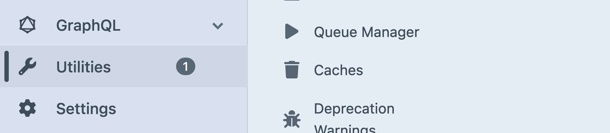
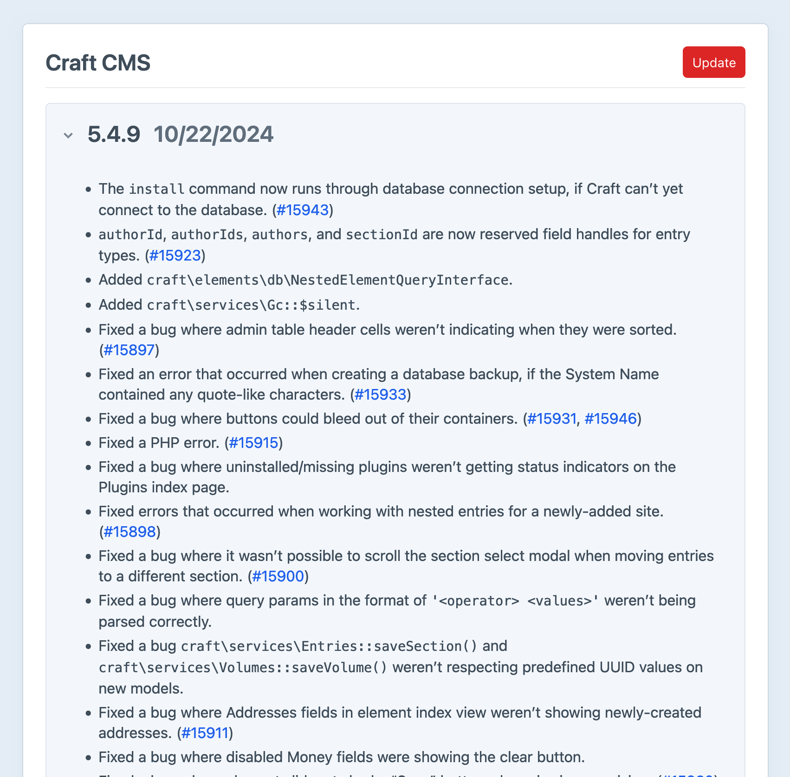

# Running Updates

Craft has a smart system based on [Composer](https://getcomposer.org) that helps you keep your site and plugins up-to-date. This page covers routine _updates_ to dependencies, which we consider a distinct process from [major-version _upgrades_](#major-versions).

<!-- more -->

## Using the Control Panel

When an update is available, users with the permission to update Craft will see a badge in the [control panel](system/control-panel.md) next to <Journey path="Utilities" /> in the global navigation:



Click <Journey path="Utilities, Updates" />. You can also get to this view directly from the **Updates** widget that’s installed by default in the control panel [dashboard](system/control-panel.md#dashboard).

This section displays updates for Craft CMS and installed plugins, where each version has its own collapsible panel detailing relevant changes.



You can update one dependency at a time using its **Update** button, or update everything with the **Update All** at the top of the screen. If you don’t see these options, ensure the <config5:allowUpdates> and <config5:allowAdminChanges> settings are enabled in your current environment. We generally _do not_ recommend applying updates in a non-development environment—see our [workflow](deploy.md) page for details.

::: tip
Craft’s [changelog](repo:craftcms/cms/blob/5.x/CHANGELOG.md) will warn you of any critical changes at the top of the release notes. While there aren’t _usually_ any warnings, it’s always a good idea to check the changelog and [any upgrade guides](#upgrade-guides) before updating.

Urgent messages from changelogs (like security patches) are exposed as a banner in the control panel to all administrators.
:::

After Craft successfully installs the updates, it will run any new migrations.

## Updating from the Terminal

### Craft CLI

The [`update` console command](reference/cli.md#update) can be used to update Craft and plugins.

To see available updates, navigate to a Craft project directory in your terminal and run this command:

::: code
```bash DDEV
ddev craft update
```
```bash Generic
php craft update
```
:::

You should see output like this:

```
Fetching available updates ... done
You’ve got two available updates:

    - craft 5.4.8 => 5.4.9
    - commerce 5.2.1 => 5.2.2

Run craft update all or craft update <handle> to perform an update.
```

To update everything all at once, run this command:

::: code
```bash DDEV
ddev craft update all
```
```bash Generic
php craft update all
```
:::

To apply a specific update, replace `all` with `craft` (to update Craft itself) or a plugin’s handle:

::: code
```bash DDEV
ddev craft update commerce
```
```bash Generic
php craft update commerce
```
:::

```
Fetching available updates ... done
Performing one update:

    - commerce 5.2.1 => 5.2.2

Create database backup? (yes|no) [yes]:
Backing up the database ... done
Performing update with Composer ... done
Applying new migrations ... done
Update complete!
```

You can pass multiple handles in at once:

::: code
```bash DDEV
ddev craft update commerce element-api
```
```bash Generic
php craft update commerce element-api
```
:::

#### Version Behavior

The updater installs the latest available version of Craft or a plugin, unless you append `:<version>` to the handle, where `<version>` is a legal Composer constraint:

::: code
```bash DDEV
ddev craft update element-api:4.1.0
```
```bash Generic
php craft update element-api:4.1.0
```
:::

After an update is performed from the CLI, Craft will apply any relevant migrations.

::: tip
Use the `--minor` or `--patch` flag when running `craft update` to update in finer increments. Pass `--except craft,plugin-name` to update all but the provided package(s).
:::

As of Craft [5.9.0](repo:craftcms/cms/releases/tags/5.9.0), constraints are set using the caret (`^`) operator for better interoperability with direct [Composer](#composer) usage.
The updater will _not_ update expired packages.

If for any reason you end up with a set of installed packages outside what a license allows (say, by alternating between the built-in updater and Composer CLI), Craft will warn you when running `craft up`:

```
The following licensing issues were detected:
- Commerce isn’t licensed to run version 5.5.1.
- ...

Continue anyway? (yes|no) [no]: 
```

### Composer

`craft update` is mostly a wrapper around Composer—but you can use Composer directly for more control over the update process.
The main behavioral difference is that `craft update` will _never_ update Craft or plugin versions beyond what is permitted by their respective licenses.

When using version constraints, `composer.lock` will still make sure you get a stable set of packages from `composer install`. To update all your packages to the most recent versions allowed by their constraints, run `composer update`. Update a _single_ package by specifying it in the command: `composer update craftcms/cms`.

::: tip
If you have used Craft’s [control panel](#using-the-control-panel) or [CLI](#craft-cli) updater in the past, `composer update` may do nothing!

Open `composer.json`, and look at the packages under the `require` key—if you see exact version numbers (i.e. `2.3.4`), Composer will never update those packages.
:::

Keep in mind that manually altering constraints _can_ lead to an irreconcilable set of packages—Composer will let you know about this before updating the lockfile.
Generally speaking, the “major-version” constraints set automatically when using `composer require ...` should continue to work, while protecting your project from breaking changes in dependencies.

## Workflow

Every time you [deploy](./deploy.md) your project, you should run `composer install` and `craft up` to bring that environment’s dependencies and database into agreement with your packages and their expected schema version.

The same applies when working with teammates! Any time you pull new code into a project, running `composer install` will guarantee you are working with the same set of packages as your collaborators. If you’re one for automation, you can even have Craft apply migrations and [project config](system/project-config.md) at the same time by adding a special hook to the `scripts` key in `composer.json`:

```json{9}
{
    "require": {
        "craftcms/cms": "^5.0.0",
        "vlucas/phpdotenv": "^5.4.0"
        // ...
    },
    // ...
    "scripts": {
        "post-install-cmd": "@php craft install/check && php craft up --interactive=0 || exit 0"
    }
}
```

This tells Composer that _after_ it has successfully installed packages from a lockfile (typically the result of running `composer install`), it should check if Craft is installed (`@php craft install/check`) and if so, run `craft up` non-interactively to apply migrations and project config. `|| exit 0` ensures that the command exits nominally, so as not to disrupt other processes that expect `composer install` to succeed.

::: tip
Running `craft up` will warn you before running migrations if there are licensing issues with the installed packages—say, as the result of using [Composer](#composer) directly. <Since ver="5.9.0" feature="Warnings about licensing issues when running `craft up`" />
:::

## Licensing

When you buy a Craft or plugin license, you are entitled to use that version (or any version that you update to, during the year of included updates) in perpetuity.
To get the most out of your licenses, run updates frequently!

## Upgrade Guides

Each version of the Craft documentation contains an equivalent of the [Upgrading from Craft 4](upgrade.md) page, which covers the process of upgrading from one [major version](#major-versions) to the next.

Sometimes, there are significant changes to be aware of—even in minor or “point” releases. The most common changes that fit this criteria are deprecations. Deprecation notices will be accompanied by instructions for updating your code to work with the new APIs. Any features that are subsequently removed in a major release will also be noted in the new version’s upgrade guide.

Deprecation warnings will affect plugin developers more frequently than regular users—but it’s still a good idea to keep your eye on the **Deprecation Warnings** utility.

### Major Versions

For the smoothest upgrade experience, projects must be updated to the latest available _minor_ version preceding a _major_ version upgrade. We do not support “skipping” versions, so if your site is running Craft 3, you must first update to the latest 3.x version, then perform the 3.x &rarr; 4.x upgrade, then perform the 4.x &rarr; 5.x upgrade.

You should always upgrade to the latest release in a given major Craft version—for example, you can upgrade directly from 4.12.8 (or whatever the latest 4.x release is) to 5.4.9 (or whatever the latest 5.x release is).
