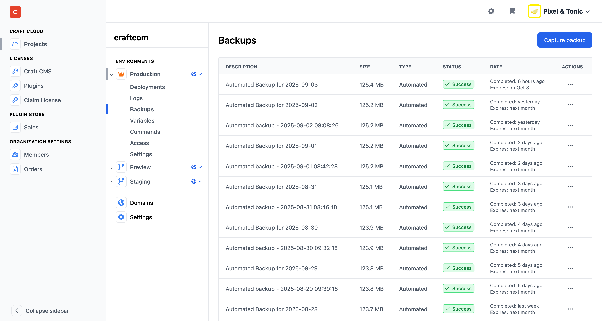
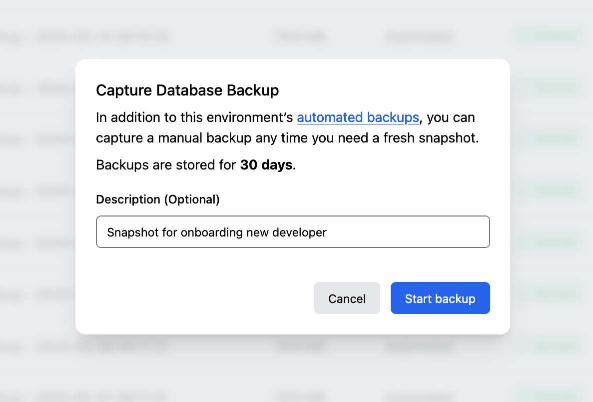

# Database Backups

::: tip
This page only covers automated and manual database backups and our retention policies. Check out our main article on [Cloud databases](databases.md) for more information.
:::

Craft Cloud automatically captures [nightly backups](#automated-backups) of your [production environment](environments.md#production-environment)’s database.
These backups (and any [manual backups](#manual-backups) you’ve captured) are stored for **30 days**, unless deleted sooner.

Backups are managed separately for each [environment](environments.md), and their format depends on your project’s database driver.

<BrowserShot
    url="https://console.craftcms.com/accounts/{org}/projects/{uuid}/environments/{uuid}/backups"
    :link="false"
    caption="Viewing automated and manual database backups in Craft Console.">

</BrowserShot>

## Automated Backups

Your project’s [region](getting-started.md#project-settings) dictates when automated “nightly” backups are captured.

Automated backups appear in the chronological feed of backups within each environment, and are identified by the **Type** column.

## Manual Backups

You can capture a manual backup of any environment from Craft Console. Each manual backup has an optional **Description**:

Manual backups are also stored for 30 days, and are identified in the list of backups by the **Type** column.

## Downloading Backups

To download an automated or manual backup, open the fly-out menu in that backup’s row and select **Download**.

## Deleting Backups

If you want to remove an automated or manual backup from an environment’s history, open the fly-out menu in that row and select **Delete**.
Deleting a backup does not alter the state of that environment’s database.

## Restoring Backups

Any Cloud backup can be restored to a Craft installation with the [`db/restore` command](/5.x/reference/cli.html#db-restore) (4.10+).

Refer to our main [Cloud databases article](databases.md) for more information on driver-specific formats and restoration commands.
Cloud backups can also be downloaded and restored to other [environments](environments.md).

## Fine Print

You may capture and download as many manual backups as necessary to manage your project.

- The schedule for automated backups is fixed, and the frequency cannot be changed.
- Single backups are limited to 200GB.
- Backups do _not_ count against your [storage quota](quotas.md#storage).
- Deleting an environment or project also deletes any backups within it.

::: warning
Backups captured or available via Craft Console are provided for your convenience, and are separate from our internal backups.
They are _not_ part of Craft Cloud’s durability architecture.
We cannot provide recovery support for individual environments or projects for which automated or manual backups do not exist.
:::
