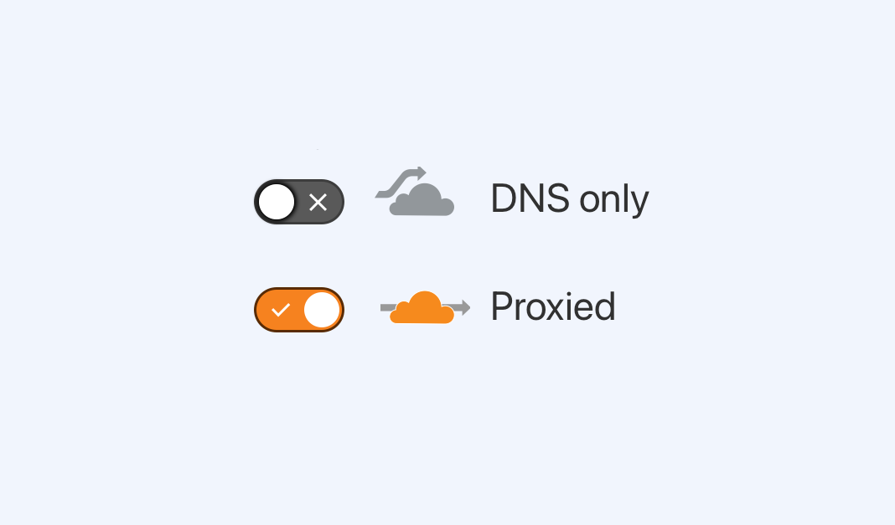

# Cloudflare

Every Craft Cloud project is protected by [Cloudflare](https://cloudflare.com/)’s enterprise-grade global WAF or _web application firewall_.
For most sites and apps, our default policies (in combination with an evolving set of custom rules) will be enough to thwart inorganic and malicious traffic—but occasionally, customers will need access to deeper customization.

As part of [launching a site on Cloud](launch-checklist.md), you’ll [connect a domain](domains.md) by adding a few DNS records with your provider.
If you or your client are already users of Cloudflare’s proxy (colloquially, “orange cloud”), you may encounter validation errors unless you follow a specific “[Orange-to-Orange](https://developers.cloudflare.com/cloudflare-for-platforms/cloudflare-for-saas/saas-customers/how-it-works/)” setup process.

::: tip
Unless you have a specific need for **Proxy** mode (like your own firewall rules, functions, or routes), we recommend using the straightforward **DNS-only** (or “grey cloud”) option in your own zone.
_Either way, your site is protected by Craft Cloud’s WAF._
:::

These instructions only apply to “pre-validation.”
If you are ready to send traffic to Cloud, you can use the [real-time validation](#real-time-validation) guide.

## Pre-Validation

This method is designed to reduce the amount of downtime that might occur.

Once you’ve begun the process of [adding a domain](domains.md#adding-a-domain), follow these steps to disable proxying:

1. Navigate to the **DNS** page of the domain in your Cloudflare dashboard;
2. Locate the `CNAME` (preferred) or `A` record for the domain or subdomain you are connecting to Craft Cloud;
3. Press **Edit**, then toggle the **Proxy status** (“orange cloud”) to _off_;
4. Press **Save** to confirm the changes;
5. Add the **Verify Ownership** and **Validate Certificate** records to Cloudflare;

    💡 At this point, you will have to wait for Cloudflare to propagate the changes.
    This _may_ take as long as the record’s **TTL** setting, but it is often significantly faster.  

6. Return to the Craft Cloud dashboard, press **Refresh** in the **DNS Records** section, and wait for the tables to reload;

::: warning
**Do not** re-enable proxying until you have finished routing traffic to Cloud in the final **Route Traffic** step.
Doing so may cause a mismatch in validation tokens, and you’ll have to start over.
:::

## Real-Time Validation

If you _can’t_ disable proxying on a domain (say, because Cloudflare provides critical functionality to the current site), you can perform “real-time validation” by sending traffic directly to Craft Cloud as you launch the site.
The process is the same as above, but you can skip records in the **Verify Ownership** section. Add the **Validate Certificate** records, then…

1. In Cloudflare, locate the `CNAME` (preferred) or `A` record for the domain or subdomain you are connecting to Craft Cloud;
2. Press **Edit**, then update the record to be a `CNAME` pointing to `edge.craft.cloud` _and_ toggle the **Proxy status** (“orange cloud”) to _off_;
3. Press **Save** to confirm the changes;
4. Repeat this process for any subdomains you’ve added in Craft Cloud—you must validate all the records at once;

There will be a brief period (typically a few minutes) in which users will see a Cloudflare error page, while validation takes place.
Once the Craft Cloud dashboard indicates that the domain is validated (as well as any subdomains you’ve configured), you may re-enable proxying on the root domain.

## Subdomains

Either strategy will work for [subdomains](domains.md#subdomains), as well.
For example, instead of connecting `mydomain.com`, you could perform pre-validation or real-time validation on `staging.mydomain.com` by adding that as a domain on your project.

When it comes time to launch (and you want your site to be available at `mydomain.com`), you’ll need to add that as a new domain in Craft Cloud.
The preview domain’s validation is handled separately and won’t affect the apex domain; you can remove it before or after adding the apex domain (and re-add it as a subdomain without any further DNS changes).
