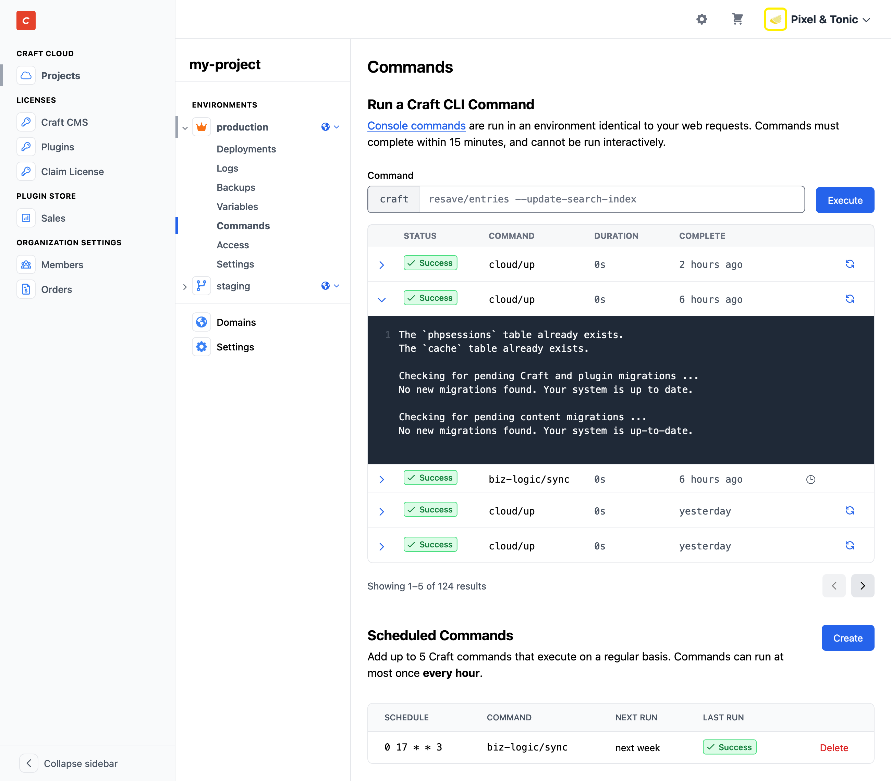

# Console Commands

Craft Cloud’s serverless architecture means that traditional access via SSH is not possible. However, the [Craft CLI](/5.x/reference/cli.md) is still an essential part of many developers’ workflows!

Each [environment](environments.md) in your Cloud project has a **Commands** screen, from which you can run one-off Craft commands, or manage [scheduled commands](cron.md).

To run a command, enter just the segment following `craft` into the **Command** field. Press <kbd>Enter</kbd> or click **Execute** to send the command to Cloud.

Commands immediately enter **Pending** status, and are picked up by our infrastructure as soon capacity allows—usually within a few seconds. At that point, the command is marked as **Running**, and will resolve as either **Success** or **Error**.

## Logs

You can view output from any command by expanding its row. Scheduled commands also appear in the command history, and are indicated by a clock icon.

## Temporary Failures

If you suspect a failure was due to a temporary issue, but the command was otherwise correct, you can re-run it by clicking the circular arrows in any row. The prior command will remain, and a new one will be started.

## Limitations

Interactive commands are not allowed, so you must provide all required input as _arguments_ and _options_. The text of your command (everything after `craft `) must fit within 255 characters, and it cannot include interpolation or other `bash` syntax.

Commands must complete within 15 minutes. Longer-running tasks may need to be split up (like `resave/entries`, using the `--limit` option), or take advantage of [batched queue jobs](/5.x/extend/queue-jobs.html#batched-jobs).

There is no limit on the number of jobs you can run—concurrently or otherwise! We store command history and execution logs for a maximum of six months.
