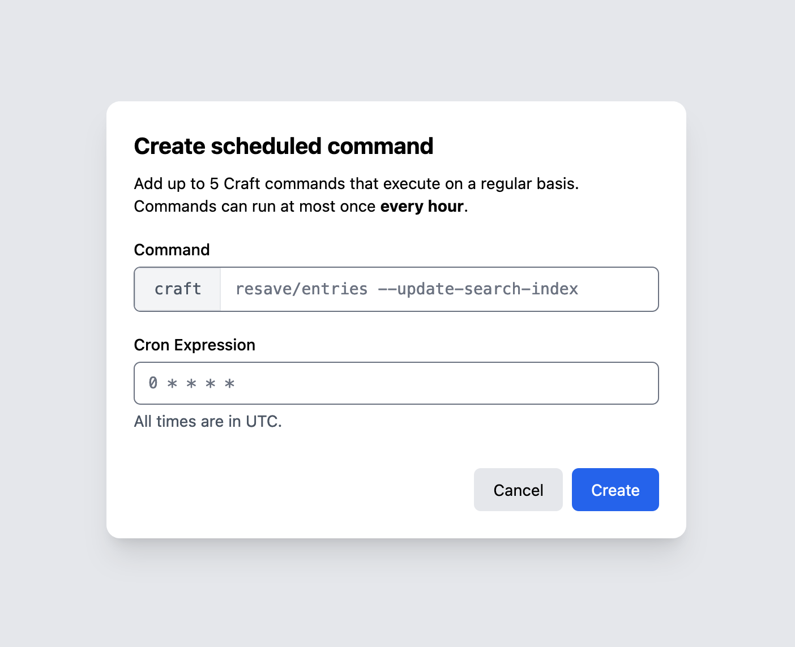

# Scheduled Commands

In addition to [running one-off commands](commands.md) in a Craft Cloud environment, you can set up recurring commands using standard cron syntax.
Each environment is allowed {{ $activeSetVars.scheduledCommandsMax }} scheduled commands.

::: tip
Cloud automatically processes [queue jobs](extension.md) for you.
There is no need to set up a scheduled command to run the queue.
:::

To get started, visit the **Commands** screen in any Craft Cloud environment, and click **Create** under the **Scheduled Commands** section.

Enter the command (everything after `craft`), and provide a valid cron expression.

Your new scheduled command will appear in the table, displaying its schedule, command, and the next and last run status.
Scheduled commands cannot be edited in-place—you must delete an existing command and create a new one.

When a scheduled command runs, it will appear in that environment’s command history with a clock icon.

Commands may run at most once per hour, but you may choose any integer minute value to offset it appropriately.
Execution is not guaranteed for the _exact_ time—there will be a short delay (typically a few seconds) between our internal scheduler discovering a command and a runner picking it up.

::: tip
Cronitor’s [Crontab.guru](https://crontab.guru/) tool is indispensable when getting started with cron expressions!
:::

The same [limitations](commands.md#limitations) apply to recurring commands as one-off commands.
