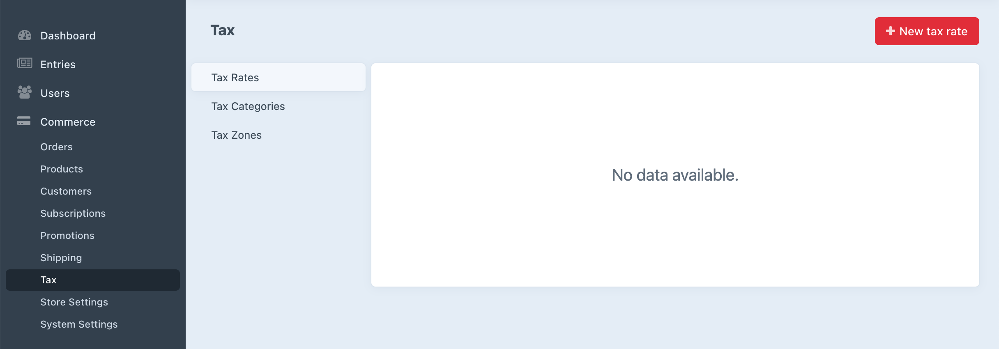

# Tax Engines

Craft Commerce supports the use of a single tax engine for determining how taxes are applied throughout the system.

The included tax engine lets you choose exactly which parts of the first-party tax system you’d like to use. This doesn’t just apply to calculation, but if and how you rely on the categories, zones, and rates used to calculate adjustments. The tax engine also specifies what parts of the included control panel tax UI—if any—are available to the store manager:

::: tip
See the [Tax](../tax.md) page to understand how Commerce uses tax categories, zones, and rates.
:::

You can also add your own navigation items and views to the tax section.

## Tax Engine Class

The term “tax engine” refers to a relatively straightforward class that implements [TaxEngineInterface](commerce3:craft\commerce\base\TaxEngineInterface), like Commerce does in its [Tax](commerce3:craft\commerce\engines\Tax) class. It does two important things:

1. Returns the class name for the [Adjuster](adjusters.md) that should be used for calculating tax, where you have the option of replacing [the one that ships with Commerce](commerce3:craft\commerce\adjusters\Tax).
2. Uses a series of simple methods to toggle and customize parts of the control panel tax UI.

By default, categories, zones, and rates may each be created, edited, and deleted by the store manager.

Let’s use tax categories as an example to demonstrate how TaxEngineInterface methods can determine what’s available to the store manager:

- You’ll return `true` or `false` for `viewTaxCategories()`, `createTaxCategories()`, and `editTaxCategories()` to toggle what UI is available in the control panel.
- You can provide additional `taxCategoryActionHtml()` to insert buttons that appear alongside **+ New tax rate** in the screenshot above.
- You can use `cpTaxNavSubItems()` to provide additional subnavigation—or your own set of items if you’ve disabled the default Commerce tax navigation—where you see **Tax Rates**, **Tax Categories**, and **Tax Zones** in the screenshot above.

## Example

The [TaxJar plugin](https://github.com/craftcms/commerce-taxjar) provides its own tax engine.

TaxJar is a third-party service for managing sales tax compliance. It provides its own separate control panel for managing zones and rates in its system along with accounting-centric categories of taxable products.

To work seamlessly with line item tax categories in Craft Commerce, the TaxJar plugin syncs its tax categories into the Craft site. This way, tax categories can be assigned to line items as they normally would even though the categories themselves may be managed in an outside system.

The TaxJar [TaxEngineInterface implementation](https://github.com/craftcms/commerce-taxjar/blob/master/src/engines/TaxJar.php) does the following:

- Registers an Adjuster that adds a sandbox mode (toggled in plugin settings) and returns an OrderAdjustment using data from the TaxJar API.
- Disables creating and deleting tax categories, allowing them to be viewed and edited.
- Adds a button for syncing TaxJar categories.
- Disables all views for tax zones and rates that are managed elsewhere.

The TaxJar plugin is an example of a tax engine that integrates with a third-party API, but you might also register your own tax engine to...

- Disable tax UI that might be confusing or irrelevant for store managers.
- Provide your own adjustment logic for something like zones, where you don’t want or need store managers to manage them in the control panel.

If you would like to make changes to the tax system that involve control panel UI or more comprehensive control, providing your own tax engine is the way to go. If your changes are limited to minor aspects of tax calculation only, it may be best to simply register your own tax [Adjuster](adjusters.md) instead.

If you’re writing a tax adjuster, create line-item adjustments wherever possible rather than broader order-level adjustments. The increased contextual precision will most likely help dealing with adjustments, calculation, and accounting in the future.
