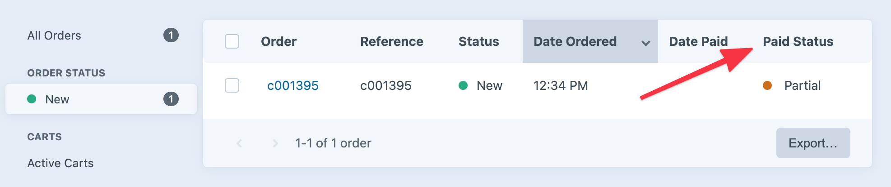

# Making Payments

Once you’ve set up [the store](configuration.md) and [payment gateways](payment-gateways.md), you can start accepting payments.

Commerce supports taking payments from the customer at checkout and from the store manager via the Craft control panel. Payments can be required for order completion, deferred until later, or made in parts depending on your store’s configuration and gateway support.

## Full Payment at Checkout

It’s most common to have a customer provide information for the payment gateway and pay in full to complete an order.

In this example, we’ll assume a customer has finished shopping and building a cart and that we know what payment gateway they intend to use. (It could be that the store only uses one gateway, or they explicitly chose a gateway in a previous step.)

The payment gateway is set on the cart. This template uses `cart.gateway.getPaymentFormHtml()` to render the form fields required by the payment gateway, posting them to the [`commerce/payments/pay`](./dev/controller-actions.html#post-payments-pay) controller action:

```twig
{# @var cart craft\commerce\elements\Order #}
<form method="post">
    {{ csrfInput() }}
    {{ actionInput('commerce/payments/pay') }}
    {{ redirectInput('/commerce/customer/order?number={number}') }}
    {{ hiddenInput('cancelUrl', '/commerce/checkout/payment'|hash) }}

    {{ cart.gateway.getPaymentFormHtml({})|raw }}

    <button type="submit">Pay Now</button>
</form>
```

::: tip
Using `gateway.getPaymentFormHtml()` is the quick way to get form elements from the gateway plugin; often you’ll want to render and style these form fields based on the needs of your site and gateway.
:::

This manual form example assumes the availability of a `paymentForm` variable, as discussed in [Payment Form Models](payment-form-models.md), and might be what a simple credit card payment form would look like:

<ToggleTip :height="465">

```twig

<form method="post">
    {{ csrfInput() }}
    {{ actionInput('commerce/payments/pay') }}
    {{ redirectInput('/commerce/customer/order?number={number}') }}
    {{ hiddenInput('cancelUrl', '/commerce/checkout/payment'|hash) }}

    {# first and last name #}
    <fieldset>
        <legend>Card Holder</legend>

        {{ forms.text({
            name: 'firstName',
            maxlength: 70,
            placeholder: "First Name",
            autocomplete: false,
            class: 'card-holder-first-name'~(paymentForm.getErrors('firstName') ? ' error'),
            value: paymentForm.firstName,
            required: true,
        }) }}

        {{ forms.text({
            name: 'lastName',
            maxlength: 70,
            placeholder: "Last Name",
            autocomplete: false,
            class: 'card-holder-last-name'~(paymentForm.getErrors('lastName') ? ' error'),
            value: paymentForm.lastName,
            required: true,
        }) }}

        
        
            
        

        {{ forms.errorList(errors) }}
    </fieldset>

    {# card number #}
    <fieldset>
        <legend>Card</legend>

        {{ forms.text({
            name: 'number',
            maxlength: 19,
            placeholder: "Card Number",
            autocomplete: false,
            class: 'card-number'~(paymentForm.getErrors('number') ? ' error'),
            value: paymentForm.number
        }) }}

        {{ forms.text({
            class: 'card-expiry'~(paymentForm.getErrors('month') or paymentForm.getErrors('year') ? ' error'),
            type: 'tel',
            name: 'expiry',
            placeholder: "MM / YYYY",
            value: paymentForm.expiry
        }) }}

        {{ forms.text({
            type: 'tel',
            name: 'cvv',
            placeholder: "CVV",
            class: 'card-cvc'~(paymentForm.getErrors('cvv') ? ' error'),
            value: paymentForm.cvv
        }) }}

        
        
            
        

        {{ forms.errorList(errors) }}
    </fieldset>

    <button type="submit">Pay Now</button>
</form>
```

</ToggleTip>

## Deferred Payment at Checkout

Commerce provides two options if you don’t want to require full payment from a customer to complete an order:

1. Require full payment with an authorize transaction to be captured later by the store manager. (Requires a gateway that supports authorize transactions.)
2. Enable the [allowCheckoutWithoutPayment](config-settings.md#allowcheckoutwithoutpayment) setting and have the customer complete checkout—without payment—via the [`commerce/cart/complete`](./dev/controller-actions.md#post-cart-complete) controller action.

### Checkout Without Payment

Once the [allowCheckoutWithoutPayment](config-settings.md#allowcheckoutwithoutpayment) setting is enabled, the customer and submit a post request to the [`commerce/cart/complete`](./dev/controller-actions.md#post-cart-complete) controller action to complete the order without any payment.

```twig
<form method="post">
    {{ csrfInput() }}
    {{ hiddenInput('action', 'commerce/cart/complete') }}
    {{ redirectInput('/shop/customer/order?number='~cart.number~'&success=true') }}

    <button type="submit">Commit to Buy</button>
</form>
```

Like the [`commerce/payments/pay`](./dev/controller-actions.html#post-payments-pay) action, the cart must have a valid email address and abide by the following store settings:

- [allowEmptyCartOnCheckout](config-settings.md#allowemptycartoncheckout)
- [requireShippingMethodSelectionAtCheckout](config-settings.md#requireshippingmethodselectionatcheckout)
- [requireBillingAddressAtCheckout](config-settings.md#requirebillingaddressatcheckout)
- [requireShippingAddressAtCheckout](config-settings.md#requireshippingaddressatcheckout)

::: warning
If you enable order completion without payment, completed orders will have the same status as any others. Don’t forget to make sure store managers are aware of the change and prepared to confirm payment before fulfilling orders!
:::

### Checkout with Partial Payment

If you’d like to permit customers to check out with partial payments, you can enable the [allowPartialPaymentOnCheckout](config-settings.md#allowpartialpaymentoncheckout) setting to allow an additional `paymentAmount` field when posting to the [`commerce/payments/pay`](./dev/controller-actions.html#post-payments-pay) controller action.

The partial amount cannot be entered directly by the customer; for security, the field must contain a hashed value in the cart’s `paymentCurrency`.

This example provides a dropdown menu that allows the customer to choose half or full payment at checkout:

```twig
{# ... payment form ... #}





<select name="paymentAmount">
    <option value="{{ halfAmount|hash }}">50%
        ({{ halfAmount|commerceCurrency(cart.paymentCurrency) }})
    </option>
    <option value="{{ fullAmount|hash }}">100%
        ({{ fullAmount|commerceCurrency(cart.paymentCurrency) }})
    </option>
</select>

{# ... payment form ... #}
```

A customer may return to make additional payments similarly to the [outstanding balance example](#paying-an-outstanding-balance), supplying a valid `paymentAmount` until the remaining balance is paid in full. The first partial payment or authorization, however, will complete the order—subsequent payments will not trigger a change in status.

::: tip
You can use the [`paidInFull`](extend/events.md#paidinfull) event if you need to add any custom functionality when an order is paid in full.
:::

### Paying an Outstanding Balance

You can allow a customer to pay the outstanding balance on a cart or order using the [`commerce/payments/pay`](./dev/controller-actions.html#post-payments-pay) controller action similarly to taking full payment at checkout, taking care to explicitly provide the order number whose outstanding balance should be paid.

::: tip
There’s a full example of this in the [example templates](example-templates.md) at [shop/checkout/pay-static.twig](https://github.com/craftcms/commerce/tree/main/example-templates/build/shop/checkout/pay-static.twig).
:::

Here we’re pretending the relevant order number is 12345, the customer’s email address is email@address.foo, and the gateway is already set on the order:

```twig





<form method="post">
    {{ csrfInput() }}
    {{ hiddenInput('action', 'commerce/payments/pay') }}
    {{ redirectInput('/shop/customer/order?number='~cart.number~'&success=true') }}
    {{ hiddenInput('cancelUrl', cancelUrl) }}
    {{ hiddenInput('email', email) }}
    {{ hiddenInput('orderNumber', cart.number) }}

    {{ cart.gateway.getPaymentFormHtml({})|raw }}

    <button type="submit">Submit</button>
</form>
```

If you’d like to have the customer pay with a different gateway than whatever’s specified on the cart/order, pass the `gatewayId` in the form:

```twig
{# ... #}
{{ hiddenInput('gatewayId', 1) }}
{# ... #}
```

::: warning
During this process the cart or order is never in the user’s session; they could be paying for a cart even with a separate cart in their current session.
:::

## Partial Payments in the Control Panel

Store managers can specify an order payment amount using any gateway that supports partial payments, regardless of whether partial payments are allowed at checkout.

To make a partial payment in the Craft control panel:

1. Navigate to **Commerce** → **Orders**.
2. Choose a cart or order to view its edit page
3. Select the **Transactions** tab and choose **Make Payment**.
4. Select a gateway that supports partial payments to enter the payment details and amount:\
    
5. Choose **Pay** to process the payment.

::: tip
To more quickly identify partially-paid orders, a store manager may want to add the **Paid Status** column on the order index page.


:::
