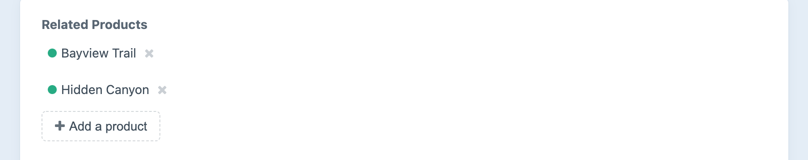

# Products Fields

Commerce Products fields allow you to relate [products](products-variants.md#products) to other elements.

## Settings

Commerce Products fields have the following settings:

- **Sources** – the product types you want to relate entries from. (Default is “All”.)
- **Limit** – the maximum number of products that can be related with the field at once. (Default is no limit.)
- **Selection Label** – the label to be shown on the field’s selection button. (Default is “Add a product”.)

## The Field

Commerce Products fields list all of the currently selected products, with a button to select new ones:



Choosing **Add a product** opens a modal window for finding and selecting additional products:


## Templating

If you have an element with a products field in your template, you can access its selected products with the field handle:

```twig

```

That will give you an [element query](/3.x/element-queries.md) prepped to output all the selected products for the given field.

::: tip
See [Relations](/3.x/relations.md) for more info on the `relatedTo` param.
:::

## Examples

To check if your Commerce Products field has any selected products, you can use the `length` filter:

```twig

    {# ... #}

```

Loop through all the selected products using `all()`:

```twig

    {# ... #}

```

Rather than typing `entry.myFieldHandle` every time, you can call it once and set it to another variable:

```twig




    <h3>Some great products</h3>
    
        {# ... #}
    


```

You can also add parameters to the element query:

```twig

```

If your products field is only meant to have a single product selected, remember that calling your products field will still give you the same element query, not the selected product. To get the first (and only) product selected, use `one()`:

```twig


    {# ... #}

```
