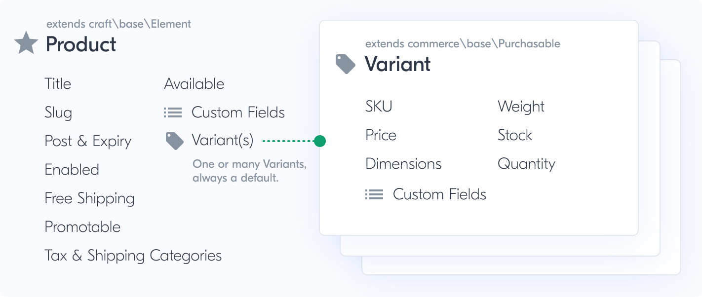
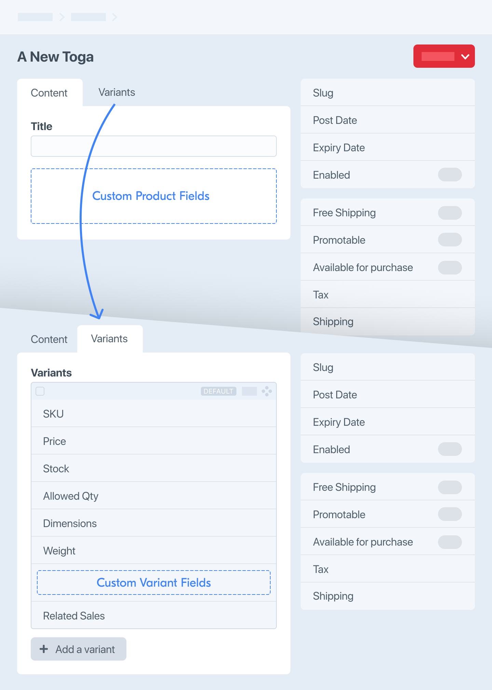

# Products & Variants

A _product_ is an [element](/3.x/elements.md) that describes what’s for sale. A _variant_ is the [purchasable](purchasables.md) the customer ultimately orders.

## Products

Products are the items available in your store.

A product itself is never sold; what goes into a cart for purchase is actually one of the product’s [variants](#variants). In the Craft control panel, you’ll see Products listed by Product Type.



## Product Types

Product Types are a way to distinguish products in your system. Similar to Craft’s [Entry Types](/3.x/entries.html#entry-types), they can determine the URL format of a product and include any number of custom fields. Each product type will also have one or more variants.

You can manage Product Types in the control panel from **Commerce** → **System Settings** → **Product Types**.


### Product Type Options

#### Name

The name of the product type as displayed in the control panel.

#### Handle

The handle is what you’ll use to reference the product type in code. In Twig, for example, to get your product types with a handle of `clothes` you would use:

```twig

```

#### Title Field Label

Allows you to change what the “Title” field label should be.

#### Automatic SKU Format

Defines what auto-generated SKUs should look like when a SKU field is submitted empty. You can include Twig tags that output properties, such as `{product.slug}` or `{myCustomField}`.

::: tip
How you access properties in the SKU format depends on whether the product type has variants. If the product type does not have multiple variants, use `{product}`. Otherwise, `{object}` will refer to the variant when the product type has multiple variants.
:::

Be sure to choose this carefully and avoid using the `id` property to ensure a unique SKU.

Since `id` refers to the element’s ID and Craft may have many other elements, this won’t be sequential. If you’d rather generate a unique sequential number, consider using Craft’s [seq()](https://craftcms.com/docs/3.x/dev/functions.html#seq) Twig function, which generates a next unique number based on the `name` parameter passed to it.

The following example generates a sequential number, per variant, with the given product slug:

```twig
{{ object.product.slug }}-{{ seq(object.product.slug) }}
```

The resulting variant SKU might be something like `a-new-toga-001`, where `a-new-toga` is the product’s slug and `001` is the first sequential number based on that slug.

::: warning
If a product type has an automatic SKU format, the SKU field is not shown for new variants. Once saved, the field will be displayed for editing.
:::

#### Order Description Format

Describes the product on a line item in an order. It can include tags that output properties, such as `{product.title}` or `{myVariantCustomField}`.

#### Show the Dimensions and Weight fields

Allows you to hide the weight and dimensions fields if they are not necessary for products of this type.

#### Products of this type have multiple variants

If enabled and multiple variants are allowed, a new tab will appear at the top of the page for configuring the variant field layout.

A “Variant Title Format” will also appear for configuring auto-generated variant titles.

#### Show the Title field for variants

Whether or not to show the “Variant Title” field when adding or editing variants. When `true` a “Variant Title Field Label” will appear, allowing you to change what the “Variant Title” field label should be.

#### Products of this type have their own URLs

This works just like Craft’s [entry](https://craftcms.com/docs/3.x/entries.html) URLs.

::: tip
When a site visitor hits the URL of a product, the `product` variable is automatically available to your templates, just like the `entry` variable for Craft’s entries.
:::


### Templating

#### craft.commerce.productTypes.allProductTypes

Returns an array of all product types set up in the system.

```twig

    {{ type.handle }} - {{ type.name }}

```

## Querying Products

You can fetch products using product queries.

::: code
```twig
{# Create a new product query #}

```

```php
// Create a new product query
$myProductQuery = \craft\commerce\elements\Product::find();
```

```graphql
# Create a new product query
{
  products {
    # ...
  }
}
```
:::

Once you’ve created a product query, you can set [parameters](#parameters) on it to narrow down the results, and then [execute it](https://craftcms.com/docs/3.x/element-queries.html#executing-element-queries) by calling `.all()`. An array of [Product](commerce3:craft\commerce\elements\Product) objects will be returned.

::: tip
See [Element Queries](https://craftcms.com/docs/3.x/element-queries.html) in the Craft docs to learn about how element queries work.
:::

### Example

We can use Twig to display the ten most recent Clothing products:

1. Create a product query with `craft.products()`.
2. Set the [`type`](#type) and [`limit`](#limit) parameters on it.
3. Fetch the products with `.all()`.
4. Loop through the products using a [`for`](https://twig.symfony.com/doc/2.x/tags/for.html) tag to output their HTML.

```twig
{# Create a product query with the 'type' and 'limit' parameters #}


{# Fetch the products #}


{# Display the products #}

    <h2><a href="{{ product.url }}">{{ product.title }}</a></h2>
    {{ product.summary }}
    <a href="{{ product.url }}">Learn more</a>

```

To fetch the same information with GraphQL, we could write a query like this:

```graphql
{
  products(limit: 10, type: "clothing") {
    title
    uri
    ... on clothing_Product {
      summary
    }
  }
}
```

## Product Query Parameters

Product queries support the following parameters:

<!-- BEGIN PRODUCTQUERY_PARAMS -->

| Param                                                 | Description
| ----------------------------------------------------- | ----------------------------------------------------------------------------------------------------------------------------------------------------------------------------------------------------------------------------------------------------------------------------------------
| [after](#product-after)                               | Narrows the query results to only products that were posted on or after a certain date.
| [anyStatus](#product-anystatus)                       | Removes element filters based on their statuses.
| [asArray](#product-asarray)                           | Causes the query to return matching products as arrays of data, rather than [Product](commerce3:craft\commerce\elements\Product) objects.
| [availableForPurchase](#product-availableforpurchase) | Narrows the query results to only products that are available for purchase.
| [before](#product-before)                             | Narrows the query results to only products that were posted before a certain date.
| [clearCachedResult](#product-clearcachedresult)       | Clears the cached result.
| [dateCreated](#product-datecreated)                   | Narrows the query results based on the products’ creation dates.
| [dateUpdated](#product-dateupdated)                   | Narrows the query results based on the products’ last-updated dates.
| [expiryDate](#product-expirydate)                     | Narrows the query results based on the products’ expiry dates.
| [fixedOrder](#product-fixedorder)                     | Causes the query results to be returned in the order specified by [id](#product-id).
| [hasVariant](#product-hasvariant)                     | Narrows the query results to only products that have certain variants.
| [id](#product-id)                                     | Narrows the query results based on the products’ IDs.
| [ignorePlaceholders](#product-ignoreplaceholders)     | Causes the query to return matching products as they are stored in the database, ignoring matching placeholder elements that were set by [craft\services\Elements::setPlaceholderElement()](https://docs.craftcms.com/api/v3/craft-services-elements.html#method-setplaceholderelement).
| [inReverse](#product-inreverse)                       | Causes the query results to be returned in reverse order.
| [limit](#product-limit)                               | Determines the number of products that should be returned.
| [offset](#product-offset)                             | Determines how many products should be skipped in the results.
| [orderBy](#product-orderby)                           | Determines the order that the products should be returned in. (If empty, defaults to `postDate DESC`.)
| [postDate](#product-postdate)                         | Narrows the query results based on the products’ post dates.
| [preferSites](#product-prefersites)                   | If [unique](#product-unique) is set, this determines which site should be selected when querying multi-site elements.
| [relatedTo](#product-relatedto)                       | Narrows the query results to only products that are related to certain other elements.
| [search](#product-search)                             | Narrows the query results to only products that match a search query.
| [site](#product-site)                                 | Determines which site(s) the products should be queried in.
| [siteId](#product-siteid)                             | Determines which site(s) the products should be queried in, per the site’s ID.
| [slug](#product-slug)                                 | Narrows the query results based on the products’ slugs.
| [status](#product-status)                             | Narrows the query results based on the products’ statuses.
| [title](#product-title)                               | Narrows the query results based on the products’ titles.
| [trashed](#product-trashed)                           | Narrows the query results to only products that have been soft-deleted.
| [type](#product-type)                                 | Narrows the query results based on the products’ types.
| [typeId](#product-typeid)                             | Narrows the query results based on the products’ types, per the types’ IDs.
| [uid](#product-uid)                                   | Narrows the query results based on the products’ UIDs.
| [unique](#product-unique)                             | Determines whether only elements with unique IDs should be returned by the query.
| [uri](#product-uri)                                   | Narrows the query results based on the products’ URIs.
| [with](#product-with)                                 | Causes the query to return matching products eager-loaded with related elements.

<h4 id="product-after"><a href="#product-after" class="header-anchor">#</a> <code>after</code></h4>

Narrows the query results to only products that were posted on or after a certain date.

Possible values include:

| Value | Fetches products…
| - | -
| `'2018-04-01'` | that were posted after 2018-04-01.
| a [DateTime](http://php.net/class.datetime) object | that were posted after the date represented by the object.


::: code
```twig
{# Fetch products posted this month #}



```

```php
// Fetch products posted this month
$firstDayOfMonth = new \DateTime('first day of this month');

$products = \craft\commerce\elements\Product::find()
    ->after($firstDayOfMonth)
    ->all();
```
:::


<h4 id="product-anystatus"><a href="#product-anystatus" class="header-anchor">#</a> <code>anyStatus</code></h4>

Removes element filters based on their statuses.


::: code
```twig
{# Fetch all products, regardless of status #}

```

```php
// Fetch all products, regardless of status
$products = \craft\commerce\elements\Product::find()
    ->anyStatus()
    ->all();
```
:::


<h4 id="product-asarray"><a href="#product-asarray" class="header-anchor">#</a> <code>asArray</code></h4>

Causes the query to return matching products as arrays of data, rather than [Product](commerce3:craft\commerce\elements\Product) objects.


::: code
```twig
{# Fetch products as arrays #}

```

```php
// Fetch products as arrays
$products = \craft\commerce\elements\Product::find()
    ->asArray()
    ->all();
```
:::


<h4 id="product-availableforpurchase"><a href="#product-availableforpurchase" class="header-anchor">#</a> <code>availableForPurchase</code></h4>

Narrows the query results to only products that are available for purchase.


::: code
```twig
{# Fetch products that are available for purchase #}

```

```php
// Fetch products that are available for purchase
$products = \craft\commerce\elements\Product::find()
    ->availableForPurchase()
    ->all();
```
:::


<h4 id="product-before"><a href="#product-before" class="header-anchor">#</a> <code>before</code></h4>

Narrows the query results to only products that were posted before a certain date.

Possible values include:

| Value | Fetches products…
| - | -
| `'2018-04-01'` | that were posted before 2018-04-01.
| a [DateTime](http://php.net/class.datetime) object | that were posted before the date represented by the object.


::: code
```twig
{# Fetch products posted before this month #}



```

```php
// Fetch products posted before this month
$firstDayOfMonth = new \DateTime('first day of this month');

$products = \craft\commerce\elements\Product::find()
    ->before($firstDayOfMonth)
    ->all();
```
:::


<h4 id="product-clearcachedresult"><a href="#product-clearcachedresult" class="header-anchor">#</a> <code>clearCachedResult</code></h4>

Clears the cached result.


<h4 id="product-datecreated"><a href="#product-datecreated" class="header-anchor">#</a> <code>dateCreated</code></h4>

Narrows the query results based on the products’ creation dates.


Possible values include:

| Value | Fetches products…
| - | -
| `'>= 2018-04-01'` | that were created on or after 2018-04-01.
| `'< 2018-05-01'` | that were created before 2018-05-01
| `['and', '>= 2018-04-04', '< 2018-05-01']` | that were created between 2018-04-01 and 2018-05-01.


::: code
```twig
{# Fetch products created last month #}




```

```php
// Fetch products created last month
$start = (new \DateTime('first day of last month'))->format(\DateTime::ATOM);
$end = (new \DateTime('first day of this month'))->format(\DateTime::ATOM);

$products = \craft\commerce\elements\Product::find()
    ->dateCreated(['and', ">= {$start}", "< {$end}"])
    ->all();
```
:::


<h4 id="product-dateupdated"><a href="#product-dateupdated" class="header-anchor">#</a> <code>dateUpdated</code></h4>

Narrows the query results based on the products’ last-updated dates.


Possible values include:

| Value | Fetches products…
| - | -
| `'>= 2018-04-01'` | that were updated on or after 2018-04-01.
| `'< 2018-05-01'` | that were updated before 2018-05-01
| `['and', '>= 2018-04-04', '< 2018-05-01']` | that were updated between 2018-04-01 and 2018-05-01.


::: code
```twig
{# Fetch products updated in the last week #}



```

```php
// Fetch products updated in the last week
$lastWeek = (new \DateTime('1 week ago'))->format(\DateTime::ATOM);

$products = \craft\commerce\elements\Product::find()
    ->dateUpdated(">= {$lastWeek}")
    ->all();
```
:::


<h4 id="product-expirydate"><a href="#product-expirydate" class="header-anchor">#</a> <code>expiryDate</code></h4>

Narrows the query results based on the products’ expiry dates.

Possible values include:

| Value | Fetches products…
| - | -
| `'>= 2020-04-01'` | that will expire on or after 2020-04-01.
| `'< 2020-05-01'` | that will expire before 2020-05-01
| `['and', '>= 2020-04-04', '< 2020-05-01']` | that will expire between 2020-04-01 and 2020-05-01.


::: code
```twig
{# Fetch products expiring this month #}



```

```php
// Fetch products expiring this month
$nextMonth = new \DateTime('first day of next month')->format(\DateTime::ATOM);

$products = \craft\commerce\elements\Product::find()
    ->expiryDate("< {$nextMonth}")
    ->all();
```
:::


<h4 id="product-fixedorder"><a href="#product-fixedorder" class="header-anchor">#</a> <code>fixedOrder</code></h4>

Causes the query results to be returned in the order specified by [id](#product-id).


::: code
```twig
{# Fetch products in a specific order #}

```

```php
// Fetch products in a specific order
$products = \craft\commerce\elements\Product::find()
    ->id([1, 2, 3, 4, 5])
    ->fixedOrder()
    ->all();
```
:::


<h4 id="product-hasvariant"><a href="#product-hasvariant" class="header-anchor">#</a> <code>hasVariant</code></h4>

Narrows the query results to only products that have certain variants.

Possible values include:

| Value | Fetches products…
| - | -
| a [VariantQuery](commerce3:craft\commerce\elements\db\VariantQuery) object | with variants that match the query.


<h4 id="product-id"><a href="#product-id" class="header-anchor">#</a> <code>id</code></h4>

Narrows the query results based on the products’ IDs.


Possible values include:

| Value | Fetches products…
| - | -
| `1` | with an ID of 1.
| `'not 1'` | not with an ID of 1.
| `[1, 2]` | with an ID of 1 or 2.
| `['not', 1, 2]` | not with an ID of 1 or 2.


::: code
```twig
{# Fetch the product by its ID #}

```

```php
// Fetch the product by its ID
$product = \craft\commerce\elements\Product::find()
    ->id(1)
    ->one();
```
:::


::: tip
This can be combined with [fixedOrder](#product-fixedorder) if you want the results to be returned in a specific order.
:::


<h4 id="product-ignoreplaceholders"><a href="#product-ignoreplaceholders" class="header-anchor">#</a> <code>ignorePlaceholders</code></h4>

Causes the query to return matching products as they are stored in the database, ignoring matching placeholder
elements that were set by [craft\services\Elements::setPlaceholderElement()](https://docs.craftcms.com/api/v3/craft-services-elements.html#method-setplaceholderelement).


<h4 id="product-inreverse"><a href="#product-inreverse" class="header-anchor">#</a> <code>inReverse</code></h4>

Causes the query results to be returned in reverse order.


::: code
```twig
{# Fetch products in reverse #}

```

```php
// Fetch products in reverse
$products = \craft\commerce\elements\Product::find()
    ->inReverse()
    ->all();
```
:::


<h4 id="product-limit"><a href="#product-limit" class="header-anchor">#</a> <code>limit</code></h4>

Determines the number of products that should be returned.


::: code
```twig
{# Fetch up to 10 products  #}

```

```php
// Fetch up to 10 products
$products = \craft\commerce\elements\Product::find()
    ->limit(10)
    ->all();
```
:::


<h4 id="product-offset"><a href="#product-offset" class="header-anchor">#</a> <code>offset</code></h4>

Determines how many products should be skipped in the results.


::: code
```twig
{# Fetch all products except for the first 3 #}

```

```php
// Fetch all products except for the first 3
$products = \craft\commerce\elements\Product::find()
    ->offset(3)
    ->all();
```
:::


<h4 id="product-orderby"><a href="#product-orderby" class="header-anchor">#</a> <code>orderBy</code></h4>

Determines the order that the products should be returned in. (If empty, defaults to `postDate DESC`.)


::: code
```twig
{# Fetch all products in order of date created #}

```

```php
// Fetch all products in order of date created
$products = \craft\commerce\elements\Product::find()
    ->orderBy('dateCreated asc')
    ->all();
```
:::


<h4 id="product-postdate"><a href="#product-postdate" class="header-anchor">#</a> <code>postDate</code></h4>

Narrows the query results based on the products’ post dates.

Possible values include:

| Value | Fetches products…
| - | -
| `'>= 2018-04-01'` | that were posted on or after 2018-04-01.
| `'< 2018-05-01'` | that were posted before 2018-05-01
| `['and', '>= 2018-04-04', '< 2018-05-01']` | that were posted between 2018-04-01 and 2018-05-01.


::: code
```twig
{# Fetch products posted last month #}




```

```php
// Fetch products posted last month
$start = new \DateTime('first day of next month')->format(\DateTime::ATOM);
$end = new \DateTime('first day of this month')->format(\DateTime::ATOM);

$products = \craft\commerce\elements\Product::find()
    ->postDate(['and', ">= {$start}", "< {$end}"])
    ->all();
```
:::


<h4 id="product-prefersites"><a href="#product-prefersites" class="header-anchor">#</a> <code>preferSites</code></h4>

If [unique](#product-unique) is set, this determines which site should be selected when querying multi-site elements.


For example, if element “Foo” exists in Site A and Site B, and element “Bar” exists in Site B and Site C,
and this is set to `['c', 'b', 'a']`, then Foo will be returned for Site C, and Bar will be returned
for Site B.

If this isn’t set, then preference goes to the current site.


::: code
```twig
{# Fetch unique products from Site A, or Site B if they don’t exist in Site A #}

```

```php
// Fetch unique products from Site A, or Site B if they don’t exist in Site A
$products = \craft\commerce\elements\Product::find()
    ->site('*')
    ->unique()
    ->preferSites(['a', 'b'])
    ->all();
```
:::


<h4 id="product-relatedto"><a href="#product-relatedto" class="header-anchor">#</a> <code>relatedTo</code></h4>

Narrows the query results to only products that are related to certain other elements.


See [Relations](https://craftcms.com/docs/3.x/relations.html) for a full explanation of how to work with this parameter.


::: code
```twig
{# Fetch all products that are related to myCategory #}

```

```php
// Fetch all products that are related to $myCategory
$products = \craft\commerce\elements\Product::find()
    ->relatedTo($myCategory)
    ->all();
```
:::


<h4 id="product-search"><a href="#product-search" class="header-anchor">#</a> <code>search</code></h4>

Narrows the query results to only products that match a search query.


See [Searching](https://craftcms.com/docs/3.x/searching.html) for a full explanation of how to work with this parameter.


::: code
```twig
{# Get the search query from the 'q' query string param #}


{# Fetch all products that match the search query #}

```

```php
// Get the search query from the 'q' query string param
$searchQuery = \Craft::$app->request->getQueryParam('q');

// Fetch all products that match the search query
$products = \craft\commerce\elements\Product::find()
    ->search($searchQuery)
    ->all();
```
:::


<h4 id="product-site"><a href="#product-site" class="header-anchor">#</a> <code>site</code></h4>

Determines which site(s) the products should be queried in.


The current site will be used by default.

Possible values include:

| Value | Fetches products…
| - | -
| `'foo'` | from the site with a handle of `foo`.
| `['foo', 'bar']` | from a site with a handle of `foo` or `bar`.
| `['not', 'foo', 'bar']` | not in a site with a handle of `foo` or `bar`.
| a [craft\models\Site](https://docs.craftcms.com/api/v3/craft-models-site.html) object | from the site represented by the object.
| `'*'` | from any site.

::: tip
If multiple sites are specified, elements that belong to multiple sites will be returned multiple times. If you
only want unique elements to be returned, use [unique](#product-unique) in conjunction with this.
:::


::: code
```twig
{# Fetch products from the Foo site #}

```

```php
// Fetch products from the Foo site
$products = \craft\commerce\elements\Product::find()
    ->site('foo')
    ->all();
```
:::


<h4 id="product-siteid"><a href="#product-siteid" class="header-anchor">#</a> <code>siteId</code></h4>

Determines which site(s) the products should be queried in, per the site’s ID.


The current site will be used by default.

Possible values include:

| Value | Fetches products…
| - | -
| `1` | from the site with an ID of `1`.
| `[1, 2]` | from a site with an ID of `1` or `2`.
| `['not', 1, 2]` | not in a site with an ID of `1` or `2`.
| `'*'` | from any site.


::: code
```twig
{# Fetch products from the site with an ID of 1 #}

```

```php
// Fetch products from the site with an ID of 1
$products = \craft\commerce\elements\Product::find()
    ->siteId(1)
    ->all();
```
:::


<h4 id="product-slug"><a href="#product-slug" class="header-anchor">#</a> <code>slug</code></h4>

Narrows the query results based on the products’ slugs.


Possible values include:

| Value | Fetches products…
| - | -
| `'foo'` | with a slug of `foo`.
| `'foo*'` | with a slug that begins with `foo`.
| `'*foo'` | with a slug that ends with `foo`.
| `'*foo*'` | with a slug that contains `foo`.
| `'not *foo*'` | with a slug that doesn’t contain `foo`.
| `['*foo*', '*bar*']` | with a slug that contains `foo` or `bar`.
| `['not', '*foo*', '*bar*']` | with a slug that doesn’t contain `foo` or `bar`.


::: code
```twig
{# Get the requested product slug from the URL #}


{# Fetch the product with that slug #}

```

```php
// Get the requested product slug from the URL
$requestedSlug = \Craft::$app->request->getSegment(3);

// Fetch the product with that slug
$product = \craft\commerce\elements\Product::find()
    ->slug(\craft\helpers\Db::escapeParam($requestedSlug))
    ->one();
```
:::


<h4 id="product-status"><a href="#product-status" class="header-anchor">#</a> <code>status</code></h4>

Narrows the query results based on the products’ statuses.

Possible values include:

| Value | Fetches products…
| - | -
| `'live'` _(default)_ | that are live.
| `'pending'` | that are pending (enabled with a Post Date in the future).
| `'expired'` | that are expired (enabled with an Expiry Date in the past).
| `'disabled'` | that are disabled.
| `['live', 'pending']` | that are live or pending.


::: code
```twig
{# Fetch disabled products #}

```

```php
// Fetch disabled products
$products = \craft\commerce\elements\Product::find()
    ->status('disabled')
    ->all();
```
:::


<h4 id="product-title"><a href="#product-title" class="header-anchor">#</a> <code>title</code></h4>

Narrows the query results based on the products’ titles.


Possible values include:

| Value | Fetches products…
| - | -
| `'Foo'` | with a title of `Foo`.
| `'Foo*'` | with a title that begins with `Foo`.
| `'*Foo'` | with a title that ends with `Foo`.
| `'*Foo*'` | with a title that contains `Foo`.
| `'not *Foo*'` | with a title that doesn’t contain `Foo`.
| `['*Foo*', '*Bar*']` | with a title that contains `Foo` or `Bar`.
| `['not', '*Foo*', '*Bar*']` | with a title that doesn’t contain `Foo` or `Bar`.


::: code
```twig
{# Fetch products with a title that contains "Foo" #}

```

```php
// Fetch products with a title that contains "Foo"
$products = \craft\commerce\elements\Product::find()
    ->title('*Foo*')
    ->all();
```
:::


<h4 id="product-trashed"><a href="#product-trashed" class="header-anchor">#</a> <code>trashed</code></h4>

Narrows the query results to only products that have been soft-deleted.


::: code
```twig
{# Fetch trashed products #}

```

```php
// Fetch trashed products
$products = \craft\commerce\elements\Product::find()
    ->trashed()
    ->all();
```
:::


<h4 id="product-type"><a href="#product-type" class="header-anchor">#</a> <code>type</code></h4>

Narrows the query results based on the products’ types.

Possible values include:

| Value | Fetches products…
| - | -
| `'foo'` | of a type with a handle of `foo`.
| `'not foo'` | not of a type with a handle of `foo`.
| `['foo', 'bar']` | of a type with a handle of `foo` or `bar`.
| `['not', 'foo', 'bar']` | not of a type with a handle of `foo` or `bar`.
| an [ProductType](commerce3:craft\commerce\models\ProductType) object | of a type represented by the object.


::: code
```twig
{# Fetch products with a Foo product type #}

```

```php
// Fetch products with a Foo product type
$products = \craft\commerce\elements\Product::find()
    ->type('foo')
    ->all();
```
:::


<h4 id="product-typeid"><a href="#product-typeid" class="header-anchor">#</a> <code>typeId</code></h4>

Narrows the query results based on the products’ types, per the types’ IDs.

Possible values include:

| Value | Fetches products…
| - | -
| `1` | of a type with an ID of 1.
| `'not 1'` | not of a type with an ID of 1.
| `[1, 2]` | of a type with an ID of 1 or 2.
| `['not', 1, 2]` | not of a type with an ID of 1 or 2.


::: code
```twig
{# Fetch products of the product type with an ID of 1 #}

```

```php
// Fetch products of the product type with an ID of 1
$products = \craft\commerce\elements\Product::find()
    ->typeId(1)
    ->all();
```
:::


<h4 id="product-uid"><a href="#product-uid" class="header-anchor">#</a> <code>uid</code></h4>

Narrows the query results based on the products’ UIDs.


::: code
```twig
{# Fetch the product by its UID #}

```

```php
// Fetch the product by its UID
$product = \craft\commerce\elements\Product::find()
    ->uid('xxxxxxxx-xxxx-xxxx-xxxx-xxxxxxxxxxxx')
    ->one();
```
:::


<h4 id="product-unique"><a href="#product-unique" class="header-anchor">#</a> <code>unique</code></h4>

Determines whether only elements with unique IDs should be returned by the query.


This should be used when querying elements from multiple sites at the same time, if “duplicate” results is not
desired.


::: code
```twig
{# Fetch unique products across all sites #}

```

```php
// Fetch unique products across all sites
$products = \craft\commerce\elements\Product::find()
    ->site('*')
    ->unique()
    ->all();
```
:::


<h4 id="product-uri"><a href="#product-uri" class="header-anchor">#</a> <code>uri</code></h4>

Narrows the query results based on the products’ URIs.


Possible values include:

| Value | Fetches products…
| - | -
| `'foo'` | with a URI of `foo`.
| `'foo*'` | with a URI that begins with `foo`.
| `'*foo'` | with a URI that ends with `foo`.
| `'*foo*'` | with a URI that contains `foo`.
| `'not *foo*'` | with a URI that doesn’t contain `foo`.
| `['*foo*', '*bar*']` | with a URI that contains `foo` or `bar`.
| `['not', '*foo*', '*bar*']` | with a URI that doesn’t contain `foo` or `bar`.


::: code
```twig
{# Get the requested URI #}


{# Fetch the product with that URI #}

```

```php
// Get the requested URI
$requestedUri = \Craft::$app->request->getPathInfo();

// Fetch the product with that URI
$product = \craft\commerce\elements\Product::find()
    ->uri(\craft\helpers\Db::escapeParam($requestedUri))
    ->one();
```
:::


<h4 id="product-with"><a href="#product-with" class="header-anchor">#</a> <code>with</code></h4>

Causes the query to return matching products eager-loaded with related elements.


See [Eager-Loading Elements](https://craftcms.com/docs/3.x/dev/eager-loading-elements.html) for a full explanation of how to work with this parameter.


::: code
```twig
{# Fetch products eager-loaded with the "Related" field’s relations #}

```

```php
// Fetch products eager-loaded with the "Related" field’s relations
$products = \craft\commerce\elements\Product::find()
    ->with(['related'])
    ->all();
```
:::


<!-- END PRODUCTQUERY_PARAMS -->

## Variants

A variant describes the individual properties of a product as an item that may be purchased.

Those properties inclue a SKU, price, and dimensions. Even if a product doesn’t appear to have any variants in the control panel, it still uses one *default variant* behind the scenes.

Let’s compare examples of a single-variant an multi-variant product: a paperback book and a t-shirt.

A book sold in only one format does not have meaningful variations for the customer to choose, but it would still have a specific SKU, price, weight, and dimensions. A single, implicit default variant needs to exist and that’s what would be added to the cart.

A t-shirt, on the other hand, would have at least one variant for each available color and size combination. You wouldn’t sell the t-shirt without a specific color and size, so multiple variants would be necessary. If the shirt came in “small” and “large” sizes and “red” or “blue” colors, four unique variants could exist:

- small, red
- small, blue
- large, red
- large, blue

### Variant Properties

Each variant includes the following unique properties:

| Property      | Type                | Required?      |
| ------------- | ------------------- | -------------- |
| SKU           | string              | <check-mark /> |
| Price         | number              | <check-mark /> |
| Stock         | number or unlimited | <check-mark /> |
| Allowed Qty   | range               |                |
| Dimensions    | number (l × w × h)  |                |
| Weight        | number              |                |
| Related Sales | relationship (Sale) |                |

Each variant may also have any number of custom fields to allow other distinguishing traits.

Commerce does not automatically create every possible unique variant for you—that’s up to the store manager.

### Default Variant

Every product has a default variant. Whenever a product is created, a default variant will be created as well.

If a product type has multiple variants enabled, the author can choose which one should be used by default. Products that do not have multiple variants still have a default variant, but the author can’t add additional variants.

For a single-variant product, variant details are shown in a unified view with custom product fields:


When a product supports multiple variants, the default variant will be identified in a **Variants** field where more variants can be added:



### Variant Stock

Variants can have unlimited stock or a specific quantity.

A finite stock amount will automatically be reduced whenever someone completes an order, until the stock amount reaches zero. At that point the variant’s “Available for purchase” setting won’t be changed, but zero-stock variants cannot be added to a cart.

For returns or refunds that aren’t ultimately delivered to the customer, you’ll need to either manually update product stock or use [the `orderStatusChange` event](events.md#orderstatuschange) to automate further stock adjustments.

## Querying Variants

You can fetch variants using **variant queries**.

::: code
```twig
{# Create a new variant query #}

```
```php
// Create a new variant query
$myVariantQuery = \craft\commerce\elements\Variant::find();
```
```graphql
# Create a new variant query
{
  variants {
    # ...
  }
}
```
:::

Once you’ve created a variant query, you can set [parameters](#parameters) on it to narrow down the results, and then [execute it](https://craftcms.com/docs/3.x/element-queries.html#executing-element-queries) by calling `.all()`. An array of [Variant](commerce3:craft\commerce\elements\Variant) objects will be returned.

::: tip
See [Element Queries](https://craftcms.com/docs/3.x/element-queries.html) in the Craft docs to learn about how element queries work.
:::

### Example

We can display a specific variant by its ID in Twig by doing the following:

1. Create a variant query with `craft.variants()`.
2. Set the [`id`](#id) parameter on it.
3. Fetch the variant with `.one()`.
4. Output information about the variant as HTML.

```twig
{# Get the requested variant ID from the query string #}


{# Create a variant query with the 'id' parameter #}


{# Fetch the variant #}


{# Make sure it exists #}

    


{# Display the variant #}
<h1>{{ variant.title }}</h1>
<!-- ... -->
```

Fetching the equivalent with GraphQL could look like this:

```graphql
# Fetch variant having ID = 46
{
  variants(id: 46) {
    title
  }
}
```

## Variant Query Parameters

Variant queries support the following parameters:

<!-- BEGIN VARIANTQUERY_PARAMS -->

| Param                                             | Description
| ------------------------------------------------- | ----------------------------------------------------------------------------------------------------------------------------------------------------------------------------------------------------------------------------------------------------------------------------------------
| [anyStatus](#variant-anystatus)                   | Removes element filters based on their statuses.
| [asArray](#variant-asarray)                       | Causes the query to return matching variants as arrays of data, rather than [Variant](commerce3:craft\commerce\elements\Variant) objects.
| [clearCachedResult](#variant-clearcachedresult)   | Clears the cached result.
| [dateCreated](#variant-datecreated)               | Narrows the query results based on the variants’ creation dates.
| [dateUpdated](#variant-dateupdated)               | Narrows the query results based on the variants’ last-updated dates.
| [fixedOrder](#variant-fixedorder)                 | Causes the query results to be returned in the order specified by [id](#variant-id).
| [hasProduct](#variant-hasproduct)                 | Narrows the query results to only variants for certain products.
| [hasSales](#variant-hassales)                     | Narrows the query results to only variants that are on sale.
| [hasStock](#variant-hasstock)                     | Narrows the query results to only variants that have stock.
| [height](#variant-height)                         | Narrows the query results based on the variants’ height dimension.
| [id](#variant-id)                                 | Narrows the query results based on the variants’ IDs.
| [ignorePlaceholders](#variant-ignoreplaceholders) | Causes the query to return matching variants as they are stored in the database, ignoring matching placeholder elements that were set by [craft\services\Elements::setPlaceholderElement()](https://docs.craftcms.com/api/v3/craft-services-elements.html#method-setplaceholderelement).
| [inReverse](#variant-inreverse)                   | Causes the query results to be returned in reverse order.
| [isDefault](#variant-isdefault)                   | Narrows the query results to only default variants.
| [length](#variant-length)                         | Narrows the query results based on the variants’ length dimension.
| [limit](#variant-limit)                           | Determines the number of variants that should be returned.
| [maxQty](#variant-maxqty)                         | Narrows the query results based on the variants’ max quantity.
| [minQty](#variant-minqty)                         | Narrows the query results based on the variants’ min quantity.
| [offset](#variant-offset)                         | Determines how many variants should be skipped in the results.
| [orderBy](#variant-orderby)                       | Determines the order that the variants should be returned in. (If empty, defaults to `sortOrder ASC`.)
| [preferSites](#variant-prefersites)               | If [unique](#variant-unique) is set, this determines which site should be selected when querying multi-site elements.
| [price](#variant-price)                           | Narrows the query results based on the variants’ price.
| [product](#variant-product)                       | Narrows the query results based on the variants’ product.
| [productId](#variant-productid)                   | Narrows the query results based on the variants’ products’ IDs.
| [relatedTo](#variant-relatedto)                   | Narrows the query results to only variants that are related to certain other elements.
| [search](#variant-search)                         | Narrows the query results to only variants that match a search query.
| [site](#variant-site)                             | Determines which site(s) the variants should be queried in.
| [siteId](#variant-siteid)                         | Determines which site(s) the variants should be queried in, per the site’s ID.
| [sku](#variant-sku)                               | Narrows the query results based on the variants’ SKUs.
| [status](#variant-status)                         | Narrows the query results based on the variants’ statuses.
| [stock](#variant-stock)                           | Narrows the query results based on the variants’ stock.
| [title](#variant-title)                           | Narrows the query results based on the variants’ titles.
| [trashed](#variant-trashed)                       | Narrows the query results to only variants that have been soft-deleted.
| [typeId](#variant-typeid)                         | Narrows the query results based on the variants’ product types, per their IDs.
| [uid](#variant-uid)                               | Narrows the query results based on the variants’ UIDs.
| [unique](#variant-unique)                         | Determines whether only elements with unique IDs should be returned by the query.
| [weight](#variant-weight)                         | Narrows the query results based on the variants’ weight dimension.
| [width](#variant-width)                           | Narrows the query results based on the variants’ width dimension.
| [with](#variant-with)                             | Causes the query to return matching variants eager-loaded with related elements.

<h4 id="variant-anystatus"><a href="#variant-anystatus" class="header-anchor">#</a> <code>anyStatus</code></h4>

Removes element filters based on their statuses.


::: code
```twig
{# Fetch all variants, regardless of status #}

```

```php
// Fetch all variants, regardless of status
$variants = \craft\commerce\elements\Variant::find()
    ->anyStatus()
    ->all();
```
:::


<h4 id="variant-asarray"><a href="#variant-asarray" class="header-anchor">#</a> <code>asArray</code></h4>

Causes the query to return matching variants as arrays of data, rather than [Variant](commerce3:craft\commerce\elements\Variant) objects.


::: code
```twig
{# Fetch variants as arrays #}

```

```php
// Fetch variants as arrays
$variants = \craft\commerce\elements\Variant::find()
    ->asArray()
    ->all();
```
:::


<h4 id="variant-clearcachedresult"><a href="#variant-clearcachedresult" class="header-anchor">#</a> <code>clearCachedResult</code></h4>

Clears the cached result.


<h4 id="variant-datecreated"><a href="#variant-datecreated" class="header-anchor">#</a> <code>dateCreated</code></h4>

Narrows the query results based on the variants’ creation dates.


Possible values include:

| Value | Fetches variants…
| - | -
| `'>= 2018-04-01'` | that were created on or after 2018-04-01.
| `'< 2018-05-01'` | that were created before 2018-05-01
| `['and', '>= 2018-04-04', '< 2018-05-01']` | that were created between 2018-04-01 and 2018-05-01.


::: code
```twig
{# Fetch variants created last month #}




```

```php
// Fetch variants created last month
$start = (new \DateTime('first day of last month'))->format(\DateTime::ATOM);
$end = (new \DateTime('first day of this month'))->format(\DateTime::ATOM);

$variants = \craft\commerce\elements\Variant::find()
    ->dateCreated(['and', ">= {$start}", "< {$end}"])
    ->all();
```
:::


<h4 id="variant-dateupdated"><a href="#variant-dateupdated" class="header-anchor">#</a> <code>dateUpdated</code></h4>

Narrows the query results based on the variants’ last-updated dates.


Possible values include:

| Value | Fetches variants…
| - | -
| `'>= 2018-04-01'` | that were updated on or after 2018-04-01.
| `'< 2018-05-01'` | that were updated before 2018-05-01
| `['and', '>= 2018-04-04', '< 2018-05-01']` | that were updated between 2018-04-01 and 2018-05-01.


::: code
```twig
{# Fetch variants updated in the last week #}



```

```php
// Fetch variants updated in the last week
$lastWeek = (new \DateTime('1 week ago'))->format(\DateTime::ATOM);

$variants = \craft\commerce\elements\Variant::find()
    ->dateUpdated(">= {$lastWeek}")
    ->all();
```
:::


<h4 id="variant-fixedorder"><a href="#variant-fixedorder" class="header-anchor">#</a> <code>fixedOrder</code></h4>

Causes the query results to be returned in the order specified by [id](#variant-id).


::: code
```twig
{# Fetch variants in a specific order #}

```

```php
// Fetch variants in a specific order
$variants = \craft\commerce\elements\Variant::find()
    ->id([1, 2, 3, 4, 5])
    ->fixedOrder()
    ->all();
```
:::


<h4 id="variant-hasproduct"><a href="#variant-hasproduct" class="header-anchor">#</a> <code>hasProduct</code></h4>

Narrows the query results to only variants for certain products.

Possible values include:

| Value | Fetches variants…
| - | -
| a [ProductQuery](commerce3:craft\commerce\elements\db\ProductQuery) object | for products that match the query.


<h4 id="variant-hassales"><a href="#variant-hassales" class="header-anchor">#</a> <code>hasSales</code></h4>

Narrows the query results to only variants that are on sale.

Possible values include:

| Value | Fetches variants…
| - | -
| `true` | on sale
| `false` | not on sale


<h4 id="variant-hasstock"><a href="#variant-hasstock" class="header-anchor">#</a> <code>hasStock</code></h4>

Narrows the query results to only variants that have stock.

Possible values include:

| Value | Fetches variants…
| - | -
| `true` | with stock.
| `false` | with no stock.


<h4 id="variant-height"><a href="#variant-height" class="header-anchor">#</a> <code>height</code></h4>

Narrows the query results based on the variants’ height dimension.

Possible values include:

| Value | Fetches variants…
| - | -
| `100` | with a height of 100.
| `'>= 100'` | with a height of at least 100.
| `'< 100'` | with a height of less than 100.


<h4 id="variant-id"><a href="#variant-id" class="header-anchor">#</a> <code>id</code></h4>

Narrows the query results based on the variants’ IDs.


Possible values include:

| Value | Fetches variants…
| - | -
| `1` | with an ID of 1.
| `'not 1'` | not with an ID of 1.
| `[1, 2]` | with an ID of 1 or 2.
| `['not', 1, 2]` | not with an ID of 1 or 2.


::: code
```twig
{# Fetch the variant by its ID #}

```

```php
// Fetch the variant by its ID
$variant = \craft\commerce\elements\Variant::find()
    ->id(1)
    ->one();
```
:::


::: tip
This can be combined with [fixedOrder](#variant-fixedorder) if you want the results to be returned in a specific order.
:::


<h4 id="variant-ignoreplaceholders"><a href="#variant-ignoreplaceholders" class="header-anchor">#</a> <code>ignorePlaceholders</code></h4>

Causes the query to return matching variants as they are stored in the database, ignoring matching placeholder
elements that were set by [craft\services\Elements::setPlaceholderElement()](https://docs.craftcms.com/api/v3/craft-services-elements.html#method-setplaceholderelement).


<h4 id="variant-inreverse"><a href="#variant-inreverse" class="header-anchor">#</a> <code>inReverse</code></h4>

Causes the query results to be returned in reverse order.


::: code
```twig
{# Fetch variants in reverse #}

```

```php
// Fetch variants in reverse
$variants = \craft\commerce\elements\Variant::find()
    ->inReverse()
    ->all();
```
:::


<h4 id="variant-isdefault"><a href="#variant-isdefault" class="header-anchor">#</a> <code>isDefault</code></h4>

Narrows the query results to only default variants.


::: code
```twig
{# Fetch default variants #}

```

```php
// Fetch default variants
$variants = \craft\commerce\elements\Variant::find()
    ->isDefault()
    ->all();
```
:::


<h4 id="variant-length"><a href="#variant-length" class="header-anchor">#</a> <code>length</code></h4>

Narrows the query results based on the variants’ length dimension.

Possible values include:

| Value | Fetches variants…
| - | -
| `100` | with a length of 100.
| `'>= 100'` | with a length of at least 100.
| `'< 100'` | with a length of less than 100.


<h4 id="variant-limit"><a href="#variant-limit" class="header-anchor">#</a> <code>limit</code></h4>

Determines the number of variants that should be returned.


::: code
```twig
{# Fetch up to 10 variants  #}

```

```php
// Fetch up to 10 variants
$variants = \craft\commerce\elements\Variant::find()
    ->limit(10)
    ->all();
```
:::


<h4 id="variant-maxqty"><a href="#variant-maxqty" class="header-anchor">#</a> <code>maxQty</code></h4>

Narrows the query results based on the variants’ max quantity.

Possible values include:

| Value | Fetches variants…
| - | -
| `100` | with a maxQty of 100.
| `'>= 100'` | with a maxQty of at least 100.
| `'< 100'` | with a maxQty of less than 100.


<h4 id="variant-minqty"><a href="#variant-minqty" class="header-anchor">#</a> <code>minQty</code></h4>

Narrows the query results based on the variants’ min quantity.

Possible values include:

| Value | Fetches variants…
| - | -
| `100` | with a minQty of 100.
| `'>= 100'` | with a minQty of at least 100.
| `'< 100'` | with a minQty of less than 100.


<h4 id="variant-offset"><a href="#variant-offset" class="header-anchor">#</a> <code>offset</code></h4>

Determines how many variants should be skipped in the results.


::: code
```twig
{# Fetch all variants except for the first 3 #}

```

```php
// Fetch all variants except for the first 3
$variants = \craft\commerce\elements\Variant::find()
    ->offset(3)
    ->all();
```
:::


<h4 id="variant-orderby"><a href="#variant-orderby" class="header-anchor">#</a> <code>orderBy</code></h4>

Determines the order that the variants should be returned in. (If empty, defaults to `sortOrder ASC`.)


::: code
```twig
{# Fetch all variants in order of date created #}

```

```php
// Fetch all variants in order of date created
$variants = \craft\commerce\elements\Variant::find()
    ->orderBy('dateCreated asc')
    ->all();
```
:::


<h4 id="variant-prefersites"><a href="#variant-prefersites" class="header-anchor">#</a> <code>preferSites</code></h4>

If [unique](#variant-unique) is set, this determines which site should be selected when querying multi-site elements.


For example, if element “Foo” exists in Site A and Site B, and element “Bar” exists in Site B and Site C,
and this is set to `['c', 'b', 'a']`, then Foo will be returned for Site C, and Bar will be returned
for Site B.

If this isn’t set, then preference goes to the current site.


::: code
```twig
{# Fetch unique variants from Site A, or Site B if they don’t exist in Site A #}

```

```php
// Fetch unique variants from Site A, or Site B if they don’t exist in Site A
$variants = \craft\commerce\elements\Variant::find()
    ->site('*')
    ->unique()
    ->preferSites(['a', 'b'])
    ->all();
```
:::


<h4 id="variant-price"><a href="#variant-price" class="header-anchor">#</a> <code>price</code></h4>

Narrows the query results based on the variants’ price.

Possible values include:

| Value | Fetches variants…
| - | -
| `100` | with a price of 100.
| `'>= 100'` | with a price of at least 100.
| `'< 100'` | with a price of less than 100.


<h4 id="variant-product"><a href="#variant-product" class="header-anchor">#</a> <code>product</code></h4>

Narrows the query results based on the variants’ product.

Possible values include:

| Value | Fetches variants…
| - | -
| a [Product](commerce3:craft\commerce\elements\Product) object | for a product represented by the object.


<h4 id="variant-productid"><a href="#variant-productid" class="header-anchor">#</a> <code>productId</code></h4>

Narrows the query results based on the variants’ products’ IDs.

Possible values include:

| Value | Fetches variants…
| - | -
| `1` | for a product with an ID of 1.
| `[1, 2]` | for product with an ID of 1 or 2.
| `['not', 1, 2]` | for product not with an ID of 1 or 2.


<h4 id="variant-relatedto"><a href="#variant-relatedto" class="header-anchor">#</a> <code>relatedTo</code></h4>

Narrows the query results to only variants that are related to certain other elements.


See [Relations](https://craftcms.com/docs/3.x/relations.html) for a full explanation of how to work with this parameter.


::: code
```twig
{# Fetch all variants that are related to myCategory #}

```

```php
// Fetch all variants that are related to $myCategory
$variants = \craft\commerce\elements\Variant::find()
    ->relatedTo($myCategory)
    ->all();
```
:::


<h4 id="variant-search"><a href="#variant-search" class="header-anchor">#</a> <code>search</code></h4>

Narrows the query results to only variants that match a search query.


See [Searching](https://craftcms.com/docs/3.x/searching.html) for a full explanation of how to work with this parameter.


::: code
```twig
{# Get the search query from the 'q' query string param #}


{# Fetch all variants that match the search query #}

```

```php
// Get the search query from the 'q' query string param
$searchQuery = \Craft::$app->request->getQueryParam('q');

// Fetch all variants that match the search query
$variants = \craft\commerce\elements\Variant::find()
    ->search($searchQuery)
    ->all();
```
:::


<h4 id="variant-site"><a href="#variant-site" class="header-anchor">#</a> <code>site</code></h4>

Determines which site(s) the variants should be queried in.


The current site will be used by default.

Possible values include:

| Value | Fetches variants…
| - | -
| `'foo'` | from the site with a handle of `foo`.
| `['foo', 'bar']` | from a site with a handle of `foo` or `bar`.
| `['not', 'foo', 'bar']` | not in a site with a handle of `foo` or `bar`.
| a [craft\models\Site](https://docs.craftcms.com/api/v3/craft-models-site.html) object | from the site represented by the object.
| `'*'` | from any site.

::: tip
If multiple sites are specified, elements that belong to multiple sites will be returned multiple times. If you
only want unique elements to be returned, use [unique](#variant-unique) in conjunction with this.
:::


::: code
```twig
{# Fetch variants from the Foo site #}

```

```php
// Fetch variants from the Foo site
$variants = \craft\commerce\elements\Variant::find()
    ->site('foo')
    ->all();
```
:::


<h4 id="variant-siteid"><a href="#variant-siteid" class="header-anchor">#</a> <code>siteId</code></h4>

Determines which site(s) the variants should be queried in, per the site’s ID.


The current site will be used by default.

Possible values include:

| Value | Fetches variants…
| - | -
| `1` | from the site with an ID of `1`.
| `[1, 2]` | from a site with an ID of `1` or `2`.
| `['not', 1, 2]` | not in a site with an ID of `1` or `2`.
| `'*'` | from any site.


::: code
```twig
{# Fetch variants from the site with an ID of 1 #}

```

```php
// Fetch variants from the site with an ID of 1
$variants = \craft\commerce\elements\Variant::find()
    ->siteId(1)
    ->all();
```
:::


<h4 id="variant-sku"><a href="#variant-sku" class="header-anchor">#</a> <code>sku</code></h4>

Narrows the query results based on the variants’ SKUs.

Possible values include:

| Value | Fetches variants…
| - | -
| `'foo'` | with a SKU of `foo`.
| `'foo*'` | with a SKU that begins with `foo`.
| `'*foo'` | with a SKU that ends with `foo`.
| `'*foo*'` | with a SKU that contains `foo`.
| `'not *foo*'` | with a SKU that doesn’t contain `foo`.
| `['*foo*', '*bar*'` | with a SKU that contains `foo` or `bar`.
| `['not', '*foo*', '*bar*']` | with a SKU that doesn’t contain `foo` or `bar`.


::: code
```twig
{# Get the requested variant SKU from the URL #}


{# Fetch the variant with that slug #}

```

```php
// Get the requested variant SKU from the URL
$requestedSlug = \Craft::$app->request->getSegment(3);

// Fetch the variant with that slug
$variant = \craft\commerce\elements\Variant::find()
    ->sku(\craft\helpers\Db::escapeParam($requestedSlug))
    ->one();
```
:::


<h4 id="variant-status"><a href="#variant-status" class="header-anchor">#</a> <code>status</code></h4>

Narrows the query results based on the variants’ statuses.


Possible values include:

| Value | Fetches variants…
| - | -
| `'enabled'`  _(default)_ | that are enabled.
| `'disabled'` | that are disabled.


::: code
```twig
{# Fetch disabled variants #}

```

```php
// Fetch disabled variants
$variants = \craft\commerce\elements\Variant::find()
    ->status('disabled')
    ->all();
```
:::


<h4 id="variant-stock"><a href="#variant-stock" class="header-anchor">#</a> <code>stock</code></h4>

Narrows the query results based on the variants’ stock.

Possible values include:

| Value | Fetches variants…
| - | -
| `0` | with no stock.
| `'>= 5'` | with a stock of at least 5.
| `'< 10'` | with a stock of less than 10.


<h4 id="variant-title"><a href="#variant-title" class="header-anchor">#</a> <code>title</code></h4>

Narrows the query results based on the variants’ titles.


Possible values include:

| Value | Fetches variants…
| - | -
| `'Foo'` | with a title of `Foo`.
| `'Foo*'` | with a title that begins with `Foo`.
| `'*Foo'` | with a title that ends with `Foo`.
| `'*Foo*'` | with a title that contains `Foo`.
| `'not *Foo*'` | with a title that doesn’t contain `Foo`.
| `['*Foo*', '*Bar*']` | with a title that contains `Foo` or `Bar`.
| `['not', '*Foo*', '*Bar*']` | with a title that doesn’t contain `Foo` or `Bar`.


::: code
```twig
{# Fetch variants with a title that contains "Foo" #}

```

```php
// Fetch variants with a title that contains "Foo"
$variants = \craft\commerce\elements\Variant::find()
    ->title('*Foo*')
    ->all();
```
:::


<h4 id="variant-trashed"><a href="#variant-trashed" class="header-anchor">#</a> <code>trashed</code></h4>

Narrows the query results to only variants that have been soft-deleted.


::: code
```twig
{# Fetch trashed variants #}

```

```php
// Fetch trashed variants
$variants = \craft\commerce\elements\Variant::find()
    ->trashed()
    ->all();
```
:::


<h4 id="variant-typeid"><a href="#variant-typeid" class="header-anchor">#</a> <code>typeId</code></h4>

Narrows the query results based on the variants’ product types, per their IDs.

Possible values include:

| Value | Fetches variants…
| - | -
| `1` | for a product of a type with an ID of 1.
| `[1, 2]` | for product of a type with an ID of 1 or 2.
| `['not', 1, 2]` | for product of a type not with an ID of 1 or 2.


<h4 id="variant-uid"><a href="#variant-uid" class="header-anchor">#</a> <code>uid</code></h4>

Narrows the query results based on the variants’ UIDs.


::: code
```twig
{# Fetch the variant by its UID #}

```

```php
// Fetch the variant by its UID
$variant = \craft\commerce\elements\Variant::find()
    ->uid('xxxxxxxx-xxxx-xxxx-xxxx-xxxxxxxxxxxx')
    ->one();
```
:::


<h4 id="variant-unique"><a href="#variant-unique" class="header-anchor">#</a> <code>unique</code></h4>

Determines whether only elements with unique IDs should be returned by the query.


This should be used when querying elements from multiple sites at the same time, if “duplicate” results is not
desired.


::: code
```twig
{# Fetch unique variants across all sites #}

```

```php
// Fetch unique variants across all sites
$variants = \craft\commerce\elements\Variant::find()
    ->site('*')
    ->unique()
    ->all();
```
:::


<h4 id="variant-weight"><a href="#variant-weight" class="header-anchor">#</a> <code>weight</code></h4>

Narrows the query results based on the variants’ weight dimension.

Possible values include:

| Value | Fetches variants…
| - | -
| `100` | with a weight of 100.
| `'>= 100'` | with a weight of at least 100.
| `'< 100'` | with a weight of less than 100.


<h4 id="variant-width"><a href="#variant-width" class="header-anchor">#</a> <code>width</code></h4>

Narrows the query results based on the variants’ width dimension.

Possible values include:

| Value | Fetches variants…
| - | -
| `100` | with a width of 100.
| `'>= 100'` | with a width of at least 100.
| `'< 100'` | with a width of less than 100.


<h4 id="variant-with"><a href="#variant-with" class="header-anchor">#</a> <code>with</code></h4>

Causes the query to return matching variants eager-loaded with related elements.


See [Eager-Loading Elements](https://craftcms.com/docs/3.x/dev/eager-loading-elements.html) for a full explanation of how to work with this parameter.


::: code
```twig
{# Fetch variants eager-loaded with the "Related" field’s relations #}

```

```php
// Fetch variants eager-loaded with the "Related" field’s relations
$variants = \craft\commerce\elements\Variant::find()
    ->with(['related'])
    ->all();
```
:::


<!-- END VARIANTQUERY_PARAMS -->
