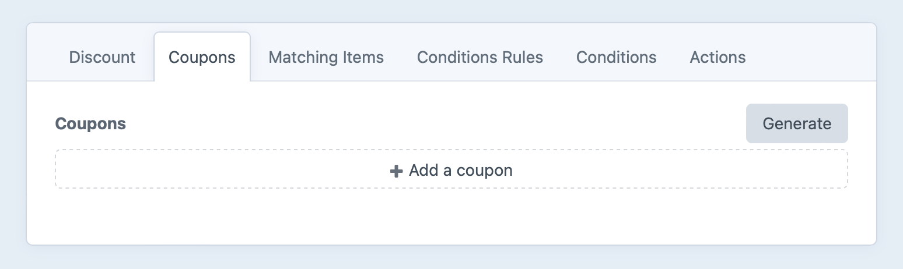
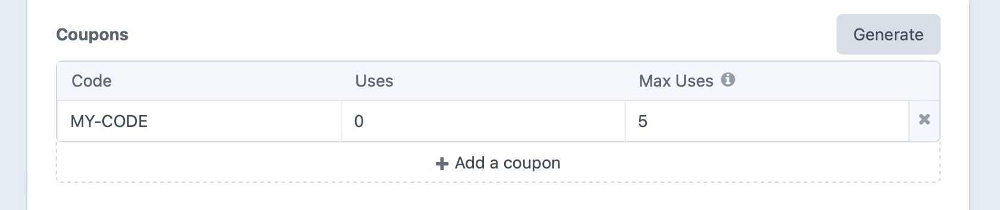

# Coupon Codes <badge type="edition" vertical="middle" title="Discounts are only available in Commerce Pro">Pro</badge>

Coupon codes are unique strings customers may enter for an order to receive a [discount](discounts.md).

Craft Commerce treats coupon codes as conditions within a discount promotion. Go to **Commerce** → **Promotions** → **Discounts**, select an existing promotion or press **+ New discount** to start a new one, and select to the “Coupons” tab:



There are no coupon codes by default, meaning no coupon code is necessary for the discount to work.

## Adding Coupon Codes

You can click **+ Add a coupon** to create them one at a time, where each one needs a **Code** and optional **Max Uses**. Individual code uses will be updated automatically in the **Uses** column each time an order is completed using that code for a matching discount:



Press **Generate** if you’d like to create codes in bulk:


Set the number of coupons you’d like to generate along with a desired format, where pound signs (`#`) will be replaced with random letters. Press **Submit** and they’ll be generated and added to the set.

::: tip
To make a coupon code no longer available for use, you can either delete it from the table or set its **Max Uses** to `0`.
:::

## Using a Coupon Code

To add a coupon to the cart, a customer submits the `couponCode` parameter using the `commerce/cart/update-cart` form action:

```twig
<form method="post">
  {{ csrfInput() }}
  {{ actionInput('commerce/cart/update-cart') }}
  {{ hiddenInput('successMessage', 'Added coupon code.'|hash) }}
  {{ redirectInput('shop/cart') }}

  <input type="text"
    name="couponCode"
    value="{{ cart.couponCode }}"
    placeholder="{{ "Coupon Code"|t }}"
  >

  <button>Update Cart</button>
</form>
```

Only one coupon code can exist on the cart at a time, accessible via `{{ cart.couponCode }}`.

If the customer submits an invalid code, Commerce may update the cart but adds an [order notice](carts-orders.md#order-notices):

```twig{7-8,16}
<form method="post">
  {{ csrfInput() }}
  {{ actionInput('commerce/cart/update-cart') }}
  {{ hiddenInput('successMessage', 'Added coupon code.'|hash) }}
  {{ redirectInput('shop/cart') }}

  {# Get the first notice for the `couponCode` attribute, if we have one #}
  

  {# Get any lower-level coupon code errors just in case #}
  

  <input type="text"
    name="couponCode"
    value="{{ cart.couponCode }}"
    class="has-error"
    placeholder="{{ "Coupon Code"|t }}"
  >

  <button>Update Cart</button>
</form>
```

::: tip
The example above includes `cart.getFirstError('couponCode')` as a precaution. Commerce won’t throw any coupon errors, but another plugin or custom module could.
:::

You can retrieve the discount associated with the coupon code using `craft.commerce.discounts.getDiscountByCode()`:

```twig
{# @var discount craft\commerce\models\Discount #}


  {{ discount.name }} - {{ discount.description }}

```
