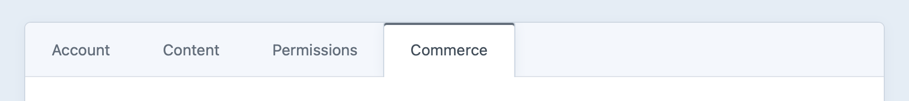

# Customers

With Craft Commerce, a _Customer_ is a [user](/4.x/users.md) element representing a person who may place an order.

That person could have placed an order as a guest, or as a credentialed user that can log in and place orders with saved information.

## User Customer Info Tab

Go to **Users** in Craft’s global navigation to see a complete list of the site’s users. Clicking any user’s name will take you to their edit screen, where you’ll find a **Commerce** tab:



This tab includes the following:

- **Orders** – a searchable list of the customer’s orders.
- **Active Carts** – a list of the customer’s active carts based on the [activeCartDuration](config-settings.md#activecartduration) setting.
- **Inactive Carts** – a list of the customer’s inactive carts based on the [activeCartDuration](config-settings.md#activecartduration) setting.
- **Subscriptions** – a list of the customer’s subscriptions.

This tab is shown by default but you can control its visibility with the [showCustomerInfoTab](config-settings.md#showeditusercommercetab) setting.

::: tip
If you’d like to be able to see and manage customer addresses from the control panel, [include the Addresses field](/4.x/addresses.html#managing-address-fields) in the User Fields layout.
:::

## Customers and Users

A customer with saved login information also has a Craft user account—but not *all* customers have user accounts. All users are listed in Craft’s global **Users** area, where the **Account Type** submenu will allow you to view the _Credentialed_ ones that are registered and the _Inactive_ ones that likely checked out as guests.

You can allow any guest user to transition from an inactive to a credentialed account at any time.

### Customer Flow

#### Guest Checkout

If someone visits the store and checks out as a guest, a new inactive user is created and related to the order.

#### User Checkout

If the customer is logged in, the order will be associated with that user the moment the cart is created and on through completion.

#### Guest Into User

A customer can register for an account before or after checkout using a normal [Craft user registration form](https://craftcms.com/knowledge-base/front-end-user-accounts).

You can also offer the option to register a user account during the checkout process by setting the `registerUserOnOrderComplete` order property to `true`. (See the [Update Cart Customer](update-cart-customer.md#registering-a-guest-customer-as-a-user) page for examples.)

If a customer chooses to register an account on order completion, a Craft user account is created and the customer is emailed an activation link. Commerce requires several conditions to be met before creating the account:

- The store must be using Commerce Pro.
- The customer must be a guest and not a logged-in user.
- The order cannot already be associated with a user account.
- There cannot already be a user account with the email address used on the order.
- The order must have an email address—which likely would have been caught earlier in the checkout process.

If any of the above fail, the user account will not be created; errors will be logged but not displayed or returned.

The Commerce [example templates](https://github.com/craftcms/commerce/blob/main/example-templates/dist/shop/checkout/payment.twig) display a “Create an account” checkbox at the payment stage—but only if a user account doesn’t already exist for the email address on the cart:

```twig
{# Get a user account using the same email address as the cart #}


  <label for="registerUserOnOrderComplete">
    {{ hiddenInput('registerUserOnOrderComplete', false) }}
    {{ input('checkbox', 'registerUserOnOrderComplete', 1, {
      id: 'registerUserOnOrderComplete'
    }) }}
    {{ 'Create an account'|t }}
  </label>

```
