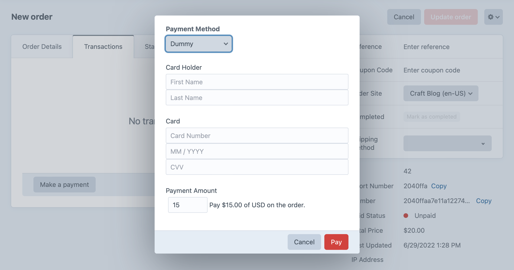

# Making Payments

Commerce supports taking payments from the customer at checkout and by a store manager via the Craft control panel. Payments can be [required](#full-payment-at-checkout) for order completion, [deferred](#checkout-without-payment) until later, or made [in parts](#checkout-with-partial-payment), depending on your store’s configuration and [gateway](payment-gateways.md) support.

## Full Payment at Checkout

The most common checkout process involves a customer paying in full by furnishing payment method details to a gateway.

In this example, we’ll assume a customer has finished shopping, and that we know what payment gateway they intend to use—it could be that the store only uses one gateway, or that they were given an opportunity to select a gateway in a previous step.

::: tip
Send a `gatewayId` param to the [`commerce/cart/update-cart` action](dev/controller-actions.md#post-cart-update-cart) to select a gateway ahead of time.
:::

This template uses `cart.gateway.getPaymentFormHtml()` to render the form fields required by the payment gateway, posting them to the [`commerce/payments/pay`](./dev/controller-actions.html#post-payments-pay) controller action:

```twig
{# @var cart craft\commerce\elements\Order #}
<form method="post">
  {{ csrfInput() }}
  {{ actionInput('commerce/payments/pay') }}
  {{ redirectInput('commerce/customer/order?number={number}') }}
  {{ hiddenInput('cancelUrl', 'commerce/checkout/payment'|hash) }}

  
    {{ cart.gateway.getPaymentFormHtml({})|raw }}
  

  <button>Pay Now</button>
</form>
```

::: tip
Using `gateway.getPaymentFormHtml()` is the quickest way to get form elements from the gateway; often, you’ll want to render and style these form fields based on the needs of your site and gateway.

Each gateway will have unique requirements for the data you submit when making a payment—consult its documentation for more information.
:::

## Deferred Payment at Checkout

Commerce provides a couple options if you don’t want to require full payment from a customer to complete an order:

1. Authorize a payment to be captured later by the store manager (not all gateways support authorize-only transactions);
1. Configure your store to allow [checkout without payment](#checkout-without-payment);
1. Use the built-in [Manual gateway](payment-gateways.md#manual-gateway) to track an offsite payment process;

::: tip
The first-party Stripe gateway supports additional payment plans via third-party services, but their availability varies by region, customer creditworthiness, and other factors.
:::

### Checkout Without Payment

Once the [allowCheckoutWithoutPayment](config-settings.md#allowcheckoutwithoutpayment) setting is enabled, the customer can submit a POST request to the [`commerce/cart/complete`](./dev/controller-actions.md#post-cart-complete) controller action to complete the order without any payment.

```twig
<form method="post">
  {{ csrfInput() }}
  {{ actionInput('commerce/cart/complete') }}
  {{ redirectInput('/shop/customer/order?number={number}&success=true') }}

  <button>Buy Now + Pay Later</button>
</form>
```

Like the [`commerce/payments/pay`](./dev/controller-actions.html#post-payments-pay) action, the cart must have a valid email address and abide by the following store settings:

- [allowEmptyCartOnCheckout](config-settings.md#allowemptycartoncheckout)
- [requireShippingMethodSelectionAtCheckout](config-settings.md#requireshippingmethodselectionatcheckout)
- [requireBillingAddressAtCheckout](config-settings.md#requirebillingaddressatcheckout)
- [requireShippingAddressAtCheckout](config-settings.md#requireshippingaddressatcheckout)

::: warning
If you enable order completion without payment, completed orders will have the same status as any others. Don’t forget to make sure store managers are aware of the change and prepared to confirm payment before fulfilling orders!

If you use these workflows, consider adding columns to the main Order [element indexes](/4.x/elements.md#indexes) for _Date Paid_ or _Amount Paid_ so that it is clear which orders need attention.
:::

### Checkout with Partial Payment

A _partial_ payment is one that’s less than an order’s outstanding balance at any point in time.

If you’d like to permit customers to check out with partial payments and the gateway supports them, you can enable the [allowPartialPaymentOnCheckout](config-settings.md#allowpartialpaymentoncheckout) setting to allow an additional hashed `paymentAmount` field when posting to the [`commerce/payments/pay`](./dev/controller-actions.html#post-payments-pay) controller action. If no `paymentAmount` field is submitted, the order’s outstanding balance will be used.

::: tip
Multiple payments can still be made on an order when `allowPartialPaymentOnCheckout` is `false`, as long as each payment is equal to the outstanding balance at the time it was made.
:::

The partial amount cannot be entered directly by the customer; for security, the field must contain a hashed value in the cart’s `paymentCurrency`.

This example provides a dropdown menu that allows the customer to choose half or full payment at checkout:

```twig
{# ... payment form ... #}





<select name="paymentAmount">
  <option value="{{ halfAmount|hash }}">
    50% ({{ halfAmount|commerceCurrency(cart.paymentCurrency) }})
  </option>
  <option value="{{ fullAmount|hash }}">
    100% ({{ fullAmount|commerceCurrency(cart.paymentCurrency) }})
  </option>
</select>

{# ... payment form ... #}
```

A customer may return to make additional payments similarly to the [outstanding balance example](#paying-an-outstanding-balance), supplying a valid `paymentAmount` until the remaining balance is paid in full. The first partial payment or authorization, however, will complete the order—subsequent payments will not trigger a change in status.

::: tip
You can use the [`paidInFull`](extend/events.md#paidinfull) event if you need to add any custom functionality when an order is paid in full.
:::

An order is considered “paid in full” as long as the total amount paid did at one point reach the order’s total—even if a payment is refunded.

### Paying an Outstanding Balance

You can allow a customer to pay the outstanding balance on a cart or order using the [`commerce/payments/pay`](./dev/controller-actions.html#post-payments-pay) controller action similarly to taking full payment at checkout, taking care to explicitly provide the order number whose outstanding balance should be paid.

::: tip
There’s a full example of this in the [example templates](example-templates.md) at [shop/checkout/pay-static.twig](https://github.com/craftcms/commerce/tree/main/example-templates/dist/shop/checkout/pay-static.twig).
:::

Here, we’re pretending the relevant order number is `12345`, the customer’s email address is `email@address.foo`, and the gateway is already set on the order:

```twig





<form method="post">
  {{ csrfInput() }}
  {{ actionInput('commerce/payments/pay') }}
  {{ redirectInput('/shop/customer/order?number={number}&success=true') }}
  {{ hiddenInput('cancelUrl', cancelUrl) }}
  {{ hiddenInput('email', email) }}
  {{ hiddenInput('orderNumber', cart.number) }}

  
    {{ cart.gateway.getPaymentFormHtml({})|raw }}
  

  <button>Submit</button>
</form>
```

If you’d like to have the customer pay with a different gateway than whatever was specified on the cart/order, pass the `gatewayId` in the form:

```twig
{# ... #}
{{ hiddenInput('gatewayId', 1) }}
{# ... #}
```

::: warning
A cart cookie is not created during this process; the user could be paying for a cart even while they have a different cart loaded.
:::

## Partial Payments in the Control Panel

Store managers can specify an order payment amount using any gateway that supports partial payments, regardless of whether partial payments are allowed at checkout.

To make a partial payment in the Craft control panel:

1. Navigate to **Commerce** → **Orders**.
2. Choose a cart or order to view its edit page
3. Select the **Transactions** tab and choose **Make Payment**.
4. Select a gateway that supports partial payments to enter the payment details and amount:\
    
5. Choose **Pay** to process the payment.

::: tip
To more quickly identify partially-paid orders, a store manager may want to add the **Paid Status** column on the order index page.


:::
