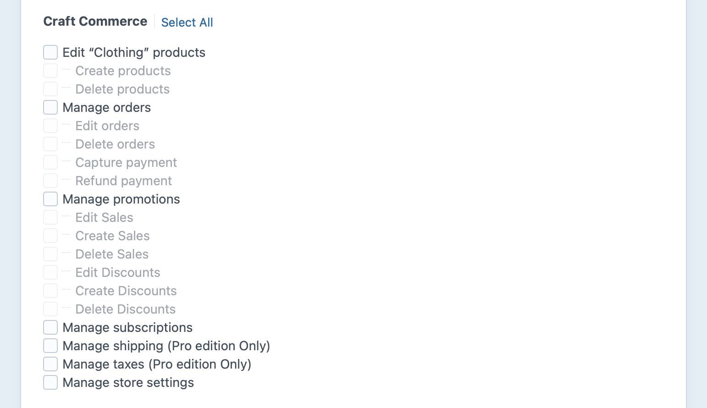

# Store Management

Craft Commerce adds user permissions you can customize in any of your [Craft CMS user groups](/4.x/user-management.md).

## Store Managers

While you have complete control over any user groups and permissions you establish for a Craft project, most projects tend to include two types of users: technical administrators and content editors.

Technical administrators are most often developers that use admin accounts for full system access, while content editors have control panel access use the control panel with more limited permissions to manage content without changing system configuration.

Commerce stores typically involve another tier of control panel users we’ll refer to throughout the documentation as “Store Managers”. These are users that have permissions tailored for managing the operation of a store, working with products and orders and pricing. The role is more permissive than that of a content editor, without full admin access to settings that could interrupt the functionality of the store.

The exact permissions you choose for “Store Managers” will depend on the needs of your organization and site.

## Permissions

The following Commerce permissions are available for Craft users and user groups.

### Access Craft Commerce

Whether the user is able to access the Commerce section of the control panel.

::: tip
Unlike the others, you’ll find it under Craft’s **Access the control panel** permission:

:::

### Manage products

Whether the user can manage products, with each product type having its own create and delete permissions.

### Manage orders

Whether the user can access and interact with orders.

#### Edit orders <badge text="Pro" type="edition" vertical="middle" title="Commerce Pro only" />

Whether the user is allowed to create and edit orders in the control panel using Commerce Pro.

#### Delete orders

Whether a user may delete orders.

#### Capture payment

Whether the user may click the “Capture” button on an authorized transaction.

#### Refund payment

Whether the user may click the “Refund” button on a successful payment.

### Manage promotions

Whether the user can manage promotions.

#### Edit sales

Whether the user can edit existing sales.

#### Create sales

Whether the user can create new sales.

#### Delete sales

Whether the user can delete sales.

#### Edit discounts

Whether the user can edit existing discounts.

#### Create discounts

Whether the user can create new discounts.

#### Delete discounts

Whether the user can delete discounts.

### Manage subscriptions

Whether the user can see subscriptions, refresh subscription payments, and cancel subscriptions.

### Manage shipping <badge text="Pro" type="edition" vertical="middle" title="Commerce Pro only" />

Whether the user can create, edit, and delete the following:

- Shipping methods
- Shipping rules
- Shipping categories
- Shipping zones

### Manage taxes <badge text="Pro" type="edition" vertical="middle" title="Commerce Pro only" />

Whether the user can create, edit, and delete tax zones and tax categories.

### Manage store settings

Whether the user may change settings in Commerce’s **Store Settings** area, including the store [location address](addresses.md), payment currencies, and settings related to shipping, tax, and subscriptions.
