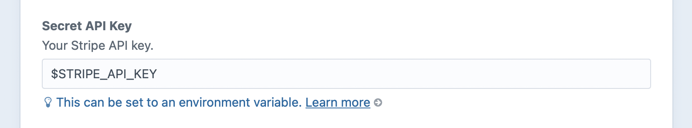

# Upgrading to Commerce 4

Commerce 4 brings the power of element types to customers and addresses and incorporates new Craft 4 features.

Address and Customer models have gone away, replaced by [Address](craft4:craft\elements\Address) and [User](craft4:craft\elements\User) elements. Thanks to the now-integrated [commerceguys/addressing](https://github.com/commerceguys/addressing) library (no relation), address data is now more pleasant to work with no matter what part of the planet you’re on.

::: warning
If you’re upgrading from Commerce 2, see the [Changes in Commerce 3](https://craftcms.com/docs/commerce/3.x/upgrading.html) and upgrade to the latest Commerce 3 version before upgrading to Commerce 4.
:::

## Preparing for the Upgrade

Before you begin, make sure that:

- you’ve reviewed the changes in Commerce 4 [in the changelog](https://github.com/craftcms/commerce/blob/main/CHANGELOG.md#400) and further down this page
- you’re running the latest version of Commerce 3.4.x
- you’ve made sure there are no deprecation warnings from Commerce 3 that need fixing
- you’ve checked the [Payment Gateways](#payment-gateways) section below and made sure any gateway plugins are ready before the upgrade
- your **database and files are backed up** in case everything goes horribly wrong

Once you’ve completed these steps, you’re ready continue with the upgrade process.

## Performing the Upgrade

1. Upgrade Craft CMS, Craft Commerce, and any other plugins, per the [Craft 4 upgrade instructions](../../4.x/upgrade.md). (Your `composer.json` should require `"craftcms/commerce": "^4.0.0-beta.1"`.)
2. In your terminal, run `php craft commerce/upgrade` and follow the interactive prompts.
3. Go to **Settings** → **Users** → **Address Fields** and drag the “Full Name”, “Organization”, and “Organization Tax ID” fields into the address field layout, so they remain editable within customers’ address books.

Once you’re running the latest version of Craft Commerce, you’ll need to update your templates and any custom code relevant to the topics detailed below.

::: warning
The [`commerce/upgrade`](console-commands.md#upgrade) command must be run interactively. It will prompt you to designate or create fields and then migrate content to them.

You’ll need to run it again in production where you can _only_ designate target fields and migrate content—unless you temporarily disable <config4:allowAdminChanges> to create fields on the fly in that environment, in which case you’d need to pull your production database down locally afterward and run [`project-config/write`](../../4.x/console-commands.md#project-config-write).
:::

## Order Numbers

Any time you pass a reference to an order/cart to a Commerce API, it will be consistently referenced as a `number`—meaning `orderNumber` is now `number` in [a few places](https://github.com/craftcms/commerce/pull/2732/files).

## Customer → User Transition

In Commerce 4, a customer is always represented by a [User](craft4:craft\elements\User) element regardless of an order’s status.

This means that whenever you see the word “customer” in Commerce 4, it’s something that relates to a user element. (This is possible thanks to Craft 4’s new support for inactive users, which are those that don’t have an account.)

The [Order::getUser()](commerce4:craft\commerce\elements\Order::getUser()) method has been deprecated, and you should use [getCustomer()](commerce4:craft\commerce\elements\Order::getCustomer()) instead. You can also designate the customer for an order using [Order::setCustomer()](commerce4:craft\commerce\elements\Order::setCustomer()) or by directly setting the [Order::$customerId](commerce4:craft\commerce\elements\Order::$customerId) property—just make sure the user you’ve referenced already exists.

Calling the [Order::setEmail()](commerce4:craft\commerce\elements\Order::setEmail()) method works slightly differently now behind the scenes to ensure a user with the supplied email address exists. (If not, Commerce will create one for you.) In other words, an order can exist without an email address, but as soon as it has an email address it also has a customer.

## Countries and States

Commerce 4 replaces manually-managed countries and states with Craft’s [Addresses](craft4:craft\services\Addresses) service, which provides a full repository of countries and subdivisions (states, provinces, etc.).

Because this repository isn’t editable, Commerce 4 has moved away from custom countries and states to a new concept called “Store Markets”—which is a more flexible way of defining where the store operates. You can navigate to these settings via **Commerce** → **Store Settings** → **Store**:


- **Order Address Condition** provides a condition builder for limiting what addresses should be allowed for orders.
- **Country List** is an autosuggest field for choosing the countries that should be available for customers to select, in the order they’re saved in the field.

::: tip
Enabled countries from Commerce 3 are migrated to the **Country List** field.
:::

You can fetch that list of available countries via the new [Store](commerce4:craft\commerce\services\Store) service:

::: code
```twig
{# Craft 3 #}


{# Craft 4 #}

```
```php
// Craft 3
$countries = \craft\commerce\Plugin::getInstance()
    ->getCountries()
    ->getAllEnabledCountriesAsList();

// Craft 4
$countries = \craft\commerce\Plugin::getInstance()
    ->getStore()
    ->getStore()
    ->getCountriesList();
```
:::

::: tip
You can get the _entire_ list of countries, and not just those you’ve chosen, with `craft.getAddresses().countryRepository.getAll()`.
:::

States can no longer be enabled or disabled for selection in dropdown lists, but you can use the new **Order Address Condition** to limit them instead. This example is configured to only allow orders from Western Australia:


While Commerce has removed support for managing custom countries and states, the [`commerce/upgrade`](console-commands.md#commerce-upgrade) command prompts you to map the custom countries to real country codes, and copies the state `abbreviation` (if a custom state was created) or the `stateName` entered by the customer to the `administrativeArea` field on relevant addresses and zones.

Please review your tax and shipping zones. We encourage you to use standardized countries and administrative areas (states) for your zones in the future.

## Address Management

Commerce-specific Address models are now Craft [Address](craft4:craft\elements\Address) elements.

This will almost certainly require changes to your front-end templates, though it comes with several benefits:

- better address formatting defaults
- easier address format customization
- custom address fields can be managed in field layouts—so no more need for `custom1`, `custom2`, etc.

If store managers had been editing user addresses directly from their profile pages in the control panel, you’ll want to expose address details in the Users field layout via **Settings** → **Users** → **User Fields**.

### Order Addresses

Each address can only have a single owner, whether that’s an order or a user.

An order’s addresses (both estimated and normal billing + shipping) belong solely to that order. If a customer designates one of their saved addresses for an order’s shipping or billing, the address will be cloned to that order with references to the original address element stored in `order.sourceBillingAddressId` and `order.sourceShippingAddressId`.

::: warning
Addresses are no longer automatically added to a customer’s address book when an order is completed, and a user must be logged in to be able to save an address to their address book. `makePrimaryBillingAddress` and `makePrimaryShippingAddress` will not have any effect for a user that’s not logged in.
:::

### User Addresses

You can use [User::getAddresses()](craft4:craft\elements\User::getAddresses()) to fetch any user’s addresses, including the currently-logged-in user:

::: code
```twig

```
```php
$userAddresses = Craft::$app->getUser()->getIdentity()->getAddresses();
```
:::

If you’d like to save a new address to a user’s address book, you must provide an `ownerId`:

```php{3-4}
$address = new \craft\elements\Address();
$address->setAttributes($addressData);
// Designate the logged-in user as the owner of this address
$address->ownerId = Craft::$app->getUser()->getIdentity()->id;

Craft::$app->getElements()->saveElement($address);
```

### Store Address

The Commerce store address is now an [Address](craft4:craft\elements\Address) element available via the store service:

::: code
```twig
{# Commerce 3 #}


{# Commerce 4 #}

```
```php
// Commerce 3
$storeAddress = \craft\commerce\Plugin::getInstance()
    ->getAddresses()
    ->getStoreLocationAddress();

// Commerce 4
$storeAddress = \craft\commerce\Plugin::getInstance()
    ->getStore()
    ->getStore()
    ->getLocationAddress();
```
:::

### Custom Address Fields and Formatting

The concept of address lines has gone away along with [DefineAddressLinesEvent](commerce3:craft\commerce\events\DefineAddressLinesEvent). Use Craft’s [Addresses::formatAddress()](craft4:craft\services\Addresses::formatAddress()) instead.

### Address Template Changes

The change in address format means you’ll need to update some references in your templates.

`businessName` and `businessTaxId` are now `organization` and `organizationTaxId`:

```twig
{# Commerce 3 #}
{# @var model craft\commerce\models\Address #}
{{ input('text', modelName ~ '[businessName]', model.businessName ?? '') }}
{{ input('text', modelName ~ '[businessTaxId]', model.businessTaxId ?? '') }}

{# Commerce 4 #}
{# @var address craft\elements\Address #}
{{ input('text', 'organization', address.organization ?? '') }}
{{ input('text', 'organizationTaxId', address.organizationTaxId ?? '') }}
```

`stateId` and `stateValue` references can be replaced with `administrativeArea`. It expects a two-letter code if the state/province is in the list of subdivisions for the current country, or an arbitrary string for countries that don’t.

```twig
{# Commerce 3 #}




  
    {# @var option \craft\commerce\models\State #}
    
    {{ tag('option', {
      value: key,
      selected: key == optionValue,
      text: option
    }) }}
  


{# Commerce 4 #}



  
    {# @var address \craft\elements\Address #}
    
    {{ tag('option', {
      value: key,
      selected: key == selectedValue,
      text: option
    }) }}
  

```

`city` is now `locality`:

```twig
{# Commerce 3 #}
{# @var model craft\commerce\models\Address #}
{{ input('text', modelName ~ '[city]', model.city ?? '') }}

{# Commerce 4 #}
{# @var address craft\elements\Address #}
{{ input('text', 'locality', address.locality ?? '') }}
```

`zipCode` is now `postalCode`:

```twig
{# Commerce 3 #}
{# @var model craft\commerce\models\Address #}
{{ input('text', modelName ~ '[zipCode]', model.zipCode ?? '') }}

{# Commerce 4 #}
{# @var address craft\elements\Address #}
{{ input('text', 'postalCode', address.postalCode ?? '') }}
```

Any custom fields can be treated just like those on any other element type. For example, if you were previously using `custom1`, which was part of Commerce 3’s address model, your migration would’ve made it a custom field on the Commerce 4 address element:

```twig
{# Commerce 3 #}
{{ input('text', 'shippingAddress[address1]', order.shippingAddress.address1 ?? '') }}
{{ input('text', 'shippingAddress[custom1]', order.shippingAddress.custom1 ?? '') }}

{# Commerce 4 #}
{{ input('text', 'shippingAddress[addressLine1]', order.shippingAddress.addressLine1 ?? '') }}
{{ input('text', 'shippingAddress[fields][custom1]', order.shippingAddress.custom1 ?? '') }}
```

## Front-End Form Requests and Responses

::: tip
Check out the [example templates](example-templates.md)—they’re compatible with Commerce 4!
:::

### Saving an Address

If you’re providing a way for customers to save their addresses on the front end, you’ll need to make a few adjustments:

- Address field names will need to be [updated](#address-template-changes), where any custom field names should follow the `fields[myFieldName]` format used by other element types.
- You must specify the user’s ID in an `ownerId` field for the address you’re saving.
- If you’re saving an _existing_ address, as opposed to a new one, you’ll need to reference it via the `addressId` param instead of `id`.
- The form action should be `users/save-address` rather than `commerce/customer-addresses/save`.
- The (optional) `makePrimaryShippingAddress` and `makePrimaryBillingAddress` params are now `isPrimaryShipping` and `isPrimaryBilling`.

::: warning
The new controller actions are only available for logged-in users; guests are no longer allowed to maintain address books.
:::

### Deleting an Address

If you’re allowing customers to delete their addresses on the front end…

- The form action should be `users/delete-address` rather than `commerce/customer-addresses/delete`.
- You must specify the address to be deleted via an `addressId` param instead of `id`.

::: warning
The new controller actions are only available for logged-in users; guests are no longer allowed to maintain address books.
:::

### Payment Forms

Gateway payment forms are now namespaced with `paymentForm` and the gateway’s `handle`, to prevent conflicts between cart/order fields and those required by the gateway.

If you were displaying the payment form on the final checkout step, for example, you would need to make the following change:

```twig
{# Commerce 3 #}
{{ cart.gateway.getPaymentFormHtml(params)|raw }}

{# Commerce 4 #}

  {{ cart.gateway.getPaymentFormHtml(params)|raw }}

```

This makes it possible to display multiple payment gateways’ form fields inside the same `<form>` tag, where the `gatewayId` param still determines which form data should be used.

### Payment Sources Responses

Ajax responses from `commerce/payment-sources/*` no longer return the payment form error using the `paymentForm` key.
Use `paymentFormErrors` to get the payment form errors instead.

## Config Settings

### PDF Settings

The `orderPdfFilenameFormat` and `orderPdfPath` settings have been removed. Create a default order [PDF](pdfs.md#creating-a-pdf) instead.

### Gateway Settings

Support for `commerce-gateways.php` has been removed. We recommend migrating any gateway-specific setting overrides to [environment variables](/4.x/config/#environmental-configuration).

**Commerce 3**

```php
// config/commerce-gateways.php
return [
    'myStripeGateway' => [
        'apiKey' => getenv('STRIPE_API_KEY'),
    ],
];
```

**Commerce 4**

```sh
# .env
STRIPE_API_KEY="<MY-API-KEY>"
```




## Twig Filters

We removed the `json_encode_filtered` Twig filter. Use [`json_encode`](../../4.x/dev/filters.md#json-encode) instead.

## Events

The [Order::EVENT_AFTER_REMOVE_LINE_ITEM](commerce4:craft\commerce\elements\Order::EVENT_AFTER_REMOVE_LINE_ITEM) string has been renamed from `afterRemoveLineItemToOrder` to `afterRemoveLineItemFromOrder`.

## Controller Actions

- The `cartUpdatedNotice` param is no longer accepted for `commerce/cart/*` requests. Use a hashed `successMessage` param instead.
- The `commerce/orders/purchasable-search` action was removed. Use `commerce/orders/purchasables-table` instead.

## Elements

- [Order::getCustomer()](commerce4:craft\commerce\elements\Order::getCustomer()) now returns a [User](craft4:craft\elements\User) element.
- [Product::getVariants()](commerce4:craft\commerce\elements\Product::getVariants()), [getDefaultVariant()](commerce4:craft\commerce\elements\Product::getDefaultVariant()), [getCheapestVariant()](commerce4:craft\commerce\elements\Product::getCheapestVariant()), [getTotalStock()](commerce4:craft\commerce\elements\Product::getTotalStock()), and [getHasUnlimitedStock()](commerce4:craft\commerce\elements\Product::getHasUnlimitedStock()) now return data related to only enabled variant(s) by default.

One element method was deprecated in Commerce 4:

| Old | What to do instead
| --- | ---
| [Order::getUser()](commerce4:craft\commerce\elements\Order::getUser()) | [getCustomer()](commerce4:craft\commerce\elements\Order::getCustomer())

Some element methods have been removed in Commerce 4:

| Old | What to do instead
| --- | ---
| [Order::getAdjustmentsTotalByType()](commerce3:craft\commerce\elements\Order::getAdjustmentsTotalByType()) | [getTotalTax()](commerce4:craft\commerce\elements\Order::getTotalTax()), [getTotalDiscount()](commerce4:craft\commerce\elements\Order::getTotalDiscount()), or [getTotalShippingCost()](commerce4:craft\commerce\elements\Order::getTotalShippingCost())
| [Order::getAvailableShippingMethods()](commerce3:craft\commerce\elements\Order::getAvailableShippingMethods()) | [getAvailableShippingMethodOptions()](commerce4:craft\commerce\elements\Order::getAvailableShippingMethodOptions())
| [Order::getOrderLocale()](commerce3:craft\commerce\elements\Order::getOrderLocale()) | [$orderLanguage](commerce4:craft\commerce\elements\Order::$orderLanguage)
| [Order::getShippingMethodId()](commerce3:craft\commerce\elements\Order::getShippingMethodId()) | [getShippingMethodHandle()](commerce4:craft\commerce\elements\Order::getShippingMethodHandle())
| [Order::getShouldRecalculateAdjustments()](commerce3:craft\commerce\elements\Order::getShouldRecalculateAdjustments()) | [recalculationMode](commerce4:craft\commerce\elements\Order::recalculationMode)
| [Order::getTotalTaxablePrice()](commerce3:craft\commerce\elements\Order::getTotalTaxablePrice()) | Taxable price is now calculated within the tax adjuster.
| [Order::isEditable](commerce3:craft\commerce\elements\Order::isEditable) | [canSave()](commerce4:craft\commerce\elements\Order::canSave())
| [Order::removeEstimatedBillingAddress()](commerce3:craft\commerce\elements\Order::removeEstimatedBillingAddress()) | [setEstimatedBillingAddress(null)](commerce4:craft\commerce\elements\Order::setEstimatedBillingAddress(null))
| [Order::removeEstimatedShippingAddress()](commerce3:craft\commerce\elements\Order::removeEstimatedShippingAddress()) | [setEstimatedShippingAddress(null)](commerce4:craft\commerce\elements\Order::setEstimatedShippingAddress(null))
| [Order::setShouldRecalculateAdjustments()](commerce3:craft\commerce\elements\Order::setShouldRecalculateAdjustments()) | [recalculationMode](commerce4:craft\commerce\elements\Order::recalculationMode)
| [Product::getIsDeletable()](commerce3:craft\commerce\elements\Product::getIsDeletable()) | [canDelete()](commerce4:craft\commerce\elements\Product::canDelete())
| [Product::getIsEditable()](commerce3:craft\commerce\elements\Product::getIsEditable()) | [canSave()](commerce4:craft\commerce\elements\Product::canSave())
| [Product::isDeletable()](commerce3:craft\commerce\elements\Product::isDeletable()) | [canDelete()](commerce4:craft\commerce\elements\Product::canDelete())
| [Product::isEditable()](commerce3:craft\commerce\elements\Product::isEditable()) | [canSave()](commerce4:craft\commerce\elements\Product::canSave())
| [Variant::isEditable()](commerce3:craft\commerce\elements\Variant::isEditable()) | [canSave()](commerce4:craft\commerce\elements\Variant::canSave())

### Element Actions

These Commerce-specific element actions have been removed and rely on Craft’s:

| Old | What to do instead
| --- | ---
| [DeleteOrder](commerce3:craft\commerce\elements\actions\DeleteOrder) | [Delete](craft4:craft\elements\actions\Delete)
| [DeleteProduct](commerce3:craft\commerce\elements\actions\DeleteProduct) | [Delete](craft4:craft\elements\actions\Delete)

## Models

### Changed

- [ProductType::$titleFormat](commerce3:craft\commerce\models\ProductType::$titleFormat) was renamed to [$variantTitleFormat](commerce4:craft\commerce\models\ProductType::$variantTitleFormat).
- [TaxRate::getRateAsPercent()](commerce4:craft\commerce\models\TaxRate::getRateAsPercent()) now returns a localized value.

### Removed

| Old | What to do instead
| --- | ---
| [ShippingAddressZone::getStatesNames()](commerce3:craft\commerce\models\ShippingAddressZone::getStatesNames()) | [getDescription()](commerce4:craft\commerce\models\ShippingAddressZone::getDescription())
| [Discount::$code](commerce3:craft\commerce\models\Discount::$code) | [$codes[0]](commerce4:craft\commerce\models\Discount::$codes)
| [Discount::getDiscountUserGroups()](commerce3:craft\commerce\models\Discount::getDiscountUserGroups()) | Discount user groups were migrated to the customer condition rule.
| [Discount::getUserGroupIds()](commerce3:craft\commerce\models\Discount::getUserGroupIds()) | Discount user groups were migrated to the customer condition rule.
| [Discount::setUserGroupIds()](commerce3:craft\commerce\models\Discount::setUserGroupIds()) | Discount user groups were migrated to the customer condition rule.
| [OrderHistory::$customerId](commerce3:craft\commerce\models\OrderHistory::$customerId) | [$userId](commerce4:craft\commerce\models\OrderHistory::$userId)
| [OrderHistory::getCustomer()](commerce3:craft\commerce\models\OrderHistory::getCustomer()) | [getUser()](commerce4:craft\commerce\models\OrderHistory::getUser())
| [Settings::$showCustomerInfoTab](commerce3:craft\commerce\models\Settings::$showCustomerInfoTab) | [$showEditUserCommerceTab](commerce4:craft\commerce\models\Settings::$showEditUserCommerceTab)
| [ShippingAddressZone::getCountries()](commerce3:craft\commerce\models\ShippingAddressZone::getCountries()) | [getDescription()](commerce4:craft\commerce\models\ShippingAddressZone::getDescription())
| [ShippingAddressZone::getCountriesNames()](commerce3:craft\commerce\models\ShippingAddressZone::getCountriesNames()) | [getDescription()](commerce4:craft\commerce\models\ShippingAddressZone::getDescription())
| [ShippingAddressZone::getCountryIds()](commerce3:craft\commerce\models\ShippingAddressZone::getCountryIds()) | [getDescription()](commerce4:craft\commerce\models\ShippingAddressZone::getDescription())
| [ShippingAddressZone::getStateIds()](commerce3:craft\commerce\models\ShippingAddressZone::getStateIds()) | [getDescription()](commerce4:craft\commerce\models\ShippingAddressZone::getDescription())
| [ShippingAddressZone::getStates()](commerce3:craft\commerce\models\ShippingAddressZone::getStates()) | [getDescription()](commerce4:craft\commerce\models\ShippingAddressZone::getDescription())
| [ShippingAddressZone::getStatesNames()](commerce3:craft\commerce\models\ShippingAddressZone::getStatesNames()) | [getDescription()](commerce4:craft\commerce\models\ShippingAddressZone::getDescription())
| [ShippingAddressZone::isCountryBased](commerce3:craft\commerce\models\ShippingAddressZone::isCountryBased) | Not applicable; zones can be country- and state-based simultaneously.
| [States](commerce3:craft\commerce\services\States) | `craft.app.getAddresses().subdivisionRepository.getAll(['US'])`
| [TaxAddressZone::getCountries()](commerce3:craft\commerce\models\TaxAddressZone::getCountries()) | [getDescription()](commerce4:craft\commerce\models\TaxAddressZone::getDescription())
| [TaxAddressZone::getCountriesNames()](commerce3:craft\commerce\models\TaxAddressZone::getCountriesNames()) | [getDescription()](commerce4:craft\commerce\models\TaxAddressZone::getDescription())
| [TaxAddressZone::getCountryIds()](commerce3:craft\commerce\models\TaxAddressZone::getCountryIds()) | [getDescription()](commerce4:craft\commerce\models\TaxAddressZone::getDescription())
| [TaxAddressZone::getStateIds()](commerce3:craft\commerce\models\TaxAddressZone::getStateIds()) | [getDescription()](commerce4:craft\commerce\models\TaxAddressZone::getDescription())
| [TaxAddressZone::getStates()](commerce3:craft\commerce\models\TaxAddressZone::getStates()) | [getDescription()](commerce4:craft\commerce\models\TaxAddressZone::getDescription())
| [TaxAddressZone::getStatesNames()](commerce3:craft\commerce\models\TaxAddressZone::getStatesNames()) | [getDescription()](commerce4:craft\commerce\models\TaxAddressZone::getDescription())
| [TaxAddressZone::isCountryBased](commerce3:craft\commerce\models\TaxAddressZone::isCountryBased) | Not applicable; zones can be country- and state-based simultaneously.

## Services

In Commerce 4, [ShippingMethods::getAvailableShippingMethods()](commerce3:craft\commerce\services\ShippingMethods::getAvailableShippingMethods()) has been renamed to [getMatchingShippingMethods()](commerce4:craft\commerce\services\ShippingMethods::getMatchingShippingMethods()) to better represent the method.

### Changed

A few methods have had changes to their arguments:

- [LineItems::createLineItem()](commerce4:craft\commerce\services\LineItems::createLineItem()) no longer has an `$orderId` argument.
- [LineItems::resolveLineItem()](commerce4:craft\commerce\services\LineItems::resolveLineItem()) expects an `$order` argument instead of `$orderId`.
- [Variants::getAllVariantsByProductId()](commerce4:craft\commerce\services\Variants::getAllVariantsByProductId()) now accepts a third param: `$includeDisabled`.

### Deprecated

Several methods have been deprecated:

| Old | What to do instead
| --- | ---
| [Plans::getAllGatewayPlans()](commerce3:craft\commerce\services\Plans::getAllGatewayPlans()) | [getPlansByGatewayId()](commerce4:craft\commerce\services\Plans::getPlansByGatewayId())
| [Subscriptions::doesUserHaveAnySubscriptions()](commerce3:craft\commerce\services\Subscriptions::doesUserHaveAnySubscriptions()) | [doesUserHaveAnySubscriptions()](commerce4:craft\commerce\services\Subscriptions::doesUserHaveSubscriptions())
| [Subscriptions::getSubscriptionCountForPlanById()](commerce3:craft\commerce\services\Subscriptions::getSubscriptionCountForPlanById()) | [getSubscriptionCountByPlanId()](commerce4:craft\commerce\services\Subscriptions::getSubscriptionCountByPlanId())
| [TaxRates::getTaxRatesForZone()](commerce3:craft\commerce\services\TaxRates::getTaxRatesForZone()) | [getTaxRatesByTaxZoneId()](commerce4:craft\commerce\services\TaxRates::getTaxRatesByTaxZoneId())
| [Transactions::deleteTransaction()](commerce3:craft\commerce\services\Transactions::deleteTransaction()) | [deleteTransactionById()](commerce4:craft\commerce\services\Transactions::deleteTransactionById())

## Controllers

Several controllers have been removed entirely in Commerce 4:

- [AddressesController](commerce3:craft\commerce\controllers\AddressesController)
- [CountriesController](commerce3:craft\commerce\controllers\CountriesController)
- [CustomersController](commerce3:craft\commerce\controllers\CustomersController)
- [CustomerAddressesController](commerce3:craft\commerce\controllers\CustomerAddressesController)
- [StatesController](commerce3:craft\commerce\controllers\StatesController)

A few controller methods have been removed as well:

- [OrdersController::_prepCustomersArray()](commerce3:craft\commerce\controllers\OrdersController::_prepCustomersArray()) (Use [_customerToArray()](commerce4:craft\commerce\controllers\OrdersController::_customerToArray()) instead.)
- [PlansController::actionRedirect()](commerce3:craft\commerce\controllers\PlansController::actionRedirect())
- [ProductsPreviewController::<wbr>enforceProductPermissions()](commerce3:craft\commerce\controllers\ProductsPreviewController::enforceProductPermissions())

## User Permissions

Permissions for managing products have become more granular in Commerce 4:

- `commerce-manageProducts` has been replaced by `commerce-editProductType:<uid>` and nested `commerce-createProducts:<uid>` and `commerce-deleteProducts:<uid>` permissions
- `commerce-manageCustomers` has been replaced by Craft’s standard user management permissions.

## Payment Gateways

There are gateway-specific changes to be aware of in Commerce 4 in addition to the [removed support for `commerce-gateways.php`](#gateway-settings).

### Stripe

The “Charge” gateway has been removed. Use the “Payment Intents” gateway instead.
