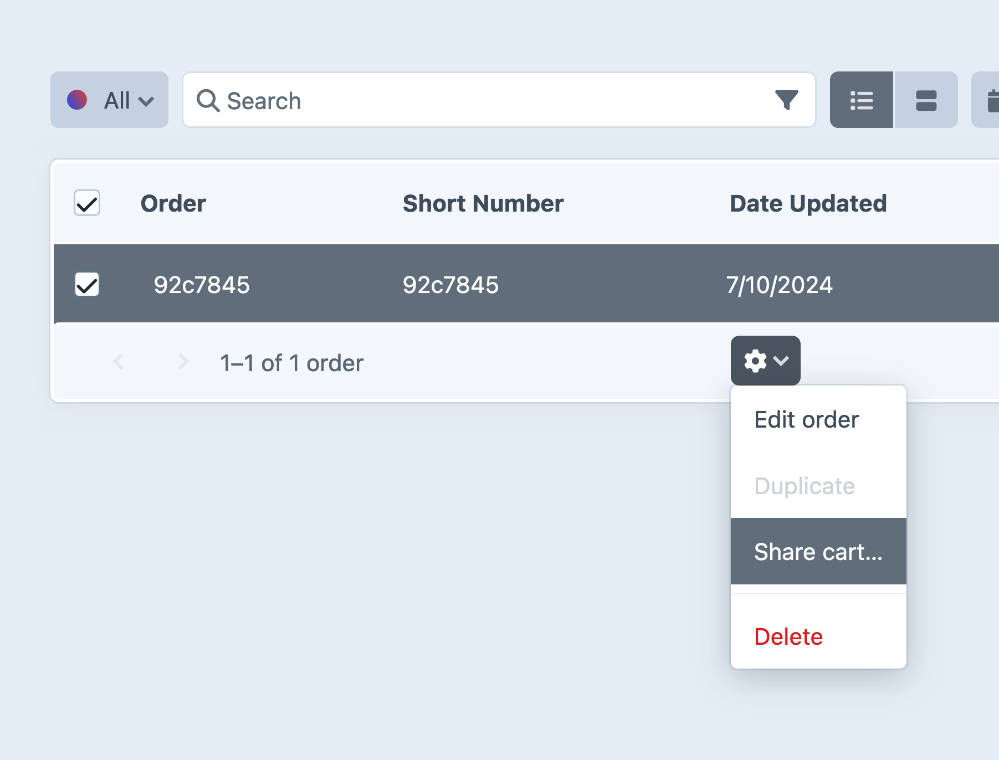

# Cart

Commerce represents a customer’s cart with the same object as a completed [order](../system/orders-carts.md), which means working with data before and after [checkout](checkout.md) is familiar.

::: tip
The snippets on this page are simplified versions of concepts illustrated in our [example templates](example-templates.md).
:::

This page covers common patterns for working with carts in the front-end, prior to [checkout](checkout.md):

- [Accessing the cart and its contents](#accessing-the-cart)
- [Displaying a cart’s contents](../development/cart.md#displaying-cart-contents)
- [Adding items to a cart](#adding-items-to-a-cart)
- [Working with line items](#line-items)
- [Using custom fields](#custom-fields)
- [Loading](#load-a-cart) and [forgetting](#forgetting-a-cart) carts

## Accessing the Cart

A customer’s cart is always available via the _carts_ service:

```twig

```

Carts are also available to headless or hybrid front-ends, via Ajax:

```js
fetch('/actions/commerce/cart/get-cart', {
  headers: {
    'Accept': 'application/json',
  },
})
  .then(r => r.json())
  .then(console.log);

// -> { cart: { ... } }
```

::: warning
The path of this Ajax request matters when working with multiple sites and stores! Prefix the [action path](/5.x/system/routing.md) with your site’s base URI if you need to load information about a specific cart.
:::

Either of the examples above will generate a new cart number if one is not already present in the session. The cart may exist only in-memory, until a customer interacts with it in some way (typically by [adding an item](#adding-items), but also saving a custom field, setting their email, adding an address, etc…).

If you _do_ need a cart to be persisted for _every_ visitor, you can force Commerce to save it by passing `true`:

```twig
{# Get a cart and ensure it’s persisted: #}

```

::: warning
This is generally not necessary, and can have significant performance impacts on high-traffic stores.
:::

To see what cart information you can use in your templates, take a look at the [Order](commerce5:craft\commerce\elements\Order) class reference. You can also refer to the example templates’ [`shop/cart/index.twig`](https://github.com/craftcms/commerce/blob/5.x/example-templates/dist/shop/cart/index.twig) file.

Once a cart is completed and turned into an order, accessing the current cart via either method starts this process over.

## Displaying Cart Contents

Your store should provide enough information about the contents of a customer’s cart for them to shop and check out confidently.

### Quantity and Totals

To display the number of items in the customer’s cart, use its `totalQty` attribute:

```twig
There are {{ cart.totalQty }} item(s) in your cart!
```

A variety of [totals](../system/orders-carts.md#order-totals) can also be displayed:

```twig
Cart ({{ cart.itemSubtotal|commerceCurrency }})
```

::: tip
Craft includes a powerful [internationalization engine](guide:tutorial-i18n#plural) that can automatically pluralize the awkward `item(s)` message above:

```twig
{{ 'You have {num,plural,=0{nothing} =1{one item} other{# items}} in your cart'|t('site', {
  num: cart.totalQty
}) }}
```
:::

### Line Items

A cart’s contents are represented by _line items_. Line items are typically populated from [purchasables](../system/purchasables.md) when they are added to the cart, but [custom line items](#custom-line-items) can also be created on-the-fly. <Since product="commerce" ver="5.1.0" feature="Custom, ad-hoc line items" />

Out-of-the-box, line items  [variant](../system/products-variants.md), and have a quantity, description, notes, a calculated subtotal, options, adjustments (like tax and shipping costs), and other metadata. Most importantly, though, the line item retains a reference to its purchasable so that it can be refreshed with the latest information from your store while the customer is shopping.

::: tip
In the event a product or variant is altered or deleted after a customer checks out, enough information is memoized on each line item to reconstruct what was purchased, and how much was paid. Some of this is recorded directly on the line item (like [prices](#prices) and its [physical attributes](#physical-properties)), and some is stored as metadata (like [options](#line-item-options-and-notes) and [snapshots](../system/purchasables.md#snapshots)).
:::

To learn about working with an active cart, jump to [Managing Cart contents](#managing-cart-contents).

Line items are always returned as an array, even if there is only a single item in the cart. Loop over them to display information about each one:

```twig{2}
<ul>
  
    <li>
      <h4>{{ item.description }} (<code>{{ item.sku }}</code>)</h4>
      <p>{{ item.price|commerceCurrency }} &times; {{ item.qty }} &rarr; {{ item.subtotal|commerceCurrency }}</p>
    </li>
  
</ul>
```

You can get a line item’s source [purchasable](../system/purchasables.md) by calling `item.purchasable`. Let’s take a closer look at some other data available via line items.

#### Prices

In the example above, we used `item.price` to display the single-item price. Commerce actually tracks two prices for every purchasable: a _price_, and a _sale price_. Both prices are resolved via the [pricing catalog](../system/pricing-rules.md), but only the sale price is ever used to calculate totals and subtotals.

This gives you flexibility in how prices are structured and advertised, while preserving a tidy, predictable API:

- **lineItem.subtotal** is the product of the line item’s `qty` and `salePrice`.
- **lineItem.adjustmentsTotal** is the sum of each of the line item’s adjustment `amount` values.
- **lineItem.total** is the sum of the line item’s `subtotal` and `adjustmentsTotal`.

You should _never_ perform math on prices directly in your templates. Commerce handles all the necessary calculations in a safe and currency-agnostic way, and provides simple accessors via line item, purchasable, and order objects.

<See path="../system/currencies.md" label="Currencies + Formatting" description="Learn about how to display and convert pricing information for customers." />

#### Physical Properties

Each line item copies its purchasable’s `length`, `width`, `depth`, and `weight` properties.

#### Metadata

Commerce populates line items with a `description` from its purchasable. Variants use their [product type](../system/products-variants.md#product-types)’s configured **Order Description Format** to render a meaningful string—but you can build a custom description in the template, if you prefer.

Your storefront can also keep arbitrary text under a `notes` property, or structured data under in the `options` array. Notes and options are not automatically validated, so your templates should account for a variety of possible values (or the absence thereof):

```twig
<ul>
  
    

    <li>
      <h4>{{ item.description }}</h4>

      {# ... #}

      {# Notes: #}
      
        <p>{{ item.notes }}</p>
      

      {# Options: #}
      
        <dl>
          
            <dt>{{ key|title }}</dt>
            <dd>{{ val }}</dd>
          
        </dl>
      
    </li>
  
</ul>
```

If you are collecting information from customers as they [add items to their cart](#line-item-options-and-notes), use the same criteria to output it. For example, “Gift Card” products might ask for a custom message under a `giftMessage` key—you can then test for the presence of that key, from the cart:

```twig
{# ... #}

{# Extra product-type-specific line item data: #}

  
    <p>{{ item.options.giftMessage ?? 'No custom message.' }}</p>
  
    {# Fall back to outputting *all* keys: #}
    
      <dl>
        
          <dt>{{ key|title }}</dt>
          <dd>{{ val }}</dd>
        
      </dl>
    

```

This same logic applies when using deeply-nested data—the schema is not automatically enforced by Commerce, so code defensively!

### Notices

Should something about a cart change (like the price of a line item, a total or subtotal, [shipping](../system/shipping.md) method eligibility, [coupon](../system/coupon-codes.md) validity, or the availability of a purchasable), Commerce will add a [notice](../system/orders-carts.md#order-notices) to the cart with an explanation of what happened.

You can display notices to the customer by looping over `cart.notices`:

```twig



  <ul>
    
      <li class="notice notice--{{ notice.type }}">{{ notice.message }}</li>
    
  </ul>

```

Each notice has `message` (a customer-facing description), `type` (an identifier used to group similar notices), and `attribute` (the name of the associated attribute) properties. You can fetch notices of a specific type and/or for a specific attribute, if you wish to colocate them with the the relevant UI:

```twig


<form method="post">
  {{ csrfInput() }}
  {{ actionInput('commerce/cart/update-cart') }}

  

  
    <ul>
      
        <li>{{ notice.message }}</li>
      
    </ul>
  

  <label>
    <span>Coupon Code</span>
    <input
      type="text"
      name="couponCode"
      value="{{ cart.couponCode }}">
  </label>
</form>
```

The `getNotices()` method accepts `type` and `attribute` arguments to make filtering notices easier. You can also filter a collection of notices after fetching them:

```twig{3}



  {{ notice.message }}

```

Notices may apply to an attribute of the cart, or an individual line item; the `attribute` in the latter case will contain the item’s ID and property:

```
lineItem.{id}.{property}
```

To access notices specific to a line item in-context, filter them down based on the `attribute`:

```twig

  {# ... #}
  

  
    {{ itemNotice.message }}
  

```

#### Clearing Notices

To clear notices, send a POST request to the `commerce/cart/update-cart` action with any value in the `clearNotices` param:

```twig
<form method="post">
  {{ csrfInput() }}
  {{ actionInput('commerce/cart/update-cart') }}
  {{ hiddenInput('clearNotices', 'Yes, please!') }}

  <button>Clear all notices</button>
</form>
```

Call <commerce5:craft\commerce\elements\Order::clearNotices()> directly to clear notices by type and/or attribute:

::: code
```twig
{# Clear notices on the `couponCode` attribute: #}

```
```php{7}
use craft\commerce\Plugin as Commerce;

// Get the current cart
$cart = Commerce::getInstance()->getCarts()->getCart();

// Clear notices on the `couponCode` attribute
$cart->clearNotices(null, 'couponCode');
```
:::

Be aware that this only removes the notices from the cart object _in memory_. Save the cart to scrub them from the database, as well:

::: code
```twig
{# Save the cart #}

```
```php
// Save the cart
Craft::$app->getElements()->saveElement($cart);
```
:::

This is best handled via a [controller action](/5.x/extend/controllers.md) in a module or plugin—rendering Twig templates should generally not have side effects.

::: warning
Notices may be re-added to a cart any time its contents change or prices are recalculated!
:::

## Managing Cart Contents

Cart contents are typically updated via HTML forms, but Commerce also supports JSON payloads over [Ajax](/5.x/development/forms.md#ajax), for headless and hybrid storefronts.

### Adding Items

To add an item to the cart, send a `purchasableId` the `commerce/cart/update-cart` action:

```twig
<form method="post">
  {{ csrfInput() }}
  {{ actionInput('commerce/cart/update-cart') }}

  <select name="purchasableId">
    
      <option value="{{ variant.id }}">{{ variant.sku }}</option>
    
  </select>

  <button>Add item</button>
</form>
```

You can add multiple items in a single request under a `purchasables[]` param:

```twig{13}
{# Load items from a “Variants” relational field: #}


<h3>Shop this look!</h3>

<form method="post">
  <ul>
    
      <li>
        <label>
          <input
            type="checkbox"
            name="purchasables[{{ loop.index }}][id]"
            value="{{ item.id }}"
            checked />
            <span>{{ purchasable.title }}</span>
        </label>
      </li>
    
  </ul>

  <button>Add item(s) to cart</button>
</form>
```

Each element in the `purchasables[]` array must have an `id` key, and may contain additional fields for [quantity](#setting-quantity) and [other metadata](#line-item-options-and-notes).

::: tip
If the inputs for each purchasable are not adjacent in the DOM, a unique index key is required to preserve their grouping—in this example we’ve used `{{ loop.index }}` as a temporary identifier.
:::

### Setting Quantity

When adding a purchasable to the cart, provide a `qty` param to let the customer choose how many they want. Expanding on our single-item form in the previous section…

```twig{11-16}
<form method="post">
  {{ csrfInput() }}
  {{ actionInput('commerce/cart/update-cart') }}

  <select name="purchasableId">
    
      <option value="{{ variant.id }}">{{ variant.sku }}</option>
    
  </select>

  <input
    type="number"
    name="qty"
    value="1"
    step="1"
    min="1">

  <button>Add to cart</button>
</form>
```

Within our multi-item form example, use an input named `purchasables[{{ loop.index }}][qty]` (alongside `purchasables[{{ loop.index }}][id]`) to send a quantity param for each item. This allows you to build advanced, single-page order forms popular in B2B or wholesale storefronts.

If a compatible line item is already in the cart, that number of items will be _added_ to it.

::: tip
To directly update the quantity of an existing line item, see the [Updating Line Items](#updating-line-items) section.
:::

### Line Item Options and Notes

An `options` parameter can be submitted with arbitrary data to include with that item. A `note` parameter can include a message from the customer.

In this example, we’re providing the customer with an option to include a note, preset engraving message, and gift-wrap option:

::: code
```twig Single Item



<form method="post">
  {{ csrfInput() }}
  {{ actionInput('commerce/cart/update-cart') }}
  {{ hiddenInput('qty', 1) }}
  <input type="text" name="note" value="">
  <select name="options[engraving]">
    <option value="happy-birthday">Happy Birthday</option>
    <option value="good-riddance">Good Riddance</option>
  </select>
  <select name="options[giftwrap]">
    <option value="yes">Yes Please</option>
    <option value="no">No Thanks</option>
  </select>
  {{ hiddenInput('purchasableId', variant.id) }}
  <button>Add to Cart</button>
</form>
```
```twig Multiple Items


<form method="post">
  {{ csrfInput() }}
  {{ actionInput('commerce/cart/update-cart') }}
  
    {{ hiddenInput('purchasables[][id]', variant.id) }}
    {{ hiddenInput('purchasables[][qty]', 1) }}
    <input type="text" name="purchasables[][note]" value="">
    <select name="purchasables[][options][engraving]">
      <option value="happy-birthday">Happy Birthday</option>
      <option value="good-riddance">Good Riddance</option>
    </select>
    <select name="purchasables[][options][giftwrap]">
      <option value="yes">Yes Please</option>
      <option value="no">No Thanks</option>
    </select>
  
  <button>Add to Cart</button>
</form>
```
:::

The same `note` and `options` params can be sent when [updating a line item](#updating-line-items), as well!

::: warning
Commerce does not validate the `options` and `note` parameters. If you’d like to limit user input, use front-end validation or use the [`Model::EVENT_DEFINE_RULES`](craft5:craft\base\Model::EVENT_DEFINE_RULES) event to add validation rules for the [`LineItem`](commerce5:craft\commerce\models\LineItem) model.
:::

The note and options will be visible on the order’s detail page in the control panel:


### Updating Line Items

The `commerce/cart/update-cart` endpoint is also used to update existing line items.

To update `qty`, `note`, or `options` for a line item, you must build input `name` attributes using its existing ID (not the purchasable ID):

```twig{8-9}


<form method="post">
  {{ csrfInput() }}
  {{ actionInput('commerce/cart/update-cart') }}

  
    <input type="number" name="lineItems[{{ item.id }}][qty]" min="1" value="{{ item.qty }}">
    <input type="text" name="lineItems[{{ item.id }}][note]" placeholder="My Note" value="{{ item.note }}">
  

  <button>Update Line Item</button>
</form>
```

### Removing Line Items

You can remove a line item by sending a `remove` parameter in the request. This example adds a checkbox the customer can use to remove the line item from the cart:

```twig{10}


<form method="post">
  {{ csrfInput() }}
  {{ actionInput('commerce/cart/update-cart') }}

  
    <input type="number" name="lineItems[{{ item.id }}][qty]" min="1" value="{{ item.qty }}">
    <input type="text" name="lineItems[{{ item.id }}][note]" placeholder="My Note" value="{{ item.note }}">
    <input type="checkbox" name="lineItems[{{ item.id }}][remove]" value="1"> Remove item<br>
  

  <button>Update Line Item</button>
</form>
```

::: tip
The [example templates](../development/example-templates.md) include a [detailed cart template](https://github.com/craftcms/commerce/blob/main/example-templates/dist/shop/cart/index.twig) for adding and updating items in a full checkout flow.
:::

#### Options Uniqueness

If a purchasable is posted that’s identical to one already in the cart, the relevant line item’s quantity will be incremented by the submitted `qty`.

If you posted a purchasable or tried to update a line item with different `options` values, however, a new line item will be created instead. This behavior is consistent whether you’re updating one item at a time or multiple items in a single request.

Each line item’s uniqueness is determined behind the scenes by an `optionsSignature` attribute, which is a hash of the line item’s options. You can think of each line item as being unique based on a combination of its `purchasableId` and `optionsSignature`.

::: tip
The `note` parameter is not part of a line item’s uniqueness; it will always be updated on a matching line item.
:::

### Customizing Messages

Any time you submit a request to `commerce/cart/update-cart`, you can include special `successMessage` and `failMessage` params to customize [flash messages](/5.x/development/forms.md#flashes) sent back to the customer. In this example, we are integrating the product type into the confirmation when adding an item to the cart:

```twig
<form method="post">
  {{ csrfInput() }}
  {{ actionInput('commerce/cart/update-cart') }}
  {{ successMessageInput("We hope you enjoy your #{product.type.name}!") }}
  {{ failMessageInput("Your #{product.type.name} couldn’t be added to the cart.") }}

  {{ hiddenInput('purchasableId', variant.id) }}

  <button>Buy</button>
</form>
```

By splitting up cart management into multiple forms, you can provide detailed, personalized messaging for each concern:

```twig
<form method="post">
  {{ csrfInput() }}
  {{ actionInput('commerce/cart/update-cart') }}
  {{ successMessageInput('Coupon code applied!') }}

  <label>
    <span>Coupon Code</span>
    <input
      type="text"
      name="couponCode"
      value="{{ cart.couponCode }}" />
  </label>

  <button>Buy</button>
</form>
```

::: tip
This kind of atomic update is especially effective in combination with [htmx](https://htmx.org) or the [Sprig](plugin:sprig) plugin!
:::

### Redirection

Like other [forms](/5.x/development/forms.md), Commerce allows you to send users to specific routes after they complete an action—like sending them to their cart after adding an item:

```twig
<form method="post">
  {{ csrfInput() }}
  {{ actionInput('commerce/cart/update-cart') }}
  {{ redirectInput('shop/cart') }}

  {# ... #}

  <button>Add to cart</button>
</form>
```

Read more about the [`redirectInput()` Twig function](/5.x/reference/twig/functions.md#redirectInput).


## Loading and Forgetting Carts

“Loading” and “forgetting” are a pair of actions that affect what cart is associated with the customer’s session.

### Load a Cart

Commerce provides a [`commerce/cart/load-cart`](../reference/controller-actions.md#get-post-cart-load-cart) endpoint for loading an existing cart into a cookie for the current customer.

You can have the user interact with the endpoint by [navigating to a URL](#loading-a-cart-with-a-url) or by [submitting a form](#loading-a-cart-with-a-form). Either way, an existing cart number is required.

If there are issues loading the cart, an error message will be flashed to the user.

::: tip
If the desired cart belongs to a user, that user must be logged in to load it into a browser cookie.
:::

The [`loadCartRedirectUrl`](../configure.md#loadcartredirecturl) setting determines where the customer will be sent by default after the cart has been loaded.

### Loading a Cart with a URL

A customer can load a cart into their session by navigating to a properly constructed [action URL](/5.x/system/routing.md).

Store managers can get this URL by navigating in the control panel to <Journey path="Commerce, Orders" />, selecting a single cart from **Active Carts** or **Inactive Carts**, then selecting **Share cart…** from the element actions menu:



You can also do this from an order edit page by choosing the gear icon and then **Share cart…**.

To do this programmatically (without the involvement of a store manager), you’ll need to create the action URL using the desired cart [number](../system/orders-carts.md#order-number).

This example sets a `loadCartUrl` variable to an absolute URL the customer can access to load their cart. We’re assuming a `cart` object already exists for the cart that should be loaded:

::: code
```twig

```
```php
$loadCartUrl = craft\helpers\UrlHelper::actionUrl(
    'commerce/cart/load-cart',
    ['number' => $cart->number]
);
```
:::

::: tip
This URL can be presented to the user however you’d like. It’s particularly useful in an email that allows the customer to retrieve an abandoned cart.
:::

### Loading a Cart with a Form

Send a GET or POST action request with a `number` parameter referencing the cart you’d like to load. When posting the form data, you can include a specific [redirect location](/5.x/development/forms.md#after-a-post-request) like you can with most any other Craft form.

This is a simplified version of [`shop/cart/load.twig`](https://github.com/craftcms/commerce/tree/5.x/example-templates/dist/shop/cart/load.twig) from the example templates, which requires the user to provide an existing cart number:

```twig
<form method="post">
  {{ csrfInput() }}
  {{ actionInput('commerce/cart/load-cart') }}
  {{ redirectInput('shop/cart') }}

  <input type="text" name="number">
  <button>Submit</button>
</form>
```

### Restoring Previous Cart Contents

If the customer is a registered user, they may want to continue shopping from another browser or computer. If they have an empty cart on the second device (as they would by default) and they log in, their most recently-created cart will automatically be loaded.

::: tip
When a guest with an active cart creates an account, that cart will be remain active after logging in.
:::

You can allow a logged-in customer to see their previous (incomplete) carts:

::: code
```twig

  

  

  
    {# Return all incomplete carts *except* the currently-loaded one: #}
    
  

  

  {# ... #}

```
```php
use craft\commerce\Plugin as Commerce;
use craft\commerce\elements\Order;

$currentUser = Craft::$app->getUser()->getIdentity();

if ($currentUser) {
    $currentCart = Commerce::getInstance()->getCarts()->getCart();

    $oldCartsQuery = Order::find()
        ->storeId(Commerce::getInstance()->getStores()->getCurrentStore())
        ->isCompleted(false)
        ->user($currentUser);

    if ($currentCart->id) {
        // Return all incomplete carts *except* the currently-loaded one:
        $oldCartsQuery->id('not '.$currentCart->id);
    }

    $oldCarts = $oldCartsQuery->all();
}
```
:::

With that list of carts, you can build a form to switch between multiple carts:

```twig
<form method="post">
  {{ csrfInput() }}
  {{ actionInput('commerce/cart/load-cart') }}
  {{ redirectInput('cart') }}

  <select name="number">
    
      <option value="{{ oldCart.number }}">
        {{ oldCart.shortNumber }}
        ({{ oldCart.totalQty }} items, last updated {{ oldCart.dateUpdated.format('F j, Y') }})
      </option>
    
  </select>

  <button>Switch</button>
</form>
```

…or loop over only the line items in those older carts to allow the customer to merge them to their _current_ cart:

```twig
<h2>Previous Cart Items</h2>

<form method="post">
  {{ csrfInput() }}
  {{ actionInput('commerce/cart/update-cart') }}

  
    
      {{ lineItem.description }}
      <label>
        {{ input('checkbox', 'purchasables[][id]', lineItem.purchasableId) }}
        Add
      </label>
    
  

  <button>Merge items</button>
</form>
```

While Commerce combines similar line items in the active cart, this simple form may list the same purchasable more than once.

### Forgetting a Cart

A logged-in customer’s cart is stored in a cookie that persists across sessions, so they can close their browser and return to the store without losing their cart. If the customer logs out, Commerce assigns the “guest” a new cart.

Removing all the items from a cart doesn’t mean that the cart is forgotten, though—sometimes, fully detaching a cart from the session is preferable to emptying it. To remove a cart from the customer’s session (without logging out or clearing the items), make a `POST` request to the [`cart/forget-cart` action](../reference/controller-actions.md#post-cart-forget-cart). A cart number is _not_ required—Commerce can only detach the customer’s current cart.

```twig
<form method="post">
  {{ csrfInput() }}
  {{ actionInput('commerce/cart/forget-cart') }}
  {{ redirectInput('shop/cart') }}

  <button>Forget this cart</button>
</form>
```

The next time the customer’s cart is accessed, Commerce will generate a new cart number and attach it to their session; as soon as they make a request to the [`update-cart` action](../reference/controller-actions.md#post-cart-update-cart), the cart will be saved.

::: warning
The only way to recover a guest’s cart is with the involvement of a store manager, via the control panel. If the customer has entered addresses or populated custom fields, they will not be able to retrieve that information after forgetting their cart, unless they recorded the cart number and your shop provides a method for [loading the cart back into their session](#load-a-cart).
:::

## Custom Fields

Like any other type of [element](/5.x/system/elements.md), orders can have custom fields associated with them via a field layout. To customize the fields available on carts and orders, visit <Journey path="Commerce, System Settings, Orders, Field Layout" />.

Custom fields are perfect for storing information about an order that falls outside [line item options or notes](#line-item-options-and-notes).

::: tip
Now that [Addresses](/5.x/reference/element-types/addresses.md#setup) are stored as elements, they support custom fields, too!
:::

You can update custom fields on a cart by posting data to the [`commerce/cart/update-cart`](../reference/controller-actions.md#post-cart-update-cart) action under a `fields` key:

```twig
<form method="post">
  {{ csrfInput() }}
  {{ actionInput('commerce/cart/update-cart') }}
  {{ redirectInput('shop/cart') }}

  <label>
    Gift Message
    {{ input('text', 'fields[giftMessage]', cart.giftMessage) }}
  </label>

  <button>Update Cart</button>
</form>
```
