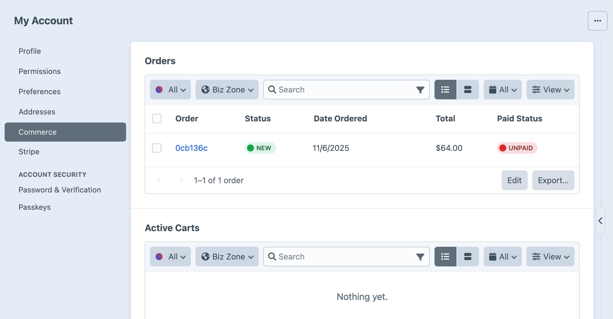

# Customers

Commerce leverages Craft’s native [User](/5.x/reference/element-types/users.md) element to represent and track customers.

As soon as an email address is added to an [Order](orders-carts.md), a customer is created or attached—but because some customers remain guests through checkout, the underlying user may never become [credentialed](#customers-and-users).

## Customer Info Tab

Go to **Users** in Craft’s global navigation to see a complete list of the site’s users. Clicking any user’s name will take you to their edit screen, where you’ll find a **Commerce** tab:



This tab includes the following:

- **Orders** – a searchable list of the customer’s orders.
- **Active Carts** – a list of the customer’s _active_ carts, based on the [activeCartDuration](../configure.md#activecartduration) setting.
- **Inactive Carts** – a list of the customer’s _inactive_ carts, based on the [activeCartDuration](../configure.md#activecartduration) setting.
- **Subscriptions** – a list of the customer’s [subscriptions](subscriptions.md).


## Customers and Users

A customer with saved login information is considered a [credentialed](/5.x/reference/element-types/users.md#active-and-inactive-users) user. Conversely, customers who check out as guests are set up as _inactive_ users.

### User Checkout

::: warning
Prior to version 4.5, some customer registration features were only only available in Commerce Pro.
:::

Logged-in customers are bound to their cart the moment it is created.

A guest can register for an account before or after checkout using a standard [Craft user registration form](kb:front-end-user-accounts#registration-form). This workflow may look a bit different depending on your configuration:

Setting | Result
------- | ------
<config5:useEmailAsUsername> | Only requires an email address to register; can be pre-filled if the customer already set an email on their cart (as this creates an inactive user, behind the scenes).
<config5:deferPublicRegistrationPassword> | A password is set only after activating their account (typically only used in combination with [email verification](/5.x/system/user-management.md#public-registration)).

<See path="../development/checkout.md" />

### Guest Checkout

If someone visits the store and checks out as a guest, a new inactive user is created and related to the order—and any future orders using the same email address will be consolidated under that user.

#### Registration at Checkout

You can also offer the option to initiate registration _at_ checkout by sending the `registerUserOnOrderComplete` param when [updating a cart](../reference/controller-actions.md#post-cart-update-cart) or [submitting payment](../reference/controller-actions.md#post-payments-pay).

If a customer chooses to register an account upon order completion, an activation link is sent to the email on file.

```twig


<form method="post">
  {{ csrfInput() }}
  {{ actionInput('commerce/cart/update-cart') }}

  {{ input('checkbox', 'registerUserOnOrderComplete', 1, {
    checked: cart.registerUserOnOrderComplete,
  }) }}

  {# ... #}

  <button>Save cart</button>
</form>
```

When registering at checkout, their order’s billing and shipping addresses are automatically saved to their new accounts.
Commerce attempts to set the user’s name based on the order’s billing address, falling back to the name on the shipping address.
If neither address contained a name, it will be blank.

New users will not have a username, so they must use their email address to [log in](/5.x/system/user-management.md#logging-in).
Consider enabling <config5:useEmailAsUsername> and labeling your `loginName` fields appropriately.
