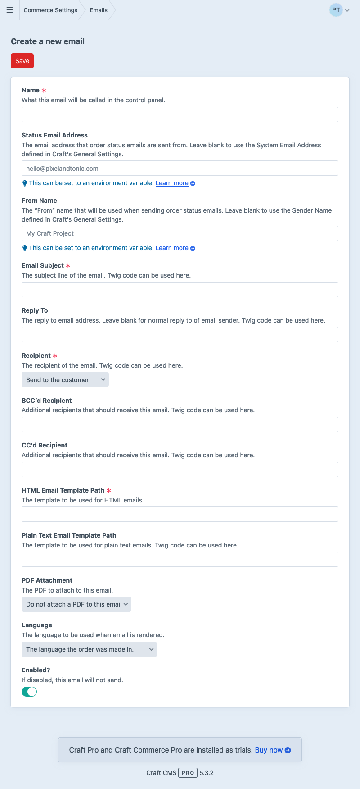
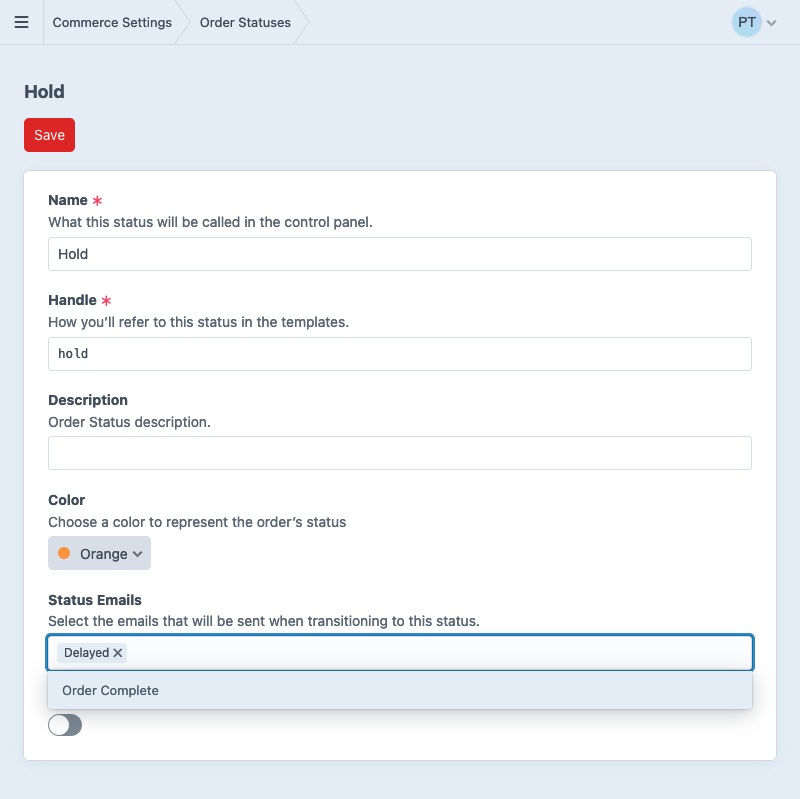
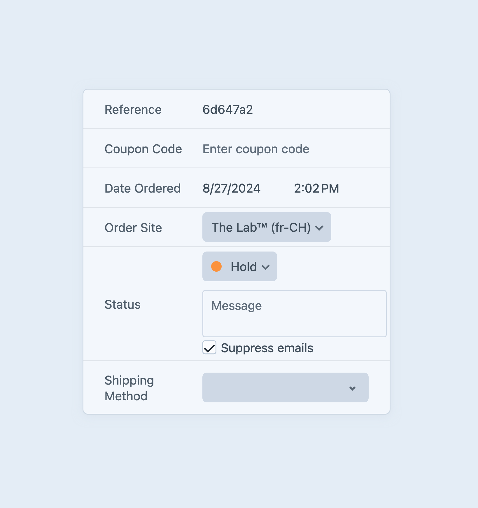

# Emails

Once you’ve defined a suite of [order statuses](custom-order-statuses.md#functionality), you can configure Commerce to send emails as orders move between them.

Commerce’s email system is completely flexible—you choose when emails are sent, who they’re sent to, and what they contain. This can be disorienting at first, because there is no built-in notion of a receipt or shipping confirmation!

::: tip
Before setting up emails for Craft Commerce, ensure that your Craft installation has a [properly configured mail adapter](/5.x/system/mail.md).

Commerce emails are sent via the [queue](/5.x/system/queue.md). To ensure prompt delivery, consider setting up a [dedicated queue runner](/5.x/system/queue.md#queue-runners)!
:::

Let’s look at a couple examples of emails you might want to send:

- **Customer Order Confirmation** —  When an order is completed, you’ll often want to send a receipt to the customer. This would be linked to the default order status since we want it to trigger when a cart is completed and becomes an order.
- **Admin Order Notification** — At the same time (when a cart becomes an order with the default order status), a separate email is sent to the store owner’s email address, with stock alerts or shipping information.
- **Shipping Update** — When an order is packed and has a shipping label, an administrator might add tracking information to a custom field on the order, then move the order into a status that triggers a specially-formatted message with a link to the courier’s tracking tool.
- **Back-ordered** — Suppose inventory was off, or a distributor’s shipment is late. You could notify the customer that their order is on hold.

The store manager can also send any email manually from an order’s edit page—whether that’s to re-send an email from a previous status change, or to send an email that is otherwise not connected to order statuses.

## Creating an Email

Emails are managed per-store. To create a new email, navigate to <Journey path="Commerce, System Settings, Emails" />, and choose **New Email**, selecting the desired store:

<toggle-tip>



</toggle-tip>

Emails have the following configuration settings. Unless otherwise noted, textual settings are treated as [object templates](/5.x/system/object-templates.md), and are provided two special variables:

- `order` — the [Order object](commerce4:craft\commerce\elements\Order) that triggered the email;
- `orderHistory` — the [OrderHistory object](commerce4:craft\commerce\models\OrderHistory) created as the order changed status, or `null` if the email was triggered manually;

This allows you to customize the behavior of an email, without a module or plugin—for example, sending a copy of an email to 

::: tip
Each email can only be triggered _once_ by a status change. If you need to send an email to multiple recipients, you can provide them as a comma-separated list in the [custom recipient](#recipient) field.
:::

### Name

A label for the email, visible when managing it in the control panel. This is not displayed to customers.

### Email Subject

The “Subject” line of the email.

```twig
Order #{{ order.id }} received.
```

### Recipient

The “To” address (or addresses) for this email.

If “Send to the customer” is selected, the email will be sent to the order’s customer in the language (locale) that customer used placing the order. This affects the use of the `|t` filter in other email fields that support Twig.

If “Send to custom recipient” is selected, a comma-separated list of email addresses can be entered.

Like the [Email Subject](#email-subject), this field is an [object template](/5.x/system/object-templates.md). Two special variables are available:

- `order` — the [Order object](commerce4:craft\commerce\elements\Order) that triggered the email;
- `orderHistory` — the [OrderHistory object](commerce4:craft\commerce\models\OrderHistory) created as the order changed status, or `null` if the email was triggered manually;

`order` is the cart or order relevant to the notification. To replicate the “Send to the customer” behavior, you might provide this:

```twig
{{ order.email }}
```

To give customers the ability to control where notifications are sent, you can store additional emails in a [custom field](orders-carts.md#field-layout) on the order, then merge it with the customer’s email:

```
{{ collect(order.extraNotificationRecipients|split(',')).push(order.email).unique().join(',') }}
```

### Reply-To Address

The Reply-To address for this email.

This field takes plain text as well as Twig values. Two special variables are available:

- `order` is a populated [Order object](commerce4:craft\commerce\elements\Order).
- `orderHistory` is a populated [OrderHistory object](commerce4:craft\commerce\models\OrderHistory).

### BCC’d Recipient

The BCC addresses for this email. Most likely, you would BCC the store owner on order confirmation.

Separate multiple addresses with a comma (`,`).

This field takes plain text as well as Twig values. Two special variables are available:

- `order` is a populated [Order object](commerce4:craft\commerce\elements\Order).
- `orderHistory` is a populated [OrderHistory object](commerce4:craft\commerce\models\OrderHistory).

### CC’d Recipient

The CC addresses for this email. Separate multiple addresses with a comma (`,`).

This field takes plain text as well as Twig values. Two special variables are available:

- `order` is a populated [Order object](commerce4:craft\commerce\elements\Order).
- `orderHistory` is a populated [OrderHistory object](commerce4:craft\commerce\models\OrderHistory).

### HTML Email Template Path

The path to an HTML template in your site’s `templates/` folder.

This field takes plain text as well as Twig values. Two special variables are available:

- `order` is a populated [Order object](commerce4:craft\commerce\elements\Order).
- `orderHistory` is a populated [OrderHistory object](commerce4:craft\commerce\models\OrderHistory).

This allows you to have full design flexibility.

### Plain Text Email Template Path

The path to a plain text template in your site’s `templates/` folder.

This works the same way as the “HTML Email Template Path”.


### PDF Attachment

Choose a PDF that will be attached to this email.

## Email Language

Under most circumstances, emails are sent in the language of the site the order was placed in. Commerce captures this at checkout, and it cannot be changed after the order is completed. As a result, emails triggered by orders from a single store _can_ be rendered in different languages, if that store is attached to multiple sites.

::: tip
Set up [static message translations](/5.x/system/sites.md#static-message-translations) if you need to localize parts of your emails.
:::

## Selecting an Email

To use an email you’ve configured, visit <Journey path="Commerce, System Settings, Order Status" /> and select the order status you want to trigger it.

Choose the email by name in the **Status Emails** field. You can select as many emails as you’d like.



Once you choose **Save**, the designated emails will be sent when an order is assigned that status.

## Suppressing Emails

There may be cases where you don’t want an order status change to send an email. When updating an order’s status (from its edit screen, or an element index), you can select **Suppress emails** to prevent Commerce from sending any emails attached to the new status:



This setting is retained only for the duration of the request, so subsequent status changes must also set this flag.

<Block label="Programmatically Suppressing Emails">

If you wish to conditionally suppress automatically-triggered emails, Commerce emits a [cancelable event](/5.x/extend/events.md#cancelable-events) any time it is preparing to send one. Set the event object’s `$isValid` property to `false` to prevent the email from being sent:

```php{13}
use craft\commerce\events\OrderStatusEmailsEvent;
use craft\commerce\services\OrderStatuses;
use yii\base\Event;

Event::on(
    OrderStatuses::class,
    OrderStatuses::EVENT_ORDER_STATUS_CHANGE_EMAILS,
    function (OrderStatusEmailsEvent $event) {
        $newStatus = $event->orderHistory->getNewStatus();

        // Prevent shipping notifications going out for orders without a shippable item:
        if ($newStatus->handle === 'shipped' && !$order->hasShippableItems()) {
            $event->isValid = false;
        }
    }
);
```

This will suppress _all_ emails associated with the new status. To prevent _individual_ emails from being sent (regardless of how they were triggered), or to modify some aspect of the email before it is sent, you can use the <commerce5:craft\commerce\services\Emails::EVENT_BEFORE_SEND_MAIL> event:

```php
use craft\commerce\events\MailEvent;
use craft\commerce\services\Emails;
use craft\helpers\StringHelper;
use yii\base\Event;

Event::on(
    Emails::class,
    Emails::EVENT_BEFORE_SEND_MAIL,
    function (MailEvent $event) {
        $order = $event->order;
        $email = $event->craftEmail;

        // Add store administrator to any email sent regarding unpaid orders:
        if ($order->getIsUnpaid()) {
            $email->setBcc('help@pixelandtonic.com');
        }
    }
);
```

</Block>

## Troubleshooting

It’s a good idea to always test your status email templates before relying on them in production.

Once you’ve configured a template, the quickest way to test it is by navigating to **Commerce** → **System Settings** → **Emails** and choosing **Preview** next to the relevant email. This will open a new tab/window to display the template rendered using a random completed order.

::: tip
You can add `&number=ORDER_NUMBER` to the preview URL to use a specific number. Replace `ORDER_NUMBER` with the order number you’d like to preview.
:::

If your template is rendering successfully but messages are failing to send, you’ll want to check these things in order:

1. **Make sure Craft’s queue is running.**\
If the [`runQueueAutomatically`](config4:runQueueAutomatically) setting is `true` you may want to establish a more reliable queue worker.
2. **Make sure any dynamic settings are parsed properly.**\
Some email settings support dynamic Twig values, where parsing errors can cause sending to fail: 
    - Email Subject
    - Reply To
    - Recipient
    - BCC’d Recipient
    - CC’d Recipient
    - HTML Email Template Path
    - Plain Text Email Template Path
3. **Make sure the HTML and Plain Text template paths exist and parse properly.**\
Syntax issues, undeclared variables, or missing information may prevent templates from rendering.
4. **Make sure included PDFs render properly.**\
If you’re including a [PDF](pdfs.md), it could have its own rendering issues that cause sending to fail. Be sure to preview the relevant PDF separately and ensure it’s working as expected.
5. **Avoid cart and session references.**\
Emails are sent by queue processes that don’t have access to cookies or sessions the cart depends on. References to `craft.commerce.carts.cart` or `craft.commerce.customers.customer`, for example, will result in session-related errors.

Commerce adds email jobs to the [queue](/5.x/system/queue.md) with “high priority” (for drivers that support it). This helps ensure outgoing messages don’t get stuck behind slow, long-running tasks.

When an email fails to send in response to a status change, its queue job will be marked as failed and include an appropriate message. Once you fix the cause of the sending failure, you can retry sending the email from the queue via **Utilities** → **Queue Manager**.

::: tip
If a plugin suppresses an email (by listening to [`EVENT_BEFORE_SEND_MAIL`](../extend/events.md#beforesendemail) and assigning `$event->isValid` to `false`), queue jobs will complete normally.
:::
