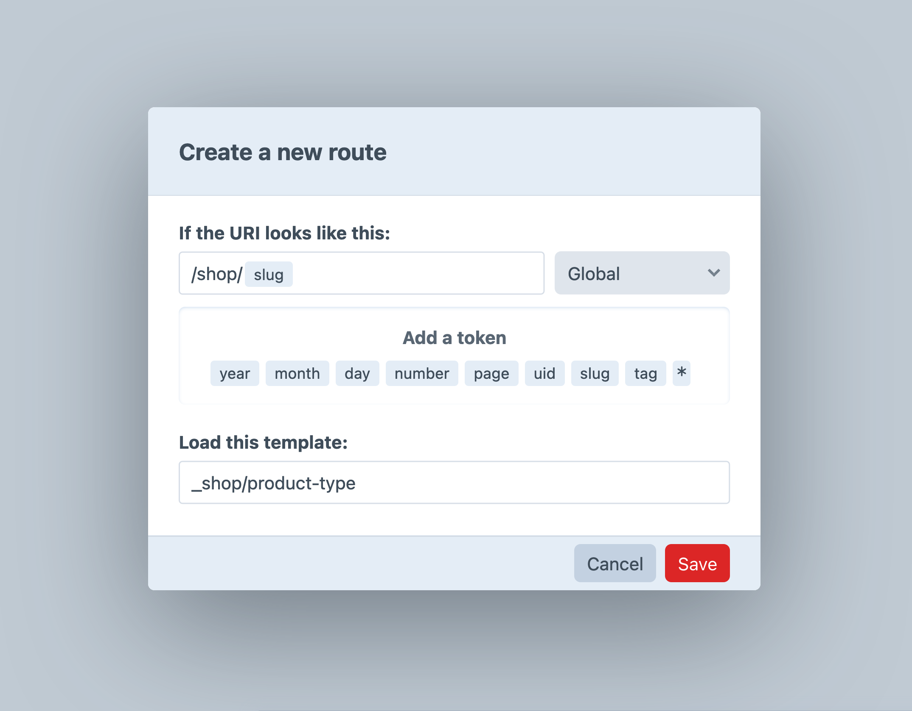

# Products & Variants

Your product catalog in Commerce is represented by a pair of [element types](/5.x/system/elements.md).

- [**Products**](#products) are the top-level container for goods and content.
- [**Variants**](#variants) represent individual [purchasables](purchasables.md) that are ultimately added to carts.

Every _product_ must have one or more _variants_, and every _variant_ belongs to a single _product_.

<Block label="Product & Variant Architecture">

To illustrate the relationship between products and variants, consider the needs of a store that sells apparel.

A particular pair of tennis shoes is available in two colors, and in U.S. half-size increments from 6 to 12. The **product** we’re describing might have a name like “Court Balance DX,” while the **variants** represent each intersection of a color and size. This is both a key discovery tool (customers need to find shoes that fit their feet and style), _and_ a necessary business tool for the store owner (tracking inventory, accounting for shipping weight, visualizing sales).

In this example, the product would hold all the marketing information like text, photos, and graphics, while the variants represent unique, saleable _variations_. Customers shop for a shoe that is aligned with their needs and tastes, but _buy_ a specific size and color.

</Block>

## Products

Products organize your goods into logical bundles of [variants](#variants). A product itself is never actually purchased—what goes into a cart for purchase is one of the product’s [variants](#variants). In this way, the product is free to house some globally-relevant attributes or content, while the variants describe specific physical or digital items.

In the same way that Craft’s native element types each share a set of common attributes, every Commerce product has a **Title**, **Slug**, **Post Date**, **Expiry Date**, and per-site status options.

## Product Types

**Product Types** provide a way to distinguish classes of goods in your stores. Manage product types in the control panel from <Journey path="Commerce, System Settings, Product Types" />.

::: warning
Despite their similarities to [entries](/5.x/reference/element-types/entries.md#entry-types), a product’s type cannot be changed after it is created.
:::

### Product Type Options

Each product type has the following settings. Some product type settings govern the behavior of the variants nested within it!

Name
:   The name of the product type as displayed in the control panel. Customers only see this if you explicitly output it in the front-end (or in an email or PDF).

Handle
:   The handle is what you’ll use to reference the product type in code. In Twig, you would [query for products](#querying-products) with the `clothes` type like this:

    ```twig
    
    ```

Versioning
:   Enable versioning to stage and revert product content changes with Craft’s drafts and revisions system. Provisional drafts (“autosaving,” colloquially) is always enabled.

Show the Title field for products
:   When enabled, each product will require a **Title**. Disable this if you’d like to generate titles with an [object template](/5.x/system/object-templates.md), using values of other attributes or fields.

    Title translation method <Since product="commerce" ver="5.1.0" feature="Product title translation method settings" />
    :   When using custom titles, you can choose how titles are synchronized across sites that the product exists in. The options are identical to those available in [custom fields](/5.x/system/fields.md#translation-methods).

        For [multi-store](stores.md) projects, you can use the **Custom…** option with a key format like this to synchronize titles across sites that use the same store:

        ```
        {site.store.handle}
        ```

    Product Title Format
    :   If you are not using custom product titles, you must provide an [object template](/5.x/system/object-templates.md) so Commerce can generate one. Make sure your underlying data is distinct enough for customers and store managers to differentiate them!

Automatic SKU Format
:   Defines what variants’ auto-generated SKUs should look like when left empty. This setting is defined as an [object template](/5.x/system/object-templates.md), meaning it can include dynamic values such as `{product.slug}` or `{myCustomField}`.

    ::: tip
    The SKU format is always evaluated in the context of a _variant_, so product attributes must be prefixed with `product`, like `{product.myCustomField}`.
    :::

    Commerce requires that SKUs are unique across all variants in the system—including anything in the trash—so avoid using static or ambiguous values (like `PLACEHOLDER`) that are apt to collide when first saving a variant.

Order Description Format
:   Like the **Automatic SKU Format**, this is also an [object template](/5.x/system/object-templates.md) that is rendered in the context of a variant. It can include tags that output properties of the variant or its product, like `{myVariantCustomField}` or `{product.title}`.

    The rendered string is ultimately stored in line items’ `description` attribute, and used to identify the purchasable in a customer’s cart (and the control panel). Changing a description format does *not* apply to completed orders, retroactively.

Max Variants
:   Limit the number of variants allowed by products of this type. Use `1` to enforce single-variant products, or leave blank to impose no limits.

Show the Dimensions and Weight fields
:   Allows you to hide the weight and dimensions fields if they are not necessary for variants belonging to products of this type.

Show the Title field for variants
:   Equivalent to **Show the Title field for products**, but for variants.

    When _enabled_, you will select a **Title Translation Method**. To avoid confusion, this should generally match the product’s setting. <Since product="commerce" ver="5.1.0" feature="Variant title translation method settings" />

    When _disabled_, you must define a **Variant Title Format** using an [object template](/5.x/system/object-templates.md). Note that this template is evaluated in the context of the variant, so product attributes and custom fields must be accessed as `{product.slug}` (not `{slug}` alone). The **Title** field layout element will always appear in the [variant field layout designer](#variant-fields), but it will be hidden when editing a variant.

Site Settings
:   Like [entries](/5.x/reference/element-types/entries.md) and other built-in [element types](/5.x/system/elements.md), products provide site-specific routing settings. When a customer visits a product’s URL in a given site, Commerce renders the specified template with a special `product` variable.

    ::: tip
    Variants do not have their own routing mechanism; calling `variant.url` will return the product’s URL (for the site it was loaded in) with a `variant={id}` query string appended.
    :::

Propagation Method <Since product="commerce" ver="5.1.0" feature="Product element propagation" />
:   Choose how new product elements are propagated across its supported sites.

::: tip
When you create a new product type, don’t forget to give your store managers the appropriate [permissions](../reference/permissions.md)!
:::

#### Tax & Shipping

The second tab in a product type’s settings screen is strictly informational—it displays a list of **Shipping Categories** and **Tax Categories** (from the **Store Management** area) that can be selected from _variants_ of current product type.

::: tip
Product types are defined globally, but shipping and tax categories are defined per-store. If you have similarly-named categories in multiple stores, you may see them listed twice.
:::

#### Product Fields

Every product type’s authoring experience can be tailored to its needs through a [field layout](/5.x/system/fields.md). Consider what content belongs on a product and what belongs on a [variant](#variant-fields).

A product’s field layout _must_ include the special **Variants** field layout element, which controls where the nested element management interface lives.

#### Variant Fields

In addition to fields associated with a product, the product type defines what fields are available to its nested variants.

### Templating

There are a ton of ways to leverage your product types and product data in templates. Keep in mind that the custom fields available to each product type may differ—but they’re accessed exactly the same way as you would with any other element type!

#### Displaying a Product Type

Every product has access to its product type definition via a `type` attribute:

```twig
<ul class="breadcrumbs">
  <li><a href="{{ siteUrl }}">Home</a></li>
  <li><a href="{{ siteUrl('shop') }}">Shop</a></li>
  <li><a href="{{ siteUrl("shop/#{product.type.handle}") }}">{{ product.type.name }}</a></li>
</ul>

<h2>{{ product.title }}</h2>
```

This example generates a URL to an “index” for a product type—but requires that we set up a corresponding [route](/5.x/system/routing.md#advanced-routing-with-url-rules) that maps it to a template:

```php
return [
    // ...
    'shop/<productType:{slug}>' => ['template' => '_shop/product-type'],
];
```

An equivalent route can by configured in the control panel, via <Journey path="Settings, Routes" />:



#### Listing Product Types

You can access a list of all configured product types via Commerce’s `productTypes` service:

```twig

  {{ type.handle }} - {{ type.name }}

```

### Querying Products

Products are automatically loaded and exposed under a `product` variable when their URL is requested. In situations where you need to fetch one or more products based on some fixed or dynamic criteria, you will use a _product query_.

Product queries are a kind of element query, meaning they have a similar API to Craft’s built-in [element types](/5.x/system/elements.md):

::: code
```twig
{# Create a new product query #}

```

```php
// Create a new product query
$myProductQuery = \craft\commerce\elements\Product::find();
```

```graphql
# Create a new product query
{
  products {
    # ...
  }
}
```
:::

Once you’ve created a product query, you can set [parameters](#product-query-parameters) on it to narrow down the results, and then [execute it](/5.x/development/element-queries.md#executing-element-queries) to return one or more [Product](commerce5:craft\commerce\elements\Product) elements.

::: tip
See [Element Queries](/5.x/development/element-queries.md) in the Craft docs to learn about how element queries work.
:::

### Example

We can use Twig to display the ten most recently-added _Clothing_ products:

1. Create a product query with `craft.products()`.
2. Set the [`type`](#type) and [`limit`](#limit) parameters on it.
3. Fetch the products with `.all()`.
4. Loop through the products using a [`for`](https://twig.symfony.com/doc/3.x/tags/for.html) tag to output their HTML.

```twig
{# Create a product query with the 'type' and 'limit' parameters #}


{# Display the products #}

  <h2>{{ product.title }}</h2>
  {{ product.summary|md }}
  <a href="{{ product.url }}">Learn more</a>

```

To fetch the same information with Craft’s [GraphQL API](/5.x/development/graphql.md), we could write a query like this:

```graphql
{
  products(limit: 10, type: "clothing") {
    title
    uri
    ... on clothing_Product {
      summary
    }
  }
}
```

### Eager-loading

Products can be [eager-loaded](/5.x/development/eager-loading.md) using the handle of a [relational field](../reference/fields.md#products-field) attached to other elements, and you can eager-load other related elements just as you would with any other element query.

You can also eager-load variants

!!!include(docs/.artifacts/commerce/5.x/product-query-params.md)!!!

## Variants

Variants are [purchasables](purchasables.md), and they represent the individual items that customers will add to their carts as _line items_—even when a product only has a single variant. The variant is where you’ll control [pricing](#prices) information, [tax and shipping](#tax-shipping-categories) settings, inventory, dimensions, and so on.

Commerce gives you a great deal of flexibility in designing your product catalog—but an important consideration early-on is how you want customers to discover goods in your store. Setting aside for a moment single-variant products, variants don’t get their own URLs, and are queried separately from products. Prematurely grouping items into products can make selection difficult for customers, while aggressively _separating_ variations of a single item into products can make differentiating products more difficult for customers.

Consider these tradeoffs when building your catalog—and don’t forget that all of Craft’s content and relational tools are at your disposal, on both products _and_ variants!

### Prices

Every variant has a _price_ and a _promotional price_. Both base prices are defined directly on the variant, in a store’s default currency—but the final price shown to a customer may be determined by [pricing rules](pricing-rules.md) and [currency conversion](currencies.md#conversion-and-formatting).

Prices are defined for each [store](stores.md) a variant is available in; in the control panel, however, you will manage those differences on a per-_site_ basis. If two sites point to the same store, you will see the same price and input currency when editing the variant in either.

### Stock

Commerce tracks inventory at the variant level, using **Inventory Items** that correspond to each unique SKU in the system.

<See path="inventory.md" />

Variants may define a minimum and maximum quantity that customers are allowed to add to their cart.

::: tip
Minimum and maximum quantities are static. If you need to enforce dynamic quantity limits, advanced validation rules can be added to line items via a [plugin or module](../extend/README.md).
:::

### Physical Properties

If the [product type](#product-type-options) is configured to display dimension fields, each variant can include a **Length**, **Width**, and **Height**, as well as a **Weight**.

Dimensions and weight are set in the system’s **Dimensions Unit** and **Weight Unit**, respectively.

::: warning
Changing the dimension or weight unit after products have been created will _not_ convert existing values!
:::

### SKUs

Each variant has a globally-unique SKU. SKUs can be defined manually, or through a dynamically-evaluated SKU format (defined by its product’s [type](#product-types)).

Commerce tracks a single [inventory item](inventory.md) per SKU, but that SKU may have inventory at multiple [locations](inventory.md#locations).

### Tax & Shipping Categories

When creating a variant, you will select its **Tax** and **Shipping Category**.

For a **Tax Category** to be selectable, it must be allowed for the product type that the variant belongs to. This is a setting on the tax category itself; tax categories are shared across stores, but the effective zones and rates are defined per-store. Variants use the same tax category in all stores.

The **Shipping Category** follows similar rules, but the options are defined per-store.

Each variant may also have any number of custom fields to allow other distinguishing traits.

Commerce does not automatically create every possible unique variant for you—that’s up to the store manager.

### Default Variant

Every product has a default variant. The default variant is indicated by a green check-mark in the nested element index.

To change the default variant, select its row in the element index and use the **Set default variant** [element action](/5.x/system/elements.md#actions).

## Querying Variants

The most common ways to access variants will be via their [product](#products) or from a line item in a customer’s cart or order. In cases where you need to directly load one or more variants, you will use a _variant query_.

Variant queries are a special type of [element query](/5.x/development/element-queries.md), and are created and executed using the same fluent API:

::: code
```twig
{# Create a new variant query #}

```
```php
// Create a new variant query
$myVariantQuery = \craft\commerce\elements\Variant::find();
```
```graphql
# Create a new variant query
{
  variants {
    # ...
  }
}
```
:::

Once you’ve created a variant query, you can set [parameters](#variant-query-parameters) on it to narrow down the results, and then [execute it](/5.x/element-queries.html#executing-element-queries) by calling `.all()`. An array of [Variant](commerce5:craft\commerce\elements\Variant) objects will be returned.

You can also fetch only the number of items a query might return, which is better for performance when you don’t need the variant data.

::: code
```twig
{# Count all enabled variants #}

```
```php
use craft\commerce\elements\Variant;

// Count all enabled variants
$myVariantCount = Variant::find()
    ->status(Variant::STATUS_ENABLED)
    ->count();
```
```graphql
# Count all enabled variants
{
  variantCount(status: "enabled")
}
```
:::

::: tip
See [Element Queries](/5.x/development/element-queries.html) in the Craft docs to learn about how element queries work.
:::

### Example

We can display a specific variant by its SKU in Twig by doing the following:

1. Create a variant query with `craft.variants()`.
2. Set the [`sku`](#variant-sku) parameter on it.
3. Fetch the variant with `.one()`.
4. Output information about the variant as HTML.

```twig
{# Get the requested variant SKU from the query string #}


{# Create a variant query with the 'SKU' parameter #}


{# Fetch the variant #}


{# Make sure it exists #}

    


{# Display information about the variant #}
<h1>{{ variant.title }}</h1>
<!-- ... -->
```

Fetching the equivalent with GraphQL could look like this:

```graphql
# Fetch variant with a SKU of `WIDGET-BASIC`
{
  variants(sku: 'WIDGET-BASIC') {
    title
  }
}
```

!!!include(docs/.artifacts/commerce/5.x/product-query-params.md)!!!
