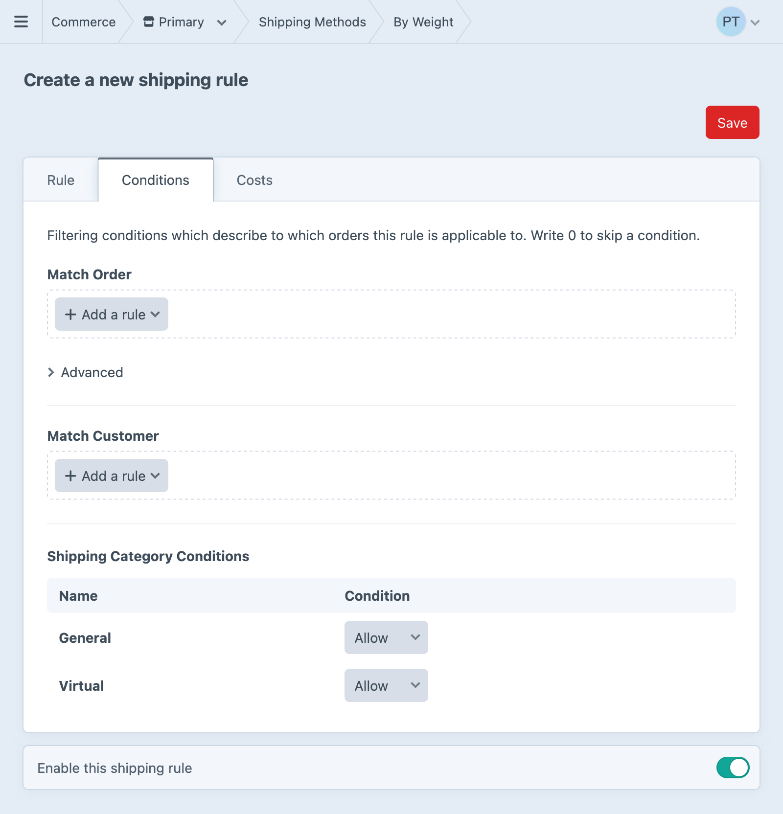
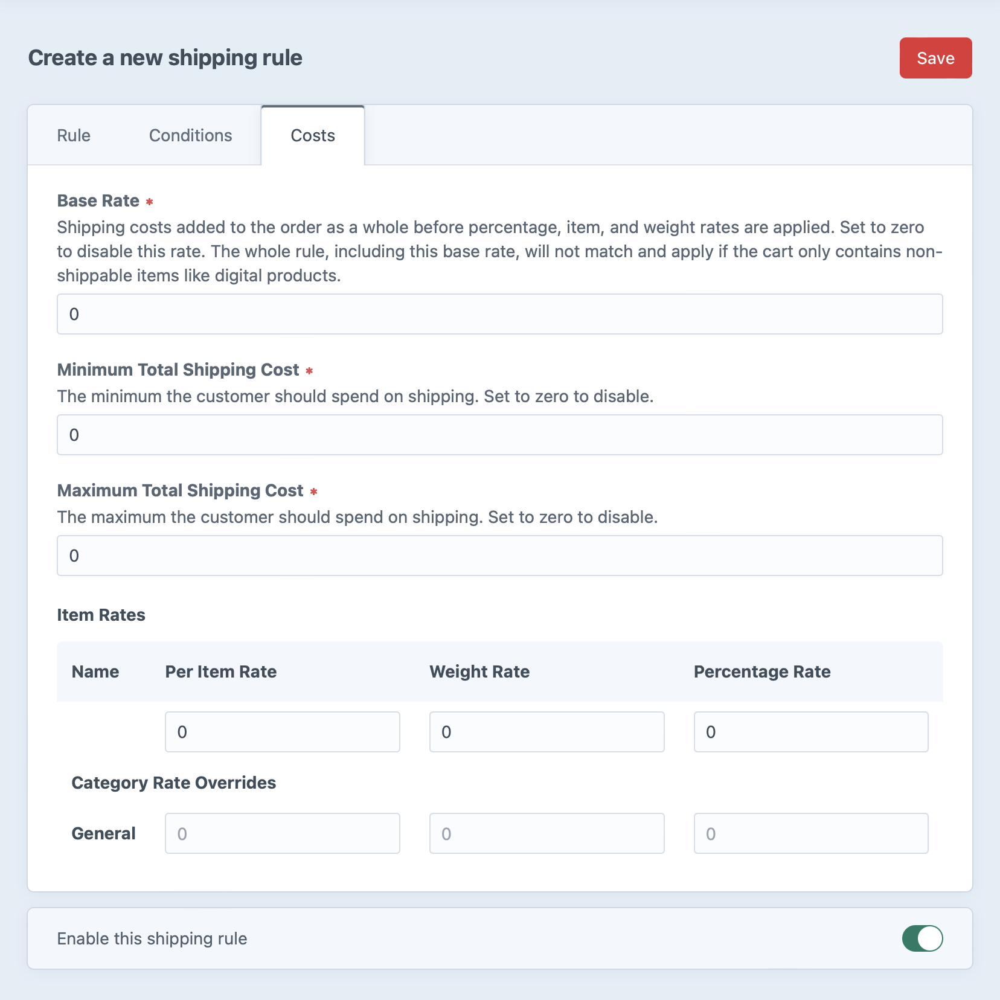

# Shipping

Craft Commerce includes a shipping system for adding shipping costs to a cart.

You can add any number of [shipping methods](#shipping-methods) to your store, where each one’s purpose is to supply relevant *shipping options* for an order at checkout.

The shipping method determines relevant options with its [shipping rules](#shipping-rules) and the store’s [shipping categories](#shipping-categories) and [shipping zones](#shipping-zones) configured in the control panel.

A store manager can see and manage these shipping details via **Commerce** → **Shipping** in the control panel.

Let’s look at each of these factors, starting with the broader shipping categories and zones.

## Shipping Categories

Shipping categories are used to classify products according to how they’re shipped. At least one shipping category is required, but you can use any number of them.

In the control panel, you’ll see the relationship between products and shipping categories in several places:

1. When creating or editing a shipping category from **Commerce** → **Shipping** → **Shipping Categories**, an **Available to Product Types** field lets store managers select the product types the category should be available to.
2. When creating or editing a [product type](products-variants.md#product-types), you’ll have a read-only view of the shipping categories available to it in the **Tax & Shipping** tab.
3. When editing an individual product, the default shipping category will be selected in a dropdown along with any other categories available for that product type.

While setting up [shipping rules](#shipping-rules), the available shipping categories can factor into the rule’s conditions and costs.

For example, you might set up a shipping rule that’s unavailable when the cart has a product in a specific shipping category. You might have another shipping rule that returns special shipping prices for different categories of products in the cart.

## Shipping Zones

Shipping zones are geographical areas your store ships to, as defined by a flexible **Address Condition** setting. The setting can be composed of one or more rules based on countries, states (called administrative areas), postal code formula, and even custom fields:


For example, you might make one zone for the USA and Canada, and another zone for the international countries you ship to:

1. For **Address Condition**, click **+ Add a rule**.
2. Click the default “Administrative Area” rule and select “Country” instead.
3. Leave “is one of” selected, and type+select “United States” and “Canada” in the typeahead input field.
4. Press **Save**.

Like shipping categories, these tax zones can factor into [shipping rule](#shipping-rules) conditions and costs. Shipping zones can be used for conditions that apply to the customer’s shipping address.

### Postal Code Formula

In addition to country and state matching, an address can match a postal code condition formula.

The “Postal Code Formula” address condition is an expression written in [Twig’s expression syntax](https://twig.symfony.com/doc/3.x/templates.html#expressions) that returns `true` or `false`.

This will match if the postal code’s first two characters are `60` or `70`:

```
postalCode[0:2] == '60' or postalCode[0:2] == '70'
```

The will match if the zip code is equal to `NG102`, `ZZ200`, or `CC101`:

```
postalCode in ['NG102', 'ZZ200', 'CC101']
```

## Shipping Methods

Shipping methods are the choices available to the customer during checkout. You can name them in whatever way will make sense to your customers: _In-Store Pickup_, _FedEx_, _USPS_, _Freight_, and _Express_ are all succinct ways to describe the general method by which the customer will get their order.

Shipping methods contain a collection of [shipping rules](#shipping-rules), which contribute eligibility conditions and determine the actual costs.

Additionally, **Match Order** and **Match Customer** <Since ver="5.4.0" product="Commerce" repo="craftcms/commerce" feature="Customer conditions for shipping methods" /> conditions can be set on the method itself to consolidate some rules.

::: warning
If a customer changes their shipping address during checkout, a previously selected shipping method may no longer match and will be immediately removed as the shipping method set on the cart.
:::

## Shipping Rules

Shipping rules belong to a shipping method and may be edited in that shipping method’s **Rules** tab after it’s first saved. Each rule is checked one by one, in order, against the cart (and the customer <Since ver="5.4.0" product="Commerce" repo="craftcms/commerce" feature="Customer conditions for shipping methods" />) to see if it’s a match. The first rule that matches the cart supplies the pricing to the shipping method. If no rules match the cart, that shipping method is not available for the customer to select.

### Conditions

Each rule uses **Match Order** and **Match Customer** <Since ver="5.4.0" product="Commerce" repo="craftcms/commerce" feature="Customer conditions for shipping rules" /> conditions to determine when a shipping rule is used.



::: tip
If a [shipping method](#shipping-methods) doesn’t include any conditions, each of its rules will be checked.
:::

### Shipping Zone

In earlier version of Commerce, each rule could be connected to a single **Shipping Zone**. This setting was migrated during the upgrade to a **Shipping Address Zone** order condition; you may now select any number of zones that the shipping address must be part of (or not part of).

### Order Condition Formula

For advanced conditions, you may provide a Twig expression via the **Order Condition Formula** field. Whenever possible, we recommend using the dedicated condition builder UIs.

The condition formula has access to an `order` variable, which (for safety) is an array and not the order element—it’s the same representation of the order you’d see if you exported it from the order index page. This data-only format prevents a store manager from accidentally calling methods like `order.markAsComplete()`.

::: tip
The condition formula’s `order` array is generated with:

```php
$order->toArray(
    [], ['lineItems.snapshot', 'shippingAddress', 'billingAddress']
);
```
:::

### Shipping Categories

The shipping rule has matching logic for each shipping category in the system. Your selection describes whether the rule **Allow**s, **Disallows**, or **Requires** products of the category to be in the cart:

1. **Allow** (Default): The rule _may_ match carts with products in this category.
2. **Disallow**: The rule will _not_ match carts that contain products in this category.
3. **Require**: The rule will _only_ match if the cart contains products in this category.

Category policies ensure that the available methods and costs accurately reflect the combined needs of the ordered products. For example, if you sell products with lithium batteries, many carriers require disclosures, insurance, special packaging, or other documentation that often increases costs. By setting up a shipping category for potentially-hazardous materials, you can easily exclude other unsuitable methods.

## Shipping Rule Costs



### Base Rate

Set a base shipping rate for the order as a whole. This is a shipping cost added to the order as a whole and not to a single line item.

### Minimum Total Shipping Cost

The minimum the person should spend on shipping.

### Maximum Total Shipping Cost

The maximum the person should spend on shipping after adding up the base rate plus all item-level rates.

### Item Rates

#### Per Item Rate

Set a default per-order item shipping rate.

#### Weight Rate

Default cost per whole unit of the store’s dimension units. For example, if you set your dimension unit option to Kilograms, your product weight is 1.4Kg, and you enter `1` as the “Weight Rate”, then the price will be \$1.40.

#### Percentage Rate

The default amount based on a percentage of item’s cost.

#### Category Rate Overrides

You can further customize the Per Item, Weight, and Percentage rates in each category.

## Configuration Examples

There are lots of ways you might combine the included shipping rules depending on what matters most for your store.

- **Regional Sales** — Some stores may sell relatively uniform items, but ship to many well-defined **areas** using local couriers’ flat-rate services. In this case, the shipping configuration will depend heavily on shipping zones to ensure customers see only methods that are actually available in their region.
- **Diverse Catalog** — Another store may have huge **variety in product types** that require radically different types of shipping and handling. This store’s shipping configuration will likely lean on shipping categories to narrow options, and use weight- or quantity-based rules to calculate costs.
- **Speed** — Customers often want options when it comes to shipping speed and cost. This store may wish to advertise services from many carriers, while ensuring the total order weight doesn’t exceed the carrier’s limits.

It’s best to identify aspects of the store’s shipping is most complex or specific, and plan around that concern with whatever features support it.

## Templating

### Displaying the Available Shipping Methods

Returns the shipping method options available for the current cart. Some shipping methods may not be included, as only those whose rules apply to the current cart will be returned.

```twig
<h3>Select a shipping method</h3>


  

  <label>
    {{ input('radio', 'shippingMethodHandle', handle, {
      checked: handle == cart.shippingMethodHandle,
    }) }}
    <strong>{{ method.name }}</strong> {{ formattedPrice }}
  </label>

```

Customers select a shipping _method_, not a _rule_. The rule is only used for matching against the cart, but does ultimately determine the cost.
