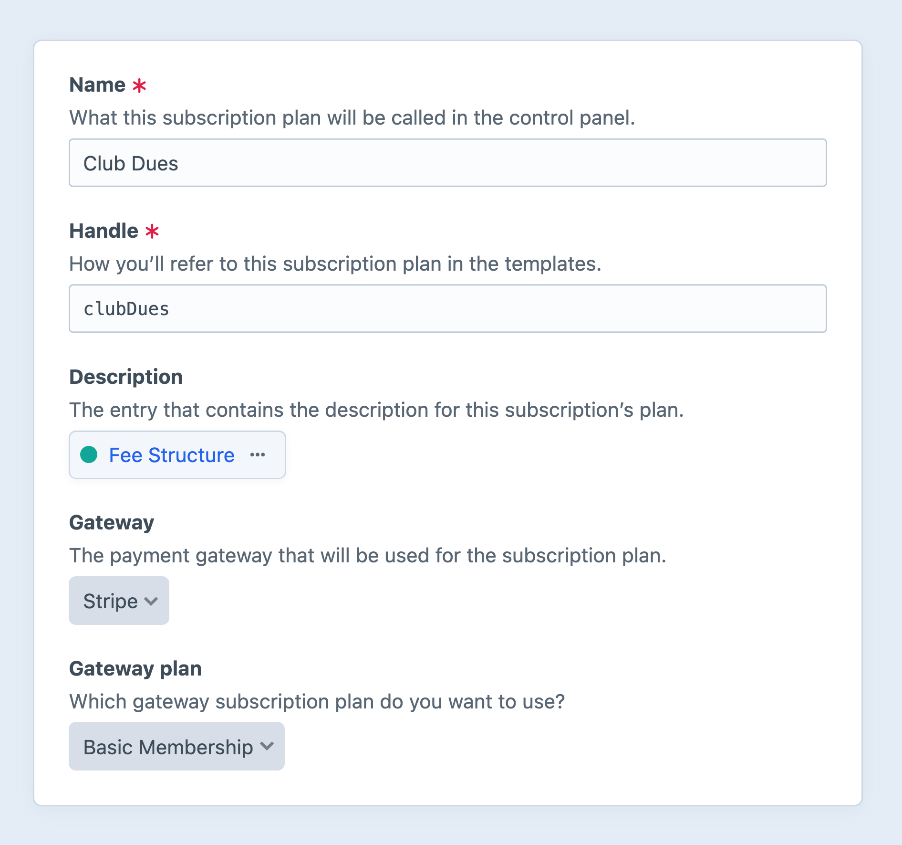

# Subscriptions

Commerce supports recurring revenue via _subscriptions_, a feature of [some gateways](#capabilities).

Once you’ve added a payment gateway that supports subscriptions, navigate to <Journey path="Commerce, Subscription Plans" /> to set up one or more _plans_.

## Plans

Plans are predefined connections to external products in a gateway.
When you create a new plan, Commerce communicates with the gateway and provides a list of existing candidates.
You must configure these links carefully for subscriptions to work as you expect.

Like gateways, plans are configured globally—but it is up to you where they are displayed in your front-end!



Plans have the following settings:

Name
:   A user-facing label for the plan.
    This should be distinct among plans that will be exposed to customers; additional descriptive content can be attached via the **Description** setting.

Handle
:   An identifier used in templates to load this specific plan.

Description
:   Attach an entry to hold additional content.
    Plans themselves are not elements, so they do not have their own field layouts.

Gateway
:   Select a gateway to display a list of its subscription products. If this menu is empty, you’ll need to create a gateway, first.

Gateway plan
:   Choose the externally-defined “plan” to bind the Commerce plan to.

    ::: tip
    Gateways may use different, proprietary names for subscription products.
    :::

Enabled for customers to select?
:   Determines whether or not customers can start new subscriptions based on this plan. Disabled plans are not returned via `craft.commerce.plans.getAllEnabledPlans()`. (This setting appears in the sidebar, outside the main form!)


### Capabilities

Subscription actions (like [cancellation](#starting-a-subscription) and [switching plans](#starting-a-subscription)) are handled in a gateway-agnostic way for your customers and administrators—but the underlying gateway _does_ ultimately determine what actions are supported.

Currently, the only first-party gateway that fully implements subscriptions is [Stripe](plugin:commerce-stripe).

## Statuses

Commerce synthesizes subscription data into the following states:

Trial
:   The subscription is within a predetermined trial period before its first billing cycle.

    ```twig
    
      Your trial lasts until {{ subscription.getTrialExpires()|date('short') }}.
    
    ```

Active
:   The subscription is within a paid billing cycle (even if it’s set to cancel at the end of the current billing cycle).

    ```twig
    
      Your subscription is in good standing, and your next payment will be on {{ subscription.nextPaymentDate()|date('short') }}.
    
    ```

Canceled
:   The subscription is _outside_ of a paid billing cycle and was _canceled by the user_.

    ```twig
    
      Your subscription was canceled on {{ subscription.dateCanceled|date('short') }} and will expire on {{ subscription.nextPaymentDate|date('short') }}.
    
    ```

Expired
:   The subscription is _outside_ of a paid billing cycle and was marked as such by the gateway (either after a fixed number of billing cycles or a permanently-failed payment).

    ```twig
    
      This subscription expired on {{ subscription.dateExpired|date('short') }}.
    
    ```

You can see where each of these status checks are useful on the [Subscription Templates](../development/subscription-templates.md) page.

::: warning
Status properties may not be mutually exclusive!
For example, a subscription can be both `onTrial` _and_ have an `active` status.
:::

## Starting a Subscription

Subscriptions are created when a logged-in customer submits a form with a plan ID and a [saved payment source](../development/saving-payment-sources.md) from the same gateway.

<See path="../development/subscription-templates.md" description="Learn about building a subscription workflow." />

The [Subscription Templates](../development/subscription-templates.md) page also includes information about [canceling](../development/subscription-templates.md#canceling-the-subscription) and [switching](../development/subscription-templates.md#switching-the-subscription-plan) plans.

## Deleting Subscriptions or Plans

### Gateways

Not all gateways permit deleting subscription plans.
Some gateways allow it and preserve all existing subscriptions, while others do not.
Regardless of individual gateway support, we recommended **against** deleting a subscription plan on the gateway because it might result in the loss of historical data.

If you wish to end support for a plan, you can disable it via its settings. Existing subscriptions will continue to work, but new ones cannot be started.

### Commerce

Commerce will attempt to delete all local subscription plans when a gateway is deleted. If any subscription—even an expired one—exists for a given plan, deletion will be prevented. Similarly, Commerce does not allow a user with active or expired subscriptions to be deleted.

## Querying Subscriptions

You can fetch subscriptions in your templates or PHP code using **subscription queries**.

::: code
```twig
{# Create a new subscription query #}

```
```php
// Create a new subscription query
$mySubscriptionQuery = \craft\commerce\elements\Subscription::find();
```
:::

Once you’ve created a subscription query, you can set [parameters](#parameters) on it to narrow down the results, and then [execute it](/5.x/development/element-queries.md#executing-element-queries) by calling `.all()`. An array of [Subscription](commerce5:craft\commerce\elements\Subscription) elements will be returned.

::: tip
See [Element Queries](/5.x/development/element-queries.md) in the Craft docs to learn about how element queries work.
:::

### Example

We can display all of the current user’s active subscriptions by doing the following:

1. Create a subscription query with `craft.subscriptions()`.
2. Set the [user](#user) and `status` parameters on it.
3. Fetch the subscriptions with `.all()`.
4. Loop through the subscriptions using a [for](https://twig.symfony.com/doc/3.x/tags/for.html) tag to output their HTML.

```twig
{# Make sure someone is logged in: #}


{# Create a subscription query and set parameters: #}


{# Fetch the subscriptions: #}


{# Display the subscriptions, if there were results: #}

  <ul>
    
      <li>
        <strong>{{ subscription.title }}</strong>
        
          Canceled on {{ subscription.dateCanceled|date('short') }}, ending on {{ subscription.nextPaymentDate|date('short') }}.
        
          Renews on {{ subscription.nextPaymentDate|date('short') }}
        
      </li>
    
  </ul>

  <p>You do not have any active subscriptions.</p>
  <a href="{{ siteUrl('my-account/membership') }}">Join now</a>

```

### Parameters

Subscription queries support the following parameters:

<!-- This section of the page is dynamically generated! Changes to the file below may be overwritten by automated tools. -->
!!!include(docs/.artifacts/commerce/5.x/subscriptions.md)!!!
