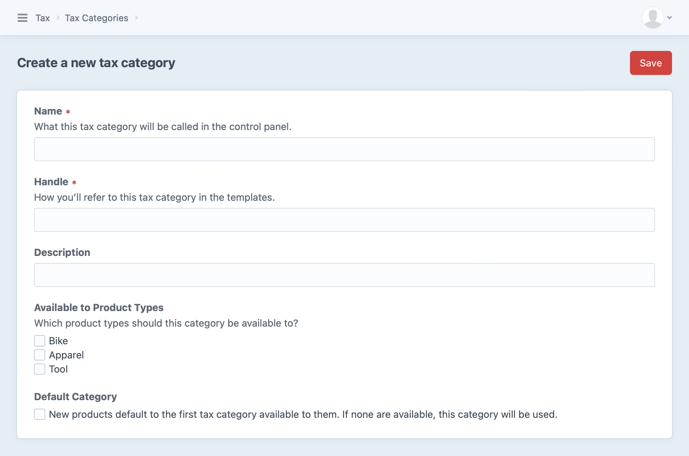
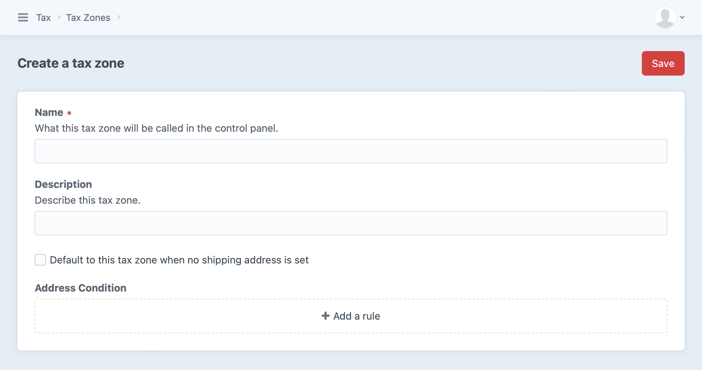
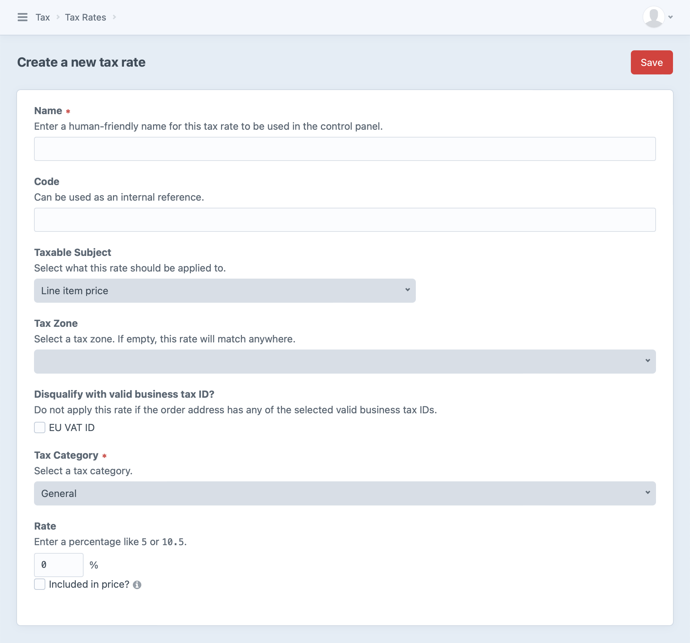

# Tax

Commerce represents taxes for an order using [tax categories](#tax-categories), [tax rates](#tax-rates), and [tax zones](#tax-zones). Each can be configured from the control panel via <Journey path="Commerce, Store Management, Tax" />.

Tax is that last of Commerce’s three built-in adjusters to be applied to orders (the others being [discounts](discounts.md) and [shipping](shipping.md)), as its [taxable subjects](#taxable-subjects) can include other costs.

::: warning
Prior to version 4.5, tax features differ between Commerce editions.
:::

Understanding Commerce’s basic tax concepts allows you to model virtually any kind of tax rules in your country or jurisdiction—like those of U.S. states, or European Value Added Tax (VAT).
There are three primary concerns, in the tax engine:

- [Category](#tax-categories) — The type of good or service being sold.
- [Zone](#tax-zones) — Where goods are going, or where the purchaser is.
- [Rate](#tax-rates) — How much tax the customer should pay.

## Tax Categories

Every variant designates a single tax category, which determines how it’s taxed.

Commerce creates a default “General” category when it’s installed.
Tax categories are defined and assigned globally (_not_ per-store).
To create a new tax category, visit <Journey path="Commerce, Store Management, Tax Categories" /> and press **+ New tax category**:



Each tax category determines which product types it is available to.
A new variant uses the first tax category that’s available to its type—or the default category, if none are.

::: warning
Similarly, every line item has a tax category, even if the product it’s based on didn’t explicitly select one.
Commerce may use the default tax category, even if it wasn’t marked as available for that product type!
:::

A tax category can be used by any number of [tax rates](#tax-rates), which we’ll explore further below.

### Example

Stores operating in countries like Australia, India, and Canada may need to apply a Goods and Services Tax (GST) to some of products, while others are exempt from that tax.

In that case, you may configure your store with `GST` and `GSTFREE` tax categories with `GST` being the default.

This would mean that all items in your store would get the `GST` tax category, and a store manager could specifically select the `GSTFREE` tax category for each item that should be exempt.

::: tip
The name of a tax category does not need to reflect the name or type of tax being collected—it just needs to provide enough information to determine which rate(s) to apply.
:::

## Tax Zones

A tax zone represents a physical area that can be used to influence tax based on an order’s shipping address (or billing address, if the **Use Billing Address For Tax** [store setting](stores.md#settings) is enabled).

When an order address falls within that zone, any rates tied to that zone may be factored into tax calculation.
An order may have more than one matching tax zone, and all of them will be factored in.

Commerce does not add any tax zones by default. Like tax rates, you’ll need to create any tax zones required for your store.

To create a new tax zone, visit <Journey path="Commerce, Store Management, Tax Zones" /> and press **+ New tax zone**:



The tax zone consists of a **Name**, **Description**, and an **Address Condition** you can use to define the relevant area. That condition can be as broad or specific as you’d like, from one or more countries to specific administrative areas (like U.S. states) or postal codes. You can also designate a single zone to be used as the default when an order doesn’t have a shipping address.

### Postal Code Formula

One of the available **Address Condition** rules is “Postal Code Formula,” or in previous versions of Commerce, the “ZIP code condition formula.”
This rule is a more sophisticated version of Craft’s built-in **Postal Code** rule, and evaluates a [Twig’s expression](https://twig.symfony.com/doc/3.x/templates.html#expressions).

::: tip
For security, only a handful of Twig filters, functions, tags, and variables are available in this context.
See <commerce5:craft\commerce\services\Formulas> for a complete list of allowed features.
:::

Here are a couple examples, using different Twig operators:

- Match postal codes whose first two characters are `60` or `70`:
  ```
  postalCode[0:2] == '60' or postalCode[0:2] == '70'
  ```
- Match an explicit list of postal codes (`NG102`, `NG103`, or `NG104`):
  ```
  postalCode in ['NG102', 'NG103', 'NG104']
  ```

### Basic Zone Examples

#### Example A

Let’s say you need to charge 5% tax for all items that ship to New York and 6% only on clothing items that ship to Pennsylvania. You’ll need to set up two zones: one for the state of New York, and another for the state of Pennsylvania.

#### Example B

You would like to charge 10% tax on all electronic items and 5% tax on everything else. This tax should apply to all countries in the European Union (EU). In this case you would construct just a single zone consisting of all the countries in the EU. Even though you need to charge two different rates for a product, you don’t necessarily need to have two zones.

## Tax Rates

Tax rates are percentage-based rules that can be applied to items in a customer’s cart.
To apply, a rate must match the item’s tax category and the cart’s address must satisfy its tax zone (if set).

Commerce does not add any tax rates by default; you’ll need to explicitly create any that you’d like to be available.

To create a new tax category, visit <Journey path="Commerce, Store Management, Tax Rates" /> and press **+ New tax rate**:



Every tax rate must specify a single [tax category](#tax-categories) it applies to.

::: tip
Multiple tax rates can apply to a single tax category and/or tax zone.
:::

Specifying a [tax zone](#tax-zones) is optional.
By default, a tax rate is _not_ limited to a particular zone, meaning it will apply to any line item belonging to its tax category alone—with no consideration for the order address.

The tax rate also has settings for exactly *what* it applies to and *how* it should be applied:

- **Taxable Subject** determines [what price or subtotal should be taxed](#taxable-subjects).
- **Disqualify with valid business tax ID?** skips the tax when certain [business tax IDs](#business-tax-ids) exist on the order.
- **Included in price?** determines whether the rate is already part of the line item’s price, and…
    - **Adjust price when included rate is disqualified?** controls whether disqualified items (those that _don’t_ match the rate, zone, or category) should have their prices adjusted accordingly.
    
<Block label="“Included” Tax">

This concept is not immediately intuitive—except perhaps from the customer’s perspective!

Suppose your business is located in a jurisdiction that allows incorporating taxes into listed prices.
A storefront might advertise that “all prices are tax-inclusive” so that customers know as they shop exactly how much they’re apt to pay.
However, customers _outside_ your jurisdiction (say, in another U.S. state) may not be required to pay those taxes when buying online, and you should _not_ collect that built-in tax.

In this scenario, you would set up a rate and zone that match only in-state purchases, and enable both **Included in price?** and **Adjust price when included rate is disqualified?**.

::: tip
Included taxes that are disqualified by zone may generate `discount` adjustments (instead of negative `tax` adjustments) to offset item or order costs.
:::

</Block>

### Taxable Subjects

There are six options for the amount that a tax rate applies to, divided into two groups: tax on _specific items_ (added to matching line items), and tax on entire purchases that contain matching items (added to the order).

Unit price (minus discounts)
:   Similar to **Line item price**, less discounts and other “included” taxes.

Line item price (minus discounts)
:   Item subtotal (sale price &times; quantity), less discounts.

Line item shipping costs
:   The line item’s total shipping costs.
    This will _not_ include order-level base rates for the chosen shipping method, even if this is the only item the rate applies to.

Both (Line item price + shipping costs)
:   Combination of **Line item price** and **Line item shipping costs**.

Order total shipping cost
:   _All_ shipping costs added to the order (whether directly from items or base costs for the order).

Order total taxable price (Line item subtotal + Total discounts + Total shipping)
:   _All_ costs associated with the order, minus “included” taxes.

The taxable subject also determines whether a resulting adjustment is added to a line item or to the order.

### Business Tax IDs

Commerce has built-in support for validating EU <abbr title="Value Added Tax">VAT</abbr> IDs.
We also maintain a first-party plugin for validating [UK VAT IDs](https://github.com/craftcms/commerce-uk-vat-id-validator) with official _HM Revenue & Customs_ APIs.

When a tax ID is provided on an address Commerce uses for tax calculations in a given store (the shipping address, unless the **Use Billing Address For Tax** [setting](stores.md#settings) is enabled), Commerce checks enabled validators until one returns `true`.
If no validator is successful, an error is added to the address element.

::: tip
The conditions under which a validator is considered “enabled” can differ from one to the next.
The built-in EU VAT ID validator is always enabled, but the UK VAT ID plugin is only considered enabled when API credentials are available.
:::

Effectively, tax IDs are validated permissively when capturing address data; Commerce only narrows the scope of validation when qualifying tax rates.
At this stage, “validation” is only concerned with whether the ID exists (for the purposes of calculating tax), so errors are _not_ added to the order element.

::: warning
Business tax IDs (`organizationTaxId`) are _not_ validated on customers’ [saved addresses](addresses.md#address-book), so applying one to a cart can result in an error when the **Validate Business Tax ID as Vat ID** [store setting](stores.md#settings) is enabled.
Consider using your store’s order address edit URL in the form’s `action="..."` attribute to allow customers to immediately correct issues:

```twig{1}
<form action="{{ url('checkout/address') }}" method="post">
  {{ actionInput('commerce/cart/update-cart') }}
  {{ csrfInput() }}

  <ul>
    
      <li>
        {{ address|address }}

        <label>
          {{ input('radio', 'shippingAddressId', address.id, {
              checked: cart.sourceShippingAddressId == address.id,
          }) }}
          Use as shipping address
        </label>

        <label>
          {{ input('radio', 'billingAddressId', address.id, {
              checked: cart.sourceBillingAddressId == address.id,
          }) }}
          Use as billing address
        </label>
      </li>
    
  </ul>

  <button>Save addresses</button>
</form>
```
:::

## Templating

It’s common to break out tax [subtotals](orders-carts.md#order-totals) for customers as they shop and check out.

Carts have a pair of special addresses used for estimating taxes before the customer has entered complete billing and shipping information: `estimatedBillingAddress` and `estimatedShippingAddress`.
You can send parts of an address (like a country or postal code) with any [cart update request](../reference/controller-actions.md#post-cartupdate-cart) to give Commerce a hint about which tax rates may apply.
Your store’s **Use Billing Address For Tax** setting also determines which of these addresses is used for estimating tax.

::: tip
Check out the [cart](https://github.com/craftcms/commerce/blob/5.x/example-templates/dist/shop/cart/index.twig) in the Commerce [example templates](../development/example-templates.md), which includes taxable totals.
:::

While the tax engine’s internals are not designed to be customer-facing, the following three sections cover how to access its configuration from templates or extensions.

### Working with Tax Categories

Tax categories are most readily accessible via their products:

```twig

```

This returns a [TaxCategory](commerce5:craft\commerce\models\TaxCategory) model representing the category’s configuration:

```twig
This product belongs to the {{ category.name }} category, and may be subject to the following rates.

{# Display additional information: #}
{{ category.description }}

<ul>
  
    <li>
      {# ... #}
    </li>
  
</ul>
```

::: warning
Tax category names and descriptions are not translatable, so they may not agree with surrounding text or content that _is_ localized for the current site.
:::

#### Tax Category APIs

You can fetch your site’s [tax categories](#tax-categories) through the [TaxCategories](commerce5:craft\commerce\services\TaxCategories) service:

::: code
```twig

```
```php
$categories = \craft\commerce\Plugin::getInstance()
    ->getTaxCategories()
    ->getAllTaxCategories();
```
:::

This returns an array of [TaxCategory](commerce5:craft\commerce\models\TaxCategory) models.

You can fetch the tax categories for a specific [product type](products-variants.md#product-types) using its ID:

::: code
```twig

```
```php
$category = \craft\commerce\Plugin::getInstance()
    ->getTaxCategories()
    ->getTaxCategoriesByProductTypeId(123);
```
:::

In some cases you may need to get a single, specific tax category:

::: code
```twig
{# Get a reference to the service for brevity below #}


{# Get the default tax category #}


{# Get tax category with an ID of `123` #}


{# Get tax category with a handle of `general` #}

```
```php
// Get a reference to the service for brevity below
$taxCategories = \craft\commerce\Plugin::getInstance()
    ->getTaxCategories();

// Get the default tax category
$category = $taxCategories->getDefaultTaxCategory();

// Get tax category with an ID of `123`
$category = $taxCategories->getTaxCategoryById(123);

// Get tax category with a handle of `general`
$category = $taxCategories->getTaxCategoryByHandle('general');
```
:::

### Working with Tax Zones

Tax zones are only used to determine which tax rates to apply to an order, and generally not shown to customers.
However, they are exposed via tax adjustments’ `sourceSnapshot`:

```twig

```

#### Tax Zone APIs

You can also fetch configured tax zones through the [TaxZones](commerce5:craft\commerce\services\TaxZones) service:

::: code
```twig

```
```php
$zones = \craft\commerce\Plugin::getInstance()
    ->getTaxZones()
    ->getAllTaxZones();
```
:::

Commerce uses the current store, or the default store in contexts where it can’t be determined.
Pass a store ID to `getAllTaxZones($id)` to load tax zones from a specific store.

This returns an array of [TaxAddressZone](commerce5:craft\commerce\models\TaxAddressZone) models. You can use these to work with basic details like the zone’s ID, name, and description and the geographic conditions you’ve established for it:

```twig

  {# @var taxZone craft\commerce\models\TaxAddressZone #}
  {{ taxZone.id }}
  {{ taxZone.name }}
  {{ taxZone.description }}
  {{ taxZone.dateCreated }}
  {{ taxZone.dateUpdated }}
  {{ taxZone.default }}
  {{ taxZone.getCondition() }}

```

In some cases you may need to get a single, specific tax zone by its ID:

::: code
```twig
{# Get tax zone with an ID of `123` #}

```
```php
// Get tax zone with an ID of `123`
$taxZones = \craft\commerce\Plugin::getInstance()
    ->getTaxZones()
    ->getTaxZoneById(123);
```
:::

### Working with Tax Rates

You can fetch all of your site’s tax rates through the [TaxRates](commerce5:craft\commerce\services\TaxRates) service:

::: code
```twig

```
```php
$rates = \craft\commerce\Plugin::getInstance()
    ->getTaxRates()
    ->getAllTaxRates();
```
:::

This returns an array of [TaxRate](commerce5:craft\commerce\models\TaxRate) models. You can use these to work with basic details like the rate’s ID, name, code, and rate, as well as related tax zones and categories:

```twig

  {# @var taxRate craft\commerce\models\TaxRate #}
  {{ taxRate.id }}
  {{ taxRate.name }}
  {{ taxRate.code }}
  {{ taxRate.rate }}
  {{ taxRate.taxable }}
  {{ taxRate.getRateAsPercent() }}
  {{ taxRate.getTaxZone() }}
  {{ taxRate.getTaxCategory() }}
  {{ taxRate.getIsEverywhere() }}

```

You can also fetch tax rates for a specific tax zone by providing a zone object or ID:

::: code
```twig
{# Fetch rates for a `zone` we’ve already got #}
{# @var zone craft\commerce\models\TaxAddressZone #}


{# Fetch rates for a tax zone with an ID of `123` #}

```
```php
// Fetch rates for a `$zone` we’ve already got
/** @var $zone craft\commerce\models\TaxAddressZone **/
$rates = \craft\commerce\Plugin::getInstance()
    ->getTaxRates()
    ->getTaxRatesForZone($zone);

// Fetch rates for a tax zone with an ID of `123`
$rates = \craft\commerce\Plugin::getInstance()
    ->getTaxRates()
    ->getTaxRatesByTaxZoneId(123);
```
:::

In some cases you may need to get a single, specific tax rate by its ID:

::: code
```twig
{# Get tax rate with an ID of `123` #}

```
```php
// Get tax zone with an ID of `123`
$taxZones = \craft\commerce\Plugin::getInstance()
    ->getTaxRates()
    ->getTaxRateById(123);
```
:::


## Further Reading

See [Tax Engines](../extend/tax-engines.md) if you’re interested in customizing or extending the Commerce tax system.
