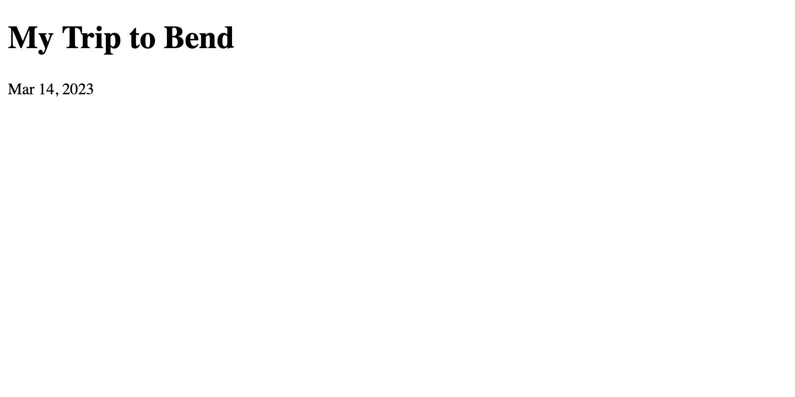
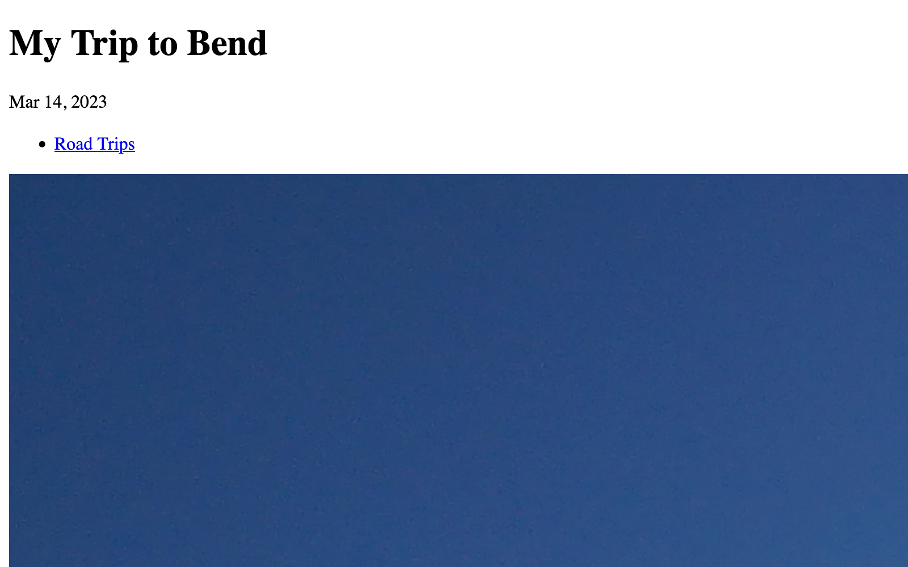
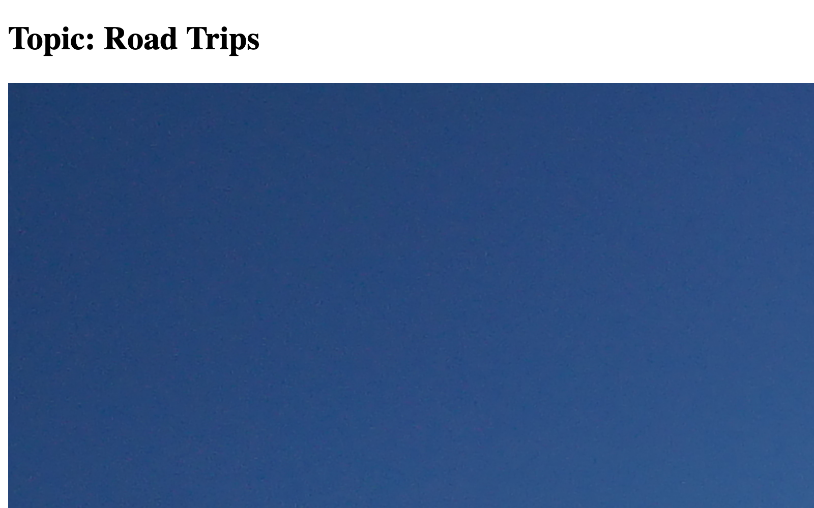

# Blog Templates

It’s time to bring together everything we’ve learned and create some templates that display data from the blog we set up in Craft.

::: tip
In the next few sections, you’ll see prompts to “refresh your browser” or “reload the page.” Changes to templates aren’t automatically broadcasted to browsers, but requesting the page again will reflect them.

You can reload a page by pressing <kbd>Control/Command + R</kbd>, <kbd>F5</kbd> (Windows only), or clicking the circular arrow icon in your browser’s toolbar.
:::

## Layout

A **layout** is Twig’s solution for reusable page wrappers. Layouts have all the same features of a regular template. This makes them a perfect place for a global header, navigation, or a footer—as well as invisible metadata in the `head` of every page that uses one.

Right-click the `templates/` folder in VS Code’s file browser, then click **New File…**, and name it `_layout.twig`.

::: tip
The underscore (`_`) at the beginning of `_layout.twig` means the template is “private.” Unlike `index.twig`, you will _not_ be able to view the template by visiting `https://tutorial.ddev.site/_layout`.

Use an underscore any time a template doesn’t need to be accessible on its own. You can also prefix a subfolder of your `templates/` directory with an underscore to hide _everything_ inside it.
:::

Copy the following into the `_layout.twig` file you just created:

```twig{2,5,6,8,11-13}
<!DOCTYPE html>
<html lang="{{ craft.app.language }}">
  <head>
    <meta charset="utf-8"/>
    <title>{{ siteName }}</title>
    <meta content="width=device-width, initial-scale=1.0" name="viewport">

    
  </head>
  <body>
    
      {# Nothing here, yet! #}
    
  </body>
</html>
```

This is the skeleton of a basic webpage, but it has no content! A layout’s main job is to reduce boilerplate in your templates; here, we’ve defined a few things we want on _every_ page of the site:

- The language content is presented in (on the `<html>` tag);
- The name of our site, in the `<title>` tag (you may recognize this from `index.html`);
- A `<meta>` tag that tells the browser how we want the page to be sized on small-screened devices;
- A reference to a stylesheet;

The last thing to note is the use of the `` tag to define a region where our content will go. Craft doesn’t know anything about `_layout.twig` yet, so we’ll have to tell it when we want to use this layout, and what we want to go that `content` block.

## Entry Template

Now that we have a _layout_ template, let’s use it for our individual blog posts.

Create `templates/blog/_entry.twig` and paste this code to it:

```twig{2,5-7}
{# You can omit the `.twig` when referencing another template: #}


{# Provide something to the `content` block in `_layout.twig`: #}

  <h1>Some day, I’ll be a blog post!</h1>

```

The first highlighted line connects our post template with the layout template, using the `` tag. The second highlight defines a ``, the content of which will be output in the corresponding region of `_layout.twig`.

::: tip
When extending a layout, all output must be within `block` tag pairs—but you may have as many `block` tags as you wish!
:::

Now that the blog section’s template is ready, you can visit the URL for a published post:

<BrowserShot url="https://tutorial.ddev.site/blog/my-trip-to-bend" :link="false" caption="">

</BrowserShot>

::: tip
Not sure what your post’s URL is? Back in the control panel, navigate to a post, then click the **View** button in the upper-right corner to open it in a new tab.
:::

If this didn’t work (and you’re still seeing the same error from the last time we accessed this page), double-check your [section’s settings](../configure/resources.md#creating-a-section) and the location and name of your template file!

### Add Dynamic Data

Hard-coding our post’s title isn’t very practical, so let’s bring in some data from the current post.

We know that any time an element (like our blog post entries) matches a request path, Craft will render the template defined in its settings. In this case, the entry belongs to a section that declared `blog/_entry` as its **Template**—which is why we had to add this one in a particular spot.

But how do we actually get the content for that post? Craft makes the matched entry available in our template under a special `entry` variable:

```twig{5,7-9}



  {# Access a property of a variable using “dot” notation: #}
  <h1>{{ entry.title }}</h1>

  <time datetime="{{ entry.postDate | atom }}">
    {{ entry.postDate | date }}
  </time>

```

Refresh your browser, and you should see the post’s title and the date it was created:

<BrowserShot url="https://tutorial.ddev.site/blog/my-trip-to-bend" :link="false" caption="">

</BrowserShot>

::: tip
If you were to go back into the control panel and create some more posts, you could access any of them this same way!
:::

#### Feature Image

Let’s display the image we attached via [the “Feature Image” asset field](../configure/resources.md#feature-image). When we attached the assets field to the _Post_ field layout, we gave it a handle of `featureImage`—so it will be available on the `entry` variable as `entry.featureImage`, just like its title was:

```twig{4,15-19}


{# Load the attached image: #}



  {# Access a property of a variable using “dot” notation: #}
  <h1>{{ entry.title }}</h1>

  <time datetime="{{ entry.postDate | atom }}">
    {{ entry.postDate | date }}
  </time>

  {# Output the image, if one was found: #}
  
    <div class="feature-image">
      {{ featureImage.getImg() }}
    </div>
  

```

At the top of the template, notice the new `set` tag. This loads and stores the first image attached to our **Feature Image** field. We check at the end of the template whether an image is indeed available (say, in case someone deleted the asset), using an [`if` tag](https://twig.symfony.com/doc/3.x/tags/if.html).

::: warning
Craft automatically loads the `entry` for this template, but leaves the rest up to you—`entry.featureImage` is actually a pre-configured _query_ that will fetch asset(s) we attached to the field. We are using `.one()` to tell Craft that we want just the first attached asset.

We’ll use a similar query when outputting the post topics and content Matrix field!
:::

We’ve used a convenient feature of the asset object returned by the custom field to generate a complete `` tag:

```twig
{{ featureImage.getImg() }}
```

<Block label="Custom Markup">

If you would prefer to build the image element yourself, you can get the individual properties from the asset:

```twig

```

Note the use of `featureImage.alt`! Craft automatically adds this attribute when building the tag itself—but it will be empty unless you add the **Alternative Text** field layout element to the volume’s field layout (and populate it with a description of the image).

</Block>

Refresh the page to see your changes:

<BrowserShot url="https://tutorial.ddev.site/blog/my-trip-to-bend" :link="false" caption="">

</BrowserShot>

Our sample image was pretty big, so it’s spilling off the page. This isn’t ideal, but it can be fixed with a bit of CSS—or with _transforms_. We’ll get to both of these solutions in a moment.

::: tip
If the lack of styles makes it difficult to evaluate whether you are staying on track, jump ahead to the [styling](../build/styles.md#project-css) section, grab the CSS, and drop it in `web/styles.css`.
:::

#### Topics

Let’s add some more metadata to the top of our post. Our content model included a [category field](../configure/resources.md#categoriestopics) called **Post Categories**, which we can access in a really similar way to the feature image!

Just below the existing `set` tag, add another one to fetch the attached categories:

```twig{3-4}


{# Load attached topics: #}

```

Because we’re allowing authors to attach multiple topics to a post, we’ve used `.all()` to fetch _all_ of them, instead of just _one_. This is important, because we will treat `topics` (plural) a little bit differently from `featureImage` (singular).

::: tip
Our annual conference [DotAll](https://dotall.com/) is named after this method!
:::

Just below the post title and `<time>` element, let’s add a new `<ul>` or “unordered list” element and output a list of categories:

```twig{5-11}
<time datetime="{{ entry.postDate | atom }}">
  {{ entry.postDate | date }}
</time>


  <ul class="topics">
    
      <li>{{ topic.getLink() }}</li>
    
  </ul>

```

This introduces two control tags:

- An `` statement, that tests whether any categories are attached and prevents outputting an unnecessary `<ul>` element;
- A `` loop, which (as we saw in `index.twig`) lets us repeat a chunk of output for each item in a list;

Within the topics loop, we output an `<li>` element and use the category’s `.getLink()` method to generate an anchor tag (`<a>`) pointing to its URL. This is akin to the `.getImg()` method we used on the asset attached via our `featureImage` field.

<BrowserShot url="https://tutorial.ddev.site/blog/my-trip-to-bend" :link="false" caption="">

</BrowserShot>

Clicking any of the links to a topic will result in a similar error to the one we encountered prior to creating the post template. We’ll implement category pages at the same time as the blog landing page, because they’ll share a great deal of logic.

::: tip
If you pasted this into `templates/blog/_entry.twig` and the indentation got messed up, select the new lines and press <kbd>Tab</kbd> to bump it in. Go too far? <kbd>Shift + Tab</kbd> will outdent it again. <kbd>Command/Control + ]</kbd> and <kbd>Command/Control + [</kbd> can do the same thing.
:::

#### Post Content

Let’s output the [post content](../configure/resources.md#post-content) stored in our Matrix field. This process starts in a familiar way:

1. Load the nested entries via the `postContent` field handle and store them in a variable;
1. Loop over those entries with a `` tag;
1. Render different content based on the entries’ types, using an `` tag;

After the line that declares our `topics` variable, add a new `set` tag:

```twig{3-4}


{# Load content blocks: #}

```

With the content loaded into a `postContent` variable, we can start outputting data for each block. Below the topics list and feature image, add a new `for` loop:

```twig{2,4,7,12,17,22}
<div class="post-content">
  
    {# Memoize the block type’s handle so we can use it later: #}
    

    {# Switch what is displayed based on the `type`: #}
    
      <div class="content-block text">
        {{ contentBlock.text | md }}
      </div>
    
      

      <div class="content-block image">
        {{ image.getImg() }}
      </div>
    
      <div class="content-block unsupported">
        <p>Unsupported block type: <code>{{ blockType }}</code></p>
      </div>
    
  
    {# `for` tags also support an `else` block for when there’s no content! #}

    <div class="content-block empty">
      <p>This post has no content!</p>
    </div>
  
</div>
```

Looking at the highlighted lines in this block of code…

- Our `for` loop uses the `postContent` variable defined at the top of the template, and makes each nested entry available in turn as `contentBlock`;
- We capture the “type” of entry in a variable named `blockType` so we can compare against it later;
- The `if`, `elseif`, and `else` tags test the value of `blockType` each time through the loop and render different parts of the template;
- “Image” blocks contain an asset field that can be used exactly the same way as the `featureImage` field is on the main entry;
- An `else` tag is used to provide some debugging information for us—but it will only show up if we’ve gotten our block type handles mixed up;
- A final `else` tag actually belongs to the main `for` loop, and allows us to output a message when there are no blocks to display;

This is right about where the complexity of field data peaks, for modest websites—so don’t worry if it’s a bit overwhelming! We’ve still got a few more things to implement, and will return to most of these concepts a couple of times before sending you on your way.

<Block label="Extra Credit">

How could we add a new _Quote_ block type?

Back in the control panel:

1. Visit <Journey path="Settings, Fields, Post Content" />;
1. In the **Entry Types** selector, click **+ Create**;
1. Name the new entry type “Quote”, and give it a handle of `quote`;
1. Add our plain text field (_Text_) to its field layout, leaving the name and label as-is;
1. Save the entry type;

At this point, return to one of your blog entries’s edit screens, and add a **Quote** block to the **Post Content** matrix field. Reload that post’s page in the front-end, and you should see something like this:

> Unsupported block type: `quote`

In `templates/blog/_entry.twig`, add a new `elseif` comparison tag in the content block loop that tests against the new block type’s handle (`quote`):

```twig{2-5}
  {# ... #}

  <div class="content-block quote">
    <blockquote>{{ contentBlock.text | md }}</blockquote>
  </div>
 {# This `else` tag already exists, and is what outputs our “unsupported” message. #}
  {# ... #}
```

This process can be repeated for however many block types you want!

</Block>

::: tip
Did you install CKEditor when creating the **Post Content** field? You can do without the `| md` filter when outputting `contentBlock.text`.
:::

## Listing Posts

We’ve set up individual pages for our posts, but there’s no way to discover them from the front-end. We’ll address this with two new templates:

1. A [blog index](#blog-index) page for all posts;
1. A [topic index](#topic-pages) template that filters posts by category;

### Blog Index

Our blog’s landing page will live at `https://tutorial.ddev.site/blog`, and display _all_ posts, in chronological order. This page doesn’t need a corresponding entry in the control panel, because we’ll be naming the template such that Craft’s routing behavior makes it directly accessible.

Create a new template at `templates/blog/index.twig`, with the following content:

```twig{3,8,9,12-14,20,22}





  <h1>Blog</h1>

  
    

    <article>
      
        <div class="thumbnail">
          {{ image.getImg() }}
        </div>
      

      <h2>{{ post.title }}</h2>

      <time datetime="{{ post.postDate | atom }}">{{ post.postDate | date }}</time>

      {{ post.summary | md }}

      <a href="{{ post.url }}">Continue Reading</a>
    </article>
  

```

In your browser, navigate to `https://tutorial.ddev.site/blog`, and verify you see all the posts you created via the control panel!

Notice that this template makes no reference to an `entry` variable. This is because it won’t be rendered based on an element’s URI format—Craft is just matching the request to `/blog` with a template.

That doesn’t mean we can’t access our content, though! The first highlighted line uses what’s called an _element query_. Element queries are different from the automatically-injected `entry` variable: instead of containing a _specific_ entry object, they define some _parameters_ for loading one or more entries from the database.

Element queries are designed to be written and read in relatively plain language. Let’s break this one down:

1. `craft` is a global variable that collects a number of functions and features;
1. `.entries()` creates a new element query with specific functionality for fetching entries;
1. `.section()` configures that query to select only entries from the passed section(s);
1. `.all()` executes the query and returns _all_ matching entries;

Most element queries will have steps 1 and 4 in common, but steps 2 and 3 are specific to our need to fetch _entries_ in a particular _section_. We’ll have a chance to use some more element query features in the next step!

::: tip
Craft sorts entries by their `postDate` (newest to oldest), by default.
:::

### Topic Pages

Now that our blog index displays a list of posts, let’s implement the topic index pages. Much of the display logic will remain consistent between them, so this template will look pretty familiar.

Create `templates/blog/_topic.twig` (the path we defined when setting up the **Category Group**) and add the following:

```twig{3,5}





  <h1>Topic: {{ category.title }}</h1>

  
    

    <article>
      
        <div class="thumbnail">
          {{ image.getImg() }}
        </div>
      

      <h2>{{ post.title }}</h2>

      <time datetime="{{ post.postDate | atom }}">{{ post.postDate | date }}</time>

      {{ post.summary | md }}

      <a href="{{ post.url }}">Continue Reading</a>
    </article>
  

```

From the blog index, click through to one of your posts, then click the topic link at the top. You should land on a topic index page:

<BrowserShot url="https://tutorial.ddev.site/blog/topics/road-trips" :link="false" caption="">

</BrowserShot>

Like the blog index, we get a list of posts that each link out to their individual pages.

_Unlike_ the blog index, our topic template automatically has access to a `category` variable. This is because every topic page is backed by a category element, just like our post entries. It’s still up to us, though, to decide what other data should be displayed—and to fetch it with element queries.

We’ve used the `category` variable in a new entry query, near the top of the template:

```twig

```

When we set up the **Post Categories** field, Craft added a corresponding `postCategories()` method to all element queries that we can use to filter results by category. Craft’s understanding of our content model is also why we can access the attached categories via `entry.postCategories` in our individual post template! This functionality is present for _all_ custom fields—but the kinds of values they return (or expect) will differ based on the type of field.

## Summary

Let’s take a moment to review some key takeaways from our first few templates.

### Twig Features

Our templates included examples of working with…

- Tags: `set`, `if`, `for`, etc;
- Filters: `date`, `length`, `md`, etc;
- Variables: `entry`, `category`, `craft`, and others that we created;

…as well as a number of other language constructs that allowed us to access Craft features:

- Custom fields (`entry.featureImage`, `contentBlock.text`, or `post.summary`);
- Element queries (like `craft.entries()`);
- Asset/category/entry methods (like `getImg()` and `getLink()`);

::: tip
Psst! There’s one more big Twig feature that we’ll look at in the [optimizations](optimization.md) section.
:::

### Routing

We used three key routing tools:

1. Directly-accessible static files (`styles.css`);
1. Rendered templates (`blog/index.twig`);
1. Content-driven element URIs (`blog/_entry.twig` and `blog/_topic.twig`);

### Data

We saw a number of different ways to gather and display data from Craft:

1. Via global variables (`now`, `siteName`, etc.);
1. Via properties on magic template variables (`entry` and `category`);
1. Looping over results of a query that used _fixed_ criteria (blog index);
1. Looping over results of a query that used _dynamic_ criteria (topic index);
