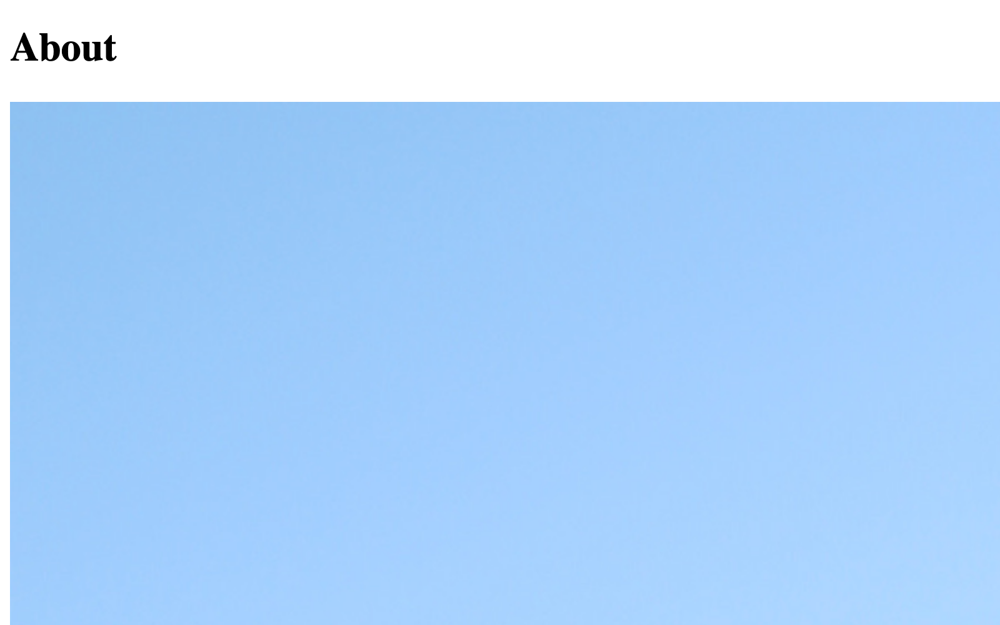

# Extra Templates

Now that we’ve scaffolded our blog templates, we can turn to some supporting features.

## About Page

Our original content model included “About” page, which we’ll set up as another section.

### Fields

Let’s by creating some fields for the page. We need a place to put a paragraph or two of text, and way to upload a profile photo.

#### Bio

1. In the control panel, navigate to **Settings** &rarr; **Fields**;
1. Click **+ New group** in the sidebar, and name it _About_;
1. Click **+ New field** in the upper-right corner;
1. Provide these settings:
    - **Name**: Bio
    - **Handle**: `bio`
    - **Field Type**: **Plain Text**
    - **Allow line breaks**: **Enabled**
    - **Initial rows**: `8`
1. Click **Save** or press <kbd>Ctrl/Command + S</kbd>;

#### Profile Photo

Picking up where you left off (in the _About_ field group), follow these steps:

1. Click **+ New field** in the upper-right corner;
1. Provide these settings:
    - **Name**: Profile Photo
    - **Handle**: `profilePhoto`
    - **Field Type**: **Assets**
    - **Sources**: **Images** only
    - **Max relations**: `1`
    - **View mode**: **Large Thumbnails**
1. Click **Save** or press <kbd>Ctrl/Command + S</kbd>;

### Single Section

Continuing in the control panel…

1. Navigate to **Settings** &rarr; **Sections**;
1. Click **+ New section**;
1. Provide these settings:
    - **Name**: _About_
    - **Handle**: `about`
    - **Section Type**: **Single**
    - **URI**: `about`
    - **Template**: `_singles/about`
1. Click **Save and edit entry types** or press <kbd>Ctrl/Command + S</kbd>;
1. Select the auto-generated entry type (it should also be named _About_);
1. Drag fields from the **About** group into the field layout in whatever order you prefer;
1. Click **Save** press <kbd>Ctrl/Command + S</kbd>;

With that, our new page is configured! Let’s head over to **Entries** &rarr; **Singles**, then click **About** to add some content.

### Template

Create `templates/_singles/about.twig` (the **Template** path we used when setting up the section) and add the following to it:

```twig





  <h1>{{ entry.title }}</h1>

  <div class="about">
    
      <div class="photo">
        {{ profilePhoto.getImg() }}
      </div>
    

    <div class="bio">
      {{ entry.bio | md }}
    </div>
  </div>

```

This template builds upon features we’ve already seen in other places—layouts, element queries, `if` tags, and filters. We’ve interspersed a bit of HTML so that we can come back and apply CSS, later.

Navigate to `/about` (the _About_ section’s URI) in the front-end—you should see our page’s `title` and the profile image we uploaded:

<BrowserShot url="https://tutorial.ddev.site/about" :link="false">

</BrowserShot>

::: tip
These big images really are a hassle! We’ll look at Craft’s built-in tools for transforming images in the [optimization](../more/optimization.md#asset-transforms) section.
:::

## Global Features

Our site is taking shape, but it’s difficult to move from page-to-page, outside of the blog.

### Page Structure

Our pages’ content is currently output directly into the `<body>` element, but it would be nice to have a bit more structure—and carve out some space for a header and footer.

Back in `templates/_layout.twig`, make these updates:

```twig{11-14,18-22}
<!DOCTYPE html>
<html lang="{{ craft.app.language }}">
  <head>
    <meta charset="utf-8"/>
    <title>{{ siteName }}</title>
    <meta content="width=device-width, initial-scale=1.0" name="viewport">

    
  </head>
  <body>
    <header>
      <a class="home" href="{{ siteUrl }}">{{ siteName }}</a>
    </header>
    <main>
      
        {# Nothing here, yet! #}
      
    </main>
    <footer>
      <div class="copyright">&copy;{{ now | date('Y') }} {{ siteName }}</div>
      <div class="colophon">Built with <a href="https://craftcms.com/" target="_blank">Craft CMS</a></div>
    </footer>
  </body>
</html>
```

This small change gives our content a dedicated region, and separates it from any global features we might add… like navigation!

### Navigation

The new `<header>` region is a great place to put a globally-available menu. Just below the anchor tag (`<a>`), add a new `<nav>` element:

```twig{3}
<a class="home" href="{{ siteUrl }}">{{ siteName }}</a>

<nav>
  <ul>
    <li>
      <a href="{{ url('blog') }}">Blog</a>
    </li>
    <li>
      <a href="{{ url('about') }}">About</a>
    </li>
  </ul>
</nav>
```

What a relief—we can finally click around the site, and every page that extends `_layout.twig` gets our centrally-defined menu without any additional work!

<BrowserShot url="https://tutorial.ddev.site/blog" :link="false">

</BrowserShot>

### Footer

The updates above included a couple of items in the footer, but it’s worth taking a moment to make this space even more useful.

#### Global Sets

Global sets are Craft’s way of storing a data that should be accessible _everywhere_ in our templates. They function almost exactly like the **Single** section we defined for the _About_ page, except that global sets don’t get their own URLs.

In the control panel, navigate to **Settings** &rarr; **Fields**, then follow these steps:

1. Click **+ New group** and name it _Global_;
1. Click **+ New field**;
1. Provide these field settings:
    - **Name**: _Description_
    - **Handle**: `description`
    - **Field type**: **Plain Text**
    - **Allow line breaks**: Enabled
1. Click **Save** or press <kbd>Ctrl/Command + S</kbd>;

With the field created, navigate to **Settings** &rarr; **Globals**:

1. Click **+ New global set**;
1. Name the set _Site Info_ and use `siteInfo` for the handle;
1. Click **+ New Tab** in the field layout designer, and name it _Settings_, _Content_, or something else generic (when there’s only a single tab, Craft will hide it—but it can’t be empty);
1. Click **Save** or press <kbd>Ctrl/Command + S</kbd>;

A new **Globals** item should appear in the main navigation. Click that, and add a description:

<BrowserShot url="https://tutorial.ddev.site/admin/globals/siteInfo" :link="false">

</BrowserShot>

Back in `templates/_layout.twig`, output that blurb in the footer:

```twig{2-4}
<footer>
  <div class="description">
    {{ siteInfo.description | md }}
  </div>
  <div class="copyright">&copy;{{ now | date('Y') }} {{ siteName }}</div>
  <div class="colophon">Built with <a href="https://craftcms.com/" target="_blank">Craft CMS</a></div>
</footer>
```

Let’s put HTML aside for a moment and get some styles applied!
