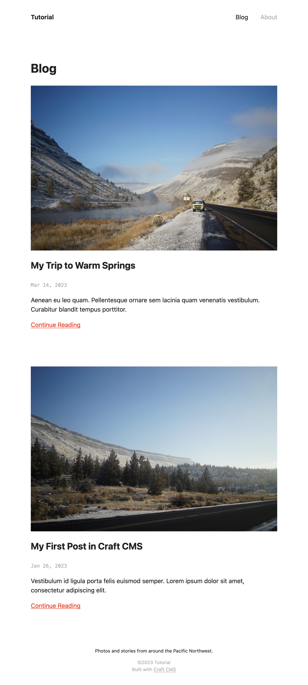
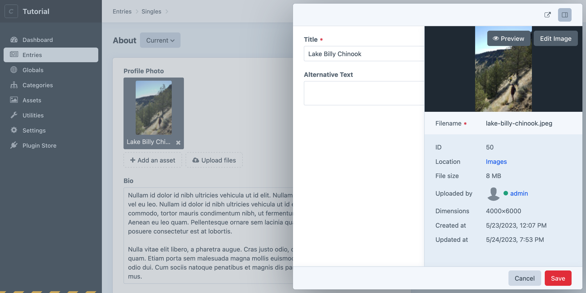
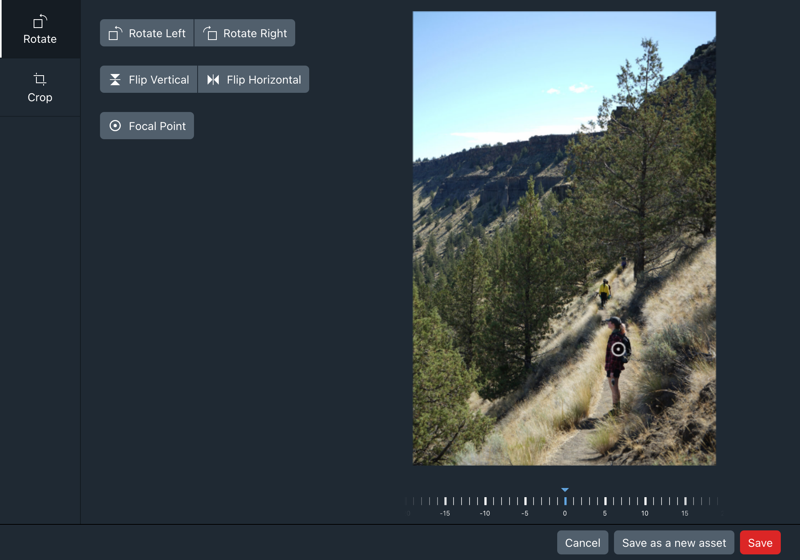
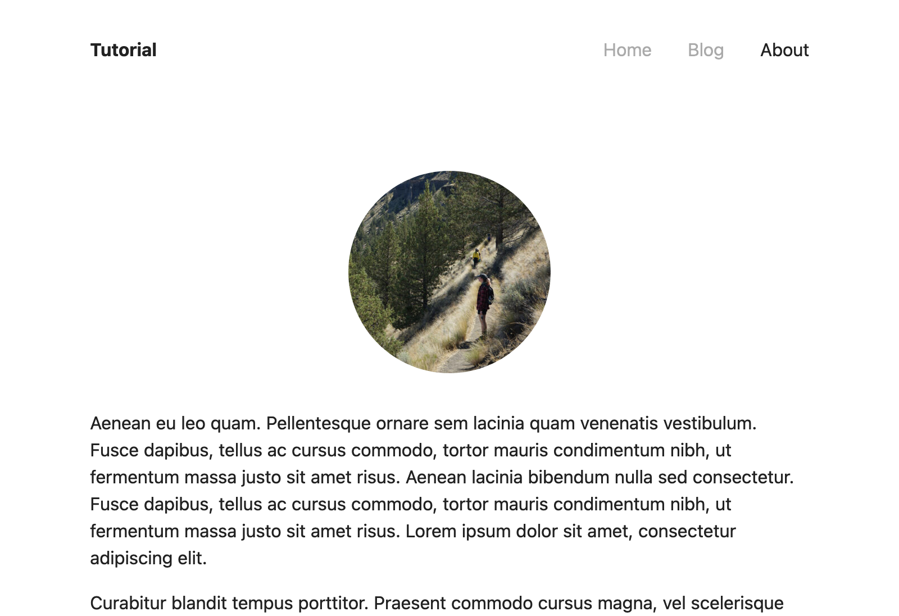

# Optimization + Cleanup

It’s worth taking a moment to talk about some Craft features that can improve your project’s speed, accessibility, and maintainability—and that are directly relevant to what we’ve built so far.

::: tip
We have a host of other ideas for [next steps](../more/README.md) if you would prefer to jump into self-guided learning!
:::

## Includes

When building the blog and topic index pages, there was a lot of repeated code involved with outputting the post previews. Twig’s `include` tag can help us reduce that repetition by extracting it into a separate template, and referencing it in both places.

We’ll start by taking the entire `for` loop from `templates/blog/_index.twig` and moving it to a new file, `templates/blog/_feed.twig`:

```twig

  

  <article>
    
      <div class="thumbnail">
        {{ image.getImg() }}
      </div>
    

    <h2>{{ post.title }}</h2>

    <time datetime="{{ post.postDate | atom }}">{{ post.postDate | date }}</time>

    {{ post.summary | md }}

    <a href="{{ post.url }}">Continue Reading</a>
  </article>

```

In place of that block of code in `templates/blog/_index.twig`, `include` the new template (then make the same change to `templates/blog/_topic.twig`):

```twig

```

By default, Twig exposes all variables in the current “context” to `include`d templates, so `posts` is available as though the partial was right there, in-line.

::: tip
Some people prefer to pass variables _explicitly_ so that they know exactly what will and won’t be accessible within a template:

```twig

```

The `only` at the end of the tag ensures that no other variables from the current template are leaked into the included template.
:::

## Asset Transforms

Applying CSS to our front-end finally got the images under control… but we’re still asking the client to download _significantly_ larger files than necessary, for the size they’re displayed at. In fact, our blog index weighs a staggering _30MB_!

The asset URLs that Craft generates for the `` tags via `image.getImg()` look like this:

```
https://tutorial-two.ddev.site/uploads/images/highway-26.jpg
```

This points to the unmodified, original file—exactly as it was uploaded. Craft always keeps these around, but we can ask for an optimized version via [transforms](/4.x/image-transforms.md).

Transforms are defined directly in your templates, or in the control panel. Each transform has a _mode_, which determines what other options are required. For our blog index, the most important qualities are the final _width_ of the image (about 640px), and that important subjects aren’t cropped out.

Let’s add these constraints to the template:

```twig
<div class="thumbnail">
  {{ image.getImg({
    mode: 'fit',
    width: 1200,
  }) }}
</div>
```

<BrowserShot url="https://tutorial.ddev.site/blog/" :link="false" :max-height="400" caption="The optimized images are indistinguishable from the originals at this scale.">

</BrowserShot>

::: tip
Refreshing the blog index, you may notice a delay before the images are displayed again—that’s to be expected, as Craft only generates a transform when it’s requested.
:::

This one change reduced our page’s total size to 310KB—or by 99%!

### Named Transforms

Applying these settings to all pages (and remembering to synchronize any tweaks between them) can be cumbersome. Fortunately, we can centralize these definitions in the control panel, and refer to them by only a handle:

1. Navigate to **Settings** &rarr; **Assets** &rarr; **Image Transforms**;
1. Click **+ New image transform**;
1. Provide these settings, leaving others at their defaults:
    - **Name**: Thumbnail;
    - **Handle**: `thumbnail`;
    - **Mode**: **Fit**;
    - **Width**: `1200` (units are in pixels, so use only numbers in this field);
    - **Allow Upscaling**: Turn _off_;
1. Click **Save**;

Now we can reference this transform in our templates by its handle, rather than its specifics:

```twig
<div class="thumbnail">
  {{ image.getImg('thumbnail') }}
</div>
```

### Focal Points

On the _About_ page, we’ve cropped the **Profile Photo** image as a circle, which almost perfectly cut out the subject. Craft doesn’t know about the content of this image—or what kind of frame it will be displayed in—but we can give it some hints.

The first step will be to define a transform. This is a one-off treatment, so we won’t bother going through the control panel:

```twig
<div class="photo">
  {{ profilePhoto.getImg({
    mode: 'crop',
    width: 360,
    height: 360,
  }) }}
</div>
```

This brings another marked improvement to the size of our pages—from 8MB for a single image to just over 40KB… but our subject is still getting cropped out!

Open the _About_ page in the control panel, then double-click the attached asset in the <Poi label="1" target="asset-slideout" id="field" /> **Profile Photo** field. In the slideout, open the metadata panel with the control in the upper-right corner, then click <Poi label="2" target="asset-slideout" id="controls" /> **Edit image** in the preview window:

<BrowserShot
  id="asset-slideout"
  url="https://tutorial-two.ddev.site/admin/admin/entries/about/46-about"
  :link="false"
  :poi="{
    field: [30, 35],
    controls: [95, 18],
  }"
  caption="Changing an asset’s focal point.">

</BrowserShot>

In the image editor, click <Poi label="1" target="focal-point" id="button" /> **Focal Point** and drag the <Poi label="1" target="focal-point" id="handle" /> control that appears to the desired position:

<BrowserShot
  id="focal-point"
  url="https://tutorial-two.ddev.site/admin/admin/entries/about/46-about"
  :link="false"
  :poi="{
    button: [28, 27],
    handle: [83, 55],
  }"
  caption="Changing an asset’s focal point.">

</BrowserShot>

Click **Save** to confirm the new focal point, and return to the _About_ page in the front-end. Refreshing the page will regenerate the transform, this time respecting the newly-defined focal point!

<BrowserShot url="https://tutorial.ddev.site/about/" :link="false" caption="Our profile picture is now resampled and cropped in such a way that the subject is still in view.">

</BrowserShot>

## Eager Loading

Our blog’s indexes show a list of posts, each of which includes an image. We perform one query for the list of posts, then _each time we output a post_, we perform _another+ query to get the asset attached via its **Feature Image** field.

This is what’s called an “N+1” problem: the number of queries required to load the content is proportional to the amount of content—and that could be _a lot_—supposing we had 50 posts, it would take 51 queries to display the blog feed; if we also wanted to display topics for each post in the feed, it would be _101_ queries!

Craft addresses this with a feature called _eager loading_, which allows us to declare in the main query what nested elements we are apt to need, for every result:

```twig{3-5}

```

Without any changes to our templates, Craft is able to fetch the posts, then gather all the assets used on those posts and match them up—and it will do this in just _two_ queries, regardless of how many posts are in a feed!

::: tip
Only relational fields (**Assets**, **Entries**, **Categories**, and **Tags**) need to be eager-loaded—and not every scenario demands it! The best rule of thumb is to look out for nested `for` loops, or any time you use a relational field _inside_ a `for` loop.
:::

### Transforms

When we defined image transforms for posts’ featured images on the blog index, we inadvertently triggered an additional query for each post, _on top of_ the asset query. Fortunately, eager loading is supported for transforms, as well:

::: code
```twig{3-12} Ad-Hoc

```
```twig{3-5} Named

```

While eager-loading can provide _some_ performance benefits here, maintaining transform options between queries and usage can become difficult. This is a great reason to consolidate transforms in the control panel!
