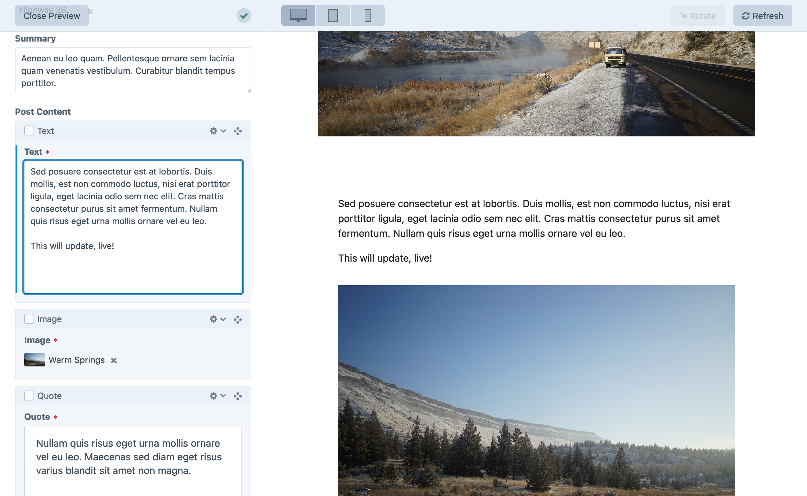

### Edit with live preview

Once you’ve added templates for each of your sections, you can visit the entry edit page in the control panel and choose the **Preview** button to slide open a panel for previewing your edits as you make them:

<BrowserShot url="https://tutorial.nitro/admin/entries/blog/40-my-first-post" :link="false" caption="Editing a blog post with live preview.">

</BrowserShot>
