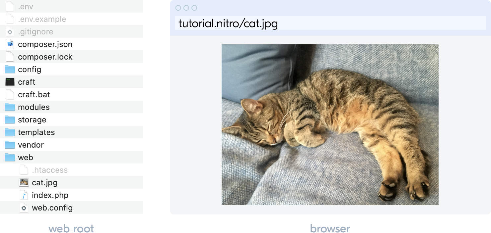
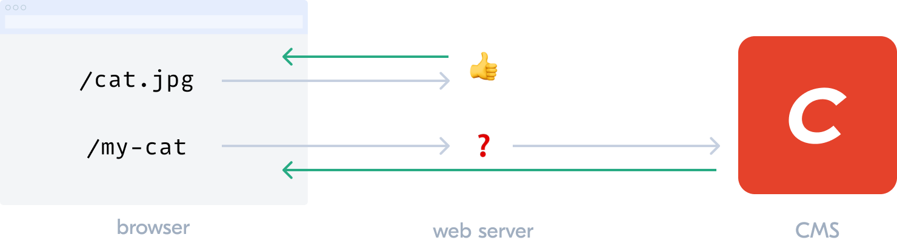

# Dynamic routing :sparkles:

Every web server has the straightforward job of translating a URL into a response. This job is called _routing_.

## Static routes

At this very moment, you can add a cat photo to your project at `web/cat.jpg` and see it in your browser at `https://tutorial.nitro/cat.jpg`.

The web server reads that URL, finds the file in the web root, and returns it in a response that’s displayed by your browser. This is a _static_ route where Craft CMS never gets involved; normal web server stuff.

## Dynamic routes

When we build a template-driven CMS website, the CMS is responsible for handling _dynamic_ routes. If the web server doesn’t find a static route in our case, it hands off to Craft CMS which then looks at [a series of things](/3.x/routing.md) to see if it can return a response. (If not, it returns a 404.)

As we add content in the control panel, Craft expands a map of dynamic routes behind the scenes.

We’ve created a _Blog_ section, for example, that uses the URL format `blog/{slug}` for its posts. `{slug}` is a special placeholder that stands for any published entry’s _Slug_ value. When a requested URL maps to a blog entry, our settings say to present it on a `blog/_entry` template we haven’t created yet.

You don’t need to know this to start working with templates, but it may help to know what role they play and why they’re different from static files.