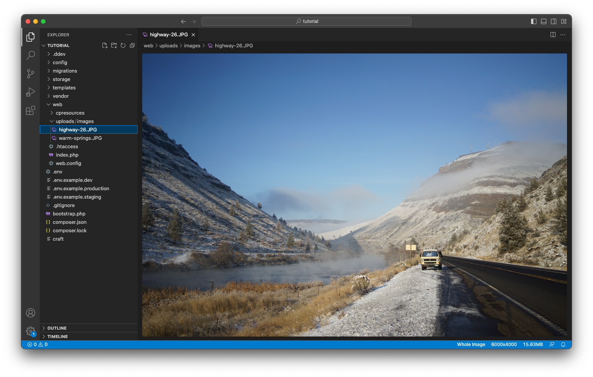
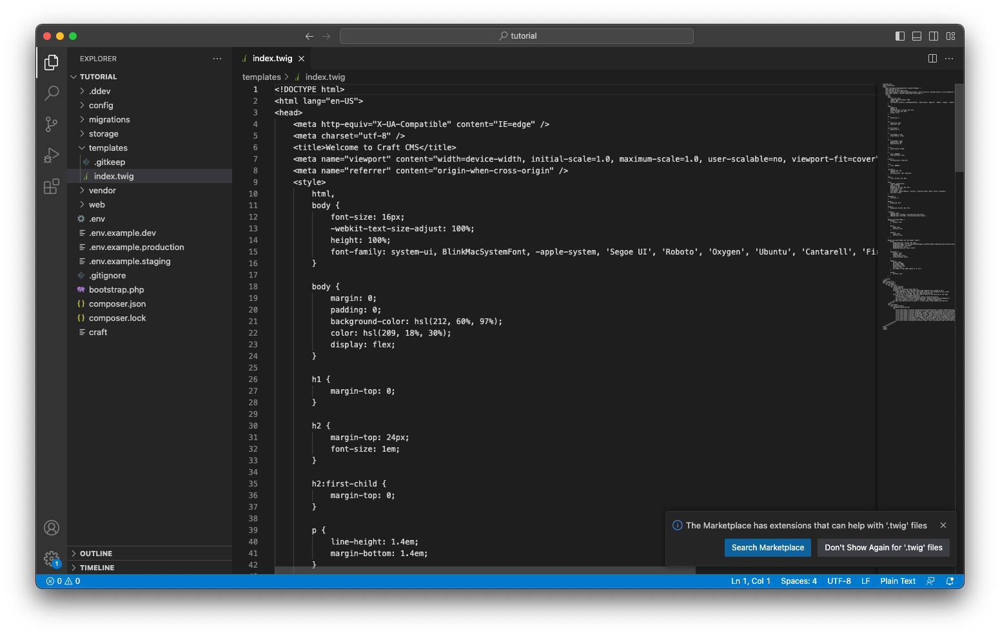

# Requests + Responses

A web server’s job is to handle _requests_ by serving a _response_, but how it does that is ultimately a product of its configuration.

DDEV comes pre-configured with an HTTP server called _nginx_, through which all our requests are processed. Only some of those requests will actually be handed off to Craft, though!

## Static Files

The relationship between your local development hostname (`https://tutorial.ddev.site`) and your project folder isn’t immediately clear. Let’s begin by looking at some files in our project’s **web root**.

### Assets

If you haven’t already done so, upload an image to your asset volume. When configuring the underlying filesystem, we set its **File System Path** to `@webroot/uploads/images`, which is a shortcut or _alias_ to a folder inside the `web/` directory at the top level of our project.

In VS Code, look in your sidebar for the `web/` directory, then navigate down to `uploads/images/`. You should see the file(s) you’ve uploaded, so far—and maybe a few extra folders that Craft created to store transforms (we’ll talk about transforms, later):



::: warning
You should let Craft manage this directory (and eventually add it to the provided `.gitignore` file). Directly adding, deleting, moving, or renaming assets oftentimes means that Craft will lose track of them.
:::

The URL to a file in your `web/uploads/images/` directory will begin with `https://tutorial.ddev.site/uploads/images/`—we know this, because we set the filesystem’s **Base URL** to `@web/uploads/images`, where `@web` is another _alias_ that Craft provides that evaluates to the project’s root URL. If we had uploaded a photo named `photo.jpg`, the full URL would be `https://tutorial.ddev.site/uploads/images/photo.jpg`.

Don’t worry about constructing these URLs—like entries, Craft knows what an asset’s URL should look like, based on where it is stored.

### Other Files

Everything in the `web/` folder is publicly accessible—we usually refer to this as the “web root,” thus the `@webroot` alias, above!

This is both a powerful feature of HTTP servers, and something to be aware of as you add files to your project. The webroot (or a subfolder therein) is a _good_ place for things like…

- Stylesheets (CSS files);
- JavaScript and other libraries;
- Static images, icons, and other non-managed graphics;
- Webfonts;
- Uploaded assets that should be public;

The webroot is a _bad_ place to store these kinds of things:

- A `.env` file;
- Database backups;
- Readmes and other documentation about the project;
- Exported data (unless it is intended for public use);

::: tip
Even though we are working in a private development environment, being mindful of where you are creating and storing files is essential when going live with a web project.
:::

Let’s create a file in the webroot. In VS code, right-click on the `web/` folder in the sidebar, select **New File…**, and type `styles.css` into the prompt. Press <kbd>Enter</kbd> to confirm the filename and create the file. VS Code will open the file and move your cursor into it—add a single line, for now:

```css
/* Hello, world! */
```

This file’s path within your project folder is `web/styles.css`. Given that we know the _web root_ is the `web/` folder, you should be able to access this file at `https://tutorial.ddev.site/styles.css`:

<BrowserShot url="https://tutorial.ddev.site/styles.css" :link="false">

</BrowserShot>

The HTTP server was able to find `styles.css` and serve it to us without getting Craft involved!

We’ll come back to `styles.css` later. For now, let’s look at a request that Craft _does_ handle.

## Dynamic Routes

It would be a lot of work to create a file for _every_ post on our blog… it also defeats the purpose of a CMS!

Whenever the HTTP server fails to find a file matching the current URL or “path” (like `/styles.css`, above), it checks with Craft before giving up—in this case by executing the `index.php` file in our web root.

We’ve actually seen this in action from the moment we first logged in to the control panel! The same process is also why we got a [scary error screen](../configure/editing.md#previewing) when attempting to access one of our posts’ URLs.

Entries in that section (_Blog_) have a **URI Format** of `blog/{slug}`. `{slug}` is a special placeholder, representing an entry’s _Slug_ value. When entries are created and updated, Craft evaluates this “template” and stores the result—for example, if a post named “My Trip to Bend” had a slug of `my-trip-to-bend`, it would be assigned a URI of `blog/my-trip-to-bend`.

Accessing `https://tutorial.ddev.site/blog/my-trip-to-bend` doesn’t match any files in our web root, so the HTTP server hands the request off to Craft. When that happens, Craft compares the path (`/blog/my-trip-to-bend`) to known URIs. Any request that _doesn’t_ match a known element URI is then tested against a few other special cases.

::: details More about URIs
URIs _must_ be unique in Craft, meaning that each post in the _Blog_ section must have a different slug. Craft will let you know when a slug would cause a collision like this.

We’re specifically referring to these as _URI_s instead of _URLs_ because Craft doesn’t store or match against fully-qualified URLs. When a request reaches Craft (wherever the installation lives), it assumes its configuration provides a correct hostname or “base URL” with which it should construct URLs. When you installed Craft, it wrote a `PRIMARY_SITE_URL` variable to the `.env` file, and stored a reference to it in the default site’s settings.

Altogether, this means that Craft sites are extremely portable. If you change the domain of a site (or move it into a subfolder), you usually only need to update a single environment variable to maintain all of your existing routes.
:::

## Template Routes

There’s one more routing feature we’ll use to build our blog, and it combines aspects of the two we’ve looked at, so far.

When you first launched your new Craft installation in a browser, you saw the _welcome screen_—without having set up any content types. On it, this sentence gives us a hint about what we’re looking at:

> You’re looking at the `index.twig` template file located in your `templates/` folder.

Let’s find that in VS Code:



We’re in the right place (the `<title>` tag’s content is the same as our browser’s tab), but this is pretty difficult to read as-is—our next step will be to get VS Code set up for working with _Twig_, Craft’s templating language.

How does Craft know to render this template, though? It’s not in the web root (so we know Craft is serving the request), but we don’t have an entry, category, or other element type set up that would match the base _path_ (`/`).

Craft performs one additional check before giving up: it searches your `templates/` folder for a file that matches the request’s path. In this case, `index.twig` has some additional significance: the request path is actually _empty_ (the initial slash is ignored), so Craft looks in the root of the `templates/` folder for an `index.twig` or `index.html`.

::: details Another Path Example
If we instead visited a path like `/not-a-real-page`, Craft would check to see if a template named `not-a-real-page.twig` (or `not-a-real-page.html`) existed in your root `templates/` folder, then check for `index.twig` (or `index.html`) in a `not-a-real-page/` subfolder.
:::

Having located our first template, it’s time to talk about the language that makes them dynamic: _Twig_.

::: tip
Craft will only render Twig files that live in the `templates/` directory. You can place HTML files in the web root, but they will _not_ be parsed as Twig, nor evaluated for any kind of dynamic content.
:::

## Everything Else

Craft has a few other routing tricks up its sleeve, but they aren’t immediately relevant to our blog. The main documentation has a complete guide to Craft’s [routing behavior](/4.x/routing.md).
