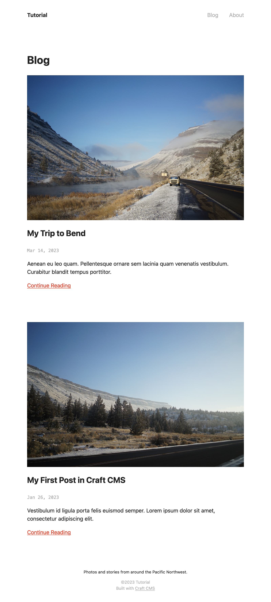
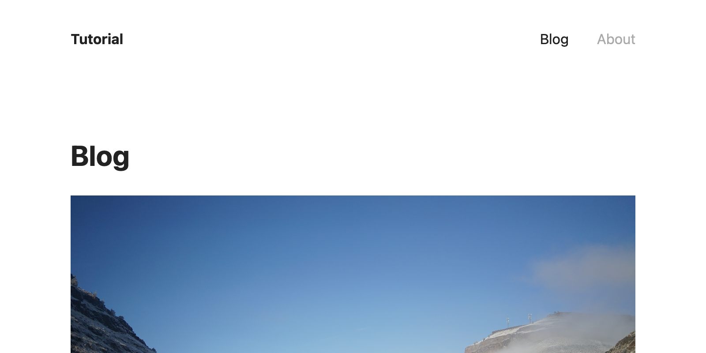

# Styling

Craft has no opinions about how you style your front-end. This section covers some basic, broadly-applicable, framework-agnostic solutions for integrating CSS into your project. You’ll find champions of virtually every popular paradigm in our [community](https://craftcms.com/community)—from vanilla CSS to Tailwind to CSS-in-JS!

## Adding a Style Sheet

When we first created `_layout.twig`, it included this line:

```twig

```

This is equivalent to using a plain `<link>` tag, but it takes care of generating a valid, absolute URL and building the appropriate HTML. You could construct it yourself, like this:

```html
<link href="{{ url('styles.css') }}" rel="stylesheet">
```

::: tip
The same tag can be used _anywhere_ in Twig, meaning each template (say, for the individual post pages) can request that a style sheet be added to the final document’s `<head>`:

```twig
{# Say, from `templates/blog/_entry.twig`! #}

```

Of course, this doesn’t do any good if there’s no underlying CSS file!
:::

### Project CSS

Let’s get some baseline styles into the project so we can visualize the structure of our HTML a bit better.

Grab the contents of [this file](repo:craftcms/tutorial-project/blob/main/web/styles.css) from the tutorial project repository on GitHub and paste it into the `web/styles.css` file we created at the beginning of the tutorial.

The blog index should now look something like this:

<BrowserShot
  url="https://tutorial.ddev.site/blog"
  :link="false"
  :max-height="400">

</BrowserShot>

## Making Styles Dynamic

### Navigation

The example style sheet above includes a couple of rules that help make the global navigation more useful:

```css
nav a {
    color: var(--color-muted);
}

nav a.active,
nav a:hover {
    color: var(--color-base);
}
```

The first rule sets a default color (`var(--color-muted)`) for links in the `nav` element. The second one combines a `:hover` “pseudo-selector” and an `.active` class selector that applies a darker color (`var(--color-base)`) under certain conditions. Our HTML doesn’t add this class, though! Let’s see what it takes to wire this up, in `_layout.twig`:

```twig{2,7,10,13}
{# Get the first segment of the current URI: #}


<nav>
  <ul>
    <li>
      <a href="{{ url('/') }}" class="{{ navSegment is empty ? 'active' : 'inactive' }}">Home</a>
    </li>
    <li>
      <a href="{{ url('blog') }}" class="{{ navSegment == 'blog' ? 'active' : 'inactive' }}">Blog</a>
    </li>
    <li>
      <a href="{{ url('about') }}" class="{{ navSegment == 'about' ? 'active' : 'inactive' }}">About</a>
    </li>
  </ul>
</nav>
```

The first highlighted line is a call to one of Craft’s internal functions that looks at the current URI or path. If we were on the `/blog/topics/road-trips` or `/blog` pages, for instance, the first “segment” would just be `blog`. If we were on `/about`, the first segment would be `about`.

The remainder of the highlighted lines add a new `class` attribute to each anchor tag, and output either `active` or `inactive`, using Twig’s _ternary_ operator (`?`). You can think of this as a combination of an output tag (`{{ ... }}`) and a control tag (``): the condition is a comparison against the `navSegment` variable, where a “truthy” result returns the value after the `?`, and a “falsey” result returns the value after the `:`. Ignoring for a moment that we aren’t displaying the navigation on the homepage, its comparison doesn’t have a value to test against, so we just check if the first segment is “empty!”

Refresh your browser, and see the link automatically highlighted:

<BrowserShot url="https://tutorial.ddev.site/blog" :link="false">

</BrowserShot>

### Matrix Blocks

One thing that our HTML _does_ currently support is different treatment for each entry type in our **Post Content** field.

Recall that we had a series of `if` tags that separated output based on each block’s `type`:

```twig{2,5,8,11}
{# Text blocks: #}
<div class="content-block text">{# ... #}</div>

{# Image blocks: #}
<div class="content-block image">{# ... #}</div>

{# Unsupported blocks: #}
<div class="content-block unsupported">{# ... #}</div>

{# Quote blocks (if you implemented them): #}
<div class="content-block quote">{# ... #}</div>
```

Rules that affect only one block type might look like this:

```css
.content-block.image {
    background-color: #EEE;
    padding: var(--layout-site-gutter);
    transform: rotate(-1deg);
}

.content-block.unsupported {
    border: 1px dashed var(--color-highlight);
    color: var(--color-highlight);
    padding: var(--layout-site-gutter);
    text-align: center;
}
```

::: tip
These aren’t included in the style sheet, but they can be added just after the other post-specific styles.
:::

### Advanced Styles and Customization

You are in complete control of the HTML that Craft outputs, so there are very few limitations with respect to its structure and substance!

#### Variation

In addition to setting flags based on your _content_, you have access to a bevy of tools and state:

- Introduce variation with randomization, with the `random()` and `shuffle()` functions;
- Step through values with the `cycle()` function, inside a loop;
- Use `now` and date comparisons to output different content based on the time of day;
- Let administrators select values in a global set (or on particular entry, category, asset, etc.) to customize the site or page’s appearance;

#### Interpolating CSS

While Twig’s primary target is HTML, you are welcome to output variables into a `<style>` tag within it:

```twig
<head>
  {# ... #}

  <style>
    body {
      background-color: {{ theme.backgroundColor | e('css') }};
      color: {{ theme.textColor | e('css') }};
    }
  </style>
</head>
```

This presumes `theme` is the handle of a global set that contains two **Color** fields named _Background Color_ and _Text Color_. Craft doesn’t have any inherent understanding of “themes” like other platforms, but you can create all kinds of aesthetic and functional settings that are suited to your project!
