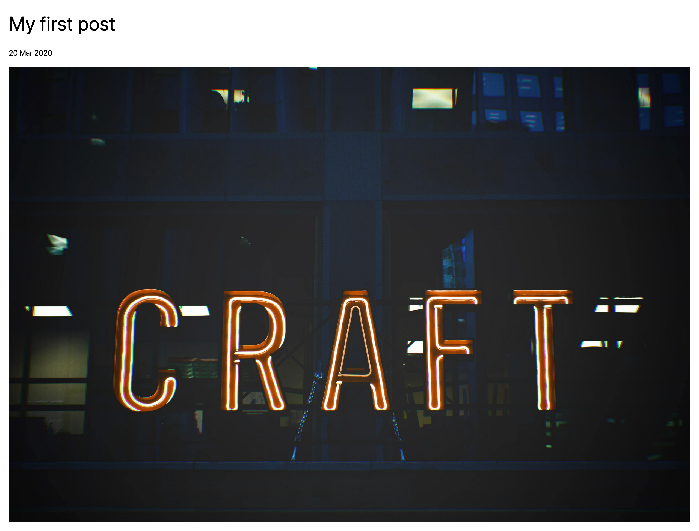
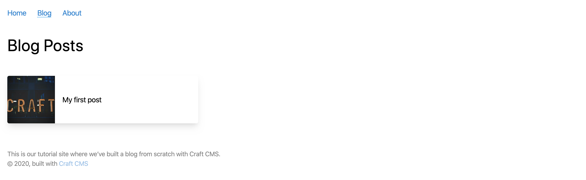
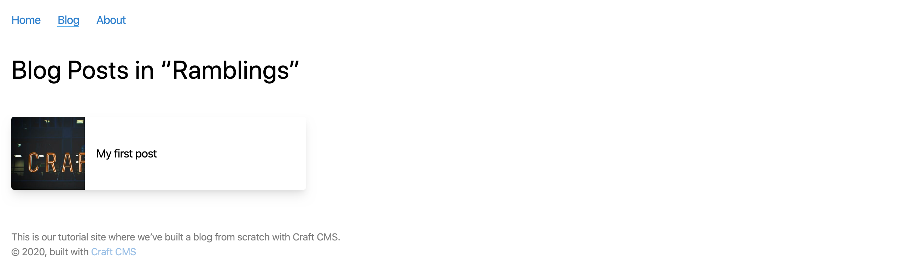
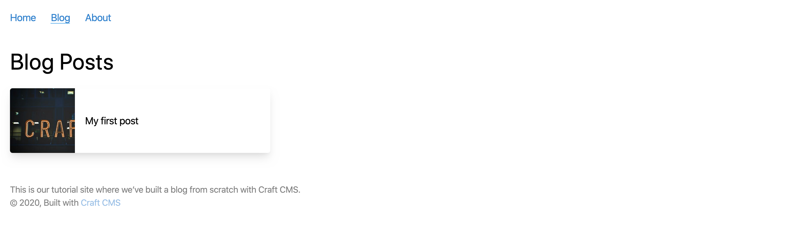

# Site Templates

It’s time to bring together everything we’ve learned and create some templates that display data from the content model we set up in Craft.

## Create a Layout

A layout is sort of like a wrapper that goes around the main content of a page, but is still a Twig template. In most cases, a layout will be responsible for outputting a header, site navigation, or a footer—but it can also contain invisible metadata in the `head` of every document that uses it.

Create a layout template at `templates/_layout.twig` by right-clicking the `templates/` folder in VS Code’s file browser, then selecting **New File…**.

::: tip
The underscore (`_`) at the beginning of `_layout.twig` means the template is “private.” Unlike `index.twig`, you will _not_ be able to view the template by visiting `https://tutorial.ddev.site/_layout`.

Use an underscore any time a template doesn’t need to be rendered on its own. You can also prefix a subfolder of your `templates/` directory with an underscore to hide _everything_ inside it.
:::

Copy the following into the new layout file you just created:

```twig{2,5,6,7,11-12}
<!DOCTYPE html>
<html lang="{{ craft.app.language }}">
  <head>
    <meta charset="utf-8"/>
    <title>{{ siteName }}</title>
    <meta content="width=device-width, initial-scale=1.0" name="viewport">
    <link href="/styles.css" rel="stylesheet">
  </head>
  <body>
    
      {# Nothing here, yet! #}
    
  </body>
</html>
```

This is the skeleton of a basic webpage, but it has no content! A layout’s main job is to reduce boilerplate in your templates; here, we’ve defined a few things we want on _every_ page of the site:

- The language content is presented in (on the `<html>` tag);
- The name of our site, in the `<title>` tag (you may recognize this from `index.html`);
- A `<meta>` tag defining how we want the page to be sized on small-screened devices;
- A reference to a stylesheet;

The last thing to note is the use of the `` tag to define a region where our content will go. Craft doesn’t know anything about `_layout.twig` yet, so we’ll have to tell it when we want to use this layout, and what we want to go that `content` block.

## Create a Post Template

Now that we have a _layout_ template, let’s use it for our individual blog post pages.

Create `templates/blog/_entry.twig` and paste this code to it:

```twig{2,5-7}
{# You can omit the `.twig` when referencing another template: #}


{# Provide something to the `content` block in `_layout.twig`: #}

  <h1>Some day, I’ll be a blog post!</h1>

```

The first highlighted line connects our post template with the layout template, using the `` tag.

Now that the blog section’s template is ready, you can visit the URL for a published post:

<BrowserShot url="https://tutorial.ddev.site/blog/my-trip-to-bend" :link="false" caption="">

</BrowserShot>

### Add Dynamic Data

Hard-coding our post’s title isn’t very practical, so let’s make a couple of changes and bring in some data from the current post.

We know now that any time an element (like our blog post entries) matches a request path, Craft will render the template defined in its settings. In this case, the entry belongs to a section that declared `blog/_entry` as its **Template**—which is why we had to add this one in a particular spot.

But how do we actually get the content for that post? Craft makes the matched entry available in our template under a special `entry` variable:

```twig{5,8-11}



  {# Access a property using “dot” notation: #}
  <h1>{{ entry.title }}</h1>

  {# Format dates with a “filter”: #}
  <time datetime="{{ entry.postDate | date('Y-m-d') }}">
    {{ entry.postDate | date('d M Y') }}
  </time>

```

Now it’s looking better!

<BrowserShot url="https://tutorial.ddev.site/blog/my-trip-to-bend" :link="false" caption="">

</BrowserShot>

Note that we’re using the [`|date` Twig filter](/4.x/dev/filters.md#date) to specify formats for the `entry.postDate` value. This is a typical example of using a filter to modify something in Twig; a value you want to modify or transform is followed by a pipe (`|`) and the name of the filter, then sometimes settings specific to that filter. You can see all Craft’s available [filters](/4.x/dev/filters.md) to get a better idea of what you can do with them.

Let’s display the “Feature Image” next, using the `featureImage` handle we created with that custom field:

```twig{4,16-18}


{# Load the attached image: #}



  {# Access a property using “dot” notation: #}
  <h1>{{ entry.title }}</h1>

  {# Format dates with a “filter”: #}
  <time datetime="{{ entry.postDate | date('Y-m-d') }}">
    {{ entry.postDate | date('d M Y') }}
  </time>

  {# Output the image, if one was found: #}
  
    {{ featureImage.getImg() }}
  

```

At the top of the template, a new `set` tag loads the first attached image. We check at the end of the template whether an image is indeed available, then let Craft generate an HTML `` tag with the right attributes.

This first uses an [`if` conditional statement](https://twig.symfony.com/doc/3.x/tags/if.html) to see if there’s an image saved for this field. The “Assets” field we used can have one or many images depending on how we configure it, so the statement uses the [`|length` Twig filter](/4.x/dev/filters.md#length) to count the number of items—where `0` will be `false` and anything else will be `true`.

If the statement is `true`, meaning we have at least one feature image, we use `entry.featureImage.all()` to get the set, then a `for` loop to display each one using the `image` variable. (We limited the field settings earlier so a content author can only provide one, but if we raised that limit later _every_ image would be shown here without any template changes!)

For each asset, we output a `img` HTML tag which tells the browser to display an image. We use two Twig tags to provide important details about the image:

- `{{ image.url }}` gives us the web-friendly URL for the image 
- `{{ image.title }}` provides a text description we can use as `alt` text for accessibility

We should now see the image after refreshing the page:

<BrowserShot url="https://tutorial.test/blog/my-trip-to-bend" :link="false" caption="">

</BrowserShot>

It’s pretty big.

## Transform an asset

[Image Transforms](/3.x/image-transforms.md) let you specify the exact dimensions you need and have Craft CMS crop and size an image automatically. Let’s specify a size for our “Feature Image”.

We’ll use Twig to create an object called `featureImage` with the settings we want, then pass those settings to `image.getUrl()` in place of `image.url`:

```twig{3-8,17}





  <h1 class="text-4xl text-black font-display my-4">{{ entry.title }}</h1>

  <time class="text-sm block pb-4" datetime="{{ entry.postDate | date('Y-m-d') }}">{{ entry.postDate | date('d M Y') }}</time>

  
    
      
    
  

```

You can now refresh the front end and see your transformed asset:

<BrowserShot url="https://tutorial.test/blog/my-trip-to-bend" :link="false" caption="Automatically-resized image, cropped at 900×600px.">

</BrowserShot>

## Display Matrix content

Let’s output the post content stored in that Matrix field.

Matrix content is stored in whatever blocks we’ve defined. To display that content, we’ll:

1. use another `for` loop to run through each block
2. use an `if` statement to handle output based on the block type

```twig{21-33}





  <h1 class="text-4xl text-black font-display my-4">{{ entry.title }}</h1>

  <time class="text-sm block pb-4" datetime="{{ entry.postDate | date('Y-m-d') }}">{{ entry.postDate | date('d M Y') }}</time>

  
    
      
    
  

  <div class="my-8">
    
      <div class="my-4">
        
          {{ block.text }}
        
          
            
          
        
      </div>
    
  </div>

```

The Matrix content will now be included on the page:

<BrowserShot url="https://tutorial.test/blog/my-trip-to-bend" :link="false" caption="Detail page with post content added." :max-height="600">

</BrowserShot>

## Use an include

The template’s getting longer, and we know we’ll be re-using the “Post Content” field again in the about page. Let’s tidy up a bit and make sure our Matrix code can be re-used.

To do this, we’ll move the new Matrix block Twig code to its own smaller, re-usable template.

Create `templates/_includes/post-blocks.twig` and copy that code to it:

```twig
<div class="my-8">
  
    <div class="my-4">
      
        {{ block.text }}
      
        
          
        
      
    </div>
  
</div>
```

We can now go back to `templates/blog/_entry.twig` and _include_ that template instead:

```twig{21}





  <h1 class="text-4xl text-black font-display my-4">{{ entry.title }}</h1>

  <time class="text-sm block pb-4" datetime="{{ entry.postDate | date('Y-m-d') }}">{{ entry.postDate | date('d M Y') }}</time>

  
    
      
    
  

  

```

The `with { blocks: entry.postContent.all() } only` part means we’re passing the `entry.postContent.all()` value in a variable we’ve labeled `blocks`. That means one small update for `templates/_includes/post-blocks.twig`:

```twig{2}
<div class="my-8">
  
    <div class="my-4">
      
        {{ block.text }}
      
        
          
        
      
    </div>
  
</div>
```

Refreshing the page in your browser shouldn’t change a thing, but the Twig behind the scenes is now a bit more DRY and ready to re-use.

::: tip
There’s nothing special about the `_includes` folder, it’s just the name we chose. You already know from the underscore it’s a private folder, but you can call yours whatever you’d like!
:::

## Add code comments

While we’re building, let’s add some comments so we can remember what we’ve done. Twig ignores anything wrapped with `{#` and `#}`, which is what we’ll use to leave human-friendly notes:

```twig{3,16,23}


{# create settings for image transform #}



  <h1 class="text-4xl text-black font-display my-4">{{ entry.title }}</h1>

  <time class="text-sm block pb-4" datetime="{{ entry.postDate | date('Y-m-d') }}">{{ entry.postDate | date('d M Y') }}</time>

  {# output transformed feature image(s) #}
  
    
      
    
  

  {# render Matrix blocks for the “Post Content” field, passed as `blocks` #}
  

```

You may find that the human you most often leave the note for is yourself.

## Display post categories

The last thing we need to do on the post detail template is output the post categories using the `postCategories` field handle:

```twig{26-35}


{# create settings for image transform #}



  <h1 class="text-4xl text-black font-display my-4">{{ entry.title }}</h1>

  <time class="text-sm block pb-4" datetime="{{ entry.postDate | date('Y-m-d') }}">{{ entry.postDate | date('d M Y') }}</time>

  {# output transformed feature image(s) #}
  
    
      
    
  

  {# render Matrix blocks for the “Post Content” field, passed as `blocks` #}
  

  {# display post categories #}
  
  <div class="border-t py-2 mb-6">
    
      <a href="{{ category.url }}" class="inline-block border rounded px-2 py-1 text-sm">
        {{- category.title -}}
      </a>
    
  </div>
  

```

Here we’re first checking whether there _are_ any categories, then outputting individual links. (Those links won’t go to real pages yet, but we’ll come back to that.)

The only new bits here are the hyphens in the Twig tag around `category.title`: `{{-` and `-}}`. You can use those for [whitespace control](https://twig.symfony.com/doc/2.x/templates.html#whitespace-control), so in the rendered page instead of...

```html
<a href="(...)" class="inline-block border rounded px-2 py-1 text-sm">
  Category
</a>
```

...the empty space around the category title will be removed:

```html
<a href="(...)" class="inline-block border rounded px-2 py-1 text-sm">Category</a>
```

This doesn’t offer any functional benefit, we just thought you should know you can control whitespace if you’re into it.

## Add a page footer with details from a global set

We used a global set to store a blurb for the bottom of every page on the site. Since we want that to appear everywhere, let’s add it to `_layout.twig` along with a copyright line:

```twig{15-18}
<!DOCTYPE html>
<html lang="{{ craft.app.language }}">
  <head>
    <meta charset="utf-8"/>
    <title>{{ siteName }}</title>
    <meta content="width=device-width, initial-scale=1.0" name="viewport">
    <link href="/styles.css" rel="stylesheet">
  </head>
  <body class="ltr">
    <div class="container mx-auto px-4">
      
      
    </div>
    <footer class="container mx-auto p-4 text-sm">
      {{ siteInformation.siteDescription|markdown }}
      <p>&copy; {{ now | date('Y') }}, built with <a class="text-blue-600" href="https://craftcms.com">Craft CMS</a></p>
    </footer>
  </body>
</html>
```

The “Site Description” field is Plain Text without any formatting, and just for fun we can use Craft’s [`markdown` filter](/3.x/dev/filters.md#markdown) to output it in a paragaph tag (`<p></p>`) and support [Markdown syntax](https://daringfireball.net/projects/markdown/).

## Add a listing page

We’ll display a listing of posts in two places: in the blog index and again on a category page where they’re limited to the selected category.

Let’s start with our landing page first.

Create `templates/blog/index.twig`. Any time you use `index.twig` or `index.html`, that will be the default template or page in a given folder. So when we visit `https://tutorial.ddev.site/blog/`, that folder’s `blog/index.twig` will be used for rendering the result. Add the following to that template:

```twig






  <h1 class="text-4xl text-black font-display my-4">Blog Posts</h1>

  

```

Our entry detail page came with an automatically-available `entry` variable, but here we’ve fetched all the entries in the `blog` section and put them in a variable called posts:

```twig

```

The technical term for what we’re doing is [querying entries](/3.x/entries.md#querying-entries). Once these content elements are stored in Craft CMS, there are lots of options and parameters you can use to query exactly the content you need wherever you happen to need it.

Now create `templates/_includes/listing.twig`. We’ll use this for listing blog entries on this index page and re-use it again shortly for the category page:

```twig
<div class="post-list my-10 flex">

  <a href="{{ post.url }}" class="flex shadow-lg rounded items-center justify-center overflow-hidden">
    
      
      <div class="w-1/4">
        
      </div>
    
    <span class="title w-3/4 p-4">{{ post.title }}</span>
  </a>

</div>
```

The image transform is similar to what we did earlier, except we used `.one()` instead of `.all()` since we only want one image. This also passes an object with `width` and `height` directly to `image.getUrl()` instead of first assigning that object to a variable.

Here’s what the result looks like:

<BrowserShot url="https://tutorial.ddev.site/blog/" :link="false" caption="">

</BrowserShot>

In this template we’ve chosen to display a square thumbnail of the “Feature Image” along with the post title. Some of these images may crop weirdly into squares, but we can use focal points to have some control over how they’re cropped!

Transformed images will automatically be cropped from the center, but a content editor may also adjust this by setting a [focal point](/3.x/assets.md#focal-points) in the control panel:

1. In the control panel, navigate to the image either using the **Assets** menu item or **Entries** and choosing the relevant blog post.
2. Double-click the asset and choose **Edit** from the top-right corner of the preview modal to launch the image editor.
3. Choose **Focal Point** and drag the focal point target to an important area of the image.
4. Choose **Save**.


Back on the front end, refresh the listing page and you’ll see the re-cropped thumbnail:

<BrowserShot url="https://tutorial.test/blog/" :link="false" caption="Listing page with adjusted thumbnail focal point.">

</BrowserShot>

## Create a category listing

Create `templates/blog/_category.twig` and add the following:

```twig






  <h1 class="text-4xl text-black font-display my-4">
    Blog Posts in “{{ category.title }}”
  </h1>

  

```

In the same way that entry detail pages came automatically loaded with an `entry` variable, category pages come with a special `category` variable. We’re using that here to limit only to posts in the selected category using the [`relatedTo` query parameter](/3.x/entries.md#relatedto):

```twig

```

Our post category listings, which you can navigate to by choosing any of a blog post’s tags, should be working now:

<BrowserShot url="https://tutorial.ddev.site/blog/category/ramblings" :link="false" caption="Listing page for posts in the `Ramblings` category.">

</BrowserShot>

## Add navigation

Getting around is pretty awkward right now. Let’s add some navigation.

Create `templates/_includes/nav.twig` and add the following to it:

```twig
<nav class="container mx-auto py-4 px-4" role="navigation" aria-label="Main">
  
  <ul class="flex">
    <li class="mr-6">
      <a class="text-blue-600 {{ firstSegment == '' ? 'border-b border-blue-400' }}" href="{{ siteUrl }}">Home</a>
    </li>
    <li class="mr-6">
      <a class="text-blue-600 {{ firstSegment == 'blog' ? 'border-b border-blue-400' }}" href="{{ url('blog') }}">Blog</a>
    </li>
    <li class="mr-6">
      <a class="text-blue-600 {{ firstSegment == 'about' ? 'border-b border-blue-400' }}" href="{{ url('about') }}">About</a>
    </li>
  </ul>
</nav>
```

Now let’s include that in `templates/_layout.twig`:

```twig{10}
<!DOCTYPE html>
<html lang="{{ craft.app.language }}">
  <head>
    <meta charset="utf-8"/>
    <title>{{ siteName }}</title>
    <meta content="width=device-width, initial-scale=1.0" name="viewport">
    <link href="/styles.css" rel="stylesheet">
  </head>
  <body class="ltr">
    
    <div class="container mx-auto px-4">
      
      
    </div>
    <footer class="container mx-auto mt-8 p-4 text-sm opacity-50">
      {{ siteInformation.siteDescription|markdown }}
      <p>&copy; {{ now | date('Y') }}, built with <a class="text-blue-600" href="https://craftcms.com">Craft CMS</a></p>
    </footer>
  </body>
</html>
```

<BrowserShot url="https://tutorial.ddev.site/blog" :link="false" caption="Blog listing with navigation." :max-height="600">

</BrowserShot>

::: tip
Using [`craft.app`](https://craftcms.com/docs/3.x/dev/global-variables.html#craft-app) gives us complete access to everything Craft offers, but it’s sort of advanced mode so you shouldn’t need to rely on it often. We’re using it here to get the first segment of the URL and use that to style our navigation accordingly.
:::

## Add a template for a single

Next, let’s set up the about page. We set it up as a single, using the template `_singles/about`.

Create `template/_singles/about.twig` and add the following to it:

```twig



  <h1 class="text-4xl text-black font-display my-4">{{ entry.title }}</h1>

  <div class="flex -mx-4">
    <div class="w-1/2 px-4">
      
        
          
        
      
    </div>
    <div class="w-1/2 px-4">
      
    </div>
  </div>

```

We’re using specific CSS utility classes to create a two-column layout, but otherwise you’ll recognize all the pieces from previous examples!

<BrowserShot url="https://tutorial.ddev.site/about" :link="false" caption="The About page.">

</BrowserShot>
