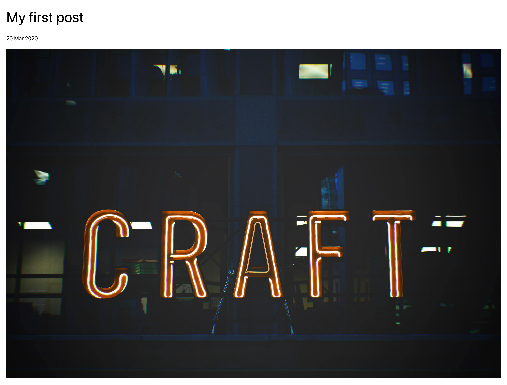
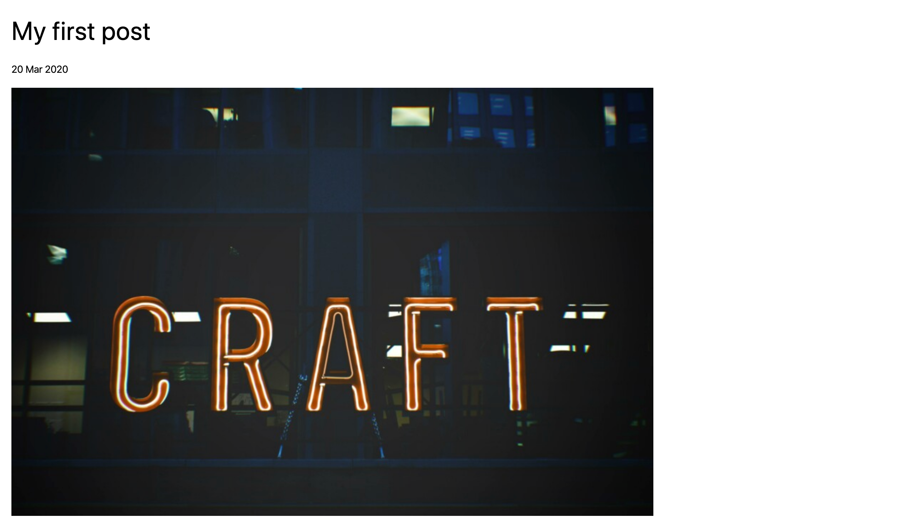
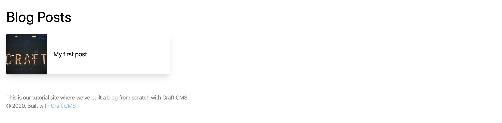
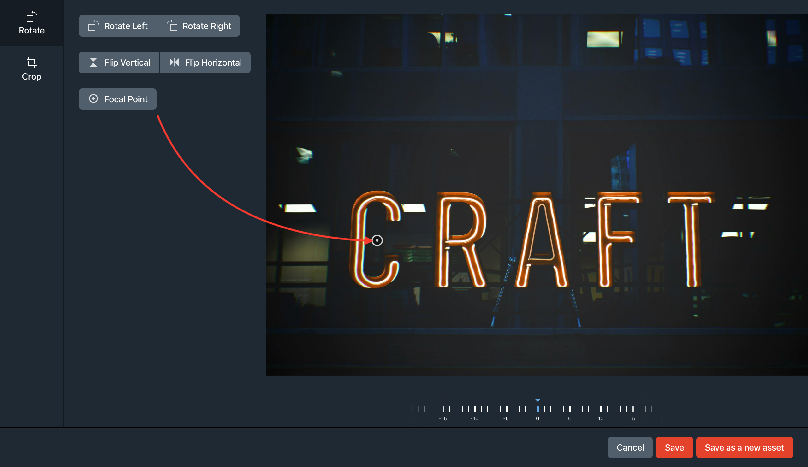
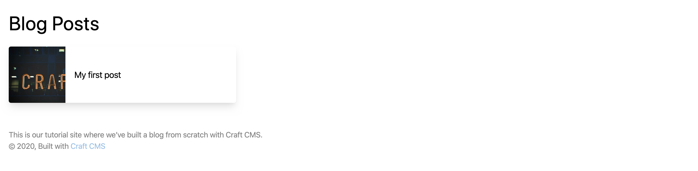
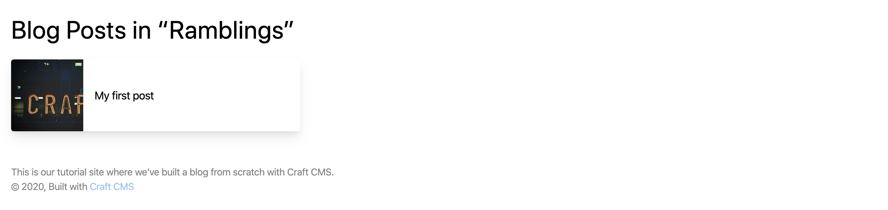
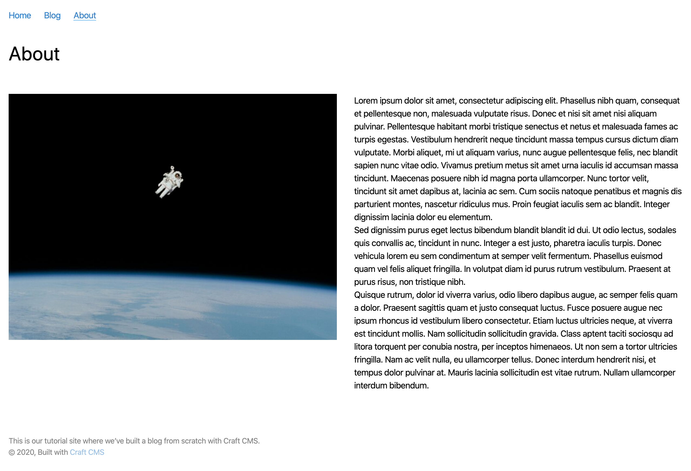

# Create templates

Let’s build some templates and start our Twig front end!

## Create a layout

Start by creating a layout template at `templates/_layout.twig`.

We want to follow [DRY methodology](https://en.wikipedia.org/wiki/Don%27t_repeat_yourself), which stands for Don’t Repeat Yourself. The idea is to write code once and re-use it as much as possible without duplicating things. That makes your site’s code easier to understand and maintain over time.

The layout is important for this because it will be the base from which our other templates _extend_.

The underscore (`_`) at the beginning of the filename, `_layout.twig`, means the template is private: unlike the quick example we started with, you _cannot_ view the template by visiting `http://tutorial.test/_layout`. We can use underscores when it makes sense—in this case it’s because the layout is only a shell and isn’t meant to appear on its own.

Copy this into the `templates/_layout.twig` file you created:

```twig
<!DOCTYPE html>
<html lang="{{ craft.app.language }}">
  <head>
    <meta charset="utf-8"/>
    <title>{{ siteName }}</title>
    <meta content="width=device-width, initial-scale=1.0" name="viewport">
    <link href="/styles.css" rel="stylesheet">
  </head>
  <body class="ltr">
    <div class="container mx-auto px-4">
      
      
    </div>
  </body>
</html>
```

This is barebones HTML that will be the foundation of every page on the site. HTML uses tags, or markup, as a structured way to organize and describe content. You may immediately recognize Craft’s `siteName` tag in this line:

```twig
<title>{{ siteName }}</title>
```

`title` is a standard HTML tag used to tell the browser how to label the window or tab for the page. Whatever’s wrapped in the `title` tag—which means whatever’s between the opening `<title>` and closing `</title>` will be displayed. You’ll recognize that `{{ siteName }}` we used above—this is a Twig tag Craft CMS provides for outputting our site name. This is how HTML and Twig work together in our templates.

Now download a copy of the example styles into `web/styles.css`: <https://raw.githubusercontent.com/craftcms/tutorial-project/master/web/styles.css>

This static stylesheet will offer some basic styling for our templates.

This base template sets the page’s language to match Craft’s and adds `meta` details that tell browsers how to interpret text and how the page fits into different browser windows.

A crucial part of the template is the `content` block:

```twig


```

Whenever you see `{{` `}}` or `` you know you’re looking at Twig tags. In this case, we’re establishing the beginning and end of a block named `content`. The `content` part could be anything we want, but here it implies that what’s inside will be page content. There’s _nothing_ inside, however, because the layout template provides a structure that other child templates will fill in.

## Create a detail page

Now that we have a layout template, let’s use it for our blog post detail pages.

Create `templates/blog/_entry.twig` and add the following to it:

```twig



  <h1 class="text-4xl text-black font-display my-4">I’m a blog post!</h1>

```

The first line _extends_ the layout template, meaning it will use that as a starting point and let us further customize or override whatever we need to. We’re now providing our own content, within the `content` block, to appear on the page.


Now that the blog section’s template is ready, you can visit the URL for a published post:

<BrowserShot url="http://tutorial.test/blog/my-first-post" :link="false" caption="">

</BrowserShot>

::: tip
Throughout these examples, some tags have `class` parameters with values like `text-4xl text-black font-display my-4`. These are TailwindCSS [utility classes](https://tailwindcss.com/docs/utility-first) that style elements on the page. You can ignore them or check out reference the [TailwindCSS documentation](https://tailwindcss.com/) if you want to explore customizing styles.
:::

That’s clearly not the title we should display on every page. For any detail page template, Craft CMS provides a special `entry` variable we can use to access the details of the relevant entry. Let’s display the `title` and `postDate` properties in the template:

```twig{4,6}



  <h1 class="text-4xl text-black font-display my-4">{{ entry.title }}</h1>

  <time class="text-sm block pb-4" datetime="{{ entry.postDate | date('Y-m-d') }}">{{ entry.postDate | date('d M Y') }}</time>

```

Now it’s looking better!

<BrowserShot url="http://tutorial.test/blog/my-first-post" :link="false" caption="">

</BrowserShot>

Notice how we’re using the [`|date` Twig filter](/3.x/dev/filters.md#date) to specify formats for the `entry.postDate` value. This is a typical example of using a filter to modify something in Twig; a value you want to modify or transform is followed by a pipe (`|`), the name of the filter, and sometimes settings specific to that filter. You can see all Craft’s available [filters](/3.x/dev/filters.md) to get a better idea of what you can do with them.

Let’s display the “Feature Image” next, using the `featureImage` handle we created with that custom field:

```twig{8-12}



  <h1 class="text-4xl text-black font-display my-4">{{ entry.title }}</h1>

  <time class="text-sm block pb-4" datetime="{{ entry.postDate | date('Y-m-d') }}">{{ entry.postDate | date('d M Y') }}</time>

  
    
      
    
  

```

This first uses an [`if` conditional statement](https://twig.symfony.com/doc/3.x/tags/if.html) to see whether the editor added an image in this field. The “Assets” field we used can have one or many images depending on how we configure it, so the statement uses the [`|length` Twig filter](/3.x/dev/filters.md#length) to count the number of items—where `0` will be `false` and anything else will be `true`.

If the statement is `true`, meaning we have at least one feature image, we’ll use `entry.featureImage.all()` to get the set and a `for` statement to loop through and display each item using the `image` variable. (We limited the field settings to allow only one image, but increasing that limit means _every_ image would be shown here!)

For each asset, we output a `img` HTML tag using `{{ image.url }}` to get the web-friendly URL for the image and `{{ image.title }}` as an `alt` tag value used for bots and screen readers.

We should now see the image after refreshing the page:

<BrowserShot url="http://tutorial.test/blog/my-first-post" :link="false" caption="">

</BrowserShot>

## Transform an asset

[Image Transforms](/3.x/image-transforms.md) let you specify the exact dimensions you need and have Craft CMS crop and size an image accordingly. Let’s specify a size for our “Feature Image”.

We’ll use Twig to create an object called `featureImage` with the settings we want, then pass those settings to `image.getUrl()` in place of `image.url`:

```twig{3-8,17}





  <h1 class="text-4xl text-black font-display my-4">{{ entry.title }}</h1>

  <time class="text-sm block pb-4" datetime="{{ entry.postDate | date('Y-m-d') }}">{{ entry.postDate | date('d M Y') }}</time>

  
    
      
    
  

```

You can now refresh the front end and see your transformed asset:

<BrowserShot url="http://tutorial.test/blog/my-first-post" :link="false" caption="Automatically-resized image, cropped at 900×600px.">

</BrowserShot>

## Display Matrix content

Let’s output the post content stored in that Matrix field.

Matrix content is stored in whatever blocks we’ve defined. To display that content, we’ll:

1. use another `for` loop to run through each block
2. use an `if` statement to handle output based on the block type

```twig{21-33}





  <h1 class="text-4xl text-black font-display my-4">{{ entry.title }}</h1>

  <time class="text-sm block pb-4" datetime="{{ entry.postDate | date('Y-m-d') }}">{{ entry.postDate | date('d M Y') }}</time>

  
    
      
    
  

  <div class="my-8">
    
      <div class="my-4">
        
          {{ block.text }}
        
          
            
          
        
      </div>
    
  </div>

```

The Matrix content will now be included on the page:

<BrowserShot url="http://tutorial.test/blog/my-first-post" :link="false" caption="Detail page with post content added." :max-height="600">

</BrowserShot>

## Use an include

The template’s getting longer, and we know we’ll be re-using the “Post Content” field again in the about page. Let’s tidy up a bit and make sure our Matrix code can be re-used.

To do this, we’ll move the new Twig above to its own smaller, re-usable template include.

Create `templates/_includes/post-blocks.twig` and copy that code to it:

```twig
<div class="my-8">
  
    <div class="my-4">
      
        {{ block.text }}
      
        
          
        
      
    </div>
  
</div>
```

We can now go back to `templates/blog/_entry.twig` and _embed_ that template instead:

```twig{21}





  <h1 class="text-4xl text-black font-display my-4">{{ entry.title }}</h1>

  <time class="text-sm block pb-4" datetime="{{ entry.postDate | date('Y-m-d') }}">{{ entry.postDate | date('d M Y') }}</time>

  
    
      
    
  

  

```

The `with { blocks: entry.postContent.all() } only` part means we’re passing the `entry.postContent.all()` value in a variable we’ve labeled `blocks`. That means one small update for `templates/_includes/post-blocks.twig`:

```twig{2}
<div class="my-8">
  
    <div class="my-4">
      
        {{ block.text }}
      
        
          
        
      
    </div>
  
</div>
```

Refreshing your front end shouldn’t change a thing, but the Twig behind the scenes is now a bit more DRY and ready to re-use.

## Add code comments

While we’re building, let’s add some comments so we can remember what we’ve done. Twig ignores anything wrapped with `{#` and `#}`, which is what we’ll use to leave human-friendly notes:

```twig{3,16,23}


{# create settings for image transform #}



  <h1 class="text-4xl text-black font-display my-4">{{ entry.title }}</h1>

  <time class="text-sm block pb-4" datetime="{{ entry.postDate | date('Y-m-d') }}">{{ entry.postDate | date('d M Y') }}</time>

  {# output transformed feature image(s) #}
  
    
      
    
  

  {# render Matrix blocks for the “Post Content” field, passed as `blocks` #}
  

```

## Display post categories

The last thing we need to do on the post detail template is output the post categories using the `postCategories` field handle:

```twig{26-35}


{# create settings for image transform #}



  <h1 class="text-4xl text-black font-display my-4">{{ entry.title }}</h1>

  <time class="text-sm block pb-4" datetime="{{ entry.postDate | date('Y-m-d') }}">{{ entry.postDate | date('d M Y') }}</time>

  {# output transformed feature image(s) #}
  
    
      
    
  

  {# render Matrix blocks for the “Post Content” field, passed as `blocks` #}
  

  {# display post categories #}
  
  <div class="border-t py-2 mb-6">
    
      <a href="{{ category.url }}" class="inline-block border rounded px-2 py-1 text-sm">
        {{- category.title -}}
      </a>
    
  </div>
  

```

Here we’re first checking whether there _are_ any categories, then outputting individual links. (Those links will be broken for now, but we’ll come back to that.)

The only new thing here are the hyphens in the Twig tag around `category.title`: `{{-` and `-}}`. Those are used for whitespace control, so in the final page instead of...

```html
<a href="(...)" class="inline-block border rounded px-2 py-1 text-sm">
  Category
</a>
```

...the empty space around the category title will be removed:

```html
<a href="(...)" class="inline-block border rounded px-2 py-1 text-sm"
  >Category</a
>
```

## Add a page footer with details from a global set

We used a global set to store a blurb to be displayed at the bottom of all the site’s pages. Since we want that to appear everywhere, let’s add it to `_layout.twig` along with a copyright line:

```twig{15-18}
<!DOCTYPE html>
<html lang="{{ craft.app.language }}">
  <head>
    <meta charset="utf-8"/>
    <title>{{ siteName }}</title>
    <meta content="width=device-width, initial-scale=1.0" name="viewport">
    <link href="/styles.css" rel="stylesheet">
  </head>
  <body class="ltr">
    <div class="container mx-auto px-4">
      
      
    </div>
    <footer class="container mx-auto p-4 text-sm">
      {{ siteInformation.siteDescription|markdown }}
      <p>&copy; {{ now | date('Y') }}, built with <a class="text-blue-600" href="https://craftcms.com">Craft CMS</a></p>
    </footer>
  </body>
</html>
```

The “Site Description” field is Plain Text without any formatting, and just for fun we can use Craft’s [`markdown` filter](/3.x/dev/filters.md#markdown) to output it in a paragaph tag (`<p></p>`) and support [markdown syntax](https://daringfireball.net/projects/markdown/).

## Add a listing page

We’ll display a listing of posts in two places: in the blog index and again on a category page where they’re limited to the selected category.

Let’s start with our landing page first.

Create `templates/blog/index.twig`. Any time you use `index.twig` or `index.html`, that will be the default template or page in a given folder. So when we visit `http://tutorial.test/blog/`, that folder’s `blog/index.twig` will be used for rendering the result. Add the following to that template:

```twig






  <h1 class="text-4xl text-black font-display my-4">Blog Posts</h1>

  

```

Our entry detail page came with an automatically-available `entry` variable, but here we’ve fetched all the entries in the `blog` section and put them in a variable called posts:

```twig

```

The technical term for what we’re doing is [querying entries](/3.x/entries.md#querying-entries). Once these content elements are stored in Craft CMS, there are lots of options and parameters you can use in these queries to get exactly what you need wherever you need it.

Now create `templates/_includes/listing.twig`. We’ll use this for listing blog entries here and re-use it again shortly:

```twig
<div class="post-list my-10 flex">

  <a href="{{ post.url }}" class="flex shadow-lg rounded items-center justify-center overflow-hidden">
    
      
      <div class="w-1/4">
        
      </div>
    
    <span class="title w-3/4 p-4">{{ post.title }}</span>
  </a>

</div>
```

The image transform is similar to what we did earlier, except we used `.one()` instead of `.all()` since we only ever want just one image. This also passes an object with `width` and `height` directly to `image.getUrl()` instead of first assigning that object to a variable.

Here’s what the result looks like:

<BrowserShot url="http://tutorial.test/blog/" :link="false" caption="">

</BrowserShot>

In this template we’ve chosen to display a square thumbnail of the “Feature Image” along with the post title. Some of these images may crop weirdly into squares, but we can use focal points to have some control over how they’re cropped!

Transformed images will automatically be cropped from the center, but a content editor may also adjust this by setting a [focal point](/3.x/assets.md#focal-points) in the control panel:

1. In the control panel, navigate to the image either using the “Assets” menu item or “Entries” and choosing the relevant blog post.
2. Double-click the asset, then choose “Edit” from the top-right corner of the image preview. (This will open the editor.)
3. Choose the “Focal Point” tool, dragging the focal point bullseye icon to an important area of the image.
4. Choose “Save”.



Back on the front end, refresh the listing page and you’ll see the re-cropped thumbnail:

<BrowserShot url="http://tutorial.test/blog/" :link="false" caption="Listing page with adjusted thumbnail focal point.">

</BrowserShot>

## Create a category listing

Create `templates/blog/_category.twig` and add the following:

```twig






  <h1 class="text-4xl text-black font-display my-4">
    Blog Posts in “{{ category.title }}”
  </h1>

  

```

In the same way that entry detail pages came automatically loaded with an `entry` variable, category pages come with a special `category` variable. We’re using that here to limit only to posts in the selected category using the [`relatedTo` query parameter](/3.x/entries.md#relatedto):

```twig

```

Our post category listings, which you can navigate to by choosing any of a blog post’s tags, should be working now:

<BrowserShot url="http://tutorial.test/blog/category/ramblings" :link="false" caption="Listing page for posts in the `Ramblings` category.">

</BrowserShot>

## Add navigation

Getting around is pretty awkward right now. Let’s add some navigation.

Create `templates/_includes/nav.twig` and add the following to it:

```twig
<nav class="container mx-auto py-4 px-4" role="navigation" aria-label="Main">
  
  <ul class="flex">
    <li class="mr-6">
      <a class="text-blue-600 {{ firstSegment == '' ? 'border-b border-blue-400' }}" href="{{ siteUrl }}">Home</a>
    </li>
    <li class="mr-6">
      <a class="text-blue-600 {{ firstSegment == 'blog' ? 'border-b border-blue-400' }}" href="{{ url('blog') }}">Blog</a>
    </li>
    <li class="mr-6">
      <a class="text-blue-600 {{ firstSegment == 'about' ? 'border-b border-blue-400' }}" href="{{ url('about') }}">About</a>
    </li>
  </ul>
</nav>
```

Now let’s include that in `templates/_layout.twig`:

```twig{11}
<!DOCTYPE html>
<html lang="{{ craft.app.language }}">
  <head>
    <meta charset="utf-8"/>
    <title>{{ siteName }}</title>
    <meta content="width=device-width, initial-scale=1.0" name="viewport">
    <link href="/styles.css" rel="stylesheet">
  </head>
  <body class="ltr">
    
    <div class="container mx-auto px-4">
      
      
    </div>
    <footer class="container mx-auto mt-8 p-4 text-sm opacity-50">
      {{ siteInformation.siteDescription|markdown }}
      <p>&copy; {{ now | date('Y') }}, built with <a class="text-blue-600" href="https://craftcms.com">Craft CMS</a></p>
    </footer>
  </body>
</html>
```

<BrowserShot url="http://tutorial.test/blog" :link="false" caption="Blog listing with navigation." :max-height="600">

</BrowserShot>

## Add a template for a single

Next, let’s set up the about page. We set it up as a single, using the template `_singles/about`.

Create `template/_singles/about.twig` and add the following to it:

```twig



  <h1 class="text-4xl text-black font-display my-4">{{ entry.title }}</h1>

  <div class="flex -mx-4">
    <div class="w-1/2 px-4">
      
        
          
        
      
    </div>
    <div class="w-1/2 px-4">
      
    </div>
  </div>

```

We’re using some CSS utility classes to create a two-column layout here, but otherwise you’ll recognize all the pieces from previous examples!

<BrowserShot url="http://tutorial.test/about" :link="false" caption="The About page.">

</BrowserShot>
