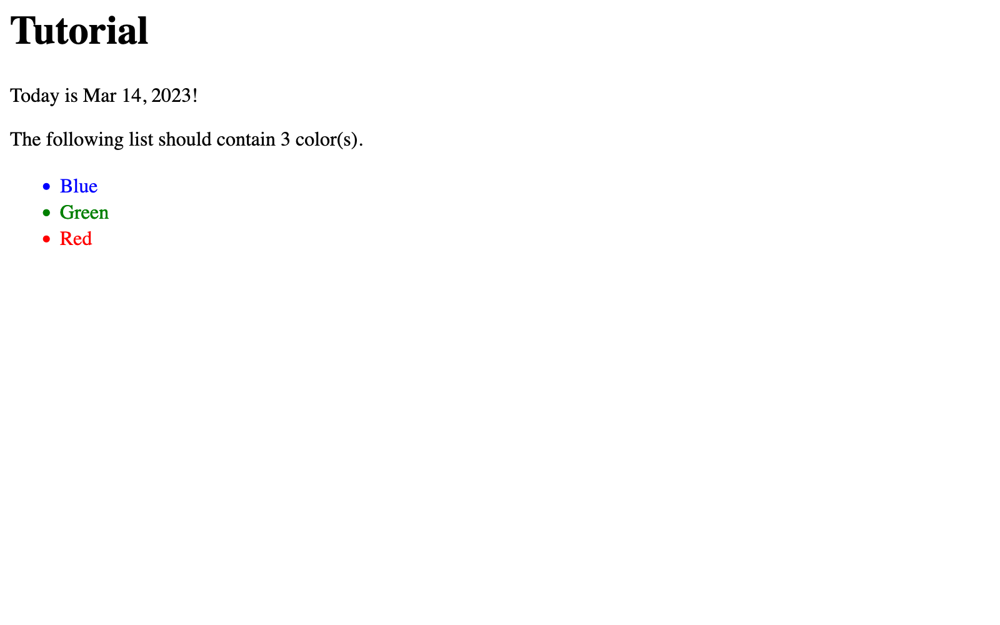

# Twig Basics

[Twig](https://twig.symfony.com/doc/3.x/) templates are plain text files that use special syntax to control Craft’s HTML output. When rendered, portions of a Twig file are inserted, replaced, omitted, or repeated, based on special instructions sprinkled throughout the HTML.

::: tip
If you’ve used Twig in other projects, that knowledge will be useful here. Craft adds a number of features to Twig, but the core principles (and syntax) are exactly the same.
:::

## Why Twig?

Our goal in this section is to combine static HTML with dynamic content. Twig is a simple—yet powerful—language that allows us to translate the data we’ve defined in Craft into a blob of HTML that can then be sent back to a browser and displayed for a user.

The beauty of a template language is that a single template can be rendered many times with different data. Our main task will be to create a Twig template for our blog posts that demonstrates a combination of Craft and Twig concepts, as well as the benefits of reusability.

::: tip
Any HTML document is also a valid Twig file, so if you have experience writing HTML _without_ a template language, you’re in a great position to start building with Craft.

If not, check out the [Getting Started with HTML](https://developer.mozilla.org/en-US/docs/Learn/HTML/Introduction_to_HTML/Getting_started) article on _Mozilla Developer Network_.
:::

## Your First Template

In VS Code, you should have `templates/index.twig` open. Let’s clear out that file (press <kbd>Command/Control + A</kbd>, then <kbd>Backspace</kbd>, or use the **Selection** menu) and replace it with this:

```twig
Hello from {{ siteName }}!
```

Back in your browser, refresh the welcome page:

<BrowserShot url="https://tutorial.ddev.site/" :link="false">

</BrowserShot>

## Syntax highlighting

So far, `index.twig` has been an impenetrable wall of white text.

VS Code has a built-in extension marketplace for installing add-ons that improve the experience of working with different languages or technologies. There’s a whole universe of customization available, but for now, we only need one: **Twig Language 2** by _mblode_.


Open the **Extensions** panel in VS Code, search for “Twig Language 2,” and choose **Install**.

::: tip
You may need to restart or “reload” VS Code to give the extension a chance to properly initialize.
:::

Our simple `index.twig` file may not look much different, but once we drop some more code into it, you’ll start to appreciate the value of syntax highlighting!

## Twig Fundamentals

There are only a few things you need to know up-front about Twig’s syntax. Everything that follows can be copy-and-pasted into your project, but being able to pick out important bits and pieces will allow you to start tinkering on-the-fly.

<See path="/4.x/dev/twig-primer.md" description="Curious about all of Twig’s features? Check out our templating guide in the main documentation." />

Replace the contents of `templates/index.twig` with this:

```twig
{# This is a comment in Twig! It won’t appear in the HTML output. #}

{# Here’s some text, dynamically inserted into an HTML tag: #}
<h1>{{ siteName }}</h1>

{# What about a dynamic value? #}
<p>Today is {{ now | date }}!</p>

{# This is a variable, and it’s being set to a list (or “array”) of colors: #}


{# How many colors are in the list? #}
<p>The following list contains {{ colors | length }} color(s).</p>

{# This is a loop that outputs those items, sorted alphabetically: #}
<ul>
  
    {# Let’s stylize each item using some inline CSS: #}
    <li style="color: {{ color }}">
      {# The color is capitalized for display: #}
      {{ color | title }}
    </li>
  
</ul>
```

For now, this code can serve as a quick-reference guide for Twig syntax. Read down through the template, and see if you can guess roughly what it’ll look like!

<BrowserShot url="https://tutorial.ddev.site/" :link="false">

</BrowserShot>

### Glossary

Let’s take a closer look at some of the features in the template, above. You don’t need to memorize all this; feel free to skip to the next page if you’d prefer to learn about the concepts in-context!

<See path="/4.x/dev/twig-primer.md" />

#### Comments

A Twig comment is surrounded by curly-braces and hashes:

```twig
{# Watch out! #}
```

Any text inside a comment is hidden when the template is rendered, meaning they’re a great place to stash notes to yourself. Most VS Code themes use a muted color for comments so that you can focus on the surrounding code.

#### Output

Pairs of curly braces output the value of an expression:

```twig
{{ siteName }}
```

“Expressions” come in many forms, but the simplest is a _variable_. Craft provides a number of global variables (including `siteName`), and makes others available, contextually.

<See path="/4.x/dev/global-variables.md" />

#### Control

Control tags let you manipulate data or alter the path through your templates. In the example, we saw two uses of this:

- `set`: Declares a new variable, which can be used elsewhere.
- `for` / `endfor`: Repeats the enclosed template for each item in a list.

The content of our `for` loop outputs an HTML “list item” tag, interpolating the color as a CSS property and as text—but each time through, the temporary `color` variable is set to the next color in our `colors` array. The first iteration of that loop is equivalent to something like this…

```twig


<li style="color: {{ color }}">{{ color }}</li>
```

…but rather than having to know how many times something needs to loop (and then write out the code for each one), we’re able to generalize the behavior.

<See path="/4.x/dev/tags.md" description="Explore other tags available in Twig." />

#### Variables

Any time you reference a value by name (like `now` or `color`), you’re using a **variable**. Variables can contain a ton of different kinds of data, like text, numbers, or dates—or arrays and objects that are collections of other values. There are some rules about how, when, and where you can use each type of data, but we’ll takes those in stride.

#### Filters

Eventually, you’ll encounter some data that you need to transform a bit before it gets output. We use a pipe (`|`) character to signify a value getting passed through a **filter**. Take this line from our example:

```twig
Today is {{ now | date }}!
```

::: tip
This gets a little heady, but bear with us
:::

`now` is a global variable containing a PHP `DateTime` object set to—you guessed it—the current date and time, in the system’s timezone. Dates and times don’t really have a concrete textual representation—in addition to not knowing which parts of a date are important for users, the specifics of formatting can differ nationally, culturally, linguistically, or just stylistically!

If we were to output the `now` variable as-is, Craft would throw an error; for this reason, Craft provides the `date` filter to convert abstract `DateTime` objects into a human-readable values. By default, it uses the site’s language to determine a localized format for the date’s month, day, and year.

Try updating that line to show the current _time_, then refresh your browser:

```twig
It’s currently {{ now | time }}.
```

Whenever this page is loaded, Craft evaluates your template and substitutes these processed values. There are dozens more filters available to you, but we won’t be able to cover them all in this tutorial.

<See path="/4.x/dev/filters.md" description="View a list of filters available in Craft’s Twig environment." />

::: tip
Twig also supports **functions**, which have a lot in common with filters. The main difference is that functions don’t always take or manipulate input; one way of looking at the relationship between functions and filters is that filters _always_ have at least one argument (the value before the `|`).

Functions are often responsible for fetching or generating a value (like `getenv('ENV_VAR_NAME')`), whereas filters are used to treat an incoming value (like `entry.textField | markdown`).
:::

#### Operators

Our example template only includes one **operator** (the filter or “pipe” symbol), but Twig supports all kinds [math and logic expressions](https://twig.symfony.com/doc/3.x/templates.html#expressions).

Now that we have a bit of context for Twig’s role in our project, let’s create the templates required to display our blog.
