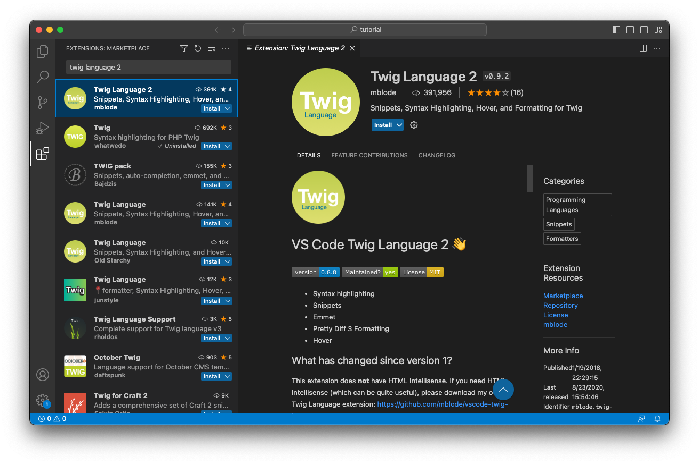

# Working with Twig

[Twig](https://twig.symfony.com/doc/3.x/templates.html) templates are plain text files that use special syntax to render Craft CMS content for the web browser.

::: tip
If you’ve used Twig in other projects that’ll be useful here. Craft adds its own layer of functionality to standard Twig.
:::

## Why Twig?

Creating Twig templates isn’t all that different from working with HTML, CSS, or JavaScript. In fact, you can write an entire Twig template without even using Twig!

If you’ve never written any part of a website before that’s okay, but it might help to familiarize yourself with fundamental [HTML, CSS, and JavaScript](https://developer.mozilla.org/en-US/docs/Web/Guide/Introduction_to_Web_development).

The idea is that you build whatever normal parts you need for a web page and Twig provides super powers for rendering dynamic content wherever you need it.

In technical terms, Twig gets compiled behind the scenes. This means you can use templates however you’d like without having to worry about performance.

Its syntax is clean and easy to learn, and it doesn’t allow PHP tags that often lead to messy or confusing templates. Twig is also a popular templating language beyond Craft CMS—so even though Craft adds unique functionality, learning Twig can be useful for other projects.

::: tip
Starting with your own static project? You can drag your existing `.html` files to the `templates/` directory and have a great starting point for adding bits of Twig.
:::

## Where front end files live

Our work ahead will focus on the `templates/` and `web/` directories, and you can copy and paste sample code as we go without needing anything else.

::: tip
The sample code is here if you want to grab everything before we get started: [github.com/craftcms/tutorial-project](https://github.com/craftcms/tutorial-project)
:::

Anything that uses dynamic content should live in your `templates/` directory.

Static HTML, CSS, JavaScript and images—including the cat photo we used earlier—can (and should) all go in your `web/` directory.

How you organize either directory is up to you!

We’ve chosen to use `web/assets/` for our Craft volumes we’ll manage in the control panel, so it’s best to keep non-user-editable files out of that directory just for clarity.

## Template files

A template file is plain text you can work with in your code editor.

Each time we add a template, that means we’ll create a new text file in the `templates/` directory, and its filename will end in `.twig` or `.html`. The file extension doesn’t matter in our filesystem, but you may remember we _didn’t_ include a file extension configuring our Craft CMS sections earlier.

When you provide Craft CMS with a value of `blog/_entry`, for example, it will automatically look for `templates/blog/_entry.twig` and `templates/blog/_entry.html`.

::: tip
There’s no “correct” file extension for templates, but `.twig` will be better for automatic syntax highlighting in editors like VS Code.
:::

## Mini demo: Twig vs. HTML

For a quick illustration of what we’ll be doing, create two files: 

1. `templates/twig-hello.twig`
2. `web/html-hello.html`

Next, add the exact same contents to each one:

```twig
Hi! This site’s name is {{ siteName }}.
```

Without any setup in Craft CMS, you can go directly to `https://tutorial.nitro/twig-hello` and `https://tutorial.nitro/html-hello.html` to see each one in your browser. Try it!

The Twig version gets parsed and displays the name of your site, with a clean URL that doesn’t require a file extension.

The static HTML shows the placeholder Twig variable because it’s not parsed, and it requires `.html` in the filename because it maps directly to a static file.

This is the difference between a Twig template and static HTML. We’ll create a series of Twig templates to display our content expanding upon this concept.

## Syntax highlighting

Let’s take a moment and configure our code editor to make life easier.

VS Code has a built-in extension marketplace for installing add-ons that improve working with different kinds of code. There’s a whole universe of customization, but the following extensions will be useful here:

- **Twig**
- **Twig Language 2**
- **Tailwind CSS IntelliSense**

Open the **Extensions** panel in VS Code, search for each one, and choose **Install**.

You’ll need to restart the app so they can all take effect.



Once the extensions are installed, your Twig templates will get helpful syntax highlighting to make code more readable and auto-complete tips. Here’s a before and after comparison:


::: tip
You’ll be able to copy and paste everything in the section that follows, but we have [an introduction to templating](/3.x/dev/twig-primer.md) if you’d like to learn how to work with it!
:::
