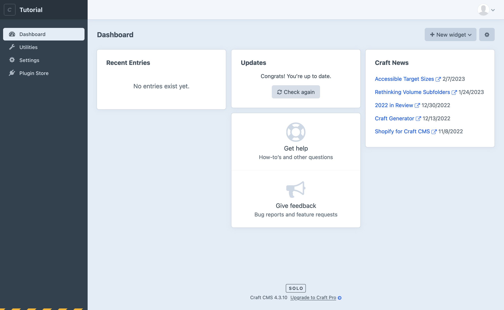
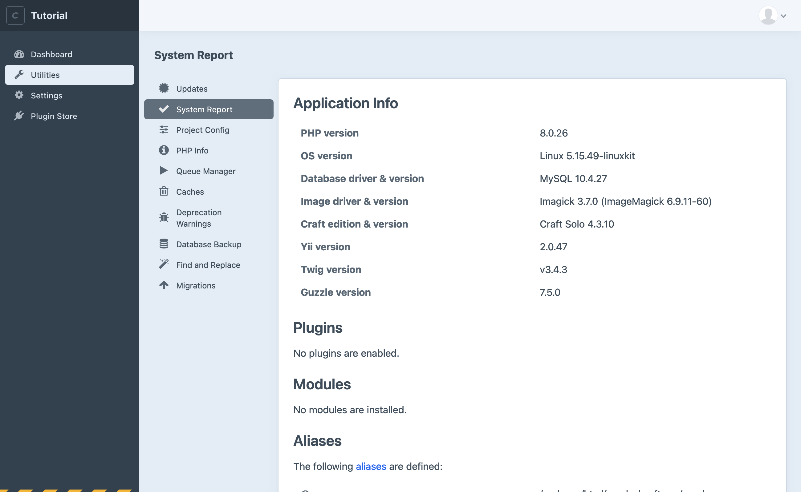
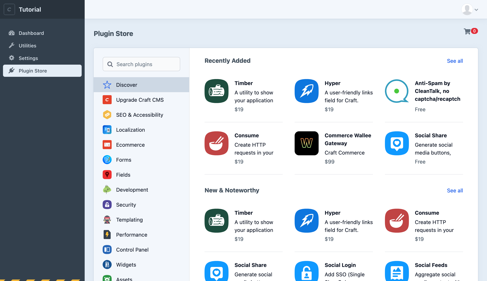

# Control panel tour

The control panel may seem a bit empty—that’s a feature, not bug! Craft doesn’t tell you how to structure your content, it provides a blank slate you can use to build however you’d like.

## Dashboard

<BrowserShot url="https://tutorial.nitro/admin/dashboard" :link="false" caption="The control panel without any content.">

</BrowserShot>

The place you landed is the Dashboard, which you can customize with various widgets. By default, we’ll see the Recent Entries we haven’t created yet, recent Craft News, Support and Feedback options, and a notice about whether any software updates are available.

In the upper right corner you can choose the profile circle to edit your account details or log out.

At the bottom, you’ll see your Craft edition (Solo) and current version number. If you’re the explore-ahead type, you can click that edition badge to switch to a trial of Craft Pro. It doesn’t expire and it won’t hurt anything, but that’s not what we’re doing right now.

To the left, then, is the sidebar navigation. (You may have to use the hamburger icon to expand the navigation if you’re working with a narrow-ish browser window.) Choose **Utilities**.

## Utilities

<BrowserShot url="https://tutorial.nitro/admin/utilities/system-report" :link="false" caption="The System Report utility lists important details about your installation.">

</BrowserShot>

You probably won’t need to visit Utilities too often, but it has some helpful tools.

By default you’ll land on the System Report. These are key details about your Craft install, and while we’re here it’s a good idea to make sure that each of the items under “Requirements” has a green check mark next to it:

<BrowserShot url="https://tutorial.nitro/admin/utilities/system-report" :link="false" caption="Installed with flying colors.">

</BrowserShot>

If any line does not have a green check mark, choose the “i” icon to see more information and whether it’s something you’re able to fix.

We won’t be using these utilities in this tutorial, but it might be good to know what they do:

- **Updates** will list software updates that are available for Craft CMS and any installed plugins.
- **PHP Info** lists exhaustive details about your environment’s PHP configuration that can be useful for troubleshooting.
- The **Queue Manager** lets you peek under the hood of the system Craft uses to run batches of small jobs. Things will show up and disappear themselves as jobs are queued up and completed.
- **Clear Caches** lets you select and clear temporary stored data Craft uses to stay fast.
- **Deprecation Warnings** will detail any outdated code you might be using, where to find it, and usually what to replace it with.
- **Database Backup** is for creating a database backup and optionally downloading a copy.
- **Find and Replace** is a tool you can use to find and replace text throughout your database.
- **Migrations** will list and run sets of instructions you write for programmatically changing stuff.

## Plugin Store

Craft’s plugin store offers free and paid plugins that add functionality to your Craft CMS website.

<BrowserShot url="https://tutorial.nitro/admin/plugin-store" :link="false" caption="The Craft CMS Plugin Store.">

</BrowserShot>
