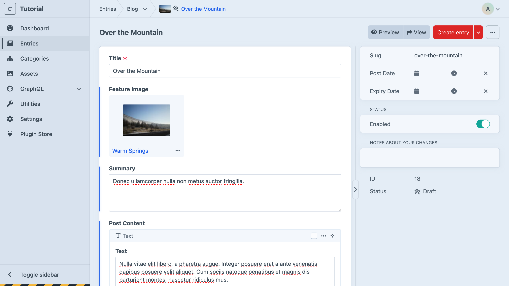
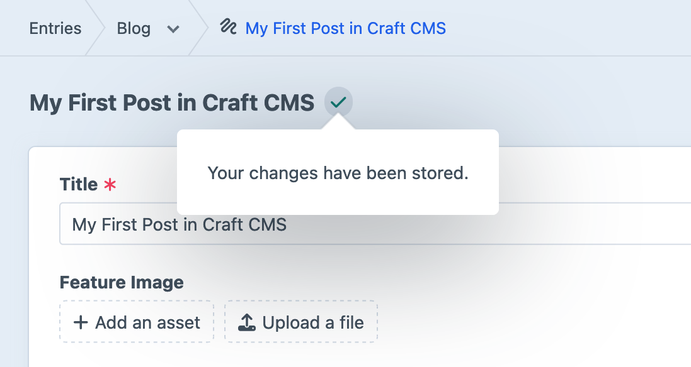
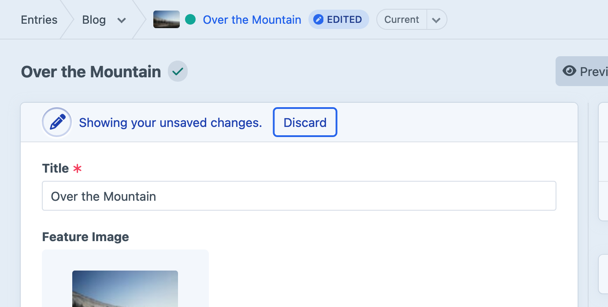
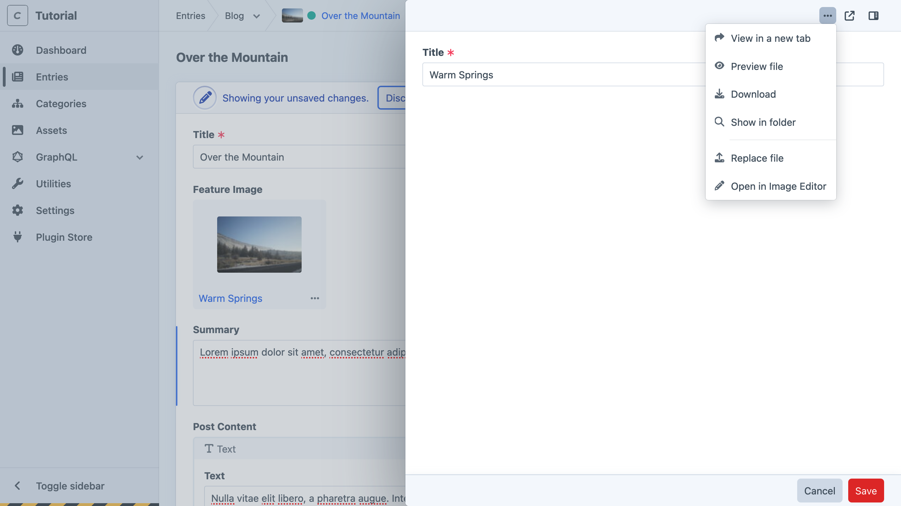
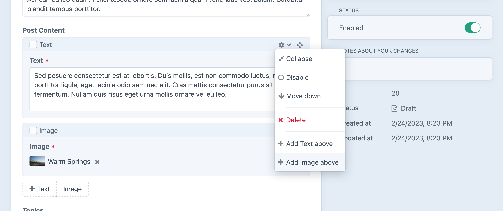
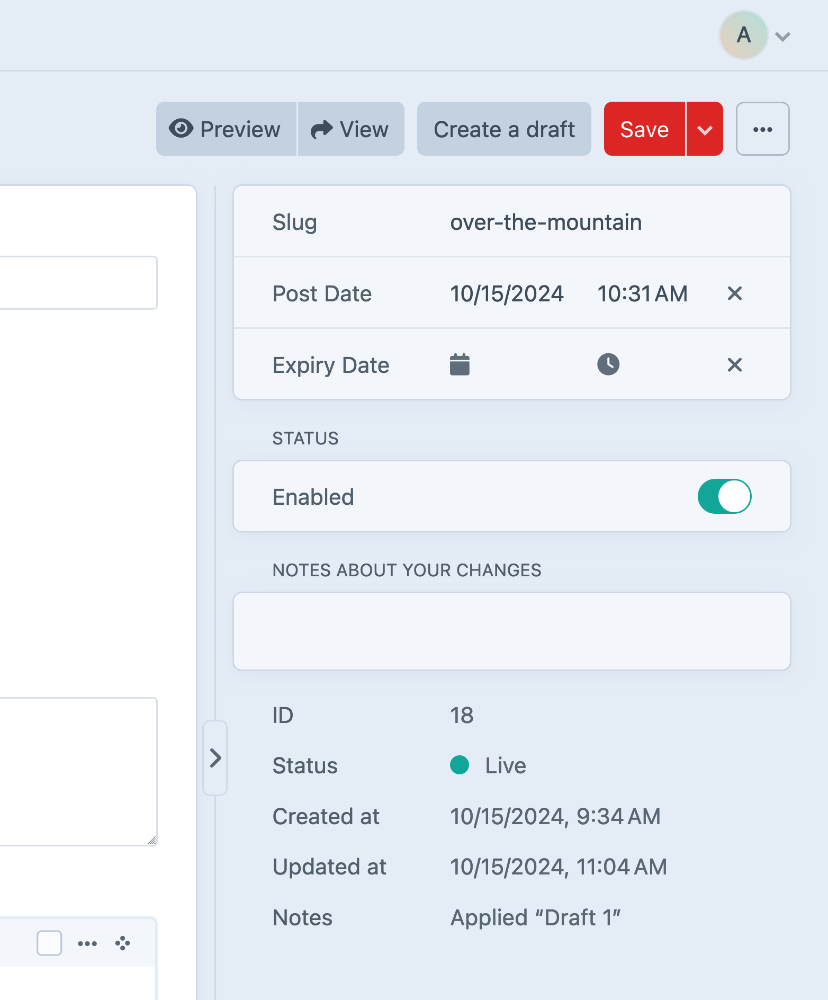
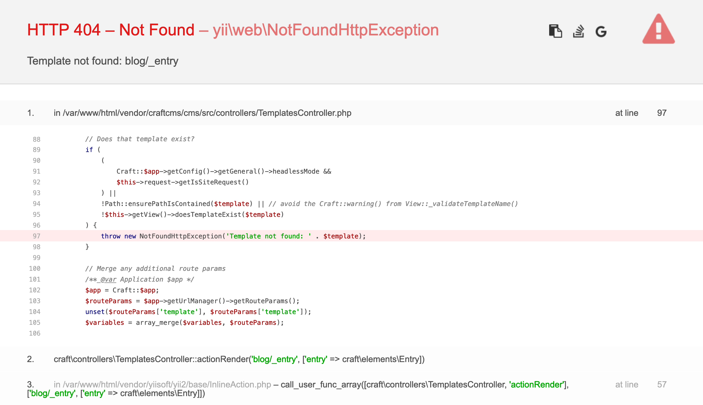

# Creating + Editing Entries

Our blog is starting to take shape! Let’s pause for a moment and look at the editing tools we’ve set up, from the perspective of a content author.

## Add a Blog Post

If you haven’t already, navigate to **Entries** and click **+ New entry** to create your first post. Here’s what it’ll look like with a bit of content added:

<BrowserShot url="https://tutorial.ddev.site/admin/entries/blog/2?draftId=1&fresh=1" :link="false" caption="A complete blog post, ready to be saved.">

</BrowserShot>

## Explore Editing Features

Working with content in Craft is usually pretty intuitive—after all, _you_ just designed the authoring experience! Here are a few things to look out for, as you get started:

### Auto-saving

From the moment you arrive on an edit screen, Craft begins autosaving your changes as a _provisional draft_. You always get to decide when those changes are applied, though.

Edits on an already-published entry automatically start a new _draft_, and you can always see the save status and even leave notes in the versions menu. This menu will also let you see previous drafts and versions, which can be handy:

If you would like to turn your edits into a _draft_ so other users can review them, click **Create draft** instead of **Save**.

### Assets

Assets can be attached or uploaded in a variety of ways:

1. From a fresh entry page, click the **+ Add an Asset** button, then **Upload Files** in the modal;
1. Drag a file from your computer onto the field;
1. Visit the **Assets** screen of the control panel and click **Upload Files**;

This last method is a great way to seed your project with an asset library.

### Slideouts

Double-click any attached element (like the asset <Poi label="A" target="editAsset" id="source" />  in our **Featured Image** field) to edit it in a _slideout_. Here, we’ve taken the opportunity to clean up the uploaded image’s **Title** <Poi label="B" target="editAsset" id="title" />:

<BrowserShot
    url="https://tutorial.ddev.site/admin/entries/blog/2?draftId=1&fresh=1"
    id="editAsset"
    :poi="{
        source: [31, 42, 'A'],
        title: [65, 14, 'B'],
        sidebar: [96.3, 9, 'C'],
    }"
    :link="false"
    caption="Editing an asset in a slideout.">

</BrowserShot>

Click the sidebar button <Poi label="C" target="editAsset" id="sidebar" /> to view and edit additional details (like the asset’s filename), or click **Save** to save your changes and close the slideout.

::: warning
Edits made in this way affect the element anywhere else it’s used. For example: if you also attached the asset to a block in the **Post Content** field with the intention of outputting its title as a caption or credit in _both_ places it’s used, updating its title in _either_ place (or via the top-level **Assets** section of the control panel) affects _all_ instances.
:::

### Matrix

You can grab the handle <Icon kind="move" /> in the upper-right corner of any matrix block to re-order them. Each block has a <Icon kind="settings" /> menu just to the left of its handle containing options to move, delete, or disable the block, as well as insert new blocks between existing ones:

### Publishing

Craft will generate slugs based on the entry’s title. Based on the _Blog_ section’s **URI Format** (`blog/{slug}`), the slug ends up as part of the entry’s public URL. The slug can be edited at the top of the sidebar

You can set **Post Date** to a future date/time to have it appear then, and optionally add an **Expiry Date** to have it disappear later. You can always flip _Enabled_ off and know the post will be hidden publicly, regardless of other settings.

### Previewing

Choosing **View** from the header opens the entry in a new tab—even if it isn’t enabled. In this case, Craft generates get a private, temporary—but sharable—URL.

If you were to click this button right now, you’d get something that looks like this:

<BrowserShot url="https://tutorial.ddev.site/blog/my-trip-to-bend" :link="false">

</BrowserShot>

This looks scarier than it is. In fact, it tells us _exactly_ what the problem is: we haven’t created the template our blog posts are expecting. Let’s fix this.
