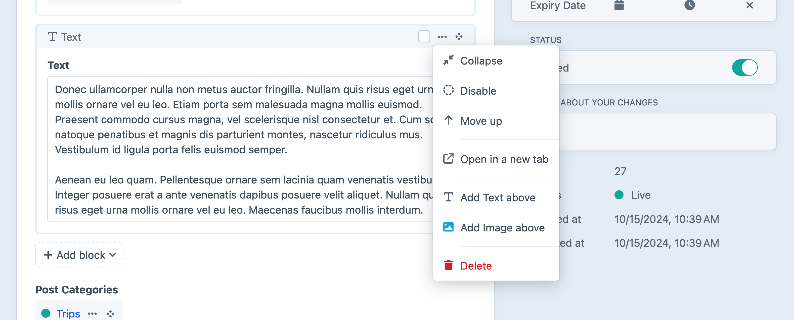

# Authoring Content

Our blog is starting to take shape! Let’s pause for a moment and look at the editing tools we’ve set up, from the perspective of a content author.

## Add a Blog Post

If you haven’t already, navigate to **Entries** and click **+ New entry** to create your first post. Here’s what it’ll look like with a bit of content added:

<BrowserShot
    url="https://tutorial.ddev.site/admin/entries/blog/2?draftId=1&fresh=1"
    :link="false"
    caption="A blog post, populated with content, ready to be saved.">

</BrowserShot>

## Explore Editing Features

Working with content in Craft is usually pretty intuitive—after all, _you_ just designed the authoring experience! Here are a few things to look out for, as you get started:

### Auto-saving

As soon as you arrive on an edit screen (for new entries) or make any kind of edit (to an existing entry), Craft creates a _provisional draft_ and begins autosaving your changes. When you’re ready to apply those changes, click **Save**.

If you would like to turn your edits into a _draft_ so other users can review them, click **Create draft** instead of **Save**. You can go back to editing the live entry via the **Revisions** menu in the breadcrumbs; whenever you save changes to a _live_ entry, Craft will merge them back into any drafts the next time they’re accessed via the control panel.

Provisional drafts are tied to your user, and any entries you’ve edited (but not saved or turned into a proper draft) will display an _Edited_ chip, wherever it’s visible in the control panel.

### Assets

Assets can be attached or uploaded in a variety of ways:

1. From an entry page, click the **+ Add an Asset** button, then **Upload Files** in the modal;
1. Drag a file from a folder on your computer into the browser and drop it on the field;
1. Visit the **Assets** screen of the control panel and click **Upload Files**;

This last method is a great way to seed your project with an asset library.

### Categories

Our _Post Categories_ field is backed by categories, which are managed similarly to entries and assets—this is because they are both types of _elements_.

Categories are attached by clicking **+ Add a category**, then selecting an existing category (or clicking **New Topics category**) in the modal.

### Slideouts

Double-click any attached element (like the asset <Poi label="A" target="editAsset" id="source" />  in our **Featured Image** field, or the category in our **Topics** field) to edit it in a _slideout_. Here, we’ve taken the opportunity to clean up the uploaded image’s **Title** <Poi label="B" target="editAsset" id="title" />:

<BrowserShot
    url="https://tutorial.ddev.site/admin/entries/blog/2?draftId=1&fresh=1"
    id="editAsset"
    :poi="{
        source: [31, 42, 'A'],
        title: [65, 14, 'B'],
        sidebar: [96.3, 9, 'C'],
    }"
    :link="false"
    caption="Editing an asset in a slideout.">

</BrowserShot>

Click the sidebar button <Poi label="C" target="editAsset" id="sidebar" /> to view and edit additional details (like the asset’s filename), or click **Save** to save your changes and close the slideout.

::: warning
Edits made in this way affect the element anywhere else it’s used. For example: if you also attached the asset to a block in the **Post Content** field with the intention of outputting its title as a caption or credit in _both_ places it’s used, updating its title in _either_ place (or via the top-level **Assets** section of the control panel) affects _all_ instances.
:::

<Block label="Images + Accessibility">

Craft’s control panel is routinely audited for accessibility against WCAG 2.2 (general web accessibility guidelines) and ATAG 2.0 (specific to content authoring tools). To help your editors (and users!), add the native **Alternative Text** field layout element to all your asset volumes.

We’ll take another look at alternative text as we begin using images in templates.

</Block>

### Matrix

You can grab the handle <Icon kind="move" /> in the upper-right corner of any nested entry to re-order them. Each nested entry also as an action menu <Icon kind="ellipses" /> (just to the left of its handle) containing options to move, delete, or disable the block, as well as insert new entries between existing ones:

### Publishing

For new entries, Craft will generate slugs based on the entry’s title. Our _Blog_ section’s **URI Format** (`blog/{slug}`) incorporates that slug, meaning it will appear as part of the entry’s public URL. If you wish to edit the slug manually, it appears at the top of the sidebar.

You can set an entry’s **Post Date** to be in the future to prevent it from being available on the front-end, and optionally add an **Expiry Date** to have it disappear, later. You can always turn off the **Enabled** switch to be certain the post will be hidden publicly, regardless of other settings.

### Previewing

Choosing **View** from the header opens the entry in a new tab—even if it isn’t enabled. In this case, Craft generates get a private, temporary (but sharable) URL.

If you were to click this button right now, you’d get something that looks like this:

<BrowserShot url="https://tutorial.ddev.site/blog/over-the-mountain" :link="false">

</BrowserShot>

This looks scarier than it is! In fact, it tells us _exactly_ what the problem is: we haven’t created the template that our blog post entries are expecting to exist. Let’s fix this.
