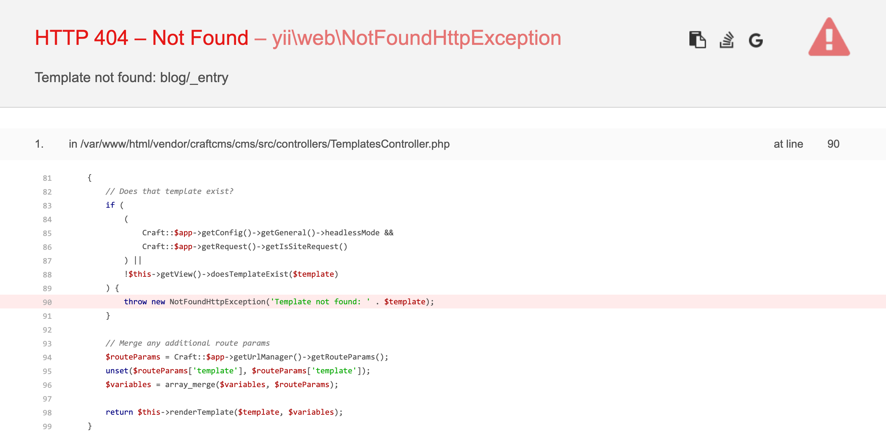

# Edit entries

Now that we’ve set up sections and fields, we can focus on editing content.

## Add a blog entry

Navigate to **Entries** and create a new blog entry. Fill in each field.

<BrowserShot url="https://tutorial.nitro/admin/entries/blog/9?draftId=7&fresh=1" :link="false" caption="A complete new blog post ready to be saved.">

</BrowserShot>

## Check out some editing features

While adding content should be intuitive, there are a few things you might want to know about:

### Edits are automatically saved while you work.

Craft saves your work as you go, but you always decide when to _publish_. Edits on an already-published entry automatically start a new draft, and you can always see the save status and even leave notes in the versions menu. This menu will also let you see previous drafts and versions, which can be handy:

### Double-click a related asset or category to edit it in place.

Here, the default Title has been cleaned up so it’s more presentable:

When you do this, you’re editing that asset or category so any changes will carry over if you re-use it somewhere else. (Navigate to **Assets** and observe the update there as well, for example.)

### Matrix is pretty cool.

You can grab the handles next to Matrix blocks to re-order them, and each block has a menu just to the left of that handle you can use to collapse, disable or delete the block. You can also use this as a convenient place to insert new blocks:

### You can fine-tune details for how and when your post is displayed.

Craft will set a slug for you by default, and it’ll be used in the post URL once published. You can set **Post Date** to a future date/time to have it appear then, and optionally add an **Expiry Date** to have it disappear later. You can always flip _Enabled_ off and know the post will be hidden publicly, regardless of other settings.

### You can share drafts privately.

Choosing **Share** at the top of the entry will always give you a URL for viewing the content you’re looking at. If it’s unpublished content, the URL will include an `x-craft-preview` token that can be used for a limited time [determined by your settings](/3.x/config/config-settings.md#defaulttokenduration).

## Add about content

Navigate to **Entries**, select **Singles**, and choose **About**.

You’ll notice this is similar to editing a blog post entry, except that the slug is fixed and there are no post or expiry date fields. This is because the single isn’t one post in a series, but a single post meant to live at a specific URL.

Go ahead and add some content and publish it when you’re ready!

## Linking to pages

Once you’ve saved an entry, you can use the globe icon from the Entries listing to jump to its public URL. The result foreshadows what’s next:

<BrowserShot url="https://tutorial.nitro/blog/my-first-post" :link="false" caption="The front end is missing.">

</BrowserShot>

This is not an acceptable way to display a blog post. Let’s continue to the next section and build a front end!
