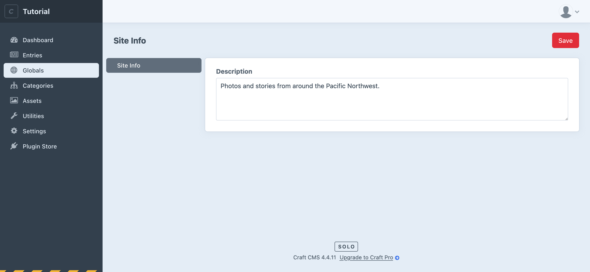

# Configure globals

Often you’ll have little bits of information you’d like to display on many pages of a site, not limited to just one entry. In this case we’ll add a brief description of the blog that can be shown beneath posts—this is a perfect use for a Global Set.

Just like the blog post, let’s start by adding a field for this description:

1. Navigate to **Settings** → **Fields**.
2. Choose **+ New group** and create a group called `Global Fields`.
3. With that Global Fields group selected, choose **+ New field**.
4. Give this new field the a name of `Site Description` and make it a Plain Text field that allows line breaks.
5. Save the field.

Now let’s create a Global Set and add the Site Description field to it:

1. Navigate to **Settings** → **Globals**.
2. Choose **+ New global set**.
3. Give the new global set a name of `Site Information`, then select the **Field Layout** tab.
4. Choose **+ New Tab** in the field layout designer, choose a descriptive name to your tab, and drag your Site Description field into that tab.
5. Save the global set.

You’ll now see **Globals** in Craft’s main navigation. The site’s starting to take shape!

::: tip
You’ve now added custom fields to a new field layout twice. This is a fundamental part of working with Craft as you decide what content is stored in different places. 👏
:::

Visit **Globals** and add some kind of public description for this blog project.

<BrowserShot url="http://tutorial.test/admin/globals/siteInformation" :link="false" caption="Site Description field we added to Globals.">

</BrowserShot>
