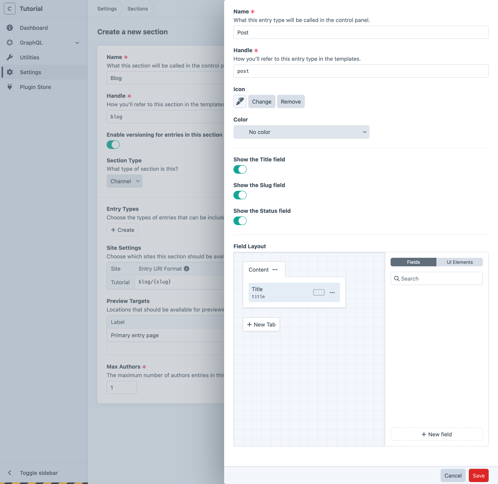
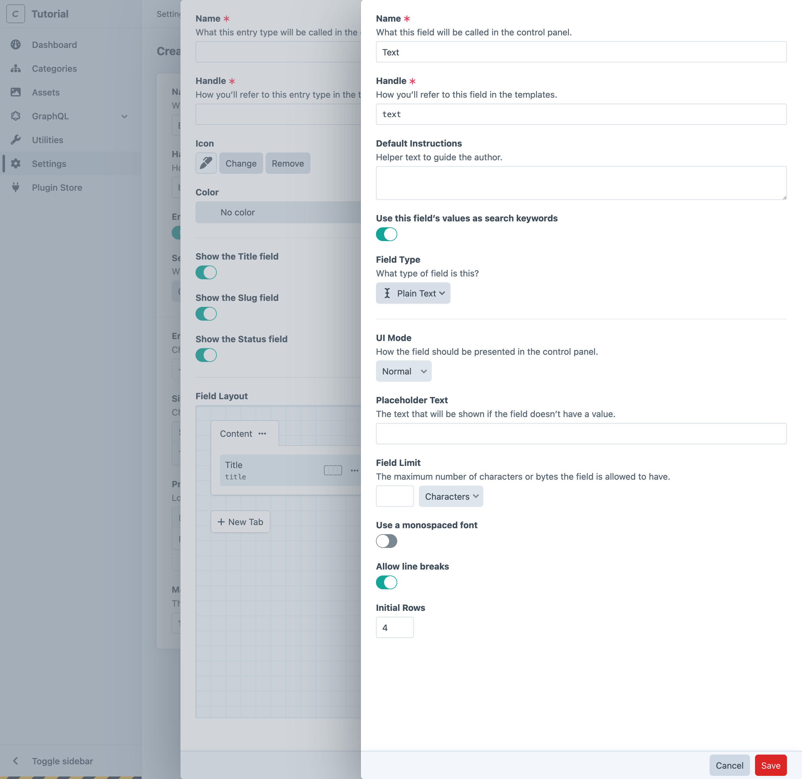
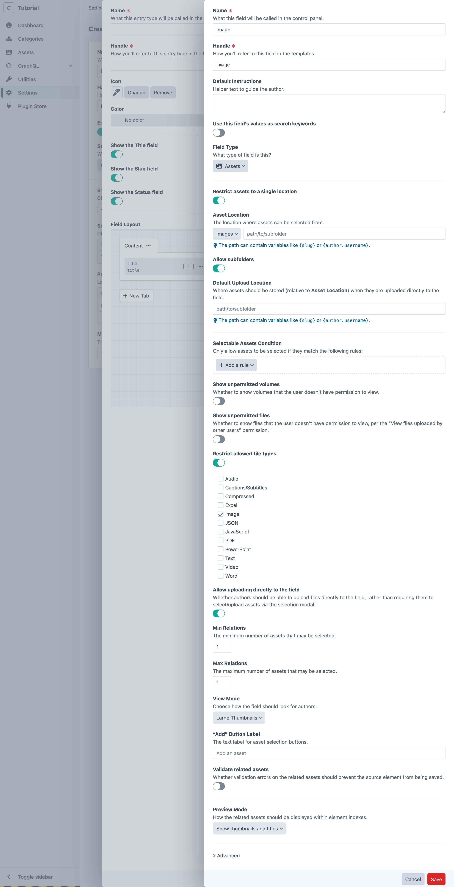
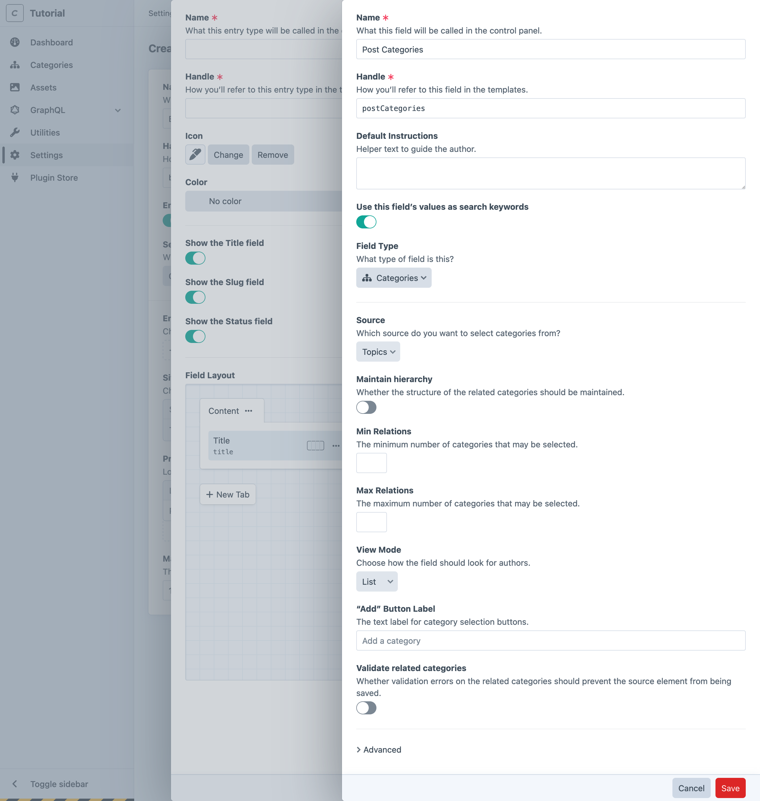
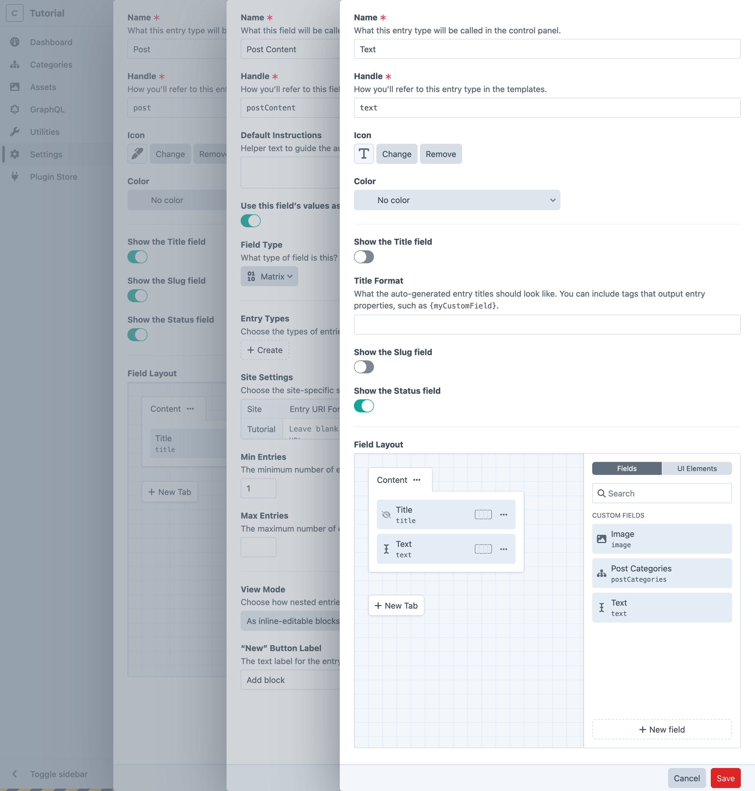
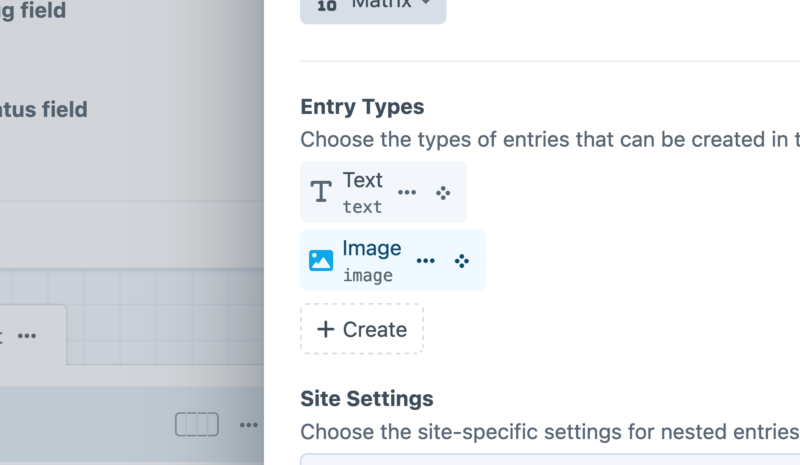

# Creating Resources

Before we can add content and use it in our site’s front-end, we need to define the management tools for it. This process is done entirely within the control panel—no coding is required to create new content types!

::: tip
Our content outline included an _About_ page and a place to keep global site information—we’ll circle back and work on those after we see the blog through.
:::

## Supporting Features

Authors will primarily interact with entries as they create blog posts, but some of the features we’ve planned depend on other resources that make sense to configure ahead of time.

### Create an Asset Volume

First, let’s create a place to upload the files for our feature and post images.

Assets are organized into _volumes_, which sit on top of a _filesystem_. Filesystems are how Craft talks to different storage providers, while keeping the user interface consistent. For now, we’ll be using your local hard drive—but it could be a remote service like Amazon S3 or Google Cloud Storage.

<BrowserShot
    url="https://tutorial.ddev.site/admin/settings/assets/volumes/new"
    id="newVolume"
    :poi="{
        volumeName: [30, 20, 'A'],
        volumeHandle: [30, 28, 'B'],
        volumeFsMenu: [35, 42, 'C'],
        fsName: [60, 7, 'D'],
        fsHandle: [60, 16, 'E'],
        fsHasPublicUrls: [70, 35, 'F'],
        fsBaseUrl: [60, 48, 'G'],
        fsBasePath: [60, 64, 'H'],
        volumeSubpath: [30, 56, 'I'],
        transformSubpath: [33, 84, 'J'],
    }"
    :link="false"
    caption="Creating an asset volume and filesystem.">

</BrowserShot>

We’ll create a local asset volume within the web root, so our images are accessible from a web browser:

1. In the control panel, navigate to <Journey path="Settings, Assets" />;
1. Click **+ New volume**;
1. Enter “Images” in the **Name** field <Poi label="A" target="newVolume" id="volumeName" />;
1. Click the **Asset Filesystem** menu <Poi label="C" target="newVolume" id="volumeFsMenu" /> and select **Create a new filesystem…**;

    Within the filesystem creation slideout that opens, provide these settings:

    - **Name** <Poi label="D" target="newVolume" id="fsName" />: “Hard Disk”
    - **Files in this filesystem have public URLs** <Poi label="F" target="newVolume" id="fsHasPublicUrls" />: On/Enabled
    - **Base URL** <Poi label="G" target="newVolume" id="fsBaseUrl" />: `@uploads`
    - **Base Path** <Poi label="H" target="newVolume" id="fsBasePath" />: `@webroot/uploads`

    Save the filesystem, and ensure it has populated the **Asset Filesystem** <Poi label="C" target="newVolume" id="volumeFsMenu" /> menu.

    ::: tip
    We chose a generic **Base URL** and **Base Path** here so that the filesystem can be reused later by multiple volumes—say, one for “Documents” that you want to keep separate from photographic media. The **Subpath** setting on the volume (see below) will ensure our images live within a specific folder of the filesystem!
    :::

1. Set the volume’s **Subpath** <Poi label="I" target="newVolume" id="volumeSubpath" /> and **Transform subpath** <Poi label="J" target="newVolume" id="transformSubpath" /> both to `images`;
1. Save the Asset Volume.

Switch back to your code editor, and open `config/general.php`. Near the end of the file, you’ll see the `@webroot` alias we just used when configuring the filesystem. This ensures we have a reliable means of referring to the `web/` directory of our project, from resources we configure elsewhere; we still need to define the `@uploads` alias, though!

Add this to the array passed to `->aliases(...)`, then save the file:

```php{5}
return GeneralConfig::create()
    // ...
    ->aliases([
        '@webroot' => dirname(__DIR__) . '/web',
        '@uploads' => App::env('PRIMARY_SITE_URL') . '/uploads',
    ])
;
```

Here, we combine the value of the `PRIMARY_SITE_URL` environment variable (automatically provided by DDEV) with a path segment (`/uploads`)—this corresponds to the filesystem’s **Base Path**, when accessed via HTTP. In practical terms, we’re using predefined values to build consistent on-disk paths (like `/var/www/html/web/uploads/images`) and URLs (like `https://tutorial.ddev.site/uploads/images`) for every uploaded asset.

::: tip
You may have noticed that Craft suggests existing aliases and environment variables as you input these values via the control panel. If you want to double-check your settings after adding the alias, visit <Journey path="Settings, Filesystems, Hard Disk" />, then focus the **Base URL** field.
:::

### Create a Category Group

The second resource we need to create is a group for our blog’s _categories_.

<BrowserShot
    url="https://tutorial.ddev.site/admin/settings/categories/new"
    id="newCategoryGroup"
    :poi="{
        name: [55, 23, 'A'],
        handle: [53, 37, 'B'],
        levels: [32, 52, 'C'],
        uri: [45, 83, 'D'],
        template: [75, 83, 'E'],
        save: [89, 10.5, 'F'],
    }"
    :link="false"
    caption="Settings for a new “topics” category group.">

</BrowserShot>

1. Navigate to <Journey path="Settings, Categories";
1. Choose **+ New category group**;
1. In the **Name** <Poi label="A" target="newCategoryGroup" id="name" /> field, enter “Topics”;
1. In the **Max Levels** <Poi label="C" target="newCategoryGroup" id="levels" /> field, enter `1`;
1. Set the **Category URI Format** <Poi label="D" target="newCategoryGroup" id="uri" /> to `blog/topic/{slug}`;
1. Set the **Template** <Poi label="E" target="newCategoryGroup" id="template" /> to `blog/_topic`;
1. **Save** <Poi label="F" target="newCategoryGroup" id="save" /> the category group.

## Creating a Section

With some supporting resources created, it’s time to scaffold our blog’s _section_, _entry type_, and all its _custom fields_. Craft allows us to do this in a single screen, via nested slideouts—we’ll cover them in sequence!

<BrowserShot
    url="https://tutorial.ddev.site/admin/settings/sections/new"
    id="newSection"
    :poi="{
        name: [50, 14, 'A'],
        handle: [48, 23, 'B'],
        type: [39, 37, 'C'],
        uri: [45, 60, 'D'],
        template: [75, 60, 'E'],
        entryTypes: [32, 50, 'F'],
    }"
    :link="false"
    caption="Settings for the new blog section.">

</BrowserShot>

1. In the control panel, choose **Settings** from the main navigation.
1. Choose **Sections** from the “Content” row.
1. Choose **+ New section**.
1. Enter “Blog” in the **Name** <Poi label="A" target="newSection" id="name" /> field.
1. Leave the rest of the default settings as they are, ensuring **Section Type** <Poi label="C" target="newSection" id="type" /> is set to **Channel**.

::: tip
Craft will automatically generate values for the **Handle** <Poi label="B" target="newSection" id="handle" />, **Entry URI Format** <Poi label="D" target="newSection" id="uri" />, and **Template** <Poi label="E" target="newSection" id="template" /> fields. These will come into play in a moment!
:::

Without leaving this screen, we can also create our first _entry type_. Click **+ Create** <Poi label="F" target="newSection" id="entryTypes" /> within the **Entry Types** field to open a slideout:

<BrowserShot
    url="https://tutorial.ddev.site/admin/settings/sections/new"
    id="newEntryType"
    :poi="{
        name: [81, 5, 'A'],
        icon: [65, 21, 'B'],
        fld: [60, 52, 'C'],
        newField: [94, 89, 'D'],
    }"
    :link="false"
    caption="Creating a “Post” entry type for our new Blog section.">

</BrowserShot>

1. Enter “Post” in the entry type’s **Name** <Poi label="A" target="newEntryType" id="name" /> field;
1. Pick an **Icon** <Poi label="B" target="newEntryType" id="icon" /> and **Color** (optional—we’ll have another opportunity to make better use of these settings, in a moment);

At the bottom of the entry type creation slideout, you’ll find the **Field Layout** <Poi label="C" target="newEntryType" id="fld" /> designer.

## Custom Fields

To add a field to our new _Post_ entry type, click the **+ New field** <Poi label="D" target="newEntryType" id="newField" /> button in the sidebar of the **Field Layout**.

::: tip
You may have noticed the field layout designer at the bottom of the asset volume and category group settings screens—every element type in Craft supports the content modeling tools we’re going to cover in this section!
:::

### Summary

The post summary will be entered in a _plain text_ field. We’re going to create a single, generic text field and reuse it in a few places.

<BrowserShot
    url="https://tutorial.ddev.site/admin/settings/sections/new"
    id="newTextField"
    :poi="{
        name: [81, 5, 'A'],
        keywords: [75, 29, 'B'],
        allowLineBreaks: [60, 74, 'C'],
    }"
    :link="false"
    caption="Creating a plain text field in a slideout.">

</BrowserShot>

1. Enter “Text” into the **Name** <Poi label="A" target="newTextField" id="name" /> field;
1. Enable **Use this field’s value as search keywords** <Poi label="B" target="newTextField" id="keywords" />;
1. Enable **Allow line breaks** <Poi label="C" target="newTextField" id="allowLineBreaks" />;
1. Save the field.

That’s all we need for now! The slideout will close, revealing the text field in the field layout designer sidebar. Drag that field into the _Content_ tab in the field layout.

Our generic field is not very useful to editors, though—how would they know what to enter into a field labeled “Text?” Craft supports reuse of most field types, each instance of which can override the base field’s UI label (what authors see) and handle (how it’s accessed in templates and queries).

On the field layout element you just dragged into the _Content_ tab, open the action menu <Icon kind="ellipses" /> and select **Settings**:


In the slideout that appears, update the **Label** to “Summary” and the **Handle** to `summary`, then click **Apply** to save the overrides; you should see the new label and handle reflected in the field layout designer, as well as a pencil icon indicating that field instance has customizations.

::: warning
If you don’t see the pencil icon, make sure the changes were made in the **Settings** slideout, not the **Edit field** slideout—the former controls instance-level settings, and the latter re-opens the base field’s configuration.
:::

### Feature Image

Posts’ primary images will be added to an _asset_ field. This one will also be used in a few places, so we’re going to give it a relatively generic name and handle. Click **+ New Field** from the entry type’s field layout designer again to open a slideout:

<BrowserShot
    url="https://tutorial.ddev.site/admin/settings/sections/new"
    id="newAssetsField"
    :poi="{
        name: [44.5, 3, 'A'],
        handle: [44.5, 7, 'B'],
        type: [44.5, 18, 'C'],
        restrict: [44.5, 22, 'D'],
        location: [44.5, 26, 'E'],
        allowSubfolders: [44.5, 30, 'F'],
        defaultLocation: [44.5, 34, 'G'],
        allowedTypes: [44.5, 52, 'H'],
        minMaxRelations: [44.5, 74, 'I'],
        viewMode: [44.5, 80, 'J'],
    }"
    :link="false"
    :max-height="600"
    caption="Settings for a new asset field.">

</BrowserShot>

1. Enter “Image” into the **Name** <Poi label="A" target="newAssetsField" id="name" /> field (and note that Craft automatically generates a **Handle** <Poi label="B" target="newAssetsField" id="handle" /> of `image`);
1. Select **Assets** from the **Field Type** <Poi label="C" target="newAssetsField" id="type" /> menu—the rest of the page will be updated with options specific to asset fields;
1. Enable **Restrict assets to a single location?** <Poi label="D" target="newAssetsField" id="restrict" />;
1. Select the **Images** volume from the revealed **Asset Location** <Poi label="E" target="newAssetsField" id="location" /> menu;
1. Enable **Allow subfolders** <Poi label="F" target="newAssetsField" id="allowSubfolders" />;
1. Leave both path inputs (<Poi label="E" target="newAssetsField" id="location" /> + <Poi label="G" target="newAssetsField" id="defaultLocation" />) empty;
1. Enable **Restrict allowed file types** <Poi label="H" target="newAssetsField" id="allowedTypes" />, then tick **Image** from the revealed options;
1. Set **Min** and **Max Relations** <Poi label="I" target="newAssetsField" id="maxRelations" /> to `1`;
1. Use the **Large Thumbnails** option for the **View Mode** <Poi label="J" target="newAssetsField" id="viewMode" /> setting;
1. Save the field.

You’ll be dropped back at the entry type slideout. Add the new _Image_ field to the field layout, just as we did for the _Text_ field—then use the action menu <Icon kind="ellipses" /> to open its **Settings**:

- Update the **Label** to “Feature Image”
- Set the **Handle** to `featureImage`

Apply those overrides, and verify that the pencil icon has appeared in the field layout element.

::: tip
From the action menu <Icon kind="ellipses" />, consider enabling **Use for element thumbnails** to use the _Feature Image_ field’s asset as a visual signpost when _Post_ entries are displayed in the control panel!
:::

### Categories/Topics

Our _topics_ field is significantly simpler! Click **+ New field** again to get started:

<BrowserShot
    url="https://tutorial.ddev.site/admin/settings/sections/new"
    id="newCategoriesField"
    :poi="{
        name: [44.5, 5, 'A'],
        handle: [44.5, 12, 'B'],
        type: [44.5, 33, 'C'],
        source: [44.5, 42, 'D'],
    }"
    :link="false"
    caption="Settings for a new categories field.">

</BrowserShot>

1. Enter “Post Categories” into the **Name** <Poi label="A" target="newCategoriesField" id="name" /> field (and note that Craft automatically generates a **Handle** <Poi label="B" target="newCategoriesField" id="handle" /> of `postCategories`);
1. Choose “Categories” from the **Field Type** <Poi label="C" target="newCategoriesField" id="type" /> menu—the rest of the page will be updated with options specific to categories fields;
1. Choose “Topics” from the **Source** <Poi label="D" target="newCategoriesField" id="source" /> menu (it will probably be selected, already);
1. Save the field.

::: tip
Previously, we only created the category _group_. This step creates a _field_ that will allow us to select from that pool of content. Craft separates these concerns so that you may establish relationships between elements in different parts of your site, without needing to duplicate content on either end of the relationship.

For example, if we later added a _Galleries_ section, you could assign this categories field (or create another one) to that volume’s field layout, while pulling from the same pool of topics!
:::

With the field created, drag it into the _Post_ entry type’s field layout. This one is specific enough to the context that we don’t need to override any instance settings!

### Post Content

Our posts’ content will be authored with Craft’s _Matrix_ field type. Matrix fields are inherently a bit more complex than other field types, because they manage _nested_ entries rather than single, “scalar” values like text or numbers. The good news is that the process of defining the entry types available within a Matrix field is identical to what we’ve done, so far!

Back on our _Post_ entry type slideout, click **+ New field**:

<BrowserShot
    url="https://tutorial.ddev.site/admin/settings/sections/new"
    id="newMatrixField"
    :poi="{
        name: [44.5, 5, 'A'],
        handle: [44.5, 13, 'B'],
        search: [44.5, 28.5, 'C'],
        type: [44.5, 35, 'D'],
        entryTypes: [44.5, 45, 'E'],
        siteSettings: [44.5, 56, 'F'],
        minMaxEntries: [44.5, 68, 'G'],
        viewMode: [44.5, 81, 'H'],
        newButtonLabel: [44.5, 89, 'I'],
    }"
    :link="false"
    caption="Configuring a new matrix field.">

</BrowserShot>

1. Enter “Post Content” in the **Name** <Poi label="A" target="newMatrixField" id="name" /> field (and note that Craft automatically generates a **Handle** <Poi label="B" target="newMatrixField" id="handle" /> of `postContent`);
1. Enable **Use this field’s values as search keywords** <Poi label="C" target="newMatrixField" id="search" />;
1. Choose “Matrix” from the **Field Type** <Poi label="D" target="newMatrixField" id="type" /> menu—the rest of the page will be updated with options specific to matrix fields;
1. Leave the **Site Settings** <Poi label="F" target="newMatrixField" id="siteSettings" /> fields blank;
1. Set the **Min Entries** <Poi label="G" target="newMatrixField" id="minMaxEntries" /> field to `1`, and leave **Max Entries** blank;
1. Choose **As inline-editable blocks** from the **View Mode** <Poi label="H" target="newMatrixField" id="viewMode" /> menu;
1. Type “Add block” into the **“New” Button Label** <Poi label="I" target="newMatrixField" id="newButtonLabel" /> field;

Now, return to the **Entry Types** <Poi label="E" target="newMatrixField" id="entryTypes" /> field we skipped—it’s time to define a couple of basic entry types that we’ll use in various combinations while composing content:

#### Text Block

The first block will be used for plain text. Click **+ Create** beneath the **Entry Types** heading in the Matrix field’s settings:

<BrowserShot
    url="https://tutorial.ddev.site/admin/settings/sections/new"
    id="newNestedEntryType"
    :poi="{
        name: [44.5, 5, 'A'],
        icon: [44.5, 22, 'B'],
        showTitles: [44.5, 31.5, 'C'],
        showSlugs: [44.5, 45.5, 'D'],
        fldAdd: [59, 71, 'E'],
    }"
    :link="false"
    caption="Configuring a new entry type, nested within a Matrix field.">

</BrowserShot>

Recall that we made a general-purpose text field for our posts’ _Summary_, earlier!

1. Enter “Text” for the **Name** <Poi label="A" target="newNestedEntryType" id="name" /> and ensure the handle was automatically set to `text`;
1. Pick an **Icon** and **Color** <Poi label="B" target="newNestedEntryType" id="icon" /> (optional—these can help authors identify the nested entry types);
1. Turn off **Show the Title field** <Poi label="C" target="newNestedEntryType" id="showTitles" /> and **Show the Slug field** <Poi label="D" target="newNestedEntryType" id="showSlugs" />;
1. Drag the _Text_ (`text`) field from the **Field Layout** designer sidebar into the _Content_ tab <Poi label="E" target="newNestedEntryType" id="fldAdd" />;

Click **Save** to create the entry type and attach it to the Matrix field. If you chose an icon and color for the entry type, you’ll see it reflected in the **Entry Types** selector!

#### Image Block

The second block will be used for attaching images. Repeat the process above, but name the entry type “Image” (with a handle of `image`), and drag the _Image_ field into the **Field Layout**. Save the entry type to return to your Matrix field settings slideout. You should see two entry types connected to it:



### Finalizing the Field Layout

With the _Text_ and _Image_ entry types created, click **Save** on the Matrix field. You will be returned to the original _Post_ entry type slideout, with the _Post Content_ Matrix field isolated in its **Field Layout** sidebar.

Drag that field into the _Content_ tab, then click **Save** to create the _Post_ entry type! You should now see the _Post_ entry type attached to the _Blog_ section’s **Entry Types**. One last **Save** on the _Blog_ section, and you’re done—what a journey!

::: tip
In the future, you can access all your entry types from <Journey path="Settings, Entry Types" /> and fields from <Journey path="Settings, Fields" />, directly.
:::

<Block label="Optional Steps">

#### Install the CKEditor plugin for rich text fields

If you would prefer to compose the text of your blog posts using a _rich text_ editor (sometimes called a <abbr title="What You See Is What You Get">WYSIWYG</abbr> editor), our first-party [CKEditor](https://plugins.craftcms.com/ckeditor) plugin can be substituted for most any plain text field.

Plugins are installed from the control panel (click **Plugin Store** in the main navigation and search for “CKEditor”), or via the command line:

1. Run `ddev composer require craftcms/ckeditor -w` to add the package to your project;
1. Install the plugin by running `ddev php craft plugin/install ckeditor`;

Once installed, you’ll need to create a new field, and replace the field in our _Text_ entry type:

1. Navigate to <Journey path="Settings, Entry Types" />, then select _Text_;
1. Remove the _Text_ field from the field layout by dragging it into the sidebar, or using the action menu <Icon kind="ellipses" /> and selecting **Remove**;
1. Click **+ New field** in the field layout designer sidebar;
1. Give the field a **Name** and **Handle** that make sense, like “Rich Text” and `richText`, respectively;
1. Define a [reusable configuration](https://github.com/craftcms/ckeditor?tab=readme-ov-file#configuration);
1. Save the field;
1. Drag the new _Rich Text_ field into your layout;
1. Save the field layout;

That’s it! Plain text fields can be migrated to CKEditor without losing data—but some field types are _not_ compatible with one another! Craft puts a ⚠️ next to any options in the **Field Type** menu that can’t be automatically converted.

Switching the existing plain text field to CKEditor means that _all_ instances of that field would be updated. This may not be appropriate for our _Summary_ field (or additional uses, later in the tutorial), so we elected to treat it as a separate base field.

#### Advanced Field Layout Customizations

The **UI Elements** tab in the right sidebar of every field layout designer contains a few tools that can help create richer authoring experiences. Craft comes with tools for splitting up fields, injecting additional instructions, rendering Twig templates, and more.

Here are a few other features of field layouts worth experimenting with:

- **Widths**: By default, fields occupy the full width of the element editor. Use the column selector UI next to the <Icon kind="ellipses" /> to set the field as 1/4, 1/2, 3/4, or full-width.
- **Line breaks**: If a row isn’t full, you can force a field onto the next row with a line break field layout element.
- **Field labels**: Click the <Icon kind="ellipses" /> to open a slideout and update a field’s **Label**. This is particularly useful for the **Title** field: say you were creating employee profiles, and needed a place for each person’s name and _position_—the built-in **Title** field would make more sense being called “Full Name,” while their position could be re-labeled “Position/Title” without creating confusion.
- **Required fields**: Also within a field’s action menu is an option to mark a field as **Required**.
- **Field conditions** and **User conditions**: Fields can be conditionally included in layouts by setting up condition rules, within the settings slideout. These conditions are evaluated dynamically, and can include rules based on other fields’ values!

</Block>

## Create a Post

Return to **Entries** in the main navigation, and click **+ New entry** to create your first blog post. Check it out—all our fields are here, in a gorgeous editing interface!

<BrowserShot url="https://tutorial.ddev.site/admin/entries/blog/2?draftId=1&fresh=1" :link="false" caption="A fresh blog post entry, populated with custom fields.">

</BrowserShot>

::: tip
Anything missing? You can always go back to the _Post_ entry type to add, remove, or rearrange fields.
:::

Feel free to play with the content editor on your own—then check back in so we can go over a couple features you’ll need to be aware of before building out the front-end.
