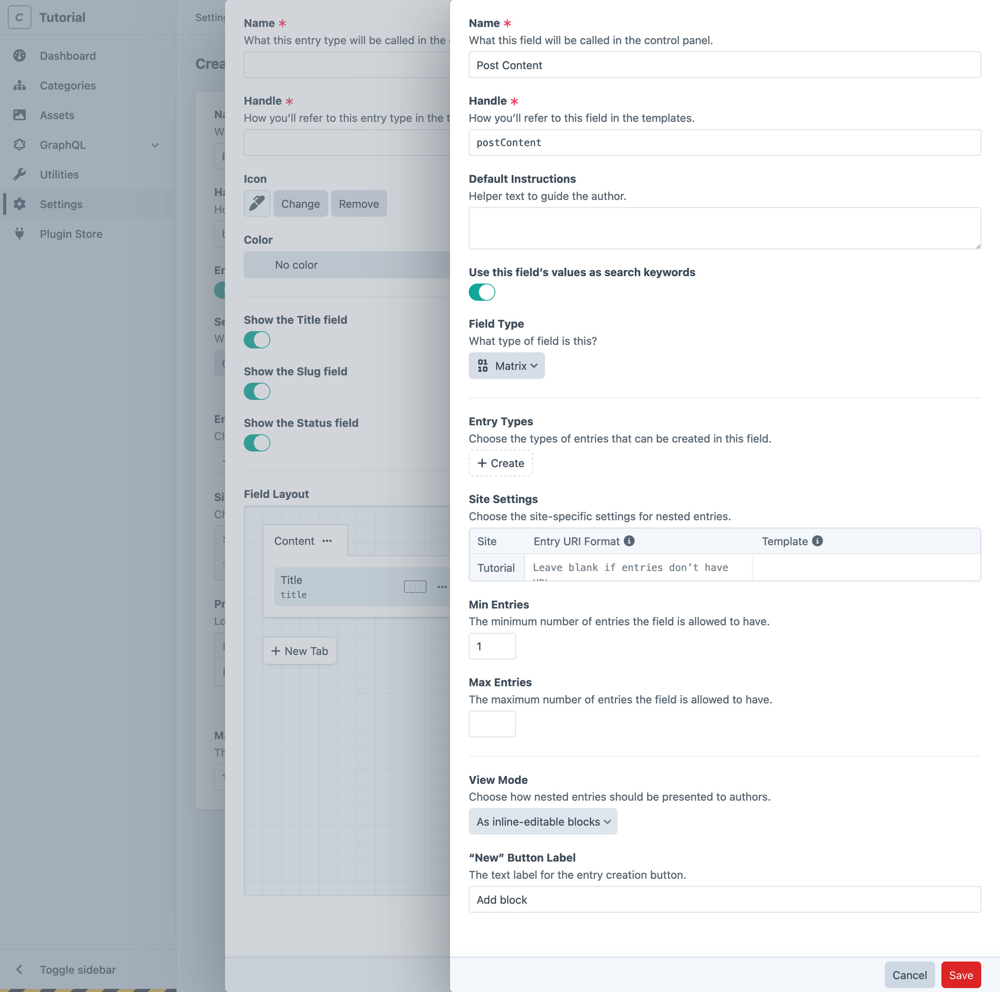
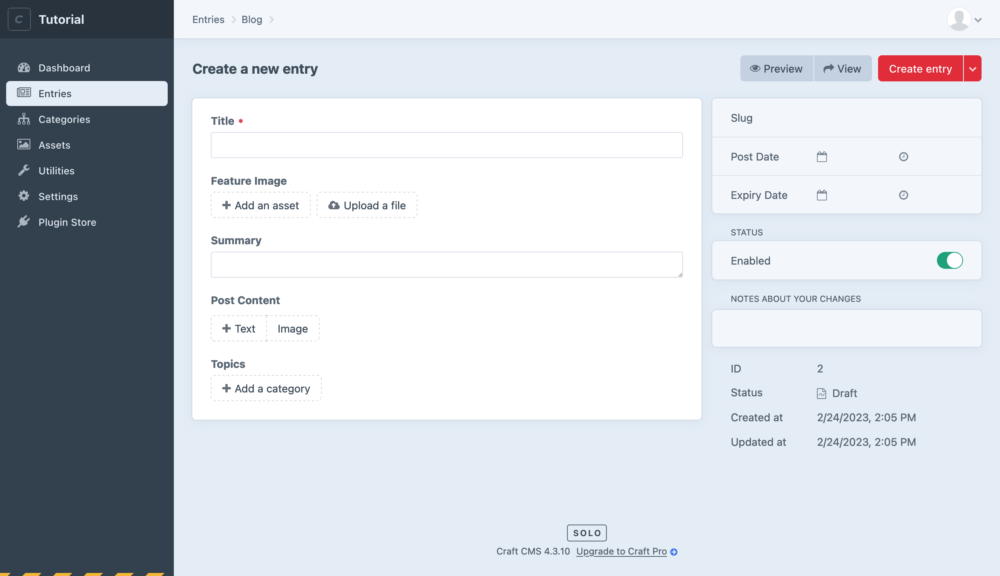

# Creating Resources

Before we can add content and use it in our site’s front-end, we need to define the management tools for it. This process is done entirely within the control panel—no coding is required to create new content types!

::: tip
Our content outline included an _About_ page and a place to keep global site information—we’ll circle back and work on those after we see the blog through.
:::

## Creating a Section

Our first order of business is to create a _section_ for our blog posts.

<BrowserShot
    url="https://tutorial.ddev.site/admin/settings/sections/new"
    id="newSection"
    :poi="{
        name: [35, 24, 'A'],
        handle: [35, 38, 'B'],
        type: [35, 62, 'C'],
        uri: [45, 80, 'D'],
        template: [70, 80, 'E'],
    }"
    :link="false"
    caption="Settings for the new blog section.">

</BrowserShot>

1. In the control panel, choose **Settings** from the main navigation.
1. Choose **Sections** from the “Content” row.
1. Choose **+ New section**.
1. Enter “Blog” in the **Name** <Poi label="A" target="newSection" id="name" /> field.
1. Leave the rest of the default settings as they are, ensuring **Section Type** <Poi label="C" target="newSection" id="type" /> is set to **Channel**.
1. Click **Save and edit entry types**.

::: tip
Craft will automatically generate values for the **Handle** <Poi label="B" target="newSection" id="handle" />, **Entry URI Format** <Poi label="D" target="newSection" id="uri" />, and **Template** <Poi label="E" target="newSection" id="template" /> fields. These will come into play in a moment!
:::

You’ll be dropped into the **Entry Types** tab of your new section’s edit screen, and should see one entry type, named “Default.” We’ll come back to this screen once we’ve created some fields.

## Supporting Features

We’ve addressed the first item in our content model inventory by creating a section for blog posts… but the content model we decided on requires some other supporting features.

Let’s walk through creating each of those components:

- A _volume_ for storing images;
- An _assets field_ to attach a primary image;
- A _plain text field_ for post summaries;
- A _categories field_ to organize posts;
- A _matrix field_ for posts’ main content;

### Create an Asset Volume

First, let’s create a place to upload the files we’ll use for our feature and post images.

Assets are organized into _volumes_, which sit on top of a _filesystem_. Filesystems are how Craft talks to different storage providers, while keeping the user interface consistent. For now, we’ll be using your local hard drive—but it could be a remote service like Amazon S3 or Google Cloud Storage.

<BrowserShot
    url="https://tutorial.ddev.site/admin/settings/assets/volumes/new"
    id="newVolume"
    :poi="{
        volumeName: [30, 25, 'A'],
        volumeHandle: [30, 35, 'B'],
        volumeFsMenu: [30, 55, 'C'],
        fsName: [70, 8, 'D'],
        fsHandle: [65, 18, 'E'],
        fsHasPublicUrls: [75, 28, 'F'],
        fsBaseUrl: [75, 40, 'G'],
        fsBasePath: [70, 72, 'H'],
    }"
    :link="false"
    caption="Creating an asset volume and filesystem.">

</BrowserShot>

We’ll create a local Asset Volume within the web root for blog post images:

1. In the control panel, navigate to **Settings** → **Assets**.
1. Click **+ New volume**.
1. Enter “Images” in the **Name** field <Poi label="A" target="newVolume" id="volumeName" />.
1. Click the **Asset Filesystem** menu <Poi label="C" target="newVolume" id="volumeFsMenu" /> and select **Create a new filesystem…**

    Within the slideout that opens, provide these settings:

    - **Name** <Poi label="D" target="newVolume" id="fsName" />: “Hard Disk”
    - **Files in this filesystem have public URLs** <Poi label="F" target="newVolume" id="fsName" />: On/Enabled
    - **Base URL** <Poi label="G" target="newVolume" id="fsBaseUrl" />: `@web/uploads/images`
    - **File System Path** <Poi label="H" target="newVolume" id="fsBasePath" />: `@webroot/uploads/images`

    Save the filesystem, and ensure it has populated the **Asset Filesystem** <Poi label="C" target="newVolume" id="volumeFsMenu" /> menu.

1. Save the Asset Volume.

::: tip
The `@web` and `@webroot` “[aliases](/4.x/config/README.md#aliases)” are automatically defined by Craft, and point to the base site URL and document root (`web/` in your project folder), respectively.
:::

### Create a Category Group

The second resource we need to create is a group for our blog’s _categories_.

<BrowserShot
    url="https://tutorial.ddev.site/admin/settings/categories/new"
    id="newCategoryGroup"
    :poi="{
        name: [53, 23, 'A'],
        handle: [51, 35, 'B'],
        levels: [32, 45, 'C'],
        uri: [45, 80, 'D'],
        template: [75, 80, 'E'],
        save: [90, 11, 'F'],
    }"
    :link="false"
    caption="Settings for a new blog category group.">

</BrowserShot>

1. Navigate to **Settings** and choose **Categories**.
1. Choose **+ New category group**.
1. In the **Name** <Poi label="A" target="newCategoryGroup" id="name" /> field, enter “Topics”.
1. In the **Max Levels** <Poi label="C" target="newCategoryGroup" id="levels" /> field, enter `1`.
1. Set the **Category URI Format** <Poi label="D" target="newCategoryGroup" id="uri" /> to `blog/topic/{slug}`.
1. Set the **Template** <Poi label="E" target="newCategoryGroup" id="template" /> to `blog/_topic`.
1. Save <Poi label="F" target="newCategoryGroup" id="save" /> the Category Group.

## Custom Fields

Now that we’ve set up all the underlying resources (a section, an asset volume, and a category group), let’s create the fields for our blog posts.

Custom fields are reusable, so we’ll define them in a global space, then add them to the field layouts where they’re needed. Each of the resources we’ve created so far can have their own field layouts.

The first thing we’ll do is create a _field group_ to keep our fields organized.

1. Navigate to **Settings** → **Fields**.
2. Choose **+ New group** in the sidebar, and give it a name like “Blog.”

The following fields will all be created within this new _Blog_ field group. Clicking **+ New Field** while viewing a group will automatically select it—but you can always move a field between groups using the **Group** option on its edit screen.

### Summary

The post summary will be entered in a _plain text_ field.

1. Click **+ New Field**;
1. Enter “Summary” into the **Name** field;
1. Enter “Summaries should be one or two sentences.” in the **Default Instructions** field to give authors a hint about the field’s intended usage.
1. Enable **Allow line breaks**;
1. Set the revealed **Initial Rows** field to `1`;
1. Save the field.

### Feature Image

Posts’ primary images will be added to an _asset_ field.

<BrowserShot
    url="https://tutorial.ddev.site/admin/settings/fields/new"
    id="newAssetField"
    :poi="{
        name: [3, 13.5, 'A'],
        handle: [3, 17.25, 'B'],
        type: [3, 27, 'C'],
        restrict: [3, 29, 'D'],
        location: [3, 33.3, 'E'],
        allowSubfolders: [3, 36.2, 'F'],
        defaultLocation: [3, 39.6, 'G'],
        allowedTypes: [3, 53.5, 'H'],
        maxRelations: [3, 75.7, 'I'],
    }"
    :link="false"
    :max-height="600"
    caption="Settings for a new asset field.">

</BrowserShot>

1. Click **+ New Field**;
1. Enter “Feature Image” into the **Name** <Poi label="A" target="newAssetField" id="name" /> field;
1. Select _Assets_ from the **Field Type** <Poi label="C" target="newAssetField" id="type" /> menu—the rest of the page will be updated with options specific to asset fields;
1. Tick **Restrict assets to a single location?** <Poi label="D" target="newAssetField" id="restrict" />;
1. Select the _Images_ volume from the revealed **Asset Location** <Poi label="E" target="newAssetField" id="location" /> menu;
1. Tick **Allow subfolders** <Poi label="F" target="newAssetField" id="allowSubfolders" />;
1. Leave both path inputs (<Poi label="E" target="newAssetField" id="location" /> + <Poi label="G" target="newAssetField" id="defaultLocation" />) empty;
1. Tick **Restrict allowed file types** <Poi label="H" target="newAssetField" id="allowedTypes" />, then tick **Image** from the revealed options;
1. Set **Max Relations** <Poi label="I" target="newAssetField" id="maxRelations" /> to `1`;
1. Save the field.

### Categories/Topics

Our _topics_ field only needs a couple of options:

1. Click **+ New Field**;
1. Enter “Post Categories” into the **Name** field;
1. Choose “Categories” from the **Field Type** menu—the rest of the page will be updated with options specific to categories fields;
1. Choose “Topics” from the **Source** menu (it will probably be selected, already);
1. Save the field.

### Post Content

Matrix fields are inherently a bit more complex than other field types, because they contain _nested_ fields. The process of creating those nested fields should feel pretty familiar, though!

<BrowserShot
    url="https://tutorial.ddev.site/admin/settings/fields/new"
    id="newMatrixField"
    :poi="{
        name: [3, 13.8, 'A'],
        handle: [3, 18.25, 'B'],
        type: [3, 30, 'C'],
        config: [5, 45, 'D'],
        fieldSettings: [65, 36.2, 'E'],
    }"
    :link="false"
    :max-height="600"
    caption="Configuring a new matrix field with multiple block types.">

</BrowserShot>

1. Click **+ New Field**;
1. Enter “Post Content” in the **Name** <Poi label="A" target="newMatrixField" id="name" /> field;
1. Choose “Matrix” from the **Field Type** <Poi label="C" target="newMatrixField" id="type" /> menu—the rest of the page will be updated with options specific to matrix fields;
1. Within the **Configuration** <Poi label="D" target="newMatrixField" id="config" /> space, use the **+ New block type**  button to create two _block types_:

    #### Text Block

    The first block will be used for text. When prompted for a _block type_ **Name**, enter “Text.”

    1. In the **Fields** column of the configuration pane, click **+ New field**;
    1. In the **Field Settings** <Poi label="D" target="newMatrixField" id="config" /> column, enter these values…
        - **Name**: “Text”
        - **Field Type**: Plain Text
        - **This field is required**: Checked
        - **Allow line breaks**: Checked
        - **Initial Rows**: `12`

    #### Image Block

    The second block will be used for attaching images.

    1. Back in the **Fields** column of the configuration pane, click **+ New field**.
    1. In the **Field Settings** <Poi label="D" target="newMatrixField" id="config" /> column…
        - Set the **Name** field to “Image”;
        - Choose “Assets” from the **Field Type** menu;
        - Tick **This field is required**;
        - Copy the remainder of the settings from the [Feature Image](#feature-image) field we created a moment ago;

1. Save the field.

With that, our fields are ready to be added to a _field layout_!

<Block label="Optional Step">

#### Install the Redactor plugin for rich text fields

If you would prefer to compose the text of your blog posts using a _rich text_ editor (sometimes called a <abbr title="What You See Is What You Get">WYSIWYG</abbr>), the first-party [Redactor](https://plugins.craftcms.com/redactor) can be substituted for the plain text field we created inside our matrix field’s _Text_ block.

Plugins can be installed from the control panel (click **Plugin Store** in the main navigation and search for “Redactor”), or via the command line:

1. Run `ddev composer require craftcms/redactor` to add the package to your project;
1. Install the plugin by running `ddev php craft plugin/install redactor`;

Once installed, you’ll need to update your field’s settings:

1. Navigate to the _Post Content_ matrix field’s settings, then the _Text_ block type, then the _Text_ field;
1. Switch the **Field Type** to _Redactor_;
1. Save the field;

That’s it! Plain text fields can be migrated to Redactor without losing data—but some field types are _not_ compatible with one another! Craft puts a ⚠️ next to any options in the **Field Type** menu that can’t be automatically converted.

</Block>

## Building a Field Layout

Craft’s assumption is that you will eventually have a variety of content types, and that each will use a subset of your fields. To connect our blog entries to the fields they need, we’ll create a _field layout_.

<BrowserShot
    url="https://tutorial.ddev.site/admin/settings/sections/1/entrytypes/1"
    id="fieldLayout"
    :poi="{
        name: [18.5, 18.5, 'A'],
        contentTab: [39, 55, 'B'],
        uiElements: [95, 41, 'C'],
    }"
    :link="false"
    caption="Post entry type field layout, prior to configuration.">

</BrowserShot>

Field layouts for entries are managed via _entry types_.

1. Navigate to **Settings** → **Sections**;
1. Choose **Edit entry types** in the _Blog_ row, and then choose the _Default_ entry type that was created along with the section;
1. Take the opportunity to give this entry type a more useful **Name** <Poi label="A" target="fieldLayout" id="name" /> like “Post,” and ensure the **Handle** is updated;
1. Drag each of the fields we created earlier to the _Content_ <Poi label="B" target="fieldLayout" id="contentTab" /> tab in whatever order makes sense to you.
1. Save the entry type.

All the fields nested within your Matrix field will come along with it, so they won’t appear in the field layout designer!

<Block label="Optional Step">

#### Advanced Field Layout Customizations

The **UI Elements** <Poi label="C" target="fieldLayout" id="uiElements" /> tab in the right sidebar contains a few tools that can help spruce up field layouts. This one is relatively simple, but as you create richer authoring experiences, having ways to split up fields, add instructions, or output arbitrary HTML can make a profound difference to its usability.

Here are a few other features of field layouts worth experimenting with:

- **Widths**: By default, fields occupy the full width of the element editor. Use the column selector UI next to the <Icon kind="settings" /> to set the field as 1/4, 1/2, 3/4, or full-width.
- **Line breaks**: If a row isn’t full, you can force a field onto the next row with a line break field layout element.
- **Field labels**: Click the <Icon kind="settings" /> to open a slideout and update a field’s **Label**. This is particularly useful for the **Title** field: say you were creating employee profiles, and needed a place for their names and _position_ titles—the built-in **Title** field would make more sense being called “Full Name.”
- **Required fields**: Also within a field’s setting slideout is an option to mark a field as **Required**.
- **Field conditions** and : Fields can be conditionally included in layouts by setting up condition rules, within the settings slideout.

</Block>

## Create a Post

Return to **Entries** in the main navigation, and click **+ New entry** to create your first blog post. Check it out—all our fields are here, in a gorgeous editing interface!

<BrowserShot url="https://tutorial.ddev.site/admin/entries/blog/2?draftId=1&fresh=1" :link="false" caption="A fresh blog post entry, populated with custom fields.">

</BrowserShot>

Feel free to play with the content editor on your own—then check back in so we can go over a couple features you’ll need to be aware of before building out the front-end.
