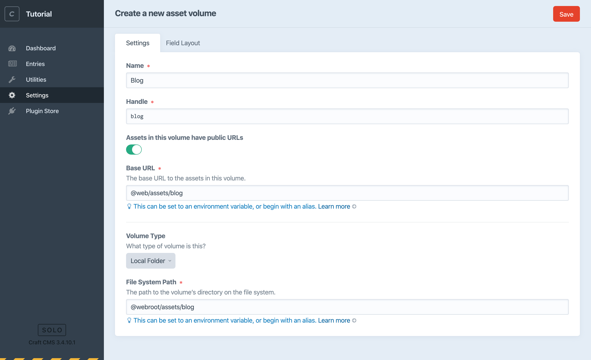
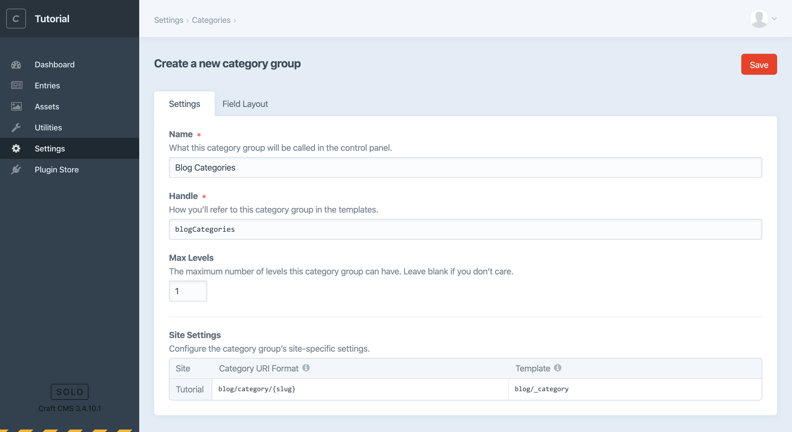
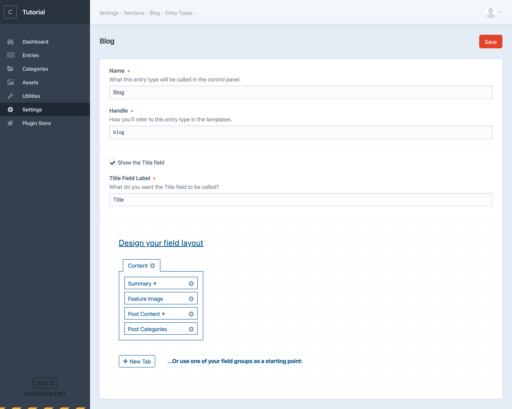
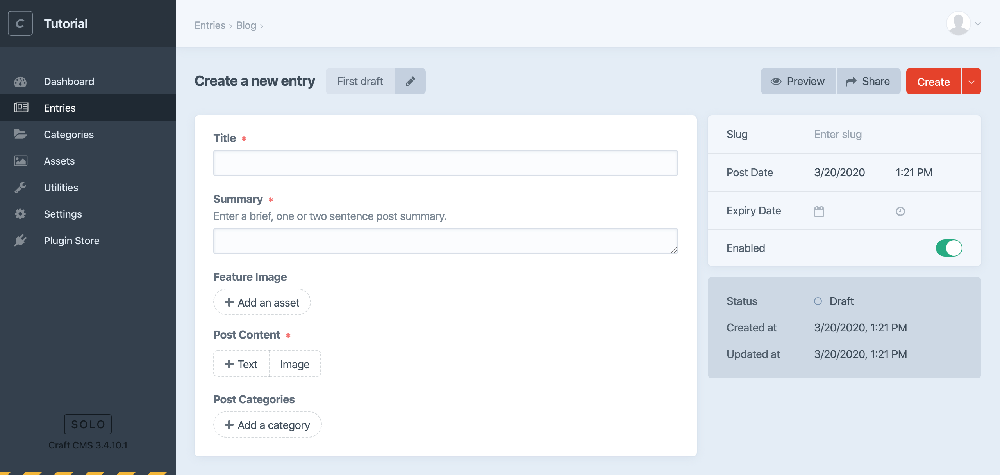

# Create the blog

The first thing we’ll do is create a new Section for our blog posts.

## Create a section

1. In the control panel, choose “Settings” from the main navigation.
2. Choose “Sections” from the “Content” options.
3. Choose “+ New section”.
4. Enter “Blog” for this new section’s name. Notice the lowercase handle and Entry URI Format are created for you. The handle is what you’ll use to refer to the section in your templates and GraphQL queries, and the URI is where you’ll eventually see your blog post on the front end.
5. Enter `blog/_entry` for the “Template” setting. We’ll create that template later on.
6. Leave the rest of the default settings as they are and choose “Save”.

<BrowserShot url="http://tutorial.test/admin/settings/sections/new" :link="false" caption="Settings for the new blog section.">

</BrowserShot>

You’ll see a new “Entries” menu item in the control panel navigation. Choose that item and select “New Entry” → “Blog”.

Technically we could create a new blog post now, but all we would have is a “Title” field.

<BrowserShot url="http://tutorial.test/entries/blog6?draftId=5&fresh=1" :link="false" caption="The new blog post entry doesn’t yet have any custom fields.">

</BrowserShot>

Let’s create some fields to store blog post content!

## Create blog fields

Now we’ll create some fields for storing content and add them to the blog entry type’s field layout.

Here’s what we’ll set up for our blog posts:

- A Volume for storing images used for post content.
- A Plain Text field to be used for a post summary.
- An Assets field for a feature image.
- A Categories field for post taxonomy.
- A Matrix field for flexible post content.

### Create an Asset Volume

First, let’s create a place to upload the files we’ll use for our feature and post images.

Craft uses the concept of Assets to describe uploaded files. Assets consist of the files themselves and any other fields we’d like to attach to them. All Assets are stored in folders referred to as Volumes. These can be in your filesystem or different cloud storage providers—see the documentation on [Volumes](/3.x/assets.md#volumes) for more about those options.

Create a local Asset Volume for storing blog post images:

1. In your local filesystem, find Craft’s `web/` folder and create a new folder inside that called `assets`. Inside that folder, create one more named `blog`. This is where we’ll store uploaded blog post files.
2. Back in the Craft CMS control panel, navigate to “Settings” and choose “Assets”.
3. Choose “+ New volume”.
4. Enter the name “Blog”, enable the “Assets in this volume have public URLs” switch, enter a “Base URL” value of `@web/assets/blog`, and a “File System Path” of `@webroot/assets/blog`.
5. Save the Asset Volume.

::: tip
`@web` and `@webroot` are [aliases](/3.x/config/#aliases) Craft includes by default, pointing to the base website URL and document root file path respectively.
:::

<BrowserShot url="http://tutorial.test/admin/settings/assets/volumes/new" :link="false" caption="Settings for the new blog volume.">

</BrowserShot>

::: tip
If you’d rather store your Assets on a cloud service like Amazon S3, you could install the [Amazon S3 plugin](https://plugins.craftcms.com/aws-s3) in order to select and configure that Volume Type here.
:::

### Create a Category Group

Now create a Category Group we can use for blog post categories:

1. Navigate to “Settings” and choose “Categories”.
2. Choose “+ New category group”.
3. Enter the name “Blog Categories” and limit “Max Levels” to `1` for now.
4. For “Category URI Format”, enter `blog/category/{slug}` and set the template to `blog/_category`.
5. Save the Category Group.

<BrowserShot url="http://tutorial.test/admin/settings/categories/new" :link="false" caption="Settings for the new blog category group.">

</BrowserShot>

### Install the Redactor plugin for rich text fields

You’ll probably want a rich text editor (WYSISYG) for editing the main text of your blog posts. For this, we’ll install the first-party Redactor plugin. You can do this through the control panel or from the terminal. Let’s be adventurous and use console commands:

1. From your terminal, run `composer require craftcms/redactor`. Composer will download the plugin and add it to your project.
2. Now run `php craft install/plugin redactor`.

That’s it! The Redactor plugin is installed and ready to use in our site.

<BrowserShot url="http://tutorial.test/admin/settings/plugins" :link="false" caption="Redactor now appears in the list of installed Plugins, where it can also be disabled and uninstalled.">

</BrowserShot>

### Create individual fields

Next, let’s create the individual fields for our blog posts:

1. Navigate to “Settings” and choose “Fields”.
2. Choose “+ New group” to create a new field group with the name “Blog Post Fields”. Save the group.
3. Create a Plain Text “Summary” field.\
   Choose “New Field”, and start by creating a new Plain Text field named “Summary”. Use the “Instructions” input to help the content editor know what to do. Add “Enter a brief, one or two sentence post summary.”. Enable “Allow line breaks” and set “Initial Rows” to `1`. Save the field.
4. Create an Assets “Feature Image” field.\
   Choose “New Field” again, enter “Feature Image” for its name, and choose “Assets” from the “Field Type” dropdown menu. Enable “Restrict uploads to a single folder?” and select the “Blog” volume. Enable “Restrict allowed file types?” and check “Image” to ensure content editors can only select files that are images. Set Limit to `1` and save the field.
5. Create a Categories field named “Post Categories”.\
   Again choose “New Field”, enter “Post Categories” for its name, and select “Categories” as the field type. The “Source” setting will default to our “Blog Categories”, so we can just save the field.
6. Create a Matrix field named “Post Content”.\
   Choose “New Field” once more, enter “Post Content” for its name, and choose “Matrix” from the “Field Type” dropdown menu. We’ll use the Configuration setting to define two Block Types that can be added and reordered to build the post content.
   1. First add a text block an author can use to enter rich text.\
      Choose “+ New block type” and enter “Text” for its name. In the Field Settings section, enter the name “Text” again and select “Rich Text” from the “Field Type” dropdown menu. Since every post should have at least some text, make sure “This field is required” is checked.
   2. Add one more block for images.\
      Choose “+ New block type” again and enter “Image” for its name. Enter “Image” again for the “Name” under Field Settings. Mark this field required as well and select “Assets” from the “Field Type” dropdown menu. Restrict uploads to the “Blog” volume, enable “Restrict allowed file types?” and make sure “Image” is checked.
   3. Save the field.

<BrowserShot url="http://tutorial.test/admin/settings/fields/2" :link="false" caption="Our complete group of new fields.">

</BrowserShot>

## Add fields to the blog field layout

Now we have everything we need to collect content for our blog posts. If you were to create a new entry right now, however, you’d still only see that Title field. It’s time to add our custom fields to the blog section in a Field Layout:

1. Navigate to “Settings” and return to “Sections”.
2. If you were to choose the name of the section again, that would take you back to the settings we established earlier. This time, choose “Edit entry types (1)”, and then choose the “Blog” entry type that was added for you.
3. At the bottom of this view you’ll see the field layout designer. Choose “+ New Tab”.
4. Select the gear icon to the right of the new tab, choose “Rename”, and give this tab a better label such as “Post Content”.
5. Drag each of the fields we created earlier to this “Post Content” tab, in whatever order you’d like.
6. Since every blog post should have some kind of content, choose the gear icon to the right of the “Post Content” field and make sure it’s required.
7. Enter “Headline” for the “Title Field Label”.
8. Save the field layout.

::: tip
You can also drag an entire field group from the available sets into your entry type’s field layout.
:::

<BrowserShot url="http://tutorial.test/admin/settings/sections/1/entrytypes/1" :link="false" caption="Completed blog entry type field layout.">

</BrowserShot>

That “Title Field Label” is a simple way to relabel the title—which *every* entry has—to something more descriptive for content editors. This can be especially important later if each entry represents something like a service, a physical object, or a person.

Once you’ve added fields to the blog section’s field layout, return to “Entries” and create a new “Blog” entry. You’ll see each of the fields you created and you’re ready to publish some content!

<BrowserShot url="http://tutorial.test/admin/entries/blog/7?draftId=6&fresh=1" :link="false" caption="A new blog post entry now includes our custom fields.">

</BrowserShot>
