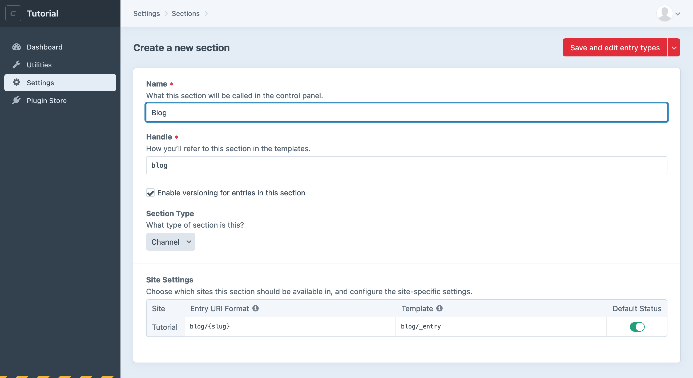
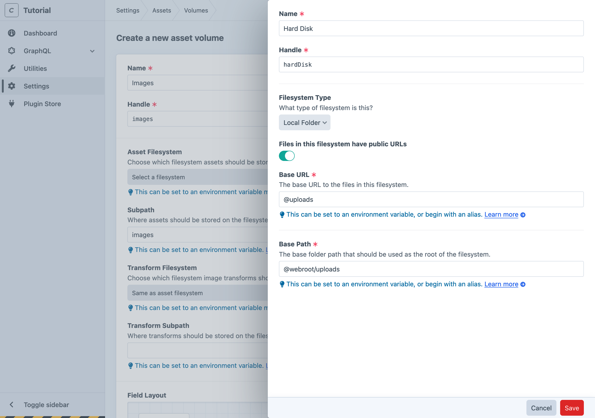
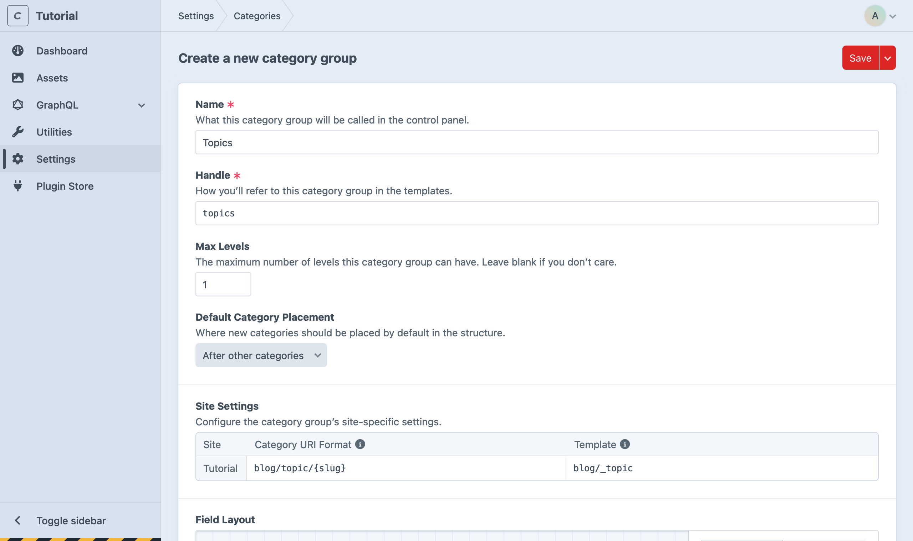
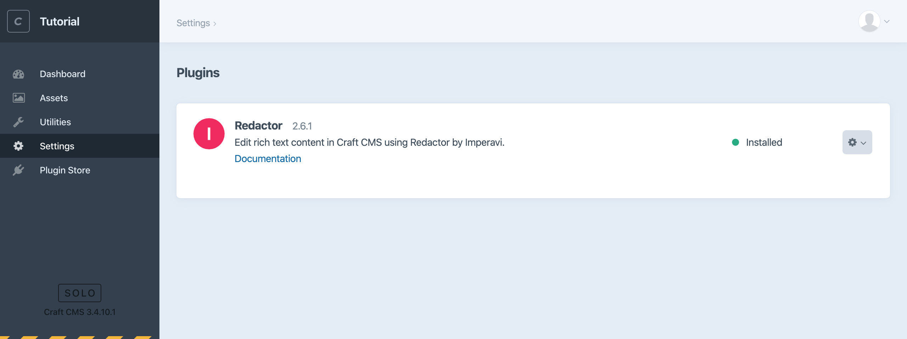
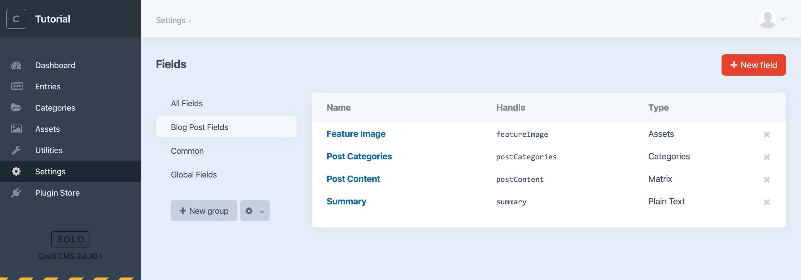
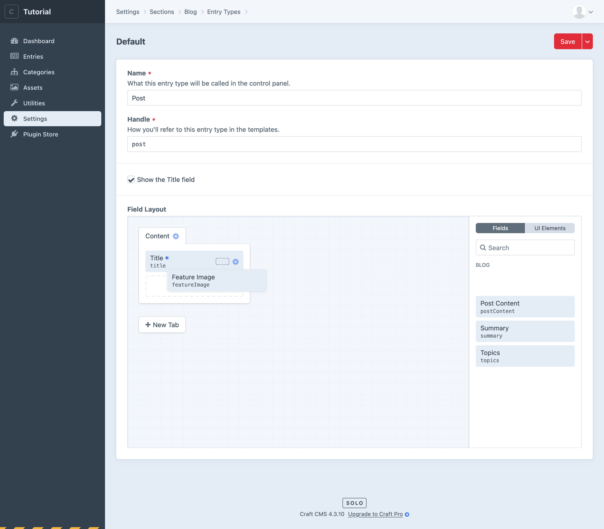

# Create the blog

The first thing we’ll do is create a new Section for our blog posts.

## Create a section

1. In the control panel, choose **Settings** from the main navigation.
2. Choose **Sections** from the “Content” options.
3. Choose **+ New section**.
4. Enter “Blog” for this new section’s name. Notice the lowercase handle and Entry URI Format are created for you. The handle is what you’ll use referring to this section in your templates and GraphQL queries, and the URI is where you’ll eventually see your blog post on the public site.
5. Enter `blog/_entry` for the **Template** setting. We’ll create that template later on.
6. Leave the rest of the default settings as they are and choose **Save**.

<BrowserShot url="https://tutorial.nitro/admin/settings/sections/new" :link="false" caption="Settings for the new blog section.">

</BrowserShot>

You’ll see a new **Entries** menu item in the sidebar navigation. Choose that, then **New Entry** → **Blog**.

We can create a new blog post now, but all it would have is a **Title** field:

<BrowserShot url="https://tutorial.nitro/entries/blog6?draftId=5&fresh=1" :link="false" caption="The new blog post entry doesn’t yet have any custom fields.">

</BrowserShot>

Let’s create some fields to store blog post content!

## Create blog fields

Now we’ll create some fields for storing content and add them to the blog entry type’s field layout.

Here’s what we’ll set up for our blog posts:

- A Volume for storing images used for post content.
- A Plain Text field to be used for a post summary.
- An Assets field for a feature image.
- A Categories field for post taxonomy.
- A Matrix field for flexible post content.

### Create an Asset Volume

First, let’s create a place to upload the files we’ll use for our feature and post images.

Craft uses the concept of Assets to describe uploaded files. Assets consist of the files themselves and any other fields we’d like to attach to them. All Assets are stored in folders referred to as Volumes. These can be in your filesystem or different cloud storage providers—see the documentation on [Volumes](/3.x/assets.md#volumes) for more about those options.

We’ll create a local Asset Volume within the web root for blog post images:

1. In the control panel, navigate to **Settings** → **Assets**.
2. Choose **+ New volume**.
3. Enter the name “Blog” and set the following:
   - **Assets in this volume have public URLs**: on/enabled
   - **Base URL**: `@web/assets/blog`
   - **File System Path**: `@webroot/assets/blog`
4. Save the Asset Volume.

Craft will create that folder and let you upload and manage its Assets from the control panel.

::: tip
`@web` and `@webroot` are [aliases](/3.x/config/#aliases) Craft includes by default, pointing to the base website URL and document root file path respectively.
:::

<BrowserShot url="https://tutorial.nitro/admin/settings/assets/volumes/new" :link="false" caption="Settings for the new blog volume.">

</BrowserShot>

::: tip
If you’d rather store your Assets on a cloud service like Amazon S3, you could install the [Amazon S3 plugin](https://plugins.craftcms.com/aws-s3) to select and configure that Volume Type instead.
:::

### Create a Category Group

Now create a Category Group we can use for blog post categories:

1. Navigate to **Settings** and choose **Categories**.
2. Choose **+ New category group**.
3. Enter the name **Blog Categories** and limit **Max Levels** to `1`.
4. For **Category URI Format**, enter `blog/category/{slug}` and set the **Template** to `blog/_category`.
5. Save the Category Group.

<BrowserShot url="https://tutorial.nitro/admin/settings/categories/new" :link="false" caption="Settings for the new blog category group.">

</BrowserShot>

### Install the Redactor plugin for rich text fields

You’ll probably want a rich text editor (WYSIWYG) for editing the main text of your blog posts. For this, we’ll install the first-party [Redactor](https://plugins.craftcms.com/redactor) plugin. You can do this through the control panel or from the terminal.

Let’s be adventurous and use console commands:

1. From your terminal, run `nitro composer require craftcms/redactor`. Composer will download the plugin and add it to your project.
2. Now run `nitro craft plugin/install redactor`.

::: tip
You can install Craft and Craft plugins from the browser like we did earlier **or** using terminal commands like we did here. 😎
:::

That’s it! The Redactor plugin is installed and ready to use in our site.

<BrowserShot url="https://tutorial.nitro/admin/settings/plugins" :link="false" caption="Redactor now appears in the list of installed plugins, where it can be disabled or uninstalled.">

</BrowserShot>

### Create individual fields

Next, let’s create the individual fields for our blog posts. With Craft, we explicitly create and configure each custom field we want to use so we can arrange them in field layouts.

1. Navigate to **Settings** → **Fields**.
2. Choose **+ New group** to create a new field group with the name “Blog Post Fields”. Save the group.
3. Create a Plain Text “Summary” field. Choose **New Field** and enter the following:
   - **Name**: `Summary`
   - **Default Instructions**: `Enter a brief, one or two sentence post summary.` (This helps the content editor know what to do!)
   - **Allow line breaks**: on/enabled
   - **Initial Rows**: `1`
   
   Save the field.
4. Create an Assets “Feature Image” field. Choose **New Field** again and enter the following:
   - **Name**: `Feature Image`
   - **Field Type**: Assets
   - **Restrict uploads to a single folder?**: checked
   - **Default Asset Location**: Blog
   - **Restrict allowed file types?**: checked
      - Select **Image** to ensure content editors can only select files that are images
   - **Limit**: `1`

   Save the field.

5. Create a Categories field named “Post Categories”. Again choose **New Field** and enter: 
   - **Name**: `Post Categories`
   - **Field Type**: Categories
   - **Source**: Blog Categories (selected by default, because we just created it in the last step).

   Save the field.
6. Create a Matrix field named “Post Content”. Choose **New Field** one more time and enter:
   - **Name**: `Post Content`
   - **Field Type**: Matrix

   We’ll use the **Configuration** area to add two block types, each being its own group of sub-fields:
   
   1. First add a text block an author can use to enter rich text.\
      Choose **+ New block type**, enter `Text` for its **Name**, and choose **Create**. For this block’s first field, enter:
      - **Name**: `Text`
      - **This field is required**: checked (Every text block should have at least *some* text.)
      - **Field Type**: Redactor
   2. Add one more block for images.\
      Choose **+ New block type** again, enter `Image` for its name, and enter:
      - **Name**: `Image`
      - **This field is required**: checked (Every image block should have an image.)
      - **Field Type**: Assets
      - **Restrict uploads to a single folder?**: checked
         - Select **Image** to ensure content editors can only select files that are images
   
   Save the field.

<BrowserShot url="https://tutorial.nitro/admin/settings/fields/2" :link="false" caption="Our complete group of new fields.">

</BrowserShot>

## Add fields to the blog field layout

Now we have everything we need to collect content for our blog posts. If you were to create a new entry right now, however, you’d still only see that Title field again.

It’s time to *use* our custom fields by creating a blog section Field Layout:

1. Navigate to **Settings** → **Sections**.
2. Choose **Edit entry types (1)**, and then choose the **Blog** entry type that was added for you.
3. At the bottom of this view you’ll see the field layout designer. Choose **+ New Tab**.
4. Select the gear icon to the right of the new tab, choose **Rename**, and give this tab a more descriptive label like `Post Content`.
5. Drag each of the fields we created earlier to this tab, in whatever order you’d like.
6. Since every blog post should have some kind of content, choose the gear icon to the right of the “Post Content” field and make sure it’s required.
7. Enter `Headline` for **Title Field Label**.
8. Save the field layout.

<BrowserShot url="https://tutorial.nitro/admin/settings/sections/1/entrytypes/1" :link="false" caption="Completed blog entry type field layout.">

</BrowserShot>

That **Title Field Label** is a simple way to relabel the title—which *every* entry has—to something more descriptive for content editors. This can be especially important later if each entry represents something like a service, a physical object, or a person.

Once you’ve added fields to the blog section’s field layout, return to **Entries** and create a new blog entry. Now you’ll see each of the fields you created and you’re ready to publish some content!

<BrowserShot url="https://tutorial.nitro/admin/entries/blog/7?draftId=6&fresh=1" :link="false" caption="A new blog post entry now includes our custom fields.">

</BrowserShot>
