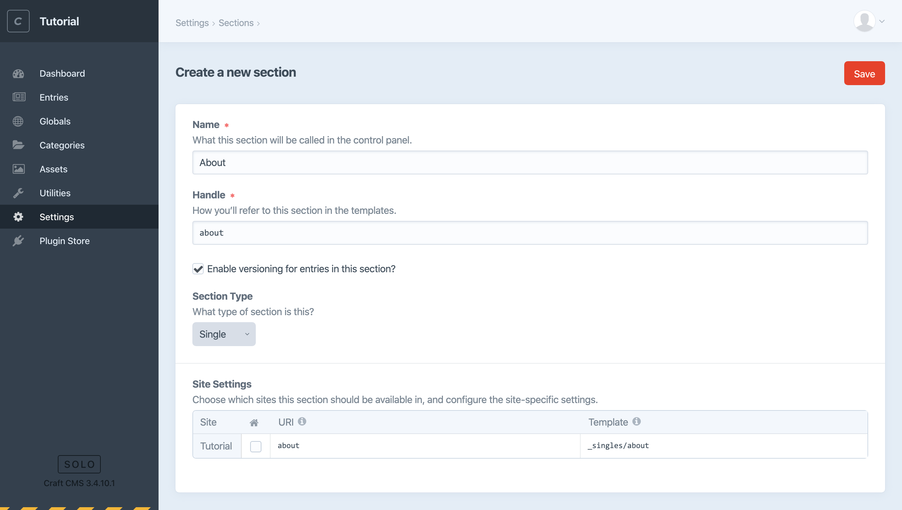
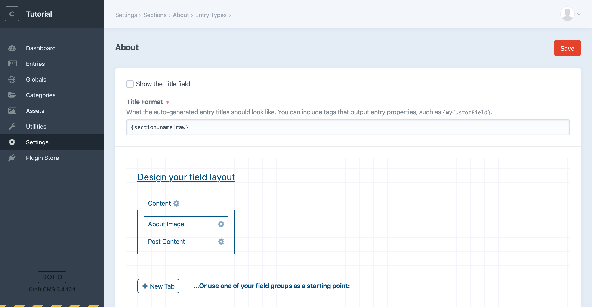

# Create an about page

Sometimes you’ll have unique, one-off pages that don’t make sense as a Section. Unlike the content you might store in Globals, however, each page *would* need to live at its own URL. A Single is perfect for this.

Let’s create a Single for an “About” page that will include a headshot and bio.

We’ll want to start again with our fields. To keep things tidy, we’ll create a volume for storing generic images and add an Assets field that uses it. Rather than create a new field for the about page content this time, we’ll re-use the Matrix block we created earlier.

## Create an Asset Volume

First, let’s add a volume for generic images. We’ll probably need images later that we don’t want to confuse with other images meant specifically for blog posts.

1. In the `assets` directory you created earlier, create a new subdirectory named `general`.
2. Back in the Craft CMS control panel, navigate to **Settings** → **Assets**.
3. Choose **+ New volume**.
4. Enter the name “General” and set the following:
    - **Assets in this volume have public URLs**: on/enabled
    - **Base URL**: `@web/assets/general`
    - **File System Path**: `@webroot/assets/general`
5. Save the Asset Volume.

## Create an Assets Field

Now let’s create a new Assets field for the about page image, telling it to limit available uploads to the new volume we just created.

1. Navigate to **Settings** → **Fields**.
2. Create a “Singles Fields” field group, then choose **+ New field**.
3. Create a field called “About Image” entering the following:
    - **Field Type**: Assets
    - **Restrict uploads to a single folder?**: checked/enabled
        - **Default Asset Location**: General
    - **Restrict allowed file types?**: checked/enabled
        - Select **Image** to ensure content editors can only select files that are images
4. Save the field.

## Create a Single

Now we can create the about page single:

1. Navigate to **Settings** → **Sections** and choose **+ New section**.
2. Enter “About” for the section name.
3. To make this new section a single, select “Single” from the **Section Type** dropdown menu. Notice that the Site Settings change to take a single URI rather than an Entry URI Format that would be required for a Section.
4. Enter `about` for **URI**, and `_singles/about` for **Template**.
5. Save this section.

<BrowserShot url="https://tutorial.nitro/admin/settings/sections/new" :link="false" caption="Settings for the new about single.">

</BrowserShot>

We’ll follow the same process we did for the blog to add fields to our new about single:

1. Navigate to **Settings** → **Sections** and choose **Edit entry type** to the right of the “About” single.
2. Create a “Content” tab and drag the “About Image” and “Post Content” fields to it. (Notice we’re re-using the “Post Content” field we created for blog entries.)
3. Save the entry type.

<BrowserShot url="https://tutorial.nitro/admin/settings/sections/2/entrytypes/2" :link="false" caption="The new about single’s field layout configuration.">

</BrowserShot>

::: tip
You could also follow the same steps to create a Single for the home page (checking the little home icon), and once more for the blog landing page. But we don’t need to worry about either of those right now.
:::
