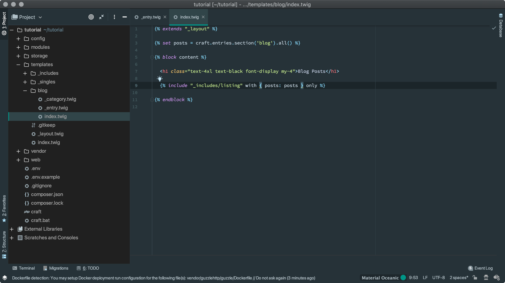

# Choose a code editor

The files Craft installs on your computer are all stored in plain text.

One benefit of plain text files is they’re extremely portable. You don’t need any special software to open and edit them, so anyone working with your site’s code could use their favorite application. We’ll start editing a few of these files to configure our site, and others later to customize what it looks like.

While you could get away with using TextEdit.app, Notepad, or Text Editor, it’s a good idea to use a code editor because it’ll make things easier later on. Code editors...

- make it easy to work with multiple files
- add color coding and helpful tools depending on the file type you’re working with
- handle invisible characters like spaces and returns carefully, which can cause annoying problems across operating systems
- usually include convenient features and plugins for, as you might expect, working with code

An excellent, popular code editor is [Visual Studio Code](https://code.visualstudio.com/), which is available for free on macOS, Windows, and Linux.

Some PHP developers prefer [PhpStorm](https://www.jetbrains.com/phpstorm/), a more complex and specialized commercial Integrated Development Environment (IDE) specifically geared toward PHP development.

There are plenty of other options you could use, just know the rest of our steps and screenshots in this tutorial will assume you’re using VS Code.
