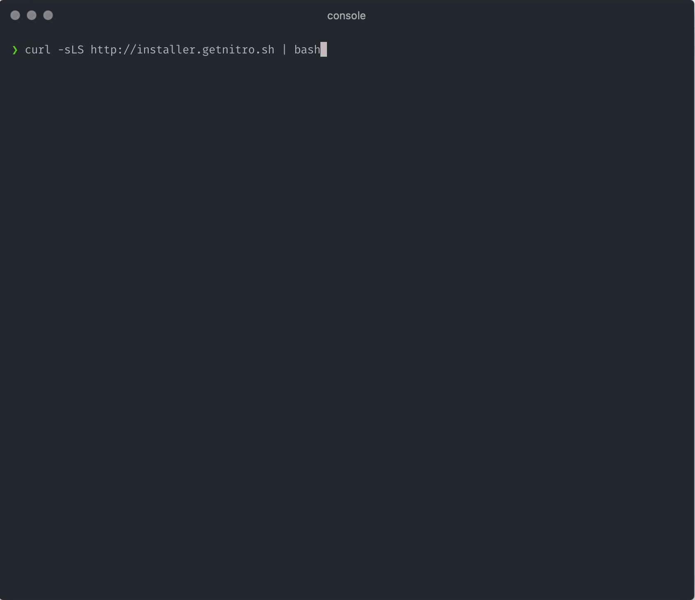

# Set up a development stack

The word “stack” refers to the web software that’s needed to work with Craft CMS, which is detailed in [Craft’s minimum requirements](/3.x/requirements.md).

Like your workstation, a web server can run different operating systems and apps. Web servers, however, use an OS and software specifically for running websites where common bundles of web software are referred to as “stacks”. (You’ve probably heard of a “full stack developer”, which means someone has experience with each of the software components in a particular stack.)

Craft can run on a number of different stacks, but the main ingredients are...

- **PHP**: the programming language in which Craft is written.
- **A database**: the place where content and most information is stored, sort of like a collection of Excel files used by code that can work with lots of data quickly. Commonly MySQL or PostgreSQL.
- **A web server**: the software that listens for requests made by your web browser, hands them off to a web application (like Craft), and gives a response back to the browser. Commonly Apache or nginx.

The best way to get working quickly is to use a pre-packaged web stack that runs on your operating system. The good news is that you’ve got plenty of options no matter what OS you’re using. The bad news is that the _best_ option depends on your OS and whatever software you’ve already installed.

::: warning
You won’t be able to set a web root until we get to installing Craft—skip that part and we’ll come back to it.
:::

## Set up Craft Nitro

We’ll walk through setup using [Nitro](/nitro/), a tool for managing your local development environment on macOS, Windows, and Linux.

### Why Nitro?

Before we dive in, here’s why we’re going to use Nitro:

- It’s made and supported by the Craft CMS team to simplify local development.
- It’s free, available on multiple platforms, and straightforward to install.
- It runs its included software inside a virtual environment, which can be updated, rebuilt, and destroyed without affecting your system.
- It supports running multiple projects, including non-Craft ones, so it’s useful for the long haul.

Some other options are limited to a specific OS, rely on your system software, or end up being complicated to manage. Nitro offers a nice balance of portability, flexibility, and simplicity.

Nitro uses [Multipass](https://multipass.run/) to efficiently set up and manage web servers inside your computer. If you decide you’d rather use something else, you can safely and easily [uninstall Nitro and Multiplass](/nitro/installation.md#uninstalling-nitro).

### Step 1: Install Multipass

Visit <https://multipass.run/#install>, choose the installer for your operating system, and run it.

::: tip
You can alternatively install Multipass with [brew](https://brew.sh/), [snap](https://snapcraft.io/), or [chocolatey](https://chocolatey.org/). If you aren’t already using any of those, it’ll be easiest to stick with the Multipass installer.
:::

### Step 2: Install Nitro

Run the following terminal command:

```sh
bash <(curl -sLS http://installer.getnitro.sh)
```



### Step 3: Create a Nitro Machine

Before adding a development server, we first have to create a Nitro machine. This is like creating a new computer just for web development, and if you’ve ever set up a VPS with a hosting provider that’s exactly what we’re doing in this step—but your PC is the data center and Multipass virtualizes the new machine.

To create a machine, run this terminal command:

```sh
nitro init
```

Follow the prompts to create your machine.


This will be the longest part of the install process, as the machine is built and initialized.

Once complete, you will have a Multipass machine called `nitro-dev`, and a new configuration file for the machine stored at `~/.nitro/nitro-dev.yaml`.

### Step 4: Add a Site to the Machine

When we install Craft CMS, or any PHP application, the project files will rely on a _web root_ for files that need to be publicly available on the internet. This is often named `public/`, `public_html/`, or in Craft’s case `web/`.

In this step, we’ll create a site that has the Nitro machine set up a special domain name—`tutorial.test`—and map it to our project’s web root.

If you’ve not installed Craft CMS yet, that’s okay. You can either point to the directory to be created, or come back to this step after installation.

At this point, it’ll be a good idea to create a folder on your disk you’ll use for setting up projects if you don’t already have one. We’ll assume here that you use `~/projects/`, which is the same as `/Users/bjorn/projects` on a Mac. Each project should live in a subfolder. In this case we’ll install Craft CMS in a project folder called `tutorial`. The full path on macOS will look like `/Users/bjorn/projects/tutorial`, and on Windows it would look like `C:\Users\bjorn\projects\tutorial`.

::: warning
The home folder path alias `~/` can only be used on macOS and Linux. With Windows, you must supply the full path instead, like `C:\Users\bjorn\projects\tutorial`.
:::

1. Once you’ve created a project folder, navigate to it in your terminal:

```sh
cd ~/projects/tutorial
```

2. Run `nitro add` and follow the prompts.

- hostname: `tutorial.test`
- webroot: `web`
- apply changes: `yes`
- password (for mapping `tutorial.test`): [your operating system password]

The whole process will look something like this when you’re finished:

```sh
nitro add
→ What should the hostname be? tutorial.test
→ Where is the webroot? web
✔ tutorial.test has been added to nitro.yaml.
→ apply nitro.yaml changes now? yes
✔ Applied the changes and added tutorial.test to nitro-dev
Adding tutorial.test to your hosts file
Password:
✔ tutorial.test added successfully!
```

You should now be able to visit `http://tutorial.test` in your browser and get a 404 error message. That’s exactly what we want, because next we’ll add the files that actually make the site go!

<BrowserShot url="http://tutorial.test" :link="false">

</BrowserShot>

## Other local environments

You can also choose one of the following guides to set up a development environment on your OS.

### MacOS, Windows, and Linux

- [Homestead](https://laravel.com/docs/6.x/homestead)
- [DDEV](https://ddev.readthedocs.io/en/stable/)
- [Lando](https://lando.dev/)

### MacOS

- [Laravel Valet](https://laravel.com/docs/7.x/valet)
- [VirtualHostX](https://clickontyler.com/virtualhostx/)
- [MAMP Pro](https://www.mamp.info/en/mamp-pro/windows/)

### Windows

- [WAMP](http://www.wampserver.com/en/)
- [AMPPS](https://www.ampps.com/)
- [XAMPP](https://www.apachefriends.org/index.html)

Once you’ve set up your local development environment, we’re ready to install Craft CMS!
