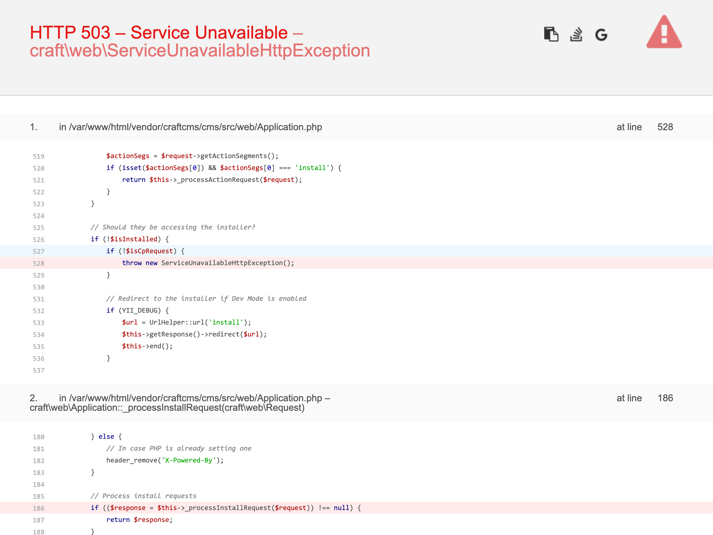

# Set up a development stack

The word “stack” refers to the web software that’s needed to work with Craft CMS, which is detailed in [Craft’s minimum requirements](/3.x/requirements.md).

Like your workstation, a web server can run different operating systems and apps. Web servers, however, use an OS and software specifically for running websites. Common bundles of web software are referred to as “stacks.” (You’ve probably heard of a “full stack developer”, which means someone having experience with each of the software components of a particular stack.)

Craft can run on a few different stacks, but the main ingredients are...

- **PHP** – programming language in which Craft is written.
- **A database** – place where content is stored, sort of like a collection of Excel files used by code that can work with lots of data quickly. Commonly MySQL or PostgreSQL.
- **A web server** – software that listens for requests made by your web browser, hands them off to a web application (like Craft), and gives a response back to the browser. Commonly Apache or nginx.

The best way to get working quickly is to use a pre-packaged web stack that runs on your operating system. We’ll walk through setup using [Craft Nitro](/nitro/2.x/), a tool for managing your local development environment on macOS, Windows, and Linux.

## Why Nitro?

Before we dive in, here’s why we’re going to use Nitro:

- It’s the fastest way to get a Craft install up and running.
- It’s made and supported by the Craft CMS team to simplify local development.
- It’s free, available on multiple platforms, and straightforward to install.
- It runs its included software inside a virtual environment, which can be updated, rebuilt, and destroyed without affecting your system.
- It supports running multiple projects, including non-Craft ones, so it’s useful for the long haul.

Some other options are limited to a specific OS, rely on your system software, or end up being complicated to manage. Nitro offers a nice balance of portability, flexibility, and simplicity.

Nitro uses [Docker](https://www.docker.com/) to efficiently manage web servers inside your computer. If you decide you’d rather use something else you can safely and easily [uninstall Nitro](/nitro/2.x/installation.md#uninstalling-nitro).

## Step 1: Install Docker Desktop

Visit <https://www.docker.com/products/docker-desktop>, choose the installer for your operating system, and run it. Make sure you start Docker Desktop after you’ve installed it.

::: tip
Linux doesn’t have a Docker Desktop app, you’ll need to install Docker Engine.\
See step 1 of [Installing Nitro for Linux](/nitro/2.x/installation.html#installing-nitro-for-linux).
:::

## Step 2: Install and Initialize Nitro

There are a few ways to [install Nitro](/nitro/2.x/installation.md), but one of the quickest is to run this terminal command:

```sh
bash <(curl -sLS http://installer.getnitro.sh)
```

::: warning
Be sure to check the [installation instructions](/nitro/2.x/installation.md) for your operating system.
:::

The longest part of the install process is where Nitro downloads and initializes itself. It will prompt you for some settings, where pressing <kbd>return</kbd> will often accept a sensible default.

At the very end Nitro may prompt you for your machine’s admin password so it can edit a hosts file in order for its custom domains to work.

If everything goes well, the process should look similar to this:

<ToggleTip>

```
$ bash <(curl -sLS http://installer.getnitro.sh)
Downloading package https://github.com/craftcms/nitro/releases/download/2.0.7/nitro_darwin_x86_64.tar.gz to /Users/oli/temp_nitro_extract/nitro_darwin_x86_64.tar.gz

x CHANGELOG.md
x LICENSE.md
x README.md
x nitro

Download complete.

Running with sufficient permissions to attempt to move nitro to /usr/local/bin

Nitro 2.0.7 has been installed to /usr/local/bin

Setting up Nitro…
Would you like to use MySQL [Y/n]?
Select the version of MySQL
  1. 8.0
  2. 5.7
  3. 5.6
Enter your selection: 1
Would you like to use PostgreSQL [Y/n]?
Select the version of PostgreSQL
  1. 13
  2. 12
  3. 11
  4. 10
  5. 9
Enter your selection: 1
Would you like to use Redis [Y/n]?
  … adding redis service ✓
Checking Nitro…
  … creating network ✓
  … pulling image ✓
  … creating volume ✓
  … creating proxy ✓
Checking network…
  ✓ network ready
Checking proxy…
  ✓ proxy ready
Checking databases…
  … checking mysql-8.0-3306.database.nitro   … downloading mysql:8.0 ✓
  … checking postgres-13-5432.database.nitro ✓
Checking services…
  … checking dynamodb service ✓
  … checking mailhog service ✓
  … checking redis service ✓
Checking proxy…
  … updating proxy ✓
Updating hosts file (you might be prompted for your password)
Password:
  … getting Nitro’s root site certificate ✓
Installing certificate (you might be prompted for your password)
Nitro certificates are now trusted 🔒
Nitro is ready! 🚀

$
```

</ToggleTip>

This is like creating a new computer just for web development, and if you’ve ever set up a VPS with a hosting provider that’s similar to what we’re doing in this step—but your PC is the data center and Nitro uses Docker to set up pieces for the development environment.

Once complete, you’ll have a configuration file stored at `~/.nitro/nitro.yaml` and be ready to add sites.

## Step 3: Create a Site

Once we have a local development environment, we can start creating sites.

### What we’re about to do

The `nitro create` command lets us breeze through setup steps we’d otherwise need to perform manually:

1. Creates a new folder from our current directory.
1. Pulls required files from a Git repository to the newly-created project folder.
2. Creates a new database where Craft will store content.
3. Installs Composer dependencies so Craft has everything it needs to run.
4. Edits a special `.env` file that tells Craft what settings to use for the local environment.

Broadly, we’re setting up the files and database for a new web app, with a custom local domain name to access it in a web browser.

When we install Craft CMS (or any PHP web app) the project will rely on a _web root_ for files that need to be publicly available on the internet. This is a directory often named `public/`, `public_html/`, or in Craft’s case `web/`.

### Let’s do it!

1. From your terminal, use the `cd` command to navigate to the root of your project folder.
    ```sh
    cd ~/dev
    ```

    ::: warning
    The home folder path alias `~/` can only be used on macOS and Linux. With Windows, you must supply the full path instead, like `C:\Users\oli\dev`.
    :::

2. Run `nitro create tutorial`.
3. Choose the following for the prompts:
    - hostname: <kbd>return</kbd> (tutorial.nitro)
    - webroot: <kbd>return</kbd> (web)
    - PHP version: <kbd>1</kbd> (8.0)
    - add a database? <kbd>return</kbd> (Y)
    - database: <kbd>1</kbd> (mysql-8.0-3306.database.nitro)
    ::: tip
    Nitro only prompts for a database engine if you added more than one; don’t worry if you don’t have to make a selection!
    :::
    - database name: `tutorial`
    - update the env file?: <kbd>return</kbd> (Y)

The whole process will look something like this when you’re finished:

<ToggleTip>

```
$ nitro create tutorial
Downloading https://github.com/craftcms/craft/archive/HEAD.zip ...
  … setting up project ✓
New site downloaded 🤓
Enter the hostname [tutorial.nitro]:
  ✓ setting hostname to tutorial.nitro
  ✓ adding site ~/tutorial
Enter the webroot for the site [web]:
  ✓ using webroot web
Choose a PHP version:
  1. 8.0
  2. 7.4
  3. 7.3
  4. 7.2
  5. 7.1
  6. 7.0
Enter your selection: 1
  ✓ setting PHP version 8.0
Add a database for the site [Y/n]
Select the database engine:
  1. mysql-8.0-3306.database.nitro
  2. postgres-13-5432.database.nitro
Enter your selection: 1
Enter the new database name: tutorial
  … creating database tutorial ✓
Database added 💪
Should we update the env file? [Y/n]
.env updated!
Preparing composer...
Loading composer repositories with package information
Updating dependencies
Lock file operations: 86 installs, 0 updates, 0 removals
  - Locking cebe/markdown (1.2.1)
  - Locking composer/ca-bundle (1.2.9)
  - Locking composer/composer (2.0.12)
  - Locking composer/semver (3.2.4)
  - Locking composer/spdx-licenses (1.5.5)
  - Locking composer/xdebug-handler (1.4.6)
  - Locking craftcms/cms (3.6.12)
  - Locking craftcms/oauth2-craftid (1.0.0.1)
  - Locking craftcms/plugin-installer (1.5.7)
  - Locking craftcms/server-check (1.2.0)
  - Locking creocoder/yii2-nested-sets (0.9.0)
  - Locking defuse/php-encryption (v2.3.1)
  - Locking doctrine/lexer (1.2.1)
  - Locking egulias/email-validator (3.1.1)
  - Locking elvanto/litemoji (3.0.1)
  - Locking enshrined/svg-sanitize (0.14.0)
  - Locking ezyang/htmlpurifier (v4.13.0)
  - Locking guzzlehttp/guzzle (7.3.0)
  - Locking guzzlehttp/promises (1.4.1)
  - Locking guzzlehttp/psr7 (1.8.1)
  - Locking justinrainbow/json-schema (5.2.10)
  - Locking laminas/laminas-escaper (2.7.0)
  - Locking laminas/laminas-feed (2.14.1)
  - Locking laminas/laminas-stdlib (3.3.1)
  - Locking laminas/laminas-zendframework-bridge (1.2.0)
  - Locking league/flysystem (1.1.3)
  - Locking league/mime-type-detection (1.7.0)
  - Locking league/oauth2-client (2.6.0)
  - Locking mikehaertl/php-shellcommand (1.6.4)
  - Locking nikic/php-parser (v4.10.4)
  - Locking opis/closure (3.6.2)
  - Locking paragonie/random_compat (v9.99.100)
  - Locking phpdocumentor/reflection-common (2.2.0)
  - Locking phpdocumentor/reflection-docblock (5.2.2)
  - Locking phpdocumentor/type-resolver (1.4.0)
  - Locking phpoption/phpoption (1.7.5)
  - Locking pixelandtonic/imagine (1.2.4.1)
  - Locking psr/container (1.1.1)
  - Locking psr/http-client (1.0.1)
  - Locking psr/http-message (1.0.1)
  - Locking psr/log (1.1.3)
  - Locking psy/psysh (v0.10.8)
  - Locking ralouphie/getallheaders (3.0.3)
  - Locking react/promise (v2.8.0)
  - Locking seld/cli-prompt (1.0.4)
  - Locking seld/jsonlint (1.8.3)
  - Locking seld/phar-utils (1.1.1)
  - Locking swiftmailer/swiftmailer (v6.2.7)
  - Locking symfony/console (v5.2.6)
  - Locking symfony/deprecation-contracts (v2.4.0)
  - Locking symfony/filesystem (v5.2.6)
  - Locking symfony/finder (v5.2.4)
  - Locking symfony/polyfill-ctype (v1.22.1)
  - Locking symfony/polyfill-iconv (v1.22.1)
  - Locking symfony/polyfill-intl-grapheme (v1.22.1)
  - Locking symfony/polyfill-intl-idn (v1.22.1)
  - Locking symfony/polyfill-intl-normalizer (v1.22.1)
  - Locking symfony/polyfill-mbstring (v1.22.1)
  - Locking symfony/polyfill-php72 (v1.22.1)
  - Locking symfony/polyfill-php73 (v1.22.1)
  - Locking symfony/polyfill-php80 (v1.22.1)
  - Locking symfony/process (v5.2.4)
  - Locking symfony/service-contracts (v2.4.0)
  - Locking symfony/string (v5.2.6)
  - Locking symfony/var-dumper (v5.2.6)
  - Locking symfony/yaml (v5.2.5)
  - Locking true/punycode (v2.1.1)
  - Locking twig/twig (v2.14.4)
  - Locking vlucas/phpdotenv (v3.6.8)
  - Locking voku/anti-xss (4.1.32)
  - Locking voku/arrayy (7.8.9)
  - Locking voku/email-check (3.1.0)
  - Locking voku/portable-ascii (1.5.6)
  - Locking voku/portable-utf8 (5.4.51)
  - Locking voku/stop-words (2.0.1)
  - Locking voku/stringy (6.4.1)
  - Locking voku/urlify (5.0.5)
  - Locking webmozart/assert (1.10.0)
  - Locking webonyx/graphql-php (v14.4.1)
  - Locking yii2tech/ar-softdelete (1.0.4)
  - Locking yiisoft/yii2 (2.0.41.1)
  - Locking yiisoft/yii2-composer (2.0.10)
  - Locking yiisoft/yii2-debug (2.1.16)
  - Locking yiisoft/yii2-queue (2.3.1)
  - Locking yiisoft/yii2-shell (2.0.4)
  - Locking yiisoft/yii2-swiftmailer (2.1.2)
Writing lock file
Installing dependencies from lock file (including require-dev)
Package operations: 86 installs, 0 updates, 0 removals
  - Downloading yiisoft/yii2-composer (2.0.10)
  - Downloading craftcms/plugin-installer (1.5.7)
  - Downloading cebe/markdown (1.2.1)
  - Downloading composer/ca-bundle (1.2.9)
  - Downloading composer/semver (3.2.4)
  - Downloading composer/spdx-licenses (1.5.5)
  - Downloading psr/log (1.1.3)
  - Downloading composer/xdebug-handler (1.4.6)
  - Downloading ezyang/htmlpurifier (v4.13.0)
  - Downloading craftcms/cms (3.6.12)
  - Downloading yiisoft/yii2 (2.0.41.1)
  - Downloading symfony/polyfill-mbstring (v1.22.1)
  - Downloading symfony/polyfill-php72 (v1.22.1)
  - Downloading symfony/polyfill-intl-normalizer (v1.22.1)
  - Downloading symfony/polyfill-intl-idn (v1.22.1)
  - Downloading symfony/polyfill-iconv (v1.22.1)
  - Downloading doctrine/lexer (1.2.1)
  - Downloading egulias/email-validator (3.1.1)
  - Downloading swiftmailer/swiftmailer (v6.2.7)
  - Downloading yiisoft/yii2-swiftmailer (2.1.2)
  - Downloading symfony/polyfill-php80 (v1.22.1)
  - Downloading symfony/process (v5.2.4)
  - Downloading yiisoft/yii2-queue (2.3.1)
  - Downloading opis/closure (3.6.2)
  - Downloading yiisoft/yii2-debug (2.1.16)
  - Downloading yii2tech/ar-softdelete (1.0.4)
  - Downloading webonyx/graphql-php (v14.4.1)
  - Downloading voku/stop-words (2.0.1)
  - Downloading voku/portable-ascii (1.5.6)
  - Downloading symfony/polyfill-intl-grapheme (v1.22.1)
  - Downloading voku/portable-utf8 (5.4.51)
  - Downloading voku/urlify (5.0.5)
  - Downloading voku/email-check (3.1.0)
  - Downloading symfony/polyfill-ctype (v1.22.1)
  - Downloading webmozart/assert (1.10.0)
  - Downloading phpdocumentor/reflection-common (2.2.0)
  - Downloading phpdocumentor/type-resolver (1.4.0)
  - Downloading phpdocumentor/reflection-docblock (5.2.2)
  - Downloading voku/arrayy (7.8.9)
  - Downloading voku/anti-xss (4.1.32)
  - Downloading paragonie/random_compat (v9.99.100)
  - Downloading defuse/php-encryption (v2.3.1)
  - Downloading voku/stringy (6.4.1)
  - Downloading twig/twig (v2.14.4)
  - Downloading true/punycode (v2.1.1)
  - Downloading symfony/deprecation-contracts (v2.4.0)
  - Downloading symfony/yaml (v5.2.5)
  - Downloading seld/cli-prompt (1.0.4)
  - Downloading pixelandtonic/imagine (1.2.4.1)
  - Downloading mikehaertl/php-shellcommand (1.6.4)
  - Downloading psr/http-message (1.0.1)
  - Downloading psr/http-client (1.0.1)
  - Downloading ralouphie/getallheaders (3.0.3)
  - Downloading guzzlehttp/psr7 (1.8.1)
  - Downloading guzzlehttp/promises (1.4.1)
  - Downloading guzzlehttp/guzzle (7.3.0)
  - Downloading league/oauth2-client (2.6.0)
  - Downloading league/mime-type-detection (1.7.0)
  - Downloading league/flysystem (1.1.3)
  - Downloading laminas/laminas-zendframework-bridge (1.2.0)
  - Downloading laminas/laminas-stdlib (3.3.1)
  - Downloading laminas/laminas-escaper (2.7.0)
  - Downloading laminas/laminas-feed (2.14.1)
  - Downloading enshrined/svg-sanitize (0.14.0)
  - Downloading elvanto/litemoji (3.0.1)
  - Downloading creocoder/yii2-nested-sets (0.9.0)
  - Downloading craftcms/server-check (1.2.0)
  - Downloading craftcms/oauth2-craftid (1.0.0.1)
  - Downloading symfony/finder (v5.2.4)
  - Downloading symfony/filesystem (v5.2.6)
  - Downloading symfony/string (v5.2.6)
  - Downloading psr/container (1.1.1)
  - Downloading symfony/service-contracts (v2.4.0)
  - Downloading symfony/polyfill-php73 (v1.22.1)
  - Downloading symfony/console (v5.2.6)
  - Downloading seld/phar-utils (1.1.1)
  - Downloading seld/jsonlint (1.8.3)
  - Downloading react/promise (v2.8.0)
  - Downloading justinrainbow/json-schema (5.2.10)
  - Downloading composer/composer (2.0.12)
  - Downloading nikic/php-parser (v4.10.4)
  - Downloading phpoption/phpoption (1.7.5)
  - Downloading vlucas/phpdotenv (v3.6.8)
  - Downloading symfony/var-dumper (v5.2.6)
  - Downloading psy/psysh (v0.10.8)
  - Downloading yiisoft/yii2-shell (2.0.4)
  0/86 [>---------------------------]   0%
  2/86 [>---------------------------]   2%
  8/86 [==>-------------------------]   9%
  9/86 [==>-------------------------]  10%
 12/86 [===>------------------------]  13%
 13/86 [====>-----------------------]  15%
 14/86 [====>-----------------------]  16%
 15/86 [====>-----------------------]  17%
 21/86 [======>---------------------]  24%
 22/86 [=======>--------------------]  25%
 23/86 [=======>--------------------]  26%
 25/86 [========>-------------------]  29%
 27/86 [========>-------------------]  31%
 28/86 [=========>------------------]  32%
 29/86 [=========>------------------]  33%
 38/86 [============>---------------]  44%
 39/86 [============>---------------]  45%
 40/86 [=============>--------------]  46%
 41/86 [=============>--------------]  47%
 44/86 [==============>-------------]  51%
 47/86 [===============>------------]  54%
 48/86 [===============>------------]  55%
 49/86 [===============>------------]  56%
 50/86 [================>-----------]  58%
 51/86 [================>-----------]  59%
 55/86 [=================>----------]  63%
 62/86 [====================>-------]  72%
 63/86 [====================>-------]  73%
 68/86 [======================>-----]  79%
 70/86 [======================>-----]  81%
 74/86 [========================>---]  86%
 75/86 [========================>---]  87%
 78/86 [=========================>--]  90%
 79/86 [=========================>--]  91%
 81/86 [==========================>-]  94%
 82/86 [==========================>-]  95%
 86/86 [============================] 100%
 86/86 [============================] 100%  - Installing yiisoft/yii2-composer (2.0.10): Extracting archive
  - Installing craftcms/plugin-installer (1.5.7): Extracting archive
  - Installing cebe/markdown (1.2.1): Extracting archive
  - Installing composer/ca-bundle (1.2.9): Extracting archive
  - Installing composer/semver (3.2.4): Extracting archive
  - Installing composer/spdx-licenses (1.5.5): Extracting archive
  - Installing psr/log (1.1.3): Extracting archive
  - Installing composer/xdebug-handler (1.4.6): Extracting archive
  - Installing ezyang/htmlpurifier (v4.13.0): Extracting archive
  - Installing craftcms/cms (3.6.12): Extracting archive
  - Installing yiisoft/yii2 (2.0.41.1): Extracting archive
  - Installing symfony/polyfill-mbstring (v1.22.1): Extracting archive
  - Installing symfony/polyfill-php72 (v1.22.1): Extracting archive
  - Installing symfony/polyfill-intl-normalizer (v1.22.1): Extracting archive
  - Installing symfony/polyfill-intl-idn (v1.22.1): Extracting archive
  - Installing symfony/polyfill-iconv (v1.22.1): Extracting archive
  - Installing doctrine/lexer (1.2.1): Extracting archive
  - Installing egulias/email-validator (3.1.1): Extracting archive
  - Installing swiftmailer/swiftmailer (v6.2.7): Extracting archive
  - Installing yiisoft/yii2-swiftmailer (2.1.2): Extracting archive
  - Installing symfony/polyfill-php80 (v1.22.1): Extracting archive
  - Installing symfony/process (v5.2.4): Extracting archive
  - Installing yiisoft/yii2-queue (2.3.1): Extracting archive
  - Installing opis/closure (3.6.2): Extracting archive
  - Installing yiisoft/yii2-debug (2.1.16): Extracting archive
  - Installing yii2tech/ar-softdelete (1.0.4): Extracting archive
  - Installing webonyx/graphql-php (v14.4.1): Extracting archive
  - Installing voku/stop-words (2.0.1): Extracting archive
  - Installing voku/portable-ascii (1.5.6): Extracting archive
  - Installing symfony/polyfill-intl-grapheme (v1.22.1): Extracting archive
  - Installing voku/portable-utf8 (5.4.51): Extracting archive
  - Installing voku/urlify (5.0.5): Extracting archive
  - Installing voku/email-check (3.1.0): Extracting archive
  - Installing symfony/polyfill-ctype (v1.22.1): Extracting archive
  - Installing webmozart/assert (1.10.0): Extracting archive
  - Installing phpdocumentor/reflection-common (2.2.0): Extracting archive
  - Installing phpdocumentor/type-resolver (1.4.0): Extracting archive
  - Installing phpdocumentor/reflection-docblock (5.2.2): Extracting archive
  - Installing voku/arrayy (7.8.9): Extracting archive
  - Installing voku/anti-xss (4.1.32): Extracting archive
  - Installing paragonie/random_compat (v9.99.100): Extracting archive
  - Installing defuse/php-encryption (v2.3.1): Extracting archive
  - Installing voku/stringy (6.4.1): Extracting archive
  - Installing twig/twig (v2.14.4): Extracting archive
  - Installing true/punycode (v2.1.1): Extracting archive
  - Installing symfony/deprecation-contracts (v2.4.0): Extracting archive
  - Installing symfony/yaml (v5.2.5): Extracting archive
  - Installing seld/cli-prompt (1.0.4): Extracting archive
  - Installing pixelandtonic/imagine (1.2.4.1): Extracting archive
  - Installing mikehaertl/php-shellcommand (1.6.4): Extracting archive
  - Installing psr/http-message (1.0.1): Extracting archive
  - Installing psr/http-client (1.0.1): Extracting archive
  - Installing ralouphie/getallheaders (3.0.3): Extracting archive
  - Installing guzzlehttp/psr7 (1.8.1): Extracting archive
  - Installing guzzlehttp/promises (1.4.1): Extracting archive
  - Installing guzzlehttp/guzzle (7.3.0): Extracting archive
  - Installing league/oauth2-client (2.6.0): Extracting archive
  - Installing league/mime-type-detection (1.7.0): Extracting archive
  - Installing league/flysystem (1.1.3): Extracting archive
  - Installing laminas/laminas-zendframework-bridge (1.2.0): Extracting archive
  - Installing laminas/laminas-stdlib (3.3.1): Extracting archive
  - Installing laminas/laminas-escaper (2.7.0): Extracting archive
  - Installing laminas/laminas-feed (2.14.1): Extracting archive
  - Installing enshrined/svg-sanitize (0.14.0): Extracting archive
  - Installing elvanto/litemoji (3.0.1): Extracting archive
  - Installing creocoder/yii2-nested-sets (0.9.0): Extracting archive
  - Installing craftcms/server-check (1.2.0): Extracting archive
  - Installing craftcms/oauth2-craftid (1.0.0.1): Extracting archive
  - Installing symfony/finder (v5.2.4): Extracting archive
  - Installing symfony/filesystem (v5.2.6): Extracting archive
  - Installing symfony/string (v5.2.6): Extracting archive
  - Installing psr/container (1.1.1): Extracting archive
  - Installing symfony/service-contracts (v2.4.0): Extracting archive
  - Installing symfony/polyfill-php73 (v1.22.1): Extracting archive
  - Installing symfony/console (v5.2.6): Extracting archive
  - Installing seld/phar-utils (1.1.1): Extracting archive
  - Installing seld/jsonlint (1.8.3): Extracting archive
  - Installing react/promise (v2.8.0): Extracting archive
  - Installing justinrainbow/json-schema (5.2.10): Extracting archive
  - Installing composer/composer (2.0.12): Extracting archive
  - Installing nikic/php-parser (v4.10.4): Extracting archive
  - Installing phpoption/phpoption (1.7.5): Extracting archive
  - Installing vlucas/phpdotenv (v3.6.8): Extracting archive
  - Installing symfony/var-dumper (v5.2.6): Extracting archive
  - Installing psy/psysh (v0.10.8): Extracting archive
  - Installing yiisoft/yii2-shell (2.0.4): Extracting archive
  0/78 [>---------------------------]   0%
  5/78 [=>--------------------------]   6%
  9/78 [===>------------------------]  11%
 11/78 [===>------------------------]  14%
 12/78 [====>-----------------------]  15%
 14/78 [=====>----------------------]  17%
 17/78 [======>---------------------]  21%
 20/78 [=======>--------------------]  25%
 25/78 [========>-------------------]  32%
 32/78 [===========>----------------]  41%
 39/78 [==============>-------------]  50%
 40/78 [==============>-------------]  51%
 47/78 [================>-----------]  60%
 50/78 [=================>----------]  64%
 55/78 [===================>--------]  70%
 62/78 [======================>-----]  79%
 68/78 [========================>---]  87%
 73/78 [==========================>-]  93%
 74/78 [==========================>-]  94%
 75/78 [==========================>-]  96%
 76/78 [===========================>]  97%
 77/78 [===========================>]  98%
 78/78 [============================] 100%33 package suggestions were added by new dependencies, use `composer suggest` to see details.
Generating optimized autoload files
49 packages you are using are looking for funding.
Use the `composer fund` command to find out more!
> @php -r "file_exists('.env') || copy('.env.example', '.env');"
> @php -r "unlink('composer.json');"
> @php -r "rename('composer.json.default', 'composer.json');"
Generating optimized autoload files
Generated optimized autoload files containing 4223 classes
> @php craft setup/welcome

   ______ .______          ___       _______ .___________.
  /      ||   _  \        /   \     |   ____||           |
 |  ,----'|  |_)  |      /  ^  \    |  |__   `---|  |----`
 |  |     |      /      /  /_\  \   |   __|      |  |
 |  `----.|  |\  \----./  _____  \  |  |         |  |
  \______|| _| `._____/__/     \__\ |__|         |__|

     A       N   E   W       I   N   S   T   A   L   L
               ______ .___  ___.      _______.
              /      ||   \/   |     /       |
             |  ,----'|  \  /  |    |   (----`
             |  |     |  |\/|  |     \   \
             |  `----.|  |  |  | .----)   |
              \______||__|  |__| |_______/


Generating an application ID ... done (CraftCMS--89e69962-ca8d-4380-ae30-2308d26ccc03)
Generating a security key ... done (fmhe0L7XVZmfZ_64kd6zmjB3Pe5a4s_3)

Welcome to Craft CMS!

Run the following command if you want to setup Craft from your terminal:

    php /app/craft setup

composer create-project completed 🤘
Checking network…
  ✓ network ready
Checking proxy…
  ✓ proxy ready
Checking databases…
  … checking mysql-8.0-3306.database.nitro ✓
  … checking postgres-13-5432.database.nitro ✓
Checking services…
  … checking dynamodb service ✓
  … checking mailhog service ✓
  … checking redis service ✓
Checking sites…
  … checking tutorial.nitro ✓
Checking proxy…
  … updating proxy ✓
Updating hosts file (you might be prompted for your password)

$
```

</ToggleTip>

You should now be able to visit `https://tutorial.nitro` in your browser and get a 503 error message. That’s exactly what we want, because Craft isn’t installed.

<BrowserShot url="https://tutorial.nitro" :link="false">

</BrowserShot>

## Other local environments

You can also choose one of the following guides to set up a development environment on your OS.

### macOS, Windows, and Linux

- [Homestead](https://craftcms.com/knowledge-base/craft-laravel-homestead)
- [DDEV](https://ddev.readthedocs.io/en/stable/)
- [Lando](https://lando.dev/)

### macOS

- [Laravel Valet](https://laravel.com/docs/7.x/valet)
- [VirtualHostX](https://clickontyler.com/virtualhostx/)
- [MAMP Pro](https://www.mamp.info/en/mamp-pro/windows/)

### Windows

- [WAMP](http://www.wampserver.com/en/)
- [AMPPS](https://www.ampps.com/)
- [XAMPP](https://www.apachefriends.org/index.html)

Once you’ve set up your local development environment, we’re ready to install Craft CMS!
