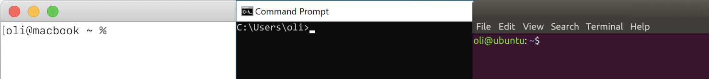

# Get to know your terminal

Every operating system comes with a text-based command line interface (CLI) for inputting commands. This provides a powerful way of doing lots of things beyond the graphical user interface you already know.

::: tip
If you’ve time traveled from the past, your operating system may _only_ have a command line interface. Our GUIs are going to blow your mind.
:::

### Find your OS terminal



- On macOS, the default console is [Terminal.app](https://support.apple.com/guide/terminal/welcome/mac).
- On Windows, the default console is called [Command Prompt](https://www.lifewire.com/command-prompt-2625840).
- On Ubuntu Linux, the default console is called [Terminal](https://ubuntu.com/tutorials/command-line-for-beginners).

There are other apps like [Hyper](https://hyper.is/) (cross-platform) and [iTerm2](https://www.iterm2.com/) (Mac), but your system’s terminal will work fine!

### Run a command

Once you’ve launched your terminal, you’ll be greeted by an empty prompt that’s ready for input.

Later on we’ll refer to “running” commands, in a format that look like this:

```bash
echo "hello world"
```

In this example, you would copy+paste or type `echo "hello world"` exactly as you see it above, then hit <kbd>return</kbd> or <kbd>enter</kbd> to execute the command. The result, or output, will be printed and you’ll be returned to the empty prompt.

The `echo` console command just repeats back whatever you pass to it. Here’s what you'd see after running that command:

```bash
echo "hello world"
hello world
```

Try it! Copy and paste `echo "hello world"` into your terminal and hit <kbd>return</kbd> or <kbd>enter</kbd>. If your console says “hello world” back, you know everything you need to run a terminal command!

### Navigate directories

We’ll eventually want to run commands alongside your site’s code, so you’ll need to know how to get there.

Every time you use the console, your commands will be executed from a specific directory on your system even when they’re not doing anything to files. This context is called the _working directory_. You can change the working directory, much like you would using a file browser, using terminal commands.

To output the current working directory:

- Run `pwd` on Mac or Linux.
- Run `cd` on Windows.

This will print the current path you’re working in.

::: tip
The `pwd` command stands for “print working directory”, and `cd` stands for “change directory”. Commands like this are shortened so they’re quicker to type.
:::

To list files in the current directory:

- Run `ls` on Mac or Linux.
- Run `dir` on Windows.

To move _up_ one directory, run `cd ..` on any platform.

To move _down_ into a specific directory, like `Documents`, use `cd Documents` on any platform.

To start at the topmost directory on your disk, use `cd /` on any platform.

To start from your user directory, use `cd ~` on Mac or Linux and `cd %HOMEPATH%` on Windows.

You can always use these commands to see where you’re at or move to a different folder on your machine.

Once you’re able to pick a folder and navigate to it, you’re all set!
