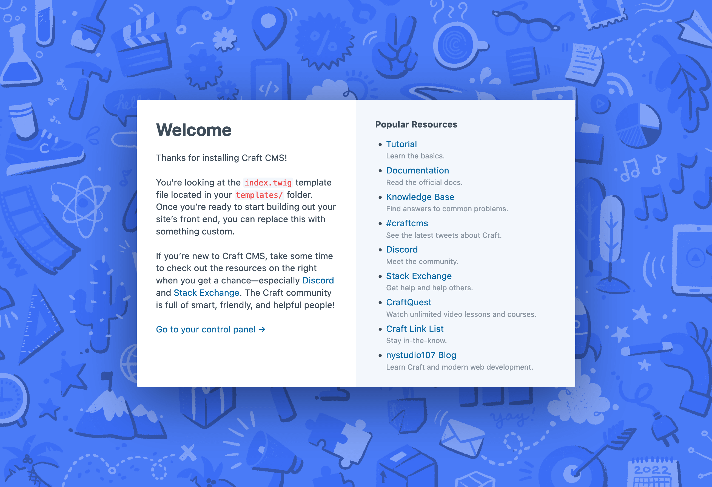

# Install Craft CMS

At this point you should have a local development environment running with a database and know how to run console commands. Now it’s time to install Craft CMS.

The first step is to decide where you want your Craft project to live. If you already have a place you like to store dev projects, create a new `tutorial/` folder in there. Otherwise, you might consider creating a `dev/tutorial/` folder within your system’s home folder,  (e.g. `~/<username>/dev/tutorial/`).

In your terminal, go to your `tutorial` folder, and run the following command to configure a new DDEV project there:

```sh
ddev config --project-type=php --php-version=8.0
```

::: tip
This will configure ddev to host your site at https://tutorial.ddev.site, where the subdomain name comes from the folder you created. To use a different ddev subdomain pass the `--project-name` argument, for example `--project-name=my-craft-tutorial`.
:::

Then run the following command to download the [craftcms/craft](https://github.com/craftcms/craft/) starter project contents, and install its Composer dependencies (namely [craftcms/cms](https://github.com/craftcms/cms/)):

```shell
ddev composer create -y craftcms/craft
```

At the end of that command, it will ask whether you’d like to begin the setup. Go ahead and answer `yes`. Then answer the subsequent prompts as follows:

- **Which database driver are you using? (mysql or pgsql)** → `mysql` (default)
- **Database server name or IP address** → `db`
- **Database port** → `3306` (default)
- **Database username** → `db`
- **Database password** → `db`
- **Database name** → `db`
- **Database table prefix** → _(leave blank)_

Answer `yes` to the prompt on whether to install Craft now, and answer the remaining prompts as you like. The only one that matters is **Site URL**, which you should answer with `https://tutorial.ddev.site`.

::: warning
The Site URL subdomain should match the ddev project name. If you specified a project name in the `ddev config` command, use that in place of `tutorial` here. For example `https://my-craft-tutorial.ddev.site`.
:::

Now set your DDEV web server’s document root to the `web/` folder like so:

```sh
ddev config --docroot=web
```

Finally, you’re ready to start up your new web server:

```sh
ddev start
```

In your browser, you should be able to head over to <https://tutorial.ddev.site/> and see the Craft CMS welcome template.

<BrowserShot url="https://tutorial.ddev.site/" :link="true">

</BrowserShot>
