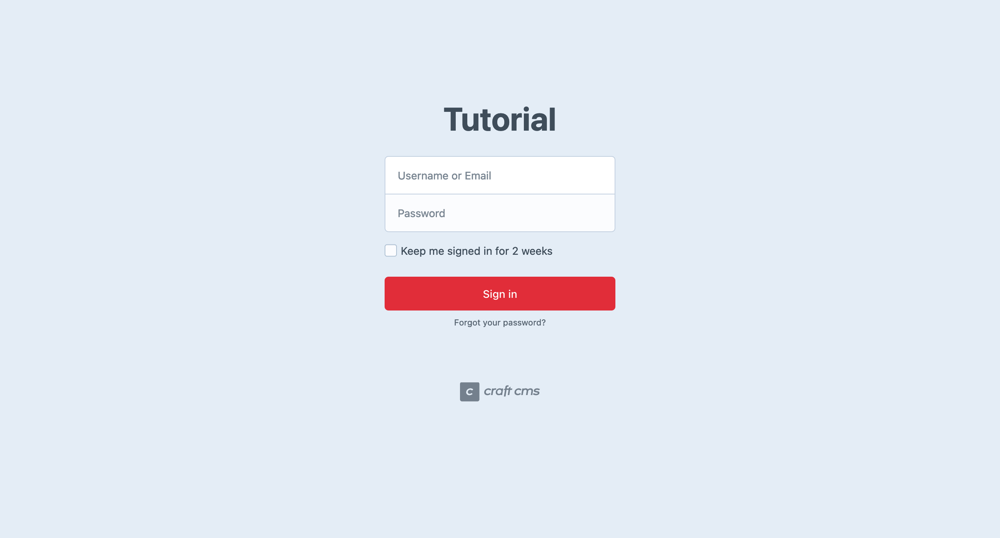
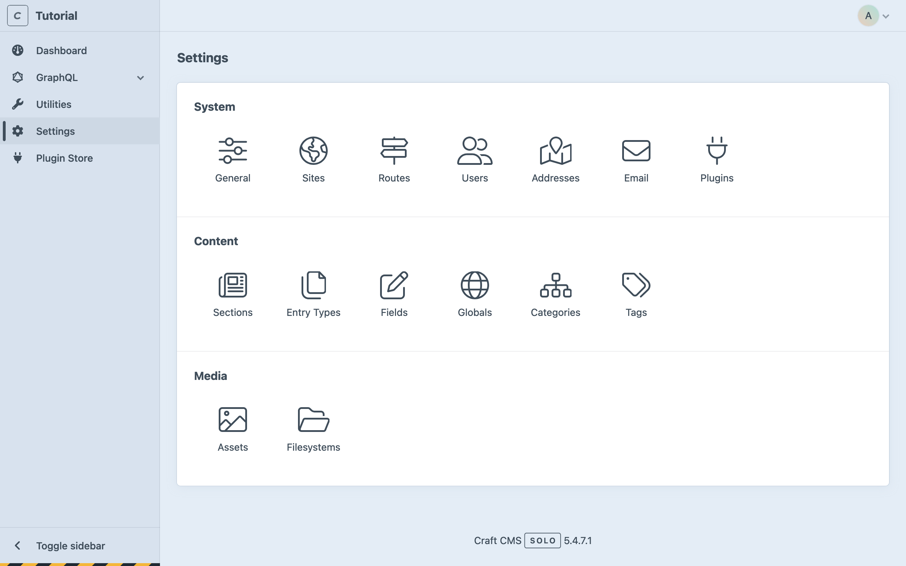

# Control Panel Tour

You should have three project windows up, at this point:

1. A terminal, which we used to install Craft and DDEV;
1. An editor, with the project folder;
1. A browser, with Craft’s default welcome page loaded;

## Signing In

You can reach the control panel in a few ways:

- Add `/admin` to tutorial project’s URL in your browser;
- Enter `ddev launch admin` in your terminal to open a second browser;
- Click the **Go to your control panel &rarr;** link from the [welcome screen](./README.md#setup);

Because this is the first time accessing the control panel, you will be greeted with a login screen:

<BrowserShot url="https://tutorial.ddev.site/admin/login" :link="false" caption="Craft’s login screen.">

</BrowserShot>

Enter the username and password you provided during installation, then click **Sign In**.

::: tip
Forgot to write down your credentials? No problem—just run this command in your terminal:

```sh
ddev craft users/set-password me@domain.com
```

`me@domain.com` should be the email or username you provided during setup. If you lost track of both of those values, try `1`—that will always be the ID of the first user.
:::

## Dashboard

<BrowserShot
    url="https://tutorial.ddev.site/admin/dashboard"
    id="dashboard"
    :poi="{
        widgets: [35, 40],
        account: [93, 4],
        edition: [65, 90],
        navigation: [13, 20],
    }"
    :link="false"
    caption="The control panel without any content.">

</BrowserShot>

Upon signing in, you will be sent to your **Dashboard**, a space you can customize with <Poi label="1" id="widgets" target="dashboard" /> widgets. Craft adds four widgets by default:

- **Recent Entries**: Empty, as we haven’t created any content yet.
- **Craft Support**: Find help in the community, or get official support.
- **Updates**: Check for Craft and plugins
- **Feed**: An RSS widget, set to display the latest posts from the official Craft blog.

In the upper right corner, the account menu <Poi label="2" id="account" target="dashboard" /> gives you access to your user’s settings, and a link to sign out.

Craft’s edition (Solo) and current version number <Poi label="3" id="edition" target="dashboard" /> appear at the bottom.

The main navigation <Poi label="4" id="navigation" target="dashboard" /> appears in the sidebar. If your browser is narrow, you may need to use the “hamburger” icon in the upper-left corner to expand the main navigation.

::: tip
If the control panel looks a little empty right now, don’t worry; this is by design! Craft is a blank slate—new projects don’t presuppose anything about your content model. You will designing all of your own content tools.
:::

## Utilities

In the main navigation, click **Utilities**. By default, you’ll land on the **System Report** utility, which displays key details about your Craft installation and server:

<BrowserShot url="https://tutorial.ddev.site/admin/utilities/system-report" :link="false" caption="The System Report utility lists important details about your installation.">

</BrowserShot>

::: tip
If you used something other than DDEV to set up the project, you may want to take a moment and ensure everything under the **Requirements** heading has been satisfied! If you see a warning about a “`@web` alias,” it’s safe to ignore for now.
:::

Feel free to explore the other [built-in utilities](/4.x/control-panel.md#utilities) at your leisure. This is the only one we’ll highlight, for now.

## Settings

The **Settings** screen is a place of great power. The next few pages will introduce you to just a few of the many ways Craft (and your content model) can be configured.

<BrowserShot url="https://tutorial.ddev.site/admin/settings" :link="false" caption="Craft’s settings screen.">

</BrowserShot>

::: tip
Check the Settings screen any time you install a new plugin! It may add its own icon to a _Plugins_ row, at the bottom.
:::

## Plugin Store

Craft’s **Plugin Store** offers free and paid plugins that add functionality to your project. You’ll have an opportunity to install a plugin later in the tutorial!

<BrowserShot url="https://tutorial.ddev.site/admin/plugin-store" :link="false" caption="The Craft CMS Plugin Store.">

</BrowserShot>

::: tip
You can also access the [Plugin Store](https://plugins.craftcms.com/) from outside the control panel.
:::

With the main control panel sections covered, let’s start unpacking Craft’s content modeling tools!
