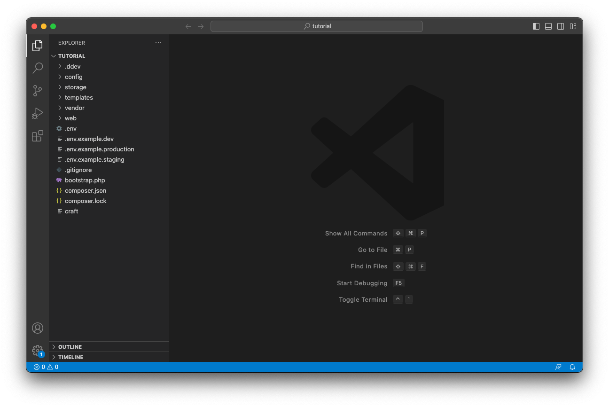

# Project File Structure

Let’s open the new `tutorial/` folder in a code editor and take a look.

If you’re on a Mac, drag the folder you’ve just created onto the Visual Studio Code icon.

If you’re on Windows or Linux, open VS Code and choose **File**, **Open Folder...**, and select the folder with your new Craft CMS files.



Let’s take a look at the files Composer just created:

```treeview
craft/
├── .ddev/
├── config/
├── modules/
├── storage/
├── templates/
├── vendor/
├── web/
├── .env
├── .env.example
├── .gitignore
├── composer.json
├── composer.lock
└── craft
```

It’s important to maintain this folder structure. You can add stuff to it, but if you want to rename anything here you may need to change some settings.

Let’s take a look at each top-level item:

- **`.ddev/`** contains DDEV configuration and runtime files. The only file in here you’re likely to ever care about is `config.yaml`.
- **`config/`** contains `.php` and `.yaml` configuration files, and `license.key` after installation.
- **`modules/`** is for custom PHP you might want to add for your site. (We’ll be ignoring that.)
- **`storage/`** is where Craft keeps its temporary files.
- **`templates/`** is where we’ll write template code to dynamically display content. (Unless you’d like to use Craft headlessly, but we’ll come back to that.)
- **`vendor/`** is where Composer stores all the project packages we covered earlier.
- **`web/`** is the document root covered [earlier](../environment/stack.md), where your web server needs to send its requests. We’ll also put site pieces like images, CSS, and JavaScript in this folder.
- **`.env`** is a special file with constants that tell Craft how to connect to its database.
- **`.env.example`** is an example of `.env`’s format for others to use setting up _their_ environments.
- **`.gitignore`** is another special file for telling Git, if it’s used, not to care about certain files.
- **`composer.json`** is the file Composer uses to know what packages it *should* install.
- **`composer.lock`** is Composer’s own detailed record of what’s *actually* installed.
- **`craft`** is Craft’s command line executable.

It’s okay if you’ve never used Git or if any of these pieces isn’t clear; we’ll be using them shortly!
