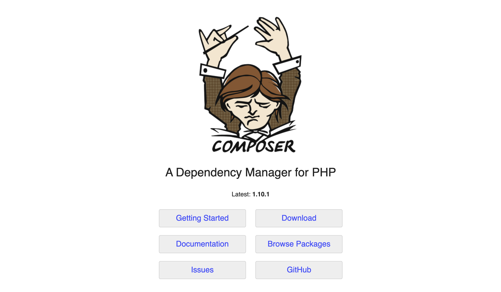

# Install Craft CMS with Composer

At this point you should have a local development environment running with a database and know how to run console commands. Now we’ll make sure Composer is installed.

## What’s Composer?

<BrowserShot url="https://getcomposer.org/" :link="true">

</BrowserShot>

Composer is a command line application with one important job: it makes sure a PHP project like our website has all the code it needs to run.

This code is split up into numerous _packages_ written by different authors. Our website depends on these packages—also referred to as _dependencies_—and each one provides a specific set of functionality. Composer makes sure every PHP package (including Craft CMS!) is installed, has the dependencies it needs to do its job, and that all these packages can work together without major conflicts.

Composer handles the complexity of combining these packages so we can use the best software available for each individual job the website needs to accomplish. This isn’t unique to Craft CMS—most modern PHP projects are built this way.

## Check your Composer version

Try running the following console command:

```bash
composer --version
```

You’ll see your current Composer version, or `command not found` if Composer is not installed.

If you’re using Composer 1.3.0 or higher, you’re ready to [Install Craft CMS via Composer](#install-craft-cms-via-composer). If you’re running a lower version or haven’t installed Composer, see [Composer’s install guide](https://getcomposer.org/doc/00-intro.md#installation-linux-unix-macos).

::: tip
You may be able update your Composer version by runing `composer self-update`. If that doesn’t work, follow the installation instructions to install a newer version.
:::

## Install Craft CMS Files

Choose a new path on your computer where you’d like to install Craft CMS. It can be anywhere you’d like, we’re just going to create some new files and tell your web server where to find them.

We’ll tell Composer where to add these new files using an _absolute_ or _relative_ path:

- The full _absolute_ path is long and specific, like `/Users/oli/projects/tutorial` or `C:\Users\oli\projects\tutorial`.
- To use a _relative_ path, you first need to use the `cd` command and change your working directory to the existing parent folder. The relative path you provide will be within this working directory. If you’ve navigated to `/Users/oli/projects`, for example, you can simply pass Composer the value of `tutorial` to have that folder created.

Whichever option you choose, run the following command and substitute your desired path for `<Path>`:

```bash
composer create-project craftcms/craft <Path>
```

Composer will take a few minutes to download Craft CMS and all its dependencies, set up your project folders, and add a security key:


Now we have all the files we need to actually install and start using Craft.

### Tour the site’s folder structure

Let’s open the new folder in a code editor and take a look.

If you’re on a Mac, drag the folder you’ve just created onto the Visual Studio Code icon.

If you’re on Windows or Linux, open VS Code and choose “File”, “Open Folder...”, and select the folder with your new Craft CMS files.


Before we complete the setup, let’s take a look at the files Composer just created:

```treeview
craft/
├── config/
├── modules/
├── storage/
├── templates/
├── vendor/
├── web/
├── .env
├── .env.example
├── .gitignore
├── composer.json
├── composer.lock
├── craft
└── craft.bat
```

It’s important to maintain this folder structure. You can add files and folders to it, but if you want to rename any of these files we’re starting with you may need to change some settings.

Let’s take a look at each top-level item:

- **`config/`** contains a handful of configuration files, and your `license.key` file once setup’s finished.
- **`modules/`** is ready for custom PHP you could write just for your site. (We’ll be ignoring that.)
- **`storage/`** is where Craft keeps its own temporary files while it’s running.
- **`templates/`** is where we’ll write code for dynamically displaying content. (Unless you’d like to use Craft headlessly, but we’ll come back to that.)
- **`vendor/`** is where Composer stores all the project packages we covered earlier.
- **`web/`** is called the document root, and it’s where your web server will need to be configured to send its requests. We’ll also put website pieces like images, CSS, and JavaScript in this folder.
- **`.env`** is a special file with constants we’ll fill in so Craft knows how to connect to its database.
- **`.env.example`** is an example of `.env`’s format for others to use setting up _their_ environments.
- **`.gitignore`** is another special file for telling Git, if it’s used, not to care about certain files.
- **`composer.json`** is the file Composer uses to know what packages it should install.
- **`composer.lock`** is Composer’s own detailed record of what it has actually installed.
- **`craft`** is Craft’s own console command for macOS and Linux.
- **`craft.bat`** is the same console command for Windows.

It’s okay if you’ve never used Git or if any of these pieces isn’t clear; we’ll be using them shortly!
